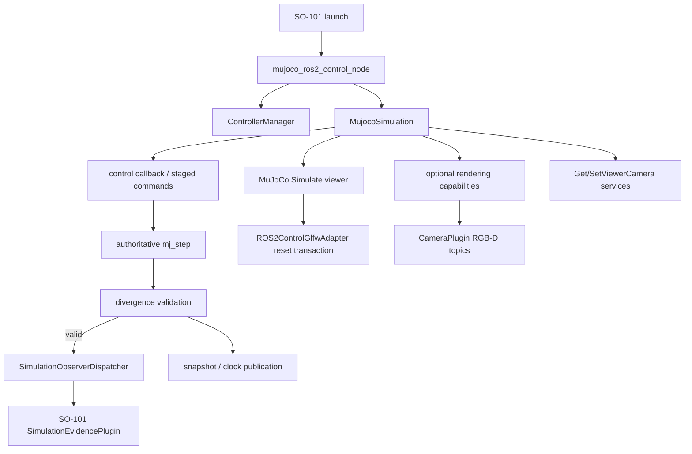

# `mujoco_ros2_control` 0.1.0 升级代码改动说明

本文说明 SO-101 项目把 `third_party/mujoco_ros2_control` 从本地
`so101-0.0.3-r11` 迁移到官方 `0.1.0` 架构时做了哪些代码改动、为什么这样改，以及后续维护者应守住哪些边界。

本文是代码导航和架构说明，不替代实验台账。完整命令、失败轮次、日志和哈希仍以
[`mujoco-ros2-control-0-1-upgrade-experiment-ledger.md`](../experiments/mujoco-ros2-control-0-1-upgrade-experiment-ledger.md)
为准。

## 1. 版本与状态

| 项目 | 精确值 |
|---|---|
| 官方版本 | `0.1.0` |
| 官方目标 commit | `57fc6744844902d4532160b403fa95840c1d6f96` |
| 本地历史基线 | `f19a8cc3af61feccacb22a9f0d16cc972e3b2c08`（`so101-0.0.3-r11`） |
| true merge commit | `6c562f861e09394ba631fa7dc4e63ea98f95e04c` |
| true merge parents | `57fc674...`、`f19a8cc...` |
| 最终 fork 候选 | `ca654e30ea9791564fab7110c90734733b68c8cc` |
| 父仓库代码 pin | `db6b1f20ff1ef8f8b7d9f9074c5828713b8bdacb` |
| candidate label | `so101-0.1.0-r1-candidate`，不是 Git tag |
| Linux 状态 | 当前 `ca654e3...` 功能门已通过；父仓库 shutdown fix 后最终复验中 |
| macOS 状态 | `BREAKER / NOT QUALIFIED` |
| 最终 release tag | 未创建 |

相对官方 `57fc674...`，fork 最终候选修改 42 个文件，约 6257 行新增、344 行删除。大量官方
`0.1.0` 新增内容则通过 true merge 直接继承，不会出现在这组“相对官方”的统计中。

## 2. 升级策略

本次不是把官方目录覆盖到本地 fork，而是以官方 `0.1.0` 为第一父提交、本地 r11 为第二父提交
建立真实合并，再把 r11 的能力迁移到官方新架构：

```text
official 0.1.0 @ 57fc674 ─────┐
                              ├─ true merge @ 6c562f8 ── migration/fixes ── ca654e3
local 0.0.3-r11 @ f19a8cc ───┘
```

这样做有三个目的：

1. Git 能同时证明官方 `0.1.0` 和本地 r11 都是最终候选的祖先；
2. 官方包拆分、插件、消息、测试和文档演进被完整吸收；
3. 本地功能按新 `MujocoSimulation`、插件能力和渲染生命周期重新落位，不继续维护旧架构副本。

## 3. 最终运行架构



权威成功步的顺序固定为：

```text
应用 staged control / pre-step
  -> mj_step
  -> divergence check
  -> observer on_physics_step
  -> authoritative snapshot / clock
```

发生 divergence 的步不再被视为权威结果：不通知 observer，不用失败状态覆盖最后一个有效快照，
并锁存“必须 reset 后才能 resume/step”的恢复边界。

## 4. nested fork 的主要改动

### 4.1 用可选 capability 扩展插件，不破坏官方 base ABI

新增：

- `mujoco_ros2_control_plugins/include/.../mujoco_ros2_control_plugin_capabilities.hpp`
- `mujoco_ros2_control/include/.../simulation_observer_dispatcher.hpp`
- `mujoco_ros2_control/src/simulation_observer_dispatcher.cpp`

`MuJoCoROS2ControlPluginBase` 保持官方 `0.1.0` 字节级 ABI，不把 SO-101 hook 继续塞进 base class。
需要额外能力的插件通过多继承选择实现：

- `MuJoCoROS2ControlSimulationObserver`
  - `on_physics_step`
  - `on_reset`
  - `on_pause`
  - `on_state_snapshot`
- `MuJoCoROS2ControlRenderingPlugin`
  - `set_platform_render_context`
  - `set_rendering_enabled`
  - `close_rendering`

`SimulationObserverDispatcher` 在插件加载时用 `dynamic_pointer_cast` 发现 observer。单个 observer 抛异常时，
dispatcher 记录错误并只禁用该 observer，避免破坏物理线程和其他插件。

### 4.2 重构 `MujocoSimulation` 的生命周期与并发边界

主要文件：

- `mujoco_ros2_control/include/.../mujoco_simulation.hpp`
- `mujoco_ros2_control/src/mujoco_simulation.cpp`
- `mujoco_ros2_control/tests/test_mujoco_simulation.cpp`

核心变化：

- controller read/write、ROS service、physics loop 和 viewer reset 共享明确的 simulation mutex 边界；
- `RuntimeUse` RAII 记录仍在使用 simulation/model/data 的回调；shutdown 先停止接受新使用者，再等待计数归零；
- `shutdown_mutex_` 和 `shutdown_complete_` 让 shutdown 可重复调用且只执行一次真实销毁；
- rendering plugin 有独立的 shutdown started/complete 状态、mutex 和 condition variable；
- 渲染插件先停止并 join，自身不再访问 context 后，才销毁 camera context 和 viewer；
- shutdown、service callback、physics thread、render loop 的所有权用回归测试固定。

### 4.3 reset、pause、step 与 divergence 恢复

本地 r11 的 reset/pause/snapshot 能力被迁移到官方 `MujocoSimulation` 服务实现，而不是保留旧的
`MujocoSystemInterface` 私有分支。

改动包括：

- reset 只在允许的暂停事务中修改状态；
- reset 成功后按 `on_reset -> on_state_snapshot` 发布权威边界；
- pause 状态变化发布 `on_pause`，暂停快照使用相同权威数据；
- `StepSimulation`、普通 physics loop 和 catch-up loop 共用 divergence 判定；
- divergence 后拒绝 resume 和继续 step，直到成功 reset 清除 latch；
- 失败步保留最后一个有效 control state 和快照；
- reset 会清理累计 divergence 诊断，避免 reset 后立即被旧状态重新锁存。

### 4.4 MuJoCo Viewer reset 事务

官方 `Simulate::Sync()` 同时处理 reset、history、keyframe 和 zero-control，旧 r11 的“时间倒退等于
reset”判断无法区分这些操作。最终实现把项目自有的 `ROS2ControlGlfwAdapter::PollEvents()` 作为
精确接缝：

- 只消费 viewer 明确提交的 pending reset；
- 在 `RenderLoop` 已持有 `Simulate::mtx` 时完成 reset 事务；
- 通过 generation 把 reset 事件交给 physics/observer 路径；
- 如果同一批事件中后到的 history、keyframe 或 zero-control 获胜，则不再错误执行 common reset；
- 不修改或复制上游 `simulate.cc`，source-backed 与预构建 `libsimulate` 两种分支都保留。

### 4.5 Viewer camera 消息与服务

新增接口：

- `mujoco_ros2_control_msgs/msg/ViewerCamera.msg`
- `mujoco_ros2_control_msgs/srv/GetViewerCamera.srv`
- `mujoco_ros2_control_msgs/srv/SetViewerCamera.srv`

新增实现：

- `mujoco_ros2_control/include/.../viewer_camera.hpp`
- `mujoco_ros2_control/src/viewer_camera.cpp`

服务暴露 `lookat`、`distance`、`azimuth`、`elevation`、camera type 和固定 camera id。所有输入先做
有限性、范围和类型校验；无效请求不会部分修改 viewer。ROS service 和 UI 都在 simulation/viewer
同步边界内读写 `mjvCamera`。

### 4.6 CameraPlugin 迁移与 macOS 主线程渲染

主要文件：

- `mujoco_ros2_control_plugins/src/camera_plugin.{hpp,cpp}`
- `mujoco_ros2_control/include/.../macos_ui_dispatcher.hpp`
- `mujoco_ros2_control/src/macos_ui_dispatcher.cpp`
- `mujoco_ros2_control/src/mujoco_simulation.cpp`

旧 r11 的 camera 逻辑被迁移为官方 plugin 架构下的 rendering capability：

- CameraPlugin 不再自行决定整个 viewer/context 生命周期；
- 公共 capability 使用平台中立的 `set_platform_render_context(void*)`，不在 ABI 中暴露 macOS 名称；
- macOS 在主线程创建隐藏 GLFW camera context，再有界借给 camera worker 渲染；
- viewer/GLFW 的主线程任务通过 `MacOSUIDispatcher` 串行执行；
- Linux 调用同一 capability 时传 `nullptr`，实现保持 no-op，并继续使用自身的隐藏 GLFW context；
- `disable_rendering`、init rollback、`close_rendering` 和 worker join 有明确顺序；
- camera topics 仍由官方 CameraPlugin 发布，SO-101 不复制第二套 RGB-D publisher。

### 4.7 controller introspection publisher 的停机顺序

`mujoco_ros2_control_node.cpp` 新增 ROS context pre-shutdown callback：

- ControllerManager 先执行自身 controller/resource teardown；
- 随后停止 PAL default registry 与 controller-manager statistics registry 的 publisher thread；
- registry 对象保留到 ControllerManager 析构，避免 control thread 尚在 publish 时清空 registry；
- 最后才让 ROS context 进入 invalid 状态。

这解决了正常退出时 publisher thread 穿过 context shutdown 的竞态。测试允许普通实时 publish contention，
但仍拒绝 generic publisher exception、invalid-context 和强制信号升级。

### 4.8 LiDAR、编译与可移植安装

主要变化：

- `mujoco_3d_lidar` 显式使用满足 `std::byte` 的 C++17；
- Apple conversion 处理缩到必要表达式，不对整个 target 降低告警等级；
- rangefinder 在分配 vector 前做有限性、溢出和模型上限检查，拒绝接近 `SIZE_MAX` 的输入；
- macOS 使用显式 Apple framework 和相对 RPATH；Linux 保持 ELF loader 约定；
- 安装产物不包含 build-host、用户目录或 evidence root 的绝对 RPATH；
- copy-install 与 moved-tree loader smoke 验证安装可搬迁；
- Linux camera test 不再能被环境变量 `SKIP_CAMERA_TESTS=true` 静默跳过；
- site-velocity 冷启动等待仅在 Darwin 放宽，Linux 保持短超时。

### 4.9 测试生命周期修复

Linux 全量测试暴露 `PausedDivergenceRejectsResumeUntilReset` 的测试局部对象生命周期竞态：物理线程
仍可能调用 observer，而 `EventCollector`、observer 和 callback 捕获对象已开始析构。

最终修复只改测试：

- 先声明所有会被 physics thread 引用的局部对象；
- 再声明 `SimulationShutdownGuard`；
- 随后注册 callback、启动 physics thread；
- C++ 逆序析构保证所有正常、fatal assertion 和 exception 路径都先 shutdown/join，再销毁局部状态。

生产代码没有为了测试 hang 增加 timeout、detach、skip 或 force-exit。

## 5. 从官方 0.1.0 吸收的能力

true merge 保留官方 `0.1.0` 的包结构和功能，包括：

- 以 `MujocoSimulation` 为中心的 simulation、service 和 rendering 架构；
- `FreeJointState`、`SimulationState`、ResetWorld、SetFreeJointState 等消息/服务；
- BaseVelocity、ExternalWrench、FreeJointStatePublisher、Camera、3D/Rangefinder LiDAR 插件；
- mobile-base、PID、transmission、site-velocity demo/test 资源；
- 新的 Sphinx 文档、Pixi 环境和 CI/build 配置；
- 官方 URDF-to-MJCF 工具、hardware interface 文档和插件文档。

本地代码只在 SO-101 必需的生命周期、证据、viewer camera、跨平台渲染和可移植构建边界上扩展，
没有回退成 r11 的旧目录结构。

## 6. 父仓库适配改动

### 6.1 双锁、gitlink 与 provenance

修改：

- `src/so101_demo_py/config/dependency-lock.yaml`
- `src/so101_demo_py/config/mujoco/dependency-lock.yaml`
- `scripts/check_backend_integration.py`
- `src/so101_demo_py/test/test_macos_install_contract.py`

两份 lock 同时固定：

- fork URL、candidate commit、candidate label；
- 本地 r11 lineage commit；
- 官方 `0.1.0` commit；
- ViewerCamera/Reset/Pause/Step/FreeJointState 接口 SHA；
- capability/base/viewer-camera header 和运行时安装产物。

contract 会拒绝 dirty submodule、错误 origin、错误 gitlink、错误 HEAD、双 ancestry 缺失、两份 lock 不一致
和 candidate label 被提前创建为 release tag。

### 6.2 安装器

`scripts/install-mujoco-ros2-control.zsh` 的主要变化：

- 构建包从 core/msgs/plugins 扩为 `mujoco_3d_lidar`、msgs、plugins、core 四包；
- 在 build 前验证 gitlink、锁、origin、clean source 和双 ancestry；
- candidate 阶段要求同名 Git tag 不存在；
- 在隔离 shared clone 中 checkout locked commit，不直接污染 submodule；
- build/test 使用独立 build/install/log 目录；
- 安装后读回四个 package prefix、ROS interfaces、CameraPlugin manifest 和 required files。

### 6.3 SO-101 simulation evidence plugin

修改：

- `src/so101_mujoco_support/include/.../simulation_evidence_plugin.hpp`
- `src/so101_mujoco_support/test/test_simulation_evidence_plugin.cpp`

`SimulationEvidencePlugin` 现在同时继承官方 base 与可选
`MuJoCoROS2ControlSimulationObserver`：

- `update()` 继续承担普通 plugin 更新边界；
- `on_physics_step()` 只消费权威成功步；
- `on_reset()` 推进 reset generation；
- `on_pause()` 维护权威暂停状态；
- `on_state_snapshot()` 发布 reset/pause 对应的原子快照。

这样 SO-101 的接触、cup pose、step、reset epoch 和 hazard evidence 不需要侵入官方 base ABI。

### 6.4 phase-separated camera 验收探针

修改/新增：

- `src/so101_demo_py/test/macos_camera_topic_probe.py`
- `src/so101_demo_py/test/test_macos_camera_topic_probe_behavior.py`
- `src/so101_demo_py/test/test_mujoco_camera_plugin_contract.py`

探针改为同一 invocation 内的两个完全隔离阶段：

1. color-only：至少 30 个真实、唯一 header stamp，用首末 header 计算 8–12 Hz；
2. aligned RGB-D：重新创建 Context/executor/node，三个 topic 各至少 3 条，并要求一个共同 timestamp、
   640×480、`task_camera_frame`、`rgb8`、`32FC1`、非空 payload 和全帧 finite-positive depth。

每个阶段都完整销毁 node/executor/context。任一阶段失败或 teardown 失败时，不写成功 JSON；最终文件使用
临时文件加原子替换，避免留下半成功结果。

### 6.5 文档和 contract 同步

修改：

- `docs/guides/so101-mujoco-ros2-integration-guide.md`
- `docs/guides/macos-apple-silicon-ros2-jazzy-so101-mujoco.md`
- `scripts/check_backend_integration.py`

文档从旧的“base plugin 直接拥有 physics hook”改为“可选 observer capability + dispatcher”；同时记录
实际权威步顺序、四包 prefix、双 ancestry 和 macOS dylib/source 顺序。contract 会拒绝旧架构描述回流。

## 7. 关键文件索引

| 关注点 | 主要文件 |
|---|---|
| simulation 生命周期、reset、pause、step、viewer | `mujoco_ros2_control/{include,src}/mujoco_simulation.*` |
| optional plugin capability | `mujoco_ros2_control_plugins/include/.../mujoco_ros2_control_plugin_capabilities.hpp` |
| observer 隔离 | `mujoco_ros2_control/{include,src}/simulation_observer_dispatcher.*` |
| viewer camera 类型与校验 | `mujoco_ros2_control/{include,src}/viewer_camera.*` |
| viewer camera ROS API | `mujoco_ros2_control_msgs/{msg/ViewerCamera.msg,srv/*ViewerCamera.srv}` |
| macOS 主线程调度 | `mujoco_ros2_control/{include,src}/macos_ui_dispatcher.*` |
| RGB-D renderer 生命周期 | `mujoco_ros2_control_plugins/src/camera_plugin.*` |
| node 停机顺序 | `mujoco_ros2_control/src/mujoco_ros2_control_node.cpp` |
| SO-101 原子物理证据 | `src/so101_mujoco_support/include/.../simulation_evidence_plugin.hpp` |
| 依赖安装与验证 | `scripts/install-mujoco-ros2-control.zsh`、`scripts/check_backend_integration.py` |
| 固定版本与接口 | `src/so101_demo_py/config/{dependency-lock.yaml,mujoco/dependency-lock.yaml}` |
| camera runtime probe | `src/so101_demo_py/test/macos_camera_topic_probe.py` |
| 全过程台账 | `docs/experiments/mujoco-ros2-control-0-1-upgrade-experiment-ledger.md` |

## 8. 验证结果

### 8.1 候选级回归

- macOS focused lifecycle test：20/20；source-backed core：9/9；source-less core：9/9；
- Linux fork：6 packages、22/22 wrappers、327 JUnit cases，0 failure/error；
- Linux source-less：9/9 wrappers、179 cases，0 failure/error；
- Linux project：3 packages、529/529 cases；
- ABI、13 个 ROS interfaces、单一权威 `mj_step`、copy-install、relocation、RPATH/linkage、双 ancestry 全部通过。

### 8.2 Linux 端到端

- camera：30 个唯一 color header，8.9066339066 Hz；RGB/depth/info 共同 timestamp；
- 图像：640×480，`task_camera_frame`，`rgb8` / `32FC1`；
- depth：307200/307200 finite-positive；
- dynamic cup pick-place：exit 0、`DONE/QUALIFIED`、19 transitions；
- lift/transport/place/release/retreat 全部通过，最终 XY error 1.854 mm；
- GUI 截图与物理/MoveIt/controller/TF 证据一致；
- 一次正常 Ctrl-C 后无残留 task PID/node、无 invalid-context 或信号升级。

Linux 完整报告位于：
`/tmp/so101-debug-mujoco-control-1-0-upgrade-20260825/linux/fix2-full/linux-task8-fix2-full-report.md`。

### 8.3 macOS 当前 blocker

macOS Runtime Round 4 曾在同一生产代码上证明 camera 和 dynamic 功能可运行，但 shutdown 出现 PAL
invalid-context 和 SIGTERM 升级，因此该轮不合格。修复停机顺序后，最终允许的 Round 5 在 viewer
初始化的 `_glfwSetWindowSizeCocoa` 路径发生 SIGSEGV，`ros2_control_node` exit `-11`，未进入该轮
camera/dynamic 验收。

`fcbc9f7...` 的 Linux 全量验收仍是有效历史证据，但当前 `ca654e3...` 把公开 rendering capability
从 `set_macos_render_context(void*)` 改为 `set_platform_render_context(void*)`，属于 ABI 与调用点变更。
因此必须对当前精确候选重新完成 Linux 构建、camera、dynamic 和干净停机验收；它也不能替代 macOS
最终联合验收。当前不得创建 `so101-0.1.0-r1` release tag。

## 9. 后续维护规则

下一次跟进官方版本或修改本 fork 时必须：

1. 保留 true merge ancestry，不 squash 掉官方或本地 lineage；
2. 不向官方 base plugin 增加 SO-101 专用 virtual method，继续使用 optional capability；
3. 新的 `mj_step` 路径必须进入同一 divergence/observer/snapshot 顺序；
4. viewer reset 必须区分 history/keyframe/zero-control，不以时间倒退猜测 reset；
5. rendering worker 必须在 GLFW/context/viewer 销毁前停止并 join；
6. macOS Cocoa/GLFW 创建和窗口操作必须留在主线程；
7. Linux camera test 不能被环境变量静默 skip；
8. lock、gitlink、submodule HEAD、origin、双 ancestry 和 installed prefix 必须一起读回；
9. source-backed 与预构建 `libsimulate` 两条路径都必须测试；
10. 最终 tag 只能在 macOS、Linux 对同一 fork commit 完成 camera、dynamic 和干净停机验收后创建。
