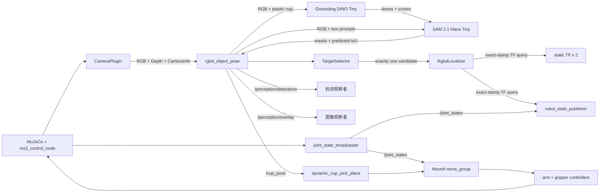

# SO-101 Grounded SAM RGB-D 多实例感知 PickPlace 教学与源码导读

**范围：** Grounding DINO Tiny 文本引导检测、SAM 2.1 Hiera Tiny 实例分割、不可变本地模型包、逐帧无状态推理、RGB-D 深度定位、tf2、`/cup_pose`、MoveIt 与 MuJoCo 抓放验证

**对象：** 已了解 Python 和 ROS 2 基础，希望看懂“用开放词汇模型在多个物体中找到唯一杯子，再完成抓放”的开发者

**目标：** 理解并复现下面这条链路。生产路径只读取 RGB-D，不允许用 MuJoCo object ID、truth pose、颜色阈值或预先写好的杯子坐标替代模型判断

```text
MuJoCo RGB
  -> Grounding DINO Tiny + 受控文本 "plastic cup."
  -> 多个候选框
  -> 去重
  -> SAM 2.1 Hiera Tiny + box prompt
  -> 多个实例 mask
  -> DetectionCandidate
  -> 唯一 plastic_cup 选择
  -> mask + Depth + CameraInfo
  -> exact-stamp tf2
  -> /cup_pose
  -> dynamic_cup_pick_place
  -> MoveIt -> controller -> MuJoCo
```

本文沿用 [`so101-rgbd-perception-pick-place-source-guide.md`](so101-rgbd-perception-pick-place-source-guide.md) 的讲解方式。原导读从颜色和点云聚类讲起；[`so101-yolo-seg-rgbd-perception-pick-place-source-guide.md`](so101-yolo-seg-rgbd-perception-pick-place-source-guide.md) 进一步介绍了合成数据、YOLO-Seg 微调和本地权重部署。这里换一条路线：先用 Grounding DINO 的开放词汇能力建立基线，再根据失败样本微调 DINO，并只训练 SAM 2.1 的 mask decoder。运行时仍然是 DINO 找框、SAM 按框切实例。

`/cup_pose` 之后的动态目标、5-DoF IK、MoveIt 规划和抓放状态机，可配合 [`so101-dynamic-cup-pick-place-source-guide.md`](so101-dynamic-cup-pick-place-source-guide.md) 阅读。

## 1. 这条路线解决什么问题

YOLO-Seg 适合类别固定、数据可控的任务。它的代价也很明确：先生成或采集数据，再标注、训练、检查指标和分发 `best.pt`。当你想快速试一个新类别时，数据准备往往比写推理代码更费时间。

Grounding DINO 接受图像和文字。输入 `plastic cup.` 后，它返回与这段文字匹配的候选框。SAM 2.1 再把每个框当成提示，输出框内物体的 mask。这样可以先做零样本验证，看看预训练模型是否已经认识目标。

不过，开放词汇不等于可以让用户随意输入 prompt。当前应用只允许：

```text
plastic_cup -> "plastic cup."
```

映射写在 [`grounded_sam.yaml`](../../src/so101_demo_py/config/perception/grounded_sam.yaml) 和 [`grounded_sam_postprocess.py`](../../src/so101_demo_py/src/adapters/perception/grounded_sam_postprocess.py) 中。CLI 传的是规范类别 `plastic_cup`，不是任意自然语言。这样做能把模型能力限制在机器人任务已经验证过的范围内。

## 2. 先看完整运行图

### 2.1 公开入口

单独运行感知节点：

```bash
ros2 run so101_demo_py rgbd_object_pose ...
```

启动 MuJoCo、感知和抓放整条链路：

```bash
ros2 run so101_demo_py so101_mujoco_perception_pick_place ...
ros2 launch so101_demo_py so101_mujoco_perception_pick_place.launch.py ...
```

console script 注册在 [`setup.py`](../../src/so101_demo_py/setup.py)。一体化入口和公开 launch 最后都调用 [`build_perception_pick_place_launch_description()`](../../src/so101_demo_py/src/runtime/launch_composition.py)，因此参数门禁、组件顺序和退出策略只有一份实现。

### 2.2 实际启动的组件

当 `perception_backend:=grounded_sam` 且执行参数通过检查后，launch 会启动这些组件：

| 组件 | 进程或节点 | 生命周期 | 责任 |
|---|---|---|---|
| MuJoCo 与 controller manager | `mujoco_ros2_control/ros2_control_node` | 长驻 | 推进物理、发布 `/clock`，承载相机和物理证据插件 |
| Robot State Publisher | `robot_state_publisher` | 长驻 | 读取 URDF 与 `/joint_states`，发布机器人 `/tf` |
| Controller spawner × 3 | `controller_manager/spawner` | 激活后退出 | 启动 joint state、手臂和夹爪 controller |
| MoveIt | `so101_mujoco_support/graceful_shutdown_move_group` | 长驻 | 提供规划、轨迹执行与 Planning Scene 接口 |
| Planning Scene 初始化 | `so101_demo_py/scene_setup` | 一次性 | 写入并回读桌子、底座和杯子碰撞对象 |
| 静态相机 TF × 2 | `tf2_ros/static_transform_publisher` | 长驻 | 发布 `base -> camera_link -> task_camera_frame` |
| Grounded SAM 感知 | `so101_demo_py/rgbd_object_pose` | 发布后等待统一关停 | 加载本地双模型包，处理 RGB-D，发布候选、overlay 和 `/cup_pose` |
| 动态抓放 | `so101_demo_py/dynamic_cup_pick_place` | 一次任务 | 消费 `/cup_pose`，调用 MoveIt/controller，并验证物理结果 |

Grounding DINO 和 SAM 2.1 没有各自启动一个 ROS 节点，也没有 HTTP 服务。它们都在 `rgbd_object_pose` 进程内运行，共用一个 device。

### 2.3 组件如何通信



### 2.4 ROS 接口表

| 接口 | 类型 | 发布或提供方 | 消费方 | 用途 |
|---|---|---|---|---|
| `/clock` | `rosgraph_msgs/msg/Clock` | MuJoCo | 所有 `use_sim_time` 节点 | 统一图像、TF、Pose 和执行的时间基准 |
| `/task_camera/camera_info` | `sensor_msgs/msg/CameraInfo` | CameraPlugin | `rgbd_object_pose` | 图像尺寸和针孔内参 |
| `/task_camera/color` | `sensor_msgs/msg/Image`，`rgb8` | CameraPlugin | `rgbd_object_pose` | 两个模型使用的 RGB 输入 |
| `/task_camera/depth` | `sensor_msgs/msg/Image`，`32FC1` | CameraPlugin | `rgbd_object_pose` | 选中 mask 内的米制深度 |
| `/tf_static` | `tf2_msgs/msg/TFMessage` | 静态 TF 节点 | 感知、MoveIt | 固定相机外参 |
| `/tf` | `tf2_msgs/msg/TFMessage` | Robot State Publisher | 感知、MoveIt | 机器人 link 的动态变换 |
| `/perception/detections` | `vision_msgs/msg/Detection2DArray` | `rgbd_object_pose` | 观察者 | 候选 ID、类别、置信度和 bbox |
| `/perception/overlay` | `sensor_msgs/msg/Image`，`rgb8` | `rgbd_object_pose` | 观察者 | 带 mask、bbox、DINO 分数和 SAM 质量的图像 |
| `/cup_pose` | `geometry_msgs/msg/PoseStamped` | `rgbd_object_pose` | `dynamic_cup_pick_place` | `world` frame 下的杯子中心 |
| `/joint_states` | `sensor_msgs/msg/JointState` | joint state broadcaster | RSP、MoveIt、抓放节点 | 关节反馈 |
| `/plan_kinematic_path` | `moveit_msgs/srv/GetMotionPlan` | MoveIt | 抓放节点 | 生成碰撞约束轨迹 |
| `/execute_trajectory` | `moveit_msgs/action/ExecuteTrajectory` | MoveIt | 抓放节点 | 执行手臂轨迹 |

完整实例 mask 不塞进 `Detection2DArray`。它保留在进程内的 `DetectionCandidate.mask` 中，同时写入证据目录。三维定位读取的是布尔 mask，不是 overlay 图片。

## 3. 源码分成了哪些层

| 层 | 主要文件 | 只负责什么 |
|---|---|---|
| 核心数据契约 | [`detection.py`](../../src/so101_demo_py/src/core/detection.py) | frame、candidate、batch 和质量字段 |
| 检测端口 | [`object_detector.py`](../../src/so101_demo_py/src/ports/object_detector.py) | 定义 `detect(frame, query)`，不依赖具体模型 |
| 模型包校验 | [`model_bundle.py`](../../src/so101_demo_py/src/adapters/perception/model_bundle.py) | manifest、文件集合、大小和 SHA-256 |
| 纯后处理 | [`grounded_sam_postprocess.py`](../../src/so101_demo_py/src/adapters/perception/grounded_sam_postprocess.py) | prompt、框去重、mask 门禁和 candidate 转换 |
| 模型 adapter | [`grounded_sam.py`](../../src/so101_demo_py/src/adapters/perception/grounded_sam.py) | 本地加载、warm-up、DINO 推理和 SAM 推理 |
| detector 工厂 | [`detector_factory.py`](../../src/so101_demo_py/src/adapters/perception/detector_factory.py) | 验证后端参数，构造 YOLO 或 Grounded SAM |
| 应用规则 | [`object_pose.py`](../../src/so101_demo_py/src/application/object_pose.py) | 唯一目标选择、深度定位和请求编排 |
| ROS adapter | [`rgbd_object_pose_node.py`](../../src/so101_demo_py/src/ros/rgbd_object_pose_node.py) | 订阅、tf2、消息转换、publish 和生命周期 |
| 证据写入 | [`perception_evidence.py`](../../src/so101_demo_py/src/runtime/perception_evidence.py) | 原子写 RGB、mask、overlay、点云和 JSON |
| 启动编排 | [`launch_composition.py`](../../src/so101_demo_py/src/runtime/launch_composition.py) | 参数门禁、组件顺序、退出与清理 |

`TargetSelector` 和 `RgbdLocalizer` 没有 Grounding DINO 或 SAM 分支。更换模型只发生在 `DetectorPort` 的 adapter 一侧。

## 4. Grounding DINO Tiny 怎样把文字变成候选框

传统固定类别检测器的输出类别由训练配置决定。Grounding DINO 同时编码图片和文字，把文字 token 与图像区域做匹配。当前输入是：

```text
image: 当前 RGB 帧
text:  "plastic cup."
```

processor 把图片和文字转换为 tensor。模型输出后，`post_process_grounded_object_detection()` 使用两道阈值：

```text
grounding_box = 0.35
grounding_text = 0.25
```

`grounding_box` 控制框的检测分数，`grounding_text` 控制文字与区域的匹配。通过门槛的结果还要满足：label 必须精确归一为 `plastic cup`，bbox 必须有正面积并位于图像内，候选总数不能超过 `16`。

模型输出的 DINO score 保存到 `DetectionCandidate.confidence`。后面的 `TargetSelector` 继续用它和应用层 `confidence_threshold` 判断候选是否有资格执行。

## 5. 为什么候选框还要去重

同一个杯子可能产生两个高度重叠的框。如果直接把两个框送入 SAM，最终会得到两个候选，`TargetSelector` 就会返回 `TARGET_AMBIGUOUS`。

[`convert_grounding_results()`](../../src/so101_demo_py/src/adapters/perception/grounded_sam_postprocess.py) 先按分数降序，再比较 bbox IoU：

```text
duplicate_iou = 0.85
```

与已保留框的 IoU 达到或超过 `0.85` 时，较后的框被视为重复。这个步骤只合并同一物体的重复预测，不负责在两个真实杯子之间做选择。

## 6. SAM 2.1 怎样从 box prompt 得到实例 mask

Grounding DINO 只给矩形框。框中往往还有桌面和相邻物体，直接拿整个 bbox 做深度反投影会污染点云。

[`GroundedSamDetector._sam_results()`](../../src/so101_demo_py/src/adapters/perception/grounded_sam.py) 把所有候选框组成一次 batch：

```text
input_boxes.shape == (1, object_count, 4)
```

SAM 2.1 Hiera Tiny 对每个框返回多个 mask 方案，以及每个方案的 predicted IoU。后处理选择 predicted IoU 最高的那个 mask，再检查：

| 门禁 | 默认值 | 目的 |
|---|---:|---|
| `sam_quality` | `0.75` | predicted IoU 太低时拒绝该 mask |
| `min_mask_pixels` | `64` | 去掉过小碎片 |
| `max_mask_area_ratio` | `0.50` | 防止 mask 吞掉大半张图 |
| mask inside bbox ratio | `0.80` | 大部分 mask 必须位于提示框内 |

通过后，mask 被转成与原图同尺寸的布尔数组。被拒绝的框会记录 `MASK_REJECTED`，日志带 DINO score、最高 SAM quality 和当前门槛，便于判断是哪一道门限挡住了候选。

## 7. DINO confidence 与 SAM predicted IoU 不是一回事

一个 candidate 同时有两个质量值：

```text
confidence            = Grounding DINO score
segmentation_quality  = SAM predicted IoU
```

DINO score 表示图像区域与 `plastic cup.` 的匹配强度。SAM predicted IoU 是模型对 mask 质量的内部估计，不是拿 truth mask 现场算出的 IoU。

当前规则是：SAM 质量只负责 mask 门禁和证据记录，`TargetSelector` 不按它排序，也不会用它在两个杯子之间“挑更好的一个”。这能避免模型质量分偷偷改变任务语义。

## 8. 为什么必须逐帧无状态

SAM 2.1 有视频跟踪能力，但本版本没有启用。每次 `detect()` 都重新执行：

```text
current RGB
  -> Grounding DINO
  -> current boxes
  -> one batched SAM call
  -> current masks
```

adapter 不保存上一帧的 memory、object token 或 track ID。这样做有三个现实原因：

1. 一次请求的结果只属于当前 source stamp，证据容易复核；
2. 仿真 reset 或物体跳变后，不会把旧目标延续到新场景；
3. Mac MPS 和 Linux CUDA 共用同一套简单生命周期，先把跨平台基线跑稳。

代价是每帧都要运行两个模型，延迟高于视频跟踪。正式门槛要求 warm 后单次请求不超过 `2000 ms`，这个数值必须在真实模型 smoke 中测，不能从单元测试推断。

## 9. `DetectionCandidate` 如何承接两个模型

每个实例至少包含：

```text
instance_id
class_id = plastic_cup
confidence = DINO score
segmentation_quality = SAM predicted IoU
bbox_xyxy
mask
source_stamp_ns
source_frame_id
image_width
image_height
```

mask 必须非空，尺寸必须与当前 RGB 一致；candidate 的 stamp、frame 和尺寸不能与 batch 冲突。模型输出形状错误、NaN、越界分数或候选数量不一致时，后处理返回 `RESULT_CONTRACT_INVALID`，不会猜测缺失字段。

## 10. 为什么目标选择仍然是 0、1、2+

[`TargetSelector`](../../src/so101_demo_py/src/application/object_pose.py) 只看规范类别和 DINO confidence：

| 合格 `plastic_cup` 数量 | 结果 | 是否继续定位 |
|---:|---|---:|
| 0 | `TARGET_NOT_FOUND` | 否 |
| 1 | 选择该 candidate | 是 |
| 2 或更多 | `TARGET_AMBIGUOUS` | 否 |

两个杯子都满足条件时，程序没有“左边”“离机械臂近”或“分数最高”这样的任务约束。此时继续执行等于替用户猜目标，所以必须 fail closed。

## 11. RGB-D 为什么仍要 exact-stamp 对齐

两个模型只读取 RGB，三维位置仍依赖 Depth 和 CameraInfo。`AlignedRgbdBuffer` 只接收：

```text
camera_info.stamp == color.stamp == depth.stamp
```

节点还检查 frame、宽高和编码。RGB 必须是 `rgb8`，Depth 必须是 `32FC1`。第 N 帧的 mask 如果配上第 N+1 帧的 Depth，物体一动，边界点就会落到错误的三维位置。

## 12. mask、Depth 和 tf2 如何得到世界坐标

`RgbdLocalizer` 只遍历选中 mask 的像素。针孔相机反投影为：

```text
x = (u - cx) * z / fx
y = (v - cy) * z / fy
z = depth[v, u]
```

无效、非正或超过 `depth_trunc_m` 的深度被丢弃。点数不足时返回 `DEPTH_INVALID`。

得到相机坐标点云后，代码在原始 RGB-D source stamp 查询：

```text
world <- task_camera_frame
```

查询失败返回 `TF_UNAVAILABLE`。这里不能改用 latest transform，因为 latest TF 可能对应机械臂或相机的另一个时刻。

点云转换到 `world` 后，还要通过桌高、杯高、预期半径和半径容差。只有这些门禁都通过，才生成杯子 body center。

## 13. `/cup_pose` 何时发布

应用层顺序是：

```text
detect
  -> 写 source RGB、overlay、detections 和 candidate masks
  -> publish detections/overlay
  -> select
  -> 写 selected mask
  -> localize
  -> 写 selected cloud 和 staged result
  -> publish /cup_pose
  -> 标记 published_cup_pose=true
```

发布的消息保持原始 source stamp：

```yaml
header:
  stamp: <RGB-D source stamp>
  frame_id: world
pose:
  position: <localized cup body center>
  orientation: {x: 0.0, y: 0.0, z: 0.0, w: 1.0}
```

任何失败都不会发布默认 Pose，也不会复用上一轮 `/cup_pose`。

## 14. “本地推理服务”在这里是什么

当前实现没有 Triton、TorchServe 或 HTTP endpoint。`rgbd_object_pose` 是 ROS graph 中的本地感知进程：

```text
ROS executable
  -> verify immutable bundle
  -> force HF_HUB_OFFLINE=1 and TRANSFORMERS_OFFLINE=1
  -> import torch + transformers
  -> select mps/cuda
  -> load both snapshots with local_files_only=True
  -> warm up both models
  -> subscribe aligned RGB-D
  -> publish ROS topics
```

称它为服务，是因为其他 ROS 节点可以通过 topic 发现和消费它，不表示模型部署在远端服务器。

## 15. 不可变双模型包解决什么问题

基础模型来源固定为：

| 角色 | model ID | revision |
|---|---|---|
| detector | `IDEA-Research/grounding-dino-tiny` | `a2bb814dd30d776dcf7e30523b00659f4f141c71` |
| segmenter | `facebook/sam2.1-hiera-tiny` | `de431c4043854a71d8101e17995dfe596bf101a5` |

生产 bundle 不是这两个官方 snapshot 的原样拼接。detector 使用项目微调后的 epoch 1，segmenter 使用 decoder-only 微调后的 epoch 4；官方 ID 和 revision 用来证明各自从哪里开始训练。最终 bundle manifest SHA-256 是 `b55bb601d311407df8f9f25d9da18649f6bd78ac1299148bde0d07f7cfdfed05`。

prepare CLI 下载这两个 revision，把普通文件复制到一个新目录，并生成 canonical `manifest.json`。manifest 记录：

- pipeline ID 和受控 prompt；
- 两个模型的 ID、revision 和目录；
- 每个普通文件的相对路径、大小和 SHA-256；
- 从同目录 `requirements.lock` 解析出的完整 `name==version` 映射。

prepare CLI 不会调用 `pip freeze`，也不读取当前 venv 来猜版本。它先逐行解析 [`requirements.lock`](../../src/so101_demo_py/config/perception/requirements.lock)：缺 pin、重复 pin、`>=` 一类非精确写法都会在下载模型前失败。运行时要同时提供 bundle 根目录和 manifest SHA-256。`verify_model_bundle()` 除了检查 symlink、路径逃逸、文件集合、大小和逐文件 SHA，还会把 manifest 的依赖映射与固定预期逐项比较；即使有人改过版本并重新计算 manifest SHA，也不能通过这层校验。

校验完成后，Transformers 仍使用 `local_files_only=True`。进程还会在任何 Hugging Face loader 调用前，把 `HF_HUB_OFFLINE` 和 `TRANSFORMERS_OFFLINE` 强制设为 `1` 并回读确认。调用方原先传入 `0` 时，以本进程的离线策略为准，不会带着冲突值继续加载。

bundle 输出目录必须不存在。prepare 不会覆盖同名目录，也不会把一次失败下载混进已经验收的模型包。

## 16. 依赖锁和 ROS Python 要分别确认

[`requirements.lock`](../../src/so101_demo_py/config/perception/requirements.lock) 固定了 PyTorch、Transformers、Hugging Face Hub、tokenizers 和图像依赖。模型依赖应放进隔离 venv，不要直接污染系统 Python。

部署时要确认两层：

```text
ROS interpreter
  -> rclpy、launch、vision_msgs、tf2_ros

perception site-packages
  -> torch、transformers、huggingface_hub、safetensors、Pillow
```

只激活 perception venv 可能找不到 ROS；只 source ROS overlay 又可能找不到模型库。先检查文件路径，再启动节点。

## 17. 如何构建本地模型包

这一步需要联网，只在准备机执行一次。输出目录必须是绝对路径且尚不存在：

```bash
source /opt/ros/jazzy/setup.zsh
source /absolute/path/to/candidate/install/setup.zsh

CONFIG="$(ros2 pkg prefix so101_demo_py)/share/so101_demo_py/config/perception/grounded_sam.yaml"
MODEL_ROOT=/absolute/path/to/grounded-sam-bundle
RESULT=/absolute/path/to/grounded-sam-bundle-result.json

ros2 run so101_demo_py prepare_grounded_sam_bundle \
  --config "$CONFIG" \
  --output "$MODEL_ROOT" | tee "$RESULT"
```

成功输出形如：

```json
{"manifest_sha256": "<64 lowercase hex characters>", "status": "OK"}
```

把 digest 单独取出：

```bash
MODEL_MANIFEST_SHA256="$(python3 -c 'import json,sys; print(json.load(open(sys.argv[1]))["manifest_sha256"])' "$RESULT")"
printf '%s\n' "$MODEL_MANIFEST_SHA256"
```

当前已经有一份冻结生产包，不必再次从官方仓库拼装。它发布在私有 Hugging Face 仓库 [zjumty/so101-grounded-sam-cup-pickplace](https://huggingface.co/zjumty/so101-grounded-sam-cup-pickplace)，固定 revision 为：

```text
52b8334358e5ff11f94f10f7c14b1697ef44d964
```

这是私有仓库。目标机先完成一次 Hugging Face 登录并确认当前身份，不要把 token 写进命令、日志或仓库：

```bash
hf auth login
hf auth whoami
```

有访问权限的机器再下载到新目录：

```bash
hf download zjumty/so101-grounded-sam-cup-pickplace \
  --repo-type model \
  --revision 52b8334358e5ff11f94f10f7c14b1697ef44d964 \
  --local-dir /absolute/new/path/so101-grounded-sam-cup-pickplace

cd /absolute/new/path/so101-grounded-sam-cup-pickplace
sha256sum -c SHA256SUMS
```

运行时的模型根目录是下载结果里的 `bundle/`，manifest digest 仍使用上面的 `b55bb601...`。`threshold-lock.json` 要和它一起读回，不能自行换阈值。

## 18. 如何离线复制并复核 bundle

把整个 bundle 当作一个不可拆分的部署件。可以先打包复制，再在目标机解包到新目录；传输工具不限，但不要只拷贝两个 `model.safetensors`。

目标机在启动 ROS 前执行一次只读复核：

```bash
export MODEL_ROOT=/absolute/path/to/grounded-sam-bundle
export MODEL_MANIFEST_SHA256=<manifest_sha256_from_prepare_output>

python3 -c '
import os
from pathlib import Path
from so101_demo.adapters.perception.model_bundle import verify_model_bundle
b = verify_model_bundle(Path(os.environ["MODEL_ROOT"]), os.environ["MODEL_MANIFEST_SHA256"])
print(b.root)
print(b.manifest_sha256)
print(b.detector_dir)
print(b.segmenter_dir)
'
```

Mac 和 Linux 应使用同一 bundle、同一 manifest SHA 和同一阈值。device 不同不需要复制两份模型权重。

## 19. macOS MPS 本地部署

下面用临时 venv 演示。安装依赖属于环境变更，实际操作前先确认目标目录和授权范围。

```zsh
python3.11 -m venv /tmp/so101-grounded-sam-macos
source /tmp/so101-grounded-sam-macos/bin/activate
python -m pip install -r src/so101_demo_py/config/perception/requirements.lock
```

确认 MPS 和模型库：

```zsh
python -c 'import torch, transformers; print(torch.__version__); print(transformers.__version__); print(torch.backends.mps.is_built()); print(torch.backends.mps.is_available())'
```

运行 ROS 入口前，加载 ROS 与候选包 overlay，再注入 venv 的模型依赖：

```zsh
source /opt/ros/jazzy/setup.zsh
source /absolute/path/to/candidate/install/setup.zsh
export PYTHONPATH=/tmp/so101-grounded-sam-macos/lib/python3.11/site-packages${PYTHONPATH:+:$PYTHONPATH}
export HF_HUB_OFFLINE=1
export TRANSFORMERS_OFFLINE=1

ros2 pkg prefix so101_demo_py
python -c 'import rclpy, torch, transformers; print(rclpy.__file__); print(torch.__file__); print(transformers.__file__)'
```

正式参数使用 `perception_device:=mps` 和 `perception_allow_cpu_fallback:=false`。MPS 不可用时返回 `DEVICE_UNAVAILABLE`，不会静默转 CPU。

这次迁移还暴露了两个容易忽略的安装问题。第一，验收 overlay 要用 `--symlink-install` 构建，否则 provenance 测试可能解析到复制出来的旧源码。第二，ROS 消息包也要来自目标机的 Jazzy 环境；`mac-mini` 最终使用 `vision_msgs 4.1.0`，并把 `so101_mujoco_support` 与 `so101_demo_py` 放进同一个候选 overlay。只重建 Python 包、继续从旧工作区加载支持插件，会被 provenance 门禁拒绝。

## 20. Linux CUDA 本地部署

ai-station 使用 zsh。先确认主机和 overlay：

```zsh
hostname
pwd
source /opt/ros/jazzy/setup.zsh
source /absolute/path/to/candidate/install/setup.zsh
```

创建隔离 venv：

```zsh
python3.12 -m venv /data/work/venvs/so101-grounded-sam
source /data/work/venvs/so101-grounded-sam/bin/activate
python -m pip install -r src/so101_demo_py/config/perception/requirements.lock
```

CUDA 预检：

```zsh
nvidia-smi
python -c 'import torch, transformers; print(torch.__version__); print(transformers.__version__); print(torch.cuda.is_available()); print(torch.cuda.get_device_name(0))'
```

把模型依赖接到 ROS entrypoint：

```zsh
export PYTHONPATH=/data/work/venvs/so101-grounded-sam/lib/python3.12/site-packages${PYTHONPATH:+:$PYTHONPATH}
export HF_HUB_OFFLINE=1
export TRANSFORMERS_OFFLINE=1
python -c 'import rclpy, torch, transformers; print(rclpy.__file__); print(torch.__file__); print(transformers.__file__)'
```

正式参数使用 `perception_device:=cuda` 和 `perception_allow_cpu_fallback:=false`。`nvidia-smi` 只证明驱动可见，还要确认 `torch.cuda.is_available()` 和真实模型 smoke。

## 21. 单独启动 Grounded SAM 感知节点

先启动 MuJoCo 相机、相机 TF 和必要 ROS stack，再运行一次请求：

```bash
ros2 run so101_demo_py rgbd_object_pose \
  --backend grounded_sam \
  --model-root /absolute/path/to/grounded-sam-bundle \
  --model-manifest-sha256 <manifest_sha256_from_prepare_output> \
  --device mps \
  --grounding-box-threshold 0.50 \
  --grounding-text-threshold 0.50 \
  --duplicate-iou 0.85 \
  --max-candidates 16 \
  --sam-quality-threshold 0.50 \
  --min-mask-pixels 64 \
  --max-mask-area-ratio 0.50 \
  --request-id grounded-sam-smoke-001 \
  --evidence-root /absolute/path/to/new-evidence-directory \
  --once
```

Linux 把 `--device mps` 改为 `--device cuda`。`--once` 适合 smoke；一体化 launch 不传它，感知节点会等抓放 workflow 完成后统一关停。

## 22. 一体化启动感知与抓放

先准备一个不存在的 evidence file。launch 会创建独占 session 目录：

```bash
mkdir -p /tmp/so101-debug-grounded-sam-tutorial

ros2 launch so101_demo_py so101_mujoco_perception_pick_place.launch.py \
  run_mode:=execute \
  execute:=true \
  headless:=false \
  sensor_rendering:=true \
  session_id:=grounded-sam-tutorial-001 \
  evidence_file:=/tmp/so101-debug-grounded-sam-tutorial/run-001.json \
  mujoco_scene:="$(ros2 pkg prefix so101_demo_py)/share/so101_demo_py/assets/mujoco/scene.xml" \
  mujoco_initial_keyframe:=task_start \
  perception_backend:=grounded_sam \
  perception_model_root:=/absolute/path/to/grounded-sam-bundle \
  perception_model_manifest_sha256:=<manifest_sha256_from_prepare_output> \
  perception_device:=mps \
  perception_allow_cpu_fallback:=false \
  grounding_box_threshold:=0.50 \
  grounding_text_threshold:=0.50 \
  grounding_duplicate_iou:=0.85 \
  grounding_max_candidates:=16 \
  sam_mask_quality_threshold:=0.50 \
  sam_min_mask_pixels:=64 \
  sam_max_mask_area_ratio:=0.50
```

Linux 使用 `perception_device:=cuda`。上面的 `0.50/0.50/0.50` 来自当前冻结的 `threshold-lock.json`，不是通用默认值；换模型或换场景时不能沿用它们而跳过验证。注意 launch 参数是 `sam_mask_quality_threshold`，传给 `rgbd_object_pose` 时会转换为 CLI 参数 `--sam-quality-threshold`。

`sensor_rendering:=true` 不能省略。topic 名存在不代表相机真的在产生新 RGB-D。

## 23. launch 的启动顺序和失败策略

```text
注册退出处理器
  -> 启动静态 TF、MuJoCo、RSP、MoveIt、controllers、scene_setup
  -> scene_setup exit 0
      -> 同时启动 rgbd_object_pose 与 dynamic_cup_pick_place
  -> 感知发布 /cup_pose
  -> workflow 执行
  -> workflow 返回终态
  -> 统一关停本轮拥有的进程
```

模型包路径必须是已有的绝对非 symlink 目录，manifest digest 必须是 64 位小写十六进制。Grounded SAM 参数不能与 YOLO 权重参数混用。参数检查在节点 materialize 前完成，错误配置不会先启动半套机器人栈。

MuJoCo、RSP、MoveIt、静态 TF 或感知节点在 workflow 完成前退出，launch 都按失败处理。感知失败不会回退到固定杯位。

## 24. 常见错误码怎样定位

| 错误或症状 | 首先检查 | 不要先做什么 |
|---|---|---|
| `MODEL_BUNDLE_INVALID` | manifest schema、文件集合、symlink、路径逃逸 | 不要跳过 verifier |
| `MODEL_HASH_MISMATCH` | manifest SHA、文件大小和逐文件 SHA-256 | 不要重新下载单个缺失文件混入旧 bundle |
| `MODEL_LOAD_FAILED` | Transformers pin、snapshot 完整性、Python 路径 | 不要自动转在线 `from_pretrained()` |
| `DEVICE_UNAVAILABLE` | MPS/CUDA probe、wheel 和驱动 | 不要静默启用 CPU fallback |
| `WARMUP_FAILED` | 两个模型能否在同一 device 完成一次调用 | 不要只 warm DINO 或只 warm SAM |
| `UNSUPPORTED_DETECTION_QUERY` | query 是否为 `plastic_cup` | 不要把任意自然语言直接传入模型 |
| `CANDIDATE_LIMIT_EXCEEDED` | DINO 原始 proposal 数是否超过 `grounding_max_candidates` | 不要在 score/label 过滤后偷偷截断原始输出 |
| `RESULT_CONTRACT_INVALID` | boxes、scores、labels、masks 和 quality shape | 不要猜测或截断不一致数组 |
| `MASK_REJECTED` | predicted IoU、像素数、面积占比、框内占比 | 不要先放宽全部阈值 |
| `TARGET_NOT_FOUND` | overlay、DINO label/score、SAM rejection 日志 | 不要发布默认 Pose |
| `TARGET_AMBIGUOUS` | 是否确有两个合格杯子 | 不要暗中选最高分 |
| `DEPTH_INVALID` | selected mask 内 Depth、编码、点数 | 不要用 bbox 中心当三维位置 |
| `TF_UNAVAILABLE` | source stamp 的 `world <- task_camera_frame` | 不要换成 latest TF |
| `/cup_pose` 已有但抓放失败 | MoveIt、controller、Gazebo pose/contact 和 Planning Scene | 不要把 Pose 发布当成物理成功 |

## 25. 证据目录里有什么

一次感知请求会写出：

```text
source-rgb.png
prediction-overlay.png
candidate-mask-000.png
candidate-mask-001.png
...
detections.json
selected-mask.png
selected-cloud.ply
model-provenance.json
result.json
```

`detections.json` 同时记录 `confidence` 和 `segmentation_quality`。`model-provenance.json` 记录 backend、pipeline ID、manifest SHA 和 manifest 内容。`TARGET_NOT_FOUND`、`TARGET_AMBIGUOUS` 与 mask 拒绝也要保留证据，因为“不发布 `/cup_pose`”本身无法说明失败发生在哪一层。

## 26. 四场景如何验收

正式质量矩阵固定四类场景：

| 场景 | 期望感知结果 | `/cup_pose` |
|---|---|---:|
| 无杯，只有干扰物 | `TARGET_NOT_FOUND` | 否 |
| 一个杯子加干扰物 | 唯一 candidate，继续定位 | 是 |
| 两个合格杯子 | `TARGET_AMBIGUOUS` | 否 |
| 杯子贴近瓶子 | mask 不粘连，唯一 candidate | 是 |

两个平台都要检查：

```text
warmed latency <= 2000 ms
truth mask IoU >= 0.80
unique-cup world position error < 0.01 m
```

truth mask、MuJoCo object ID 和 truth pose 只用于验收计算，不能送进 detector 或 `TargetSelector`。

## 27. 四个预置点抓放怎样计数

Mac 和 Linux 分开统计，四个预置点分别是 `task_start`、`cup_test_forward_5cm`、`cup_test_left_5cm` 和 `cup_test_right_5cm`。每个点位都使用 `FULL_RESTART`，并固定：

- source commit；
- bundle manifest SHA；
- 阈值；
- device；
- 场景和成功契约。

一次有效失败会终止当前四点批次。环境污染导致的 `INVALID` 运行不算产品失败，但也不能原目录续跑；修复后要换新 experiment ID 和 evidence root。

每次成功不能只看 `DONE`。还要有 controller/joint/TF 变化、Gazebo 杯子 pose/contact、MoveIt attached/world scene 收敛，以及动作后的新截图。

截至 2026-09-07，ai-station Linux CUDA、当前 Mac MPS 和 `ssh mac-mini` MPS 都已完成四点 `4/4`。三台机器使用同一 bundle manifest 和同一感知阈值；每个点位都有一个候选、有效深度、`DONE/19`、杯体位移、稳定桌面释放和单独截图。Linux 使用验收提交 `7743690b...` 和 2 秒 source-age 预算；两台 Mac 使用 `d0eb6a83...`，只把这项 MuJoCo 预算提高到 5 秒，以容纳较慢的 MPS 推理。模型、prompt 和感知阈值没有随平台变化。

功能通过不等于性能相同。Linux 四次推理约 `230..282 ms`，`mac-mini` 约 `1493..1530 ms`，都通过 2 秒线；当前 Mac 最终批次只有 `task_start` 的 `1413 ms` 通过，其余三次为 `3224..3264 ms`。因此当前 Mac 的结论是“功能通过，性能有例外”，不能写成完整性能验收通过。

最终交付在 ai-station 的注册证据根下：

```text
/data/work/so101-evidence/v5-t005-grounded-sam-rgbd/
  20260901-b55c869/remediation/exp-079/delivery/cross-platform-r818/
```

目录中的 `SHA256SUMS` 覆盖三台机器的压缩证据包、两份 Mac 验收摘要和 HF 远端回读记录。`so101-cross-platform-delivery-r818.json` 记录了源码、模型、阈值、点位结果与已知边界，SHA-256 为 `8893553d284271f54bf4a48cc2bce15c5454e379e9a0ee93060bf16b9acf36d3`。这里没有实体机器人验收，`4/4` 指 MuJoCo。

## 28. 为什么后来仍然需要合成数据和微调

Grounded SAM V1 确实从开放词汇零样本基线开始，但基线在当前相机视角、杯子大小和遮挡条件下不够稳定。后续训练没有把两套模型一起全部解冻，而是分成两步：

1. 微调 Grounding DINO Tiny，让 `cup.` 在当前 MuJoCo 工作区里给出稳定的杯子框；
2. 冻结 SAM 的 image encoder、prompt encoder 和 memory 相关参数，只训练 mask decoder，让 box prompt 对应的可见杯子 mask 更贴近 categorical truth。

### 28.1 数据从哪里来

训练数据仍由 MuJoCo 生成，但不把 object ID 当作生产输入。object ID 只在离线生成阶段转成 categorical visible mask、bbox 和 RLE truth。DINO 使用 `yolo-seg-nonpenetrating-train-val-v1` 的 1200 张 train 和 300 张 val；SAM decoder 使用 `yolo-seg-small-occlusion-r4-train-val-lossless` 的对应 train/val。两套转换后的 inventory 分别把类别规范为 `cup`，prompt 固定为 `cup.`。

数据按六种场景平衡：无杯、一个杯子加干扰、两个杯子、杯子贴近瓶子、小而远的杯子、部分遮挡杯。训练和 val 使用互不重叠的 seed。四个 PickPlace 预置点、sealed test 和 COCO100 都不进入训练包，也不能用于选 epoch 或调阈值。

HF 仓库里的 `datasets/so101-v5-t005-grounded-sam-training-data-r777.tar.gz` 收纳了两次训练真正依赖的源数据和转换 inventory，没有把 9000 多个小文件逐个上传。归档 SHA-256 是 `c4b9624e9f68a96087f58ff961c67bfa10ceb28f4ea821e501e9fd16a0e00dbe`。

### 28.2 Grounding DINO 怎样训练

正式训练从已经验证过的 DINO checkpoint warm-start，使用 1200 张 train、300 张 val、batch size 1、gradient accumulation 4、学习率 `1e-5`，共跑 4 个 epoch。训练前先用 6 train + 6 val 做 CUDA smoke，确认前向、反向、保存和重新加载都正常。

每个 epoch 都在固定 synthetic val 上比较 box 指标，排序规则先看 F1、Recall、small-target Recall 和 multi-cup Recall，再在完全并列时选更早的 epoch。四个 epoch 的 F1 都达到 `1.0`，因此选 epoch 1，而不是默认拿最后一个 checkpoint。选中的 DINO 权重 SHA-256 是 `bfa141974163338b7333c9d9174609e1b29b4f3fd43eaaf5b1017d14abe7da4b`。

训练入口由 [`train_grounding_dino.py`](../../src/so101_demo_py/src/cli/train_grounding_dino.py) 负责 CLI 与配置读取，训练循环和 checkpoint 完整性检查位于 `src/so101_demo_py/src/training/`。容器入口 [`grounding-dino-training-container.sh`](../../scripts/grounding-dino-training-container.sh) 把数据、基础模型和输出目录分开挂载，并在 CUDA 不可用或发生 CPU fallback 时失败退出。

### 28.3 SAM 2.1 为什么只训练 decoder

SAM 的大部分参数负责通用图像特征和 prompt 编码，当前数据量不足以安全地把整套网络都重新训练。decoder-only 方案只允许 `mask_decoder.*` 参数更新，其余参数逐项冻结。loss 由 BCE、soft Dice 和 predicted-quality 对真实 mask IoU 的回归项组成；logits 会还原到原图尺寸后再和可见 mask 比较。

固定 recipe 跑 5 个 epoch，val 只在训练结束后统一比较。primary near-workspace F1 从原始 SAM replay 的 `0.2098` 提升到 epoch 4 的 `0.8640`，epoch 5 反而回落到 `0.8553`，所以冻结 epoch 4。选中权重 SHA-256 是 `0d252822a8c62636467368fc39d2239d5303de482f04e8bda801e71aff9c6893`。这也说明不能凭“epoch 越大越好”来选模型。

### 28.4 联合评测与泛化边界

把 DINO epoch 1 与 SAM decoder epoch 4 组合后，又在新的 nonpenetrating val 上完整执行一次 production pipeline。300 张图的 DINO box 和 SAM mask F1 都是 `1.0`，最低 mask IoU 为 `0.9258`，0/1/2+ 选择结果分别是 50 个 `TARGET_NOT_FOUND`、200 个唯一目标和 50 个 `TARGET_AMBIGUOUS`。

不过，历史 COCO100 诊断中，这个冻结模型的 Recall 和 F1 都是 `0.0`。它说明模型对 web 图片的域保持很差，不能宣传成通用杯子检测器。项目后来按用户决策移除了 COCO100 晋级门，只把模型用于近工作区 MuJoCo 抓取；这个决定没有抹掉泛化风险。

### 28.5 性能优化过程中试过什么

这次优化并不是一路调高指标。中间既有真正改变模型权重的训练，也有修正评测方法、清理错误标签和缩短实验时间的工程工作。后两类工作不会让模型“突然变准”，但如果不先做好，后面的分数并不可信。

| 尝试 | 为什么做 | 做法 | 实际效果与取舍 |
|---|---|---|---|
| 先调 Grounding DINO 阈值 | 零样本基线在无杯场景把干扰物认成杯子，最直接的想法是提高阈值 | `grounding_box_threshold` 从 `0.35` 提到 `0.70`，模型和 SAM 都不变 | 无杯场景不再误报，但双杯场景只剩一个候选，系统反而把本应判为歧义的画面当成唯一目标并发布 pose。结论是 `MODEL_CAPABILITY_NOT_MET`：只靠一个全局阈值无法同时解决误检和漏检。 |
| 把校准改成“推理一次，离线扫阈值” | 原校准对 400 条跨平台记录扫描 32,400 个点，重复做候选过滤、mask 解码和文件落盘；运行 49 分钟后仍未完成 | DINO 和 SAM 只在 raw 收集阶段运行一次；校准阶段缓存候选前缀、truth-candidate IoU 和 RLE，使用 8 个进程做独立预计算，并显示 verify、rehome、precompute、grid、finalize 五阶段进度 | 完整扫描降到 `224.9 s`，相对原来超过 `2940 s` 的未完成运行至少快约 13 倍。阈值选择和指标定义没有改变，所以这是评测提速，不是模型精度提升。 |
| 重写 production 候选对账 | 同一 DINO proposal 在不同 text threshold 下可能分别解码成 `plastic cup.` 和 `plastic cup`，只按字符串匹配会报 `PRODUCTION_CANDIDATE_MAPPING_INVALID` | 候选身份改由受控类别、原始 DINO query/分数和 bbox IoU 共同确认；映射门槛固定为 `0.98`，随后评测 production 实际采用的 SAM mask | 修复了“模型已给出候选，但 benchmark 没对上号”的问题。没有采用“坐标允许差 1 像素”这类特例，也没有提高模型本身的识别率；收益是 production 与 replay 可以可靠对账并在无法一一映射时 fail closed。 |
| 继续向下调 SAM quality，试 multimask、mask-logit 阈值和 box scale | DINO-only 的小目标、多杯 recall 明显高于完整 DINO→SAM pipeline，怀疑是 SAM 门槛或 prompt 形式丢掉了候选 | 在已保存的 mask 上离线扫描更低的 SAM quality；另外做了多 mask 选择、logit 二值化阈值、放大/缩小 box prompt 等受控诊断 | 降低 quality 会放进更多低 IoU mask；multimask、logit threshold 和 box scale 都没有形成稳定的可用信号。point+box prompt 一度接近门槛，但会引入新的启发式依赖，因此没有进入生产方案。这个阶段说明问题不只是阈值，而是 mask 几何和训练域。 |
| 修正 truth 与合成场景几何 | 早期标签把可见 mask 压成单个凸多边形；细小或不连通区域会被“补成一大片”。categorical ID 多次采样和杯体互相穿透也会制造假失败 | truth 改用 lossless RLE 和精确 bbox；categorical renderer 单独渲染并逐项回读；生成器增加非穿透检查，重新生成 train/val | 一部分看似严重的 SAM 泄漏被证明是标签或场景问题。修正后仍存在的误差才算模型问题。它没有直接训练模型，却避免了用坏标签选 checkpoint，也解释了为什么需要重新合成数据和重新训练。 |
| 微调 Grounding DINO Tiny | 修正数据后，零样本 DINO 对当前相机距离、杯子尺寸和遮挡仍不稳定 | 复用 YOLO-Seg 合成数据，类别统一为 `cup`，prompt 固定为 `cup.`；先做小规模 CUDA smoke，再在互不重叠的 train/val 上训练并逐 epoch 冻结评测 | 早期候选中 epoch 7 的 detector-only F1 曾达到 `0.8571`，但进入 SAM 和选择器后仍失败，说明不能只看框指标。最终 nonpenetrating 数据上的 4 个 epoch 都达到 F1 `1.0`，按并列时选更早 epoch 的规则冻结 epoch 1。 |
| 只训练 SAM mask decoder | 原始 SAM 在当前近工作区的 mask 形状不够贴合；全量微调又容易破坏通用特征 | 冻结 image encoder、prompt encoder 和 memory 相关参数，只更新 `mask_decoder.*`；loss 同时约束像素 BCE、soft Dice 和 predicted IoU | primary near-workspace F1 从 `0.2098` 提升到 epoch 4 的 `0.8640`；epoch 5 回落到 `0.8553`，因此选 epoch 4。最终与 DINO epoch 1 联合后，300 张新 val 和 300 张独立 synthetic test 的 box/mask F1 都达到 `1.0`。 |
| 加入真实杯图、相似负样本和蒸馏约束 | synthetic-only DINO 在 COCO100 上从官方 pinned base 的 DINO-only F1 `0.7114`、Recall `0.7085`，跌到 epoch 5 的 `0.1194`、`0.0648`；降阈值虽能找回 recall，却带来 1433 个 FP，属于明显的域遗忘 | 构造 `50%` 近工作区合成、`30%` 独立真实杯图、`20%` 通用回放和 hard negatives 的混合集；负样本包含 bottle、wine glass、bowl、vase。冻结 BERT、encoder 和 Swin 主干，先训 decoder/head，再只解冻最后一个 Swin stage；后来又让 teacher distillation 只作用于正样本，避免和负样本的背景监督冲突 | mixed-r4 last-Swin epoch 2 达到 near F1 `0.9210`、独立真实集 F1 `0.6838`、Recall `0.5653`，但在阈值 `0.35` 下仍有 15 个无杯画面被判为唯一目标，找不到兼顾遮挡 recall 和零 unsafe-unique 的统一阈值。positive-only distillation 的 epoch 3 仍只有真实集 F1 `0.6667`、Recall `0.5369`。这条路线改善了域保持，却没有通过机械臂任务的严格选择器门禁，因此没有成为最终生产模型。 |
| 审计全部历史 checkpoint，再做四点 smoke | 连续训练很容易追着最后一个实验走，也可能不小心用验收点反向选模型 | 在同一冻结 synthetic val 上重新核对 35 个有效 checkpoint，只按 F1、Recall、小目标、多杯 recall、FP 和 epoch 顺序排名；四个预置点单独生成，禁止进入 train、val、sealed test 和阈值校准 | 全局胜者仍是 DINO epoch 1，随后与 SAM decoder epoch 4、`0.50/0.50/0.50` 阈值一起冻结。四点感知和 Linux、两台 Mac 的 MuJoCo PickPlace 都达到 `4/4`。COCO100 仍为 Recall/F1 `0.0`，所以最终结论只能限定在近工作区，不是通用杯子识别。 |

还有一类容易混淆的是运行时性能优化。早期 Mac MPS 的首个正式尺寸请求需要约 `3852 ms`，而同一个 detector 连续运行后稳定在约 `967..1185 ms`。把 warm-up 从 `8x8` 单框改成 `640x480`、16 框的正式 shape 后，一次完整 smoke 的推理降到约 `1506 ms`。这解决的是首次 shape 编译和批次准备问题，不会改变 bbox 或 mask 质量。最终两台 Mac 又把 MuJoCo 的 `maximum_source_age_s` 从 2 秒调整到 5 秒，以适配较慢的 MPS 调度；它只是平台侧新鲜度预算，既不是模型加速，也不能掩盖当前 Mac 仍有 3 次约 `3.2 s` 的延迟例外。

把这些尝试放在一起看，最终方案并不是“把某个阈值调出来的”。真正留下来的模型收益来自修正后的合成数据、DINO 微调和 SAM decoder-only 微调；候选对账、lossless truth 与离线校准让这些收益可以被正确测量；混合真实数据和蒸馏实验则暴露了尚未解决的 web 泛化问题。

## 29. Grounded SAM 与 YOLO-Seg 怎么选

| 维度 | 当前 Grounded SAM | YOLO-Seg |
|---|---|---|
| 类别来源 | 受控文本 + 项目微调 | 项目训练数据中的固定类别 |
| 首次准备 | 两个基础 snapshot、DINO 微调、SAM decoder 微调 | 合成/采集、标注、训练和权重验收 |
| 推理链 | DINO 框 + SAM mask | 单模型直接给 bbox/class/mask |
| 延迟与显存 | 通常更高 | 通常更低 |
| 新类别试验 | 改受控映射后重新验收 | 通常需要补数据并训练 |
| 当前项目状态 | 三台机器 MuJoCo 四点均为 4/4；当前 Mac 有延迟例外；web 泛化弱 | 已有合成数据与微调教学链 |

开放词汇模型适合快速建立基线和定位失败边界。进入固定机械臂任务后，仍要根据速度、显存、泛化和维护成本决定保留 Grounded SAM，还是蒸馏/替换成更轻的专用模型。

## 30. 建议的源码阅读顺序

1. [`grounded_sam.yaml`](../../src/so101_demo_py/config/perception/grounded_sam.yaml)：固定模型、revision、prompt 和阈值；
2. [`model_bundle.py`](../../src/so101_demo_py/src/adapters/perception/model_bundle.py)：不可变 bundle；
3. [`grounded_sam_postprocess.py`](../../src/so101_demo_py/src/adapters/perception/grounded_sam_postprocess.py)：框去重和 mask 门禁；
4. [`grounded_sam.py`](../../src/so101_demo_py/src/adapters/perception/grounded_sam.py)：两个模型的加载、warm-up 和逐帧推理；
5. [`detector_factory.py`](../../src/so101_demo_py/src/adapters/perception/detector_factory.py)：后端互斥和 provenance；
6. [`detection.py`](../../src/so101_demo_py/src/core/detection.py)：candidate 契约；
7. [`object_pose.py`](../../src/so101_demo_py/src/application/object_pose.py)：0/1/2+ 选择和深度定位；
8. [`rgbd_object_pose_node.py`](../../src/so101_demo_py/src/ros/rgbd_object_pose_node.py)：ROS 与 tf2；
9. [`perception_evidence.py`](../../src/so101_demo_py/src/runtime/perception_evidence.py)：证据文件；
10. [`launch_composition.py`](../../src/so101_demo_py/src/runtime/launch_composition.py)：组件和生命周期；
11. [`so101-dynamic-cup-pick-place-source-guide.md`](so101-dynamic-cup-pick-place-source-guide.md)：Pose 之后的执行闭环。

## 31. 初学者最小观察练习

先不运行完整抓放。用 `rgbd_object_pose --once` 处理一个场景，然后打开：

```text
source-rgb.png
prediction-overlay.png
candidate-mask-000.png
detections.json
result.json
```

按顺序回答：

1. Grounding DINO 返回了几个框，DINO score 分别是多少？
2. 去重前后是否有变化？变化由哪个 IoU 门槛造成？
3. 每个框的最高 SAM predicted IoU 是多少？
4. 被拒绝的 mask 卡在哪一道门禁？
5. `confidence` 和 `segmentation_quality` 为什么不能混为一个分数？
6. 两个杯子都通过时，为什么没有 `selected-mask.png` 和 `/cup_pose`？
7. 唯一杯子的点云只来自哪些像素？
8. `/cup_pose.header.stamp` 为什么要保留 RGB-D source stamp？

观察清楚再启动 pick&place。这样一旦失败，你能判断它停在模型包、DINO、SAM、选择、Depth、TF 还是执行层。

## 32. 自检问题

读完后，应能不看文档回答：

1. Grounding DINO 和 SAM 2.1 各自负责哪一步？
2. 为什么 prompt 固定为 `plastic_cup -> "plastic cup."`？
3. DINO confidence 与 SAM predicted IoU 分别表示什么？
4. 为什么 mask quality 不参与两个杯子之间的排序？
5. `duplicate_iou=0.85` 解决的是重复预测还是目标歧义？
6. 为什么当前实现不启用 SAM 2.1 视频跟踪？
7. bundle 为什么既要逐文件 SHA，又要 manifest SHA？
8. `local_files_only=True` 防止了什么？
9. Mac MPS 与 Linux CUDA 为什么能用同一个 bundle？
10. 0、1、2 个合格杯子分别产生什么结果？
11. mask 为什么比 bbox 更适合深度反投影？
12. exact-stamp tf2 失败时为什么不能用 latest transform？
13. `/perception/detections`、`/perception/overlay` 和 `/cup_pose` 分别服务谁？
14. DINO 与 SAM decoder 分别使用哪套训练数据，为什么四点 smoke 不能混进去？
15. 哪些证据才能证明一次 pick&place 真正成功？

如果答案还停留在“DINO 找框，SAM 分割，最后发布 Pose”，建议回到组件图，对着一次真实证据目录把 source stamp、candidate、mask、点云、TF 和物理结果串起来。
