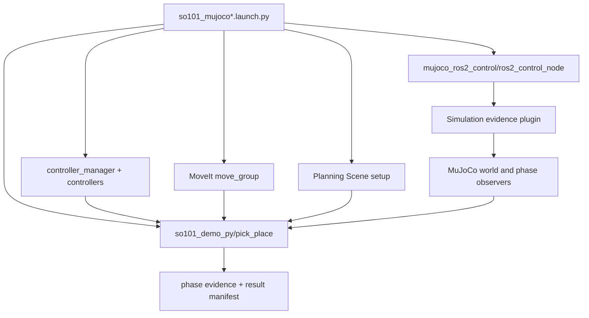

# SO-101 MuJoCo ROS 2 集成指南

本文描述当前 `so101_demo_py` 如何把 MuJoCo、`ros2_control`、MoveIt 2 和可审计的
pick-place 证据链组合起来。这里记录的是现行实现，不是迁移过程；历史实验、失败样本与决策证据
仍保留在 `docs/experiments/`、`docs/provenance/` 和计划文档中。

## 1. 当前边界

运行时只有一个 Python demo 包：

- ROS package：`so101_demo_py`
- Python namespace：`so101_demo`
- 源码目录：`src/so101_demo_py/src/`
- MuJoCo/Gazebo 启动器分开，必须显式选择，不存在默认仿真后端。
- MuJoCo `light_cup_wall_pick/v1` policy 的 SHA-256 固定为
  `aa83a43c25e2fa4bf70cbaaf6bcb76742e44d7f67a83625ab428f78dc5848356`。
- Gazebo 可以正常执行并报告实际失败阶段，但不参与 MuJoCo RED→GREEN 资格门控。
- 真实机械臂目前只有 `real_stub`，无启动器、无硬件 I/O，并以
  `REAL_HARDWARE_NOT_CONFIGURED` fail closed。

MuJoCo 链路的职责划分如下：



URDF/SRDF 提供关节语义、TF、MoveIt group 和 controller 映射；MJCF 提供实际动力学、
碰撞、接触、执行器和场景。两者通过 parity/asset tests 对齐，但不会在运行时互相转换。

## 2. 固定的 `mujoco_ros2_control` 依赖

项目把 fork 作为 Git submodule 提交，并直接构建锁定的 clean fork source：

| 项目 | 固定值 |
|---|---|
| submodule | `third_party/mujoco_ros2_control` |
| fork | `git@gitee.com:zjumty/mujoco_ros2_control.git` |
| candidate label | `so101-0.1.0-r1-candidate` |
| gitlink commit | `41a67efee2f2fe2394e327e5b4cae541806f7772` |
| upstream tag | `0.1.0` |
| upstream commit | `57fc6744844902d4532160b403fa95840c1d6f96` |
| local lineage | `f19a8cc3af61feccacb22a9f0d16cc972e3b2c08` (`so101-0.0.3-r11`) |
| lock | `src/so101_demo_py/config/mujoco/dependency-lock.yaml` |

lock 同时固定接口 SHA-256 与跨平台安装产物清单。`scripts/check_backend_integration.py` 验证
两份 lock 一致、`.gitmodules`/origin URL、clean submodule、gitlink/HEAD/commit，以及 upstream
0.1.0 与本地 r11 双祖先。candidate label 不创建 Git tag；跨平台验收后才切换到最终 release tag。
不要跟随浮动 branch，不要覆盖 `/opt/ros/jazzy`，也不要仅凭包名存在就宣称 provenance 成立。

### 2.1 安装 fork overlay

在仓库根目录执行：

```zsh
export SO101_WORKSPACE_DIR=/data/work/ws_moveit
zsh scripts/install-mujoco-ros2-control.zsh --init-submodule
```

安装器会先验证：

1. 当前 checkout 是含已提交 gitlink 的 superproject；
2. `.gitmodules`、lock、gitlink、submodule `HEAD` 四者一致；
3. submodule clean，origin URL 正确，官方 0.1.0 与本地 r11 都是 fork commit 的祖先；
4. candidate 阶段不存在同名 release tag；最终阶段 tag 精确解析到 locked commit；
5. 独立 build source 位于 locked commit 且保持 clean；
6. `mujoco_3d_lidar`、msgs、plugins、core 四个 fork package 实际被发现、构建并测试。

默认输出位于 `$SO101_WORKSPACE_DIR/ws_mujoco_ros2_control_fork/{build,install,log}`。
`mujoco_vendor` 继续来自 ROS underlay。旧版本或 dirty build source 会 fail closed；选择新的
`SO101_WORKSPACE_DIR` 或先显式归档旧 workspace，安装器不会自动清理用户文件。

### 2.2 source 顺序

每个新 shell 严格按 underlay → fork overlay → project overlay：

```zsh
source /opt/ros/jazzy/setup.zsh
source "$SO101_WORKSPACE_DIR/ws_mujoco_ros2_control_fork/install/setup.zsh"
source /path/to/so101-mujoco-ros2/install/setup.zsh

ros2 pkg prefix mujoco_ros2_control
ros2 pkg prefix mujoco_ros2_control_plugins
ros2 pkg prefix mujoco_ros2_control_msgs
ros2 pkg prefix mujoco_3d_lidar
ros2 pkg prefix mujoco_vendor
ros2 pkg prefix so101_demo_py
```

四个 fork package 必须落在 fork install，`mujoco_vendor` 必须落在 dependency overlay，
`so101_demo_py` 必须落在本次项目 install。切换 provider 后应使用新的 build/install 目录或
`--cmake-clean-cache`，避免 CMake cache 继续引用 apt header。

## 3. r1–r7 变更账本

fork 从官方 0.0.3 依次增加以下发布能力：

| Release | Commit | 现行作用 |
|---|---|---|
| r1 | `f58e2fd` | 在 reset/pause/snapshot 基础上暴露 viewer camera services。 |
| r2 | `9f02f82` | controller read 与 simulation mutex 同步，避免并发读取 MuJoCo 数据。 |
| r3 | `17fd1ec` | world reset 必须发生在 paused 状态，收紧 reset 前置条件。 |
| r4 | `20c77cd` | reset 后发布 authoritative snapshot，使新 epoch 有锁内权威帧。 |
| r5 | `f42b7b3` | viewer 在创建 OpenGL context 的 render thread 上销毁，修复 GUI clean shutdown。 |
| r6 | `738e304` | 增加每个成功 physics step 后的 plugin hook，覆盖全部 stepping path。 |
| r7 | `6fa4485` | 纳入 11 个跨平台 build/runtime commit，移除主仓补丁层，Linux 与 macOS 直接构建同一 clean fork。 |

r1 之前的 fork commits `07550eb` 与 `138e79b` 分别引入 reset/pause/snapshot hooks 和 viewer
camera state model；它们也是 r1–r7 历史的祖先。

当前 0.1.0 候选以官方 `MujocoSimulation`、double-buffer snapshot、free-joint reset 与 upstream
plugin ABI 为主体。SO-101 physics/reset/pause/snapshot 通过独立 optional observer capability
接入，不再向 upstream base class 添加虚函数；viewer-camera、macOS 主线程 context 和 CameraPlugin
生命周期在新架构上迁移保留。

## 4. 0.1.0 optional observer：逐 physics-step 权威证据

### 4.1 新接口

0.1.0 保持 upstream `MuJoCoROS2ControlPluginBase` ABI：`init()`、controller-rate `update()`、
physics-thread `pre_step()` 和 `cleanup()`。`on_physics_step`、reset、pause 与 snapshot 不属于 base；
需要这些只读仿真生命周期通知的 plugin 额外实现 optional capability：

```cpp
class MuJoCoROS2ControlSimulationObserver {
public:
  virtual void on_physics_step(const mjModel*, const mjData*);
  virtual void on_reset();
  virtual void on_pause(bool);
  virtual void on_state_snapshot(const mjModel*, const mjData*, bool);
};
```

SO-101 的 `SimulationEvidencePlugin` 同时继承 base 与
`MuJoCoROS2ControlSimulationObserver`。`MujocoSystemInterface` 仍通过 base 加载、初始化和持有
plugin；初始化成功后，`SimulationObserverDispatcher::add()` 用 `dynamic_pointer_cast` 只登记实现
observer capability 的实例。普通 upstream plugin 不会收到 observer 回调，base vtable 也没有新增
SO-101 专用虚函数。

`SimulationObserverDispatcher` 按 plugin load order 分发 physics/reset/pause/snapshot；单个 observer
抛异常时只禁用该 observer，后续 observer 继续运行。observer 必须 non-blocking，因为 physics-step
回调位于持有 simulation mutex 的 physics loop。参数是通过 divergence gate 的 authoritative
`mj_model_`/`mj_data_`，不是 control-thread snapshot。observer 是只读后置通知；需要在积分前修改
live `mjData` 的 upstream 行为继续使用 base `pre_step(mjData*)`。

### 4.2 唯一 stepping wrapper

`MujocoSimulation::step_authoritative_physics()` 固定顺序为：

1. `apply_staged_control_inputs()` 把 control-thread staging 合并进 live data；
2. `pre_step_callback_(mj_data_)` 执行既有 base `pre_step()` fan-out；
3. `mj_step(mj_model_, mj_data_)` 完成一次积分；
4. `Diverged(...)` 检查结果，失败时立即 latch 并返回；
5. 仅对未 divergence 的权威状态调用
   `observer_dispatcher_.on_physics_step(...)`；
6. `publish_control_state()` 更新 controller-facing double buffer；
7. `refresh_data_snapshot()` 更新 plugin/read-side physics snapshot；
8. `publish_clock()` 最后发布与上述状态一致的时钟。

因此权威数据流是 control staging/base pre-step -> `mj_step` -> divergence gate -> optional observer ->
control/data snapshots -> clock。divergent step 已经可能修改 live `mj_data_`，但不会通知 observer，
也不会覆盖最后一个合格 snapshot 或发布 clock。

所有三条实际 stepping 路径都必须经过该 wrapper：

- running resync 的 single step；
- running catch-up 循环中的 step；
- paused 状态下 `StepSimulation` 请求产生的 pending step。

因此对仍启用的 observer，“一个通过 divergence gate 的 physics step”与“一次
`on_physics_step()` 回调”可以建立一一对应；普通 base-only plugin 不参与这条后置通知链。

### 4.3 为什么不能继续复用 `update()`

plugin 的 `update()` 随 `ros2_control` read/controller-manager 周期运行；它服务于控制读写，
并不保证等于 MuJoCo timestep。典型配置可能是 100 Hz controller update 对 500 Hz physics：
只在 `update()` 采样会天然漏掉中间四个 step，无法证明接触峰值、短暂脱离、速度突变和
release settle 窗口完整。

optional observer 的 `on_physics_step()` 解决的是 cadence 与 authority 两个问题：

- cadence：每个成功 physics step 都调用；
- authority：在 simulation mutex 内读取真实 step 后数据。

它仍不等于“已经得到合格证据”。plugin 还必须提供有界、无阻塞的采样/发布策略，并由上层验证
session、reset epoch、step/sequence、时间新鲜度、字段有限性与连续窗口。

### 4.4 r6 测试合同

fork test 验证：

- compile-time signature checks 固定 base 仅有 `init/update/pre_step/cleanup`，observer capability 独立拥有
  physics/reset/pause/snapshot signatures；
- `SimulationObserverDispatcher` 只发现 opt-in capability，保持 load order 和参数 identity；某个 observer
  抛出标准或未知异常时只禁用该实例；
- 初始化成功的 plugin 才注册 observer，teardown 在 plugin `cleanup()` 前停止 dispatch；
- paused authoritative step 的事件顺序精确为 staged control、pre-step、`mj_step`、observer、control
  state、data snapshot、clock，且 pre-step 可观察到本轮 staged control；
- divergence gate 失败时 observer、control/data snapshots 与 clock 均不发布，最后一个合格 snapshot
  保持不变，catch-up batch 也在首个 divergent step 停止；
- running resync、running catch-up 和 paused `StepSimulation` 三条积分路径统一调用
  `MujocoSimulation::step_authoritative_physics()`。

项目侧另用 `static_assert` 证明 `SimulationEvidencePlugin` 实现
`MuJoCoROS2ControlSimulationObserver`，并以 19 个 GTest 保持原 evidence schema、chunk、hazard、reset
epoch 和 session-id 语义。

## 5. 项目构建与静态门

在 fork overlay 已 source 的新 shell 中，用隔离目录构建：

```zsh
cd /path/to/so101-mujoco-ros2

colcon build \
  --base-paths src \
  --build-base build/so101-demo \
  --install-base install/so101-demo \
  --packages-select so101_mujoco_support so101_teleop so101_demo_py

source install/so101-demo/setup.zsh
colcon list --base-paths src | rg '^so101_demo_py[[:space:]]'
ros2 pkg executables so101_demo_py
python3 scripts/check_backend_integration.py
```

测试与 lint：

```zsh
PYTHONDONTWRITEBYTECODE=1 python3 -m pytest -p no:cacheprovider -q \
  src/so101_demo_py/test

ruff check --config src/so101_demo_py/ruff.toml src/so101_demo_py
git diff --check

SO101_DEMO_EXPECTED_PREFIX="$(ros2 pkg prefix so101_demo_py)" \
  src/so101_demo_py/scripts/check_fusion_contract.sh
```

验收时必须检查 collected test 数量；`0 packages` 或 `0 tests` 即使 exit code 为 0 也不是通过。

## 6. 启动方式

### 6.1 只启动 MuJoCo 栈

```zsh
ros2 launch so101_demo_py so101_mujoco.launch.py \
  headless:=true \
  run_mode:=dry_run \
  execute:=false
```

### 6.2 启动 pick-place

dry-run 不触碰物理执行：

```zsh
ros2 launch so101_demo_py so101_mujoco_pick_place.launch.py \
  run_mode:=dry_run \
  execute:=false \
  policy_id:=light_cup_wall_pick \
  policy_version:=v1
```

live execute 必须双重显式授权，并使用唯一 session 与 `/data/work` 证据目录：

```zsh
ros2 launch so101_demo_py so101_mujoco_pick_place.launch.py \
  headless:=true \
  run_mode:=execute \
  execute:=true \
  session_id:=so101-run-001 \
  policy_id:=light_cup_wall_pick \
  policy_version:=v1 \
  evidence_file:=/data/work/so101-run-001/result.json
```

不要把 `DONE`、单次成功或 Planning Scene attachment 当作物理成功。计数资格化必须读回同一
session/epoch 的 lossless evidence、物理接触/搬运/释放后窗口、result manifest、source/policy/
bundle provenance 和 ordered shutdown。

### 6.3 Viewer camera

非 headless 启动后：

```zsh
ros2 run so101_demo_py camera_preset --list
ros2 run so101_demo_py camera_preset table_corner_nw
ros2 run so101_demo_py camera_preset --current --format yaml
```

GUI 只用于观察和数值复核；计数的接触/放置结论必须来自 headless 权威证据链。

固定 task camera 另有跨平台 topic 合同：`/task_camera/camera_info`、`/task_camera/color`、
`/task_camera/depth` 必须为 640 x 480、10 Hz（8–12 Hz 容差）、frame
`task_camera_frame`；color encoding 为 `rgb8`、depth encoding 为 `32FC1`，三者必须有对齐时间戳、
非空 payload，depth 至少包含一个有限正值。

Gazebo 使用同一个 CLI 和错误合同，但由 package-owned preset 与 `/gui/move_to/pose` adapter 实现：

```zsh
ros2 run so101_demo_py camera_preset --backend gazebo --list
ros2 run so101_demo_py camera_preset --backend gazebo overview
```

成功必须包含 transport 的 positive acknowledgement；Teleop 的 `gazebo_py` profile 也通过固定
`--backend gazebo` 参数调用这一公共 owner。

## 7. ResetWorld 事务

合格 reset 不是单个 service 成功，而是带 epoch 和 controller 收敛的事务：

1. 在物理仍运行时 deactivate controllers，避免 `/clock` 停止后 switch 卡死；
2. pause physics，并验证权威 paused state；
3. 调用 `ResetWorld`，由中央 reset 路径更新 state；
4. 在锁内发布 reset 后 authoritative snapshot，观察严格递增的新 epoch；
5. 有界 resume，使 joint-state broadcaster 产生新鲜完整 6-joint feedback；
6. activate controllers 并验证 exact active states；
7. feedback 收敛后重新 pause，排空短暂 `paused=false` 帧；
8. 只有同 session、新 epoch、step/sequence/paused 条件全部满足才提交 receipt。

不要用 `StepSimulation` 伪造 reset snapshot：它会真的推进物理。不要 pause-first 再 deactivate：
controller switch 依赖的时钟可能已停止。

Gazebo reset 使用同一公共入口，但不是 MuJoCo reset 的包装：

```zsh
ros2 run so101_demo_py teleop_reset --backend gazebo --session-id reset-001
```

它独立观察 Gazebo/MoveIt/joints，取消并等待 arm/gripper goals，分别验证物理与 Planning Scene
detach，停车/同步/恢复杯子，完全打开夹爪，按 SRDF `home` 精确 plan 并执行返回的同一 trajectory，
最后独立验证 Gazebo pose/attachment、Planning Scene membership/pose/`1/1/13`、controller、joint
position/velocity 与 TF。任一步 non-zero，不存在 partial-success receipt。

## 8. MoveIt、Planning Scene 与物理真值

MoveIt attachment 是规划器的 collision shadow，不是仿真物理约束。完整链路需要分别证明：

- controller/TF/joint state 健康；
- MoveIt plan 和 trajectory execution 成功；
- MuJoCo 中杯子由真实双指接触搬运，没有 weld/teleport/隐藏约束；
- release 后 gripper contact 消失、杯子由桌面支撑并在目标容差内稳定；
- Planning Scene 最终 detached，world primitive counts 正确。

`SimulationEvidence` 应作为同一锁边界生成的原子样本；不要把不同 receipt time 的 pose、contact、
velocity topics 拼成一帧。subscriber 还必须匹配 publisher QoS，并验证实际 callback、新鲜度和序列
连续性，不能只看 topic 名存在。

## 9. 资格化生命周期

MuJoCo 保留两套互不混计的五连胜：

- `FULL_RESTART`：每次新建并销毁完整 simulator/ROS stack；
- `RESET_WORLD`：同一个 owned stack 内，每次运行前取得新的 reset epoch。

每次 run 都必须有唯一 provenance、原始证据、结果分类和 clean shutdown。runner 在第一个
`VALID_FAILURE` 或 `INVALID` 停止，不通过丢弃失败后继续抽样来拼出五次成功。

当前融合基线的资格记录保存在 `src/so101_demo_py/docs/provenance.json`。它证明特定 source、
install、policy 与 bundle 下的历史合格结果；后续若修改 policy、物理模型、控制链、证据语义或
fork runtime，必须重新判断是否需要跑完整资格化，不能沿用旧结论。

## 10. 常见故障

| 现象 | 根因 | 处理 |
|---|---|---|
| build 成功但运行仍来自 apt | source 顺序或 CMake cache 错 | 新 shell 按三层 source，清 build/cache，读回 prefix 与 hashes。 |
| `colcon` 显示 0 packages/tests | base path 或 package select 错 | 显式 `--base-paths src` 并校验 discovery/count。 |
| reset 后无新 joint state | bounded resume 短于 broadcaster 周期 | 在原 deadline 内等待新鲜完整 6-joint callback。 |
| reset service 成功但 evidence 仍 running | 队列残留 resume 帧 | 排空 transient frame，只接受随后 fresh paused evidence。 |
| 证据 topic 存在但无 callback | QoS 不兼容 | 使用匹配 QoS，要求实际消息而非只看 graph。 |
| MoveIt 显示 attached 但杯子没移动 | 把规划 shadow 当物理约束 | 分开验证 simulator contact/pose 与 Planning Scene。 |
| controller/plugin 读取 MuJoCo 时崩溃或竞争 | 绕过 0.1.0 double buffer，跨线程读取 live `mj_data_` | controller 使用 control-state copy，普通 plugin 使用 data snapshot；逐步只读证据实现 optional observer。 |
| GUI 退出崩溃 | viewer/CameraPlugin context 的创建、使用或析构跨线程 | macOS 确认 main-thread UI/context 路径；worker 只消费已注册 context，并走 rendering capability cleanup。 |
| 500 Hz 证据只有约 100 Hz | 只用 base `update()` 的 controller cadence 采样 | 让证据 plugin 额外实现 `MuJoCoROS2ControlSimulationObserver::on_physics_step()` 并验证逐 step 序列。 |
| Gazebo execute 失败 | 策略/控制链的实际失败 | 保留第一失败 phase 和 evidence；不跳过，也不计入 MuJoCo 门控。 |

## 11. 关键文件

- dependency lock：`src/so101_demo_py/config/mujoco/dependency-lock.yaml`
- MuJoCo model/scene：`src/so101_demo_py/assets/mujoco/`
- controller/MoveIt config：`src/so101_demo_py/config/mujoco/`
- explicit launch composition：`src/so101_demo_py/src/runtime/launch_composition.py`
- MuJoCo lifecycle/reset：`src/so101_demo_py/src/backends/mujoco/`
- per-phase qualified execution：`src/so101_demo_py/src/backends/mujoco/qualified_phases/`
- result/provenance：`src/so101_demo_py/src/runtime/{result_manifest,provenance}.py`
- fork installer：`scripts/install-mujoco-ros2-control.zsh`
- repository contract：`scripts/check_backend_integration.py`
- package acceptance gate：`src/so101_demo_py/scripts/check_fusion_contract.sh`
