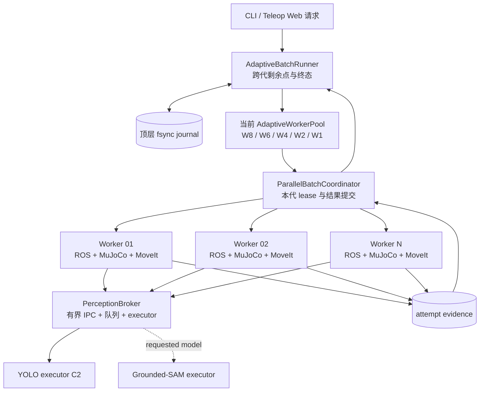
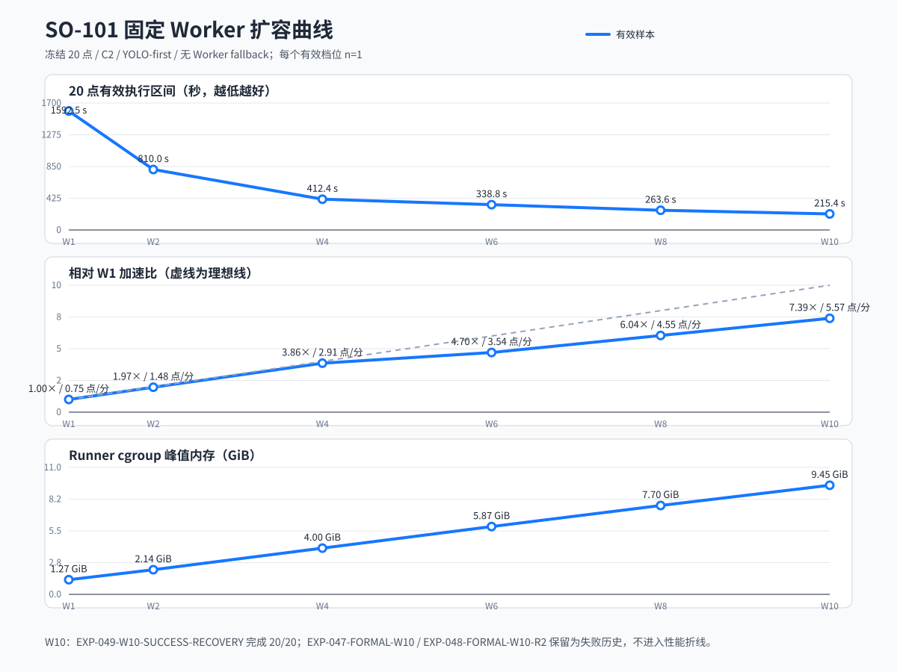

# SO-101 MoveIt 专家并发 Worker 池教学与源码导读

**范围：** 20 点 MoveIt 专家回归、`SEQUENTIAL` / `PARALLEL` / `ADAPTIVE`、完整 Worker 隔离、动态抢任务、W8 降级、共享 PerceptionBroker、YOLO-first、`/cup_pose` 时序、systemd 监督、证据与精确清理

**对象：** 已了解 Python、ROS 2、MoveIt 与 MuJoCo 基础，希望读懂并发验证实现、复现实验，并能定位 Worker 扩容失败的开发者

**目标：** 理解下面这条批量验证链路，而不把“进程更多”误认为“执行一定更快”

```text
20 个冻结测试点
  -> AdaptiveBatchRunner
  -> W8 Worker pool（必要时 W6 -> W4 -> W2 -> W1）
  -> 每个 Worker 独立 ROS Domain + MuJoCo + MoveIt + controller
  -> 共享 PerceptionBroker
  -> YOLO-Seg 优先，允许的感知失败才回退 Grounded-SAM
  -> /cup_pose READY fence
  -> MoveIt pick-place + MuJoCo 物理验收
  -> fsync 终态 + 精确清理
```

本文沿用 [`so101-yolo-seg-rgbd-perception-pick-place-source-guide.md`](so101-yolo-seg-rgbd-perception-pick-place-source-guide.md) 的讲解方式：先看完整数据流，再按源码边界逐层拆开，最后结合真实实验解释踩过的坑。感知模型、RGB-D 定位和单次抓放内部细节不在这里重复，可配合原导读和 [`so101-dynamic-cup-pick-place-source-guide.md`](so101-dynamic-cup-pick-place-source-guide.md) 阅读。

本文描述的是 `codex/parallel-adaptive-worker-pool` 实现线。冻结合同下的 W1、W2、W4、W6、W8 已完成正式对比，默认档位 W8 是当前最快的有效档位；W10 两次运行均失败，没有有效性能样本。文中使用以下标签区分证据强度：

| 标签 | 含义 |
|---|---|
| `VERIFIED` | 有有效实验、自动化测试或现场读回支持 |
| `OBSERVED` | 现场直接看到，但尚未完成根因 A/B |
| `INFERRED` | 多项事实支持的解释，仍需对照实验确认 |
| `UNVERIFIED` | 只有设计或契约支持，尚无现场运行结论 |

## 1. 这套并发模式解决什么问题

单 Worker 运行 20 个点时，仿真启动、感知、规划、机械臂运动和恢复都串行发生。一个点耗时一分钟左右，整批很容易超过二十分钟。多 Worker 的想法很直接：同时准备多套完整仿真栈，让不同点位并行执行。

真正困难的部分不是启动 N 个进程，而是让 N 次实验仍然可计数：

- 每个点必须从自己的规定初始状态开始；
- 一个点不能被两个 Worker 同时执行；
- Worker 崩溃时，已经完成的点不能丢，也不能覆盖；
- 共享感知不能把 A Worker 的结果发给 B Worker；
- 旧 ROS graph、socket、controller goal 和 MuJoCo 进程不能污染下一档；
- 业务失败不能被基础设施重试偷偷改写成成功。

因此，这套实现并不追求“八个 Worker 永远可用”。它优先用 W8 加速；当前机器承受不了时，缩到 W6 或更小的档位继续完成剩余点。目标是更快地得到可信的 20 点结果，不是建设一套线上高可用调度平台。

## 2. 三种模式不要混在一起

公开入口支持三种调度语义：

| 模式 | 调度权威 | Worker 数与领取规则 | 适合场景 |
|---|---|---|---|
| `SEQUENTIAL` | `ParallelBatchCoordinator` | 单 Worker，按冻结顺序执行 | 基线、最小复现 |
| `PARALLEL` | `ParallelBatchCoordinator` | 固定 Worker 数，`max_points_per_worker` 是硬上限 | 固定分片实验 |
| `ADAPTIVE` | `AdaptiveBatchRunner` 跨代持有终态；每代仍由 `ParallelBatchCoordinator` 发 lease | Worker 数和初始亲和可动态指定；完成初始任务后可抢剩余点；基础设施故障可降级 | 20 点日常回归 |

`ADAPTIVE` 不是在旧的固定并行模式上多加一个循环。它引入了 pool generation：W8 是第一代，若基础设施故障并且清理成功，W6 是下一代。跨代的剩余点和不可变终态归 `AdaptiveBatchRunner` 管理，本代 lease 和 attempt 则继续交给已有 Coordinator。

Web 页面只投影选定模式的顶层 journal。它不是调度权威，不能从 UI 状态推导或改写点位结果。

## 3. 完整运行架构



一套 Worker 不是一个线程，也不是只跑 MoveIt 客户端。它是完整执行栈，至少拥有：

- 唯一 `ROS_DOMAIN_ID`；
- 唯一 MuJoCo session、ROS graph、MoveIt/controller namespace；
- 独立 `ROS_HOME`、日志、临时目录和点位证据目录；
- 独立 worker identity、worker generation、heartbeat 和 lease；
- 到共享 Broker 的具名连接。

Worker 共享 GPU 感知服务，但不把顶层调度状态交给 Broker。仿真世界与控制器也各自隔离。

## 4. 源码分成哪些层

| 层 | 主要文件 | 责任 |
|---|---|---|
| 自适应契约 | `src/so101_demo_py/src/parallel_batch/adaptive_contracts.py` | W1–W16 上限、默认档位、fallback、Domain 池、批次和终态类型 |
| 初始亲和与抢任务 | `src/so101_demo_py/src/parallel_batch/adaptive_queue.py` | preferred deque、全局队列和跨 Worker 窃取顺序 |
| 跨代 Runner | `src/so101_demo_py/src/parallel_batch/adaptive_runner.py` | 剩余点、不可变终态、pool generation、降级和顶层 summary |
| 单代 Pool 适配 | `src/so101_demo_py/src/parallel_batch/adaptive_pool.py` | READY barrier、socket 预检、生产 composition、结果映射和清理 |
| 本代协调器 | `src/so101_demo_py/src/parallel_batch/coordinator.py` | Worker 注册、lease、ACK、heartbeat、动作权限与最终结果提交 |
| Worker 状态机 | `src/so101_demo_py/src/parallel_batch/worker.py` | 初始状态门、感知、执行、封存、恢复和 watchdog |
| 感知 Broker | `src/so101_demo_py/src/parallel_batch/broker.py` | 有界队列、executor、deadline、health、provenance 与 request/response 精确关联 |
| IPC | `src/so101_demo_py/src/runtime/parallel_ipc.py` | Broker 的有界推理 IPC，以及与它分离的 Coordinator/Worker 鉴权控制 IPC |
| Broker runtime | `src/so101_demo_py/src/runtime/parallel_perception_runtime.py` | 无调度状态的模型执行、等待、结果关联与指标 |
| ROS Worker runtime | `src/so101_demo_py/src/runtime/parallel_worker_runtime.py` | MuJoCo/MoveIt/controller、动态 `/cup_pose` consumer 与动作取消 |
| 资源与进程 | `src/so101_demo_py/src/parallel_batch/resources.py`、`src/so101_demo_py/src/runtime/parallel_processes.py` | Domain claim、目录、进程身份、资源读回和精确清理 |
| 用户入口 | `src/so101_demo_py/src/cli/mujoco_parallel_batch.py` | 参数解析、provenance、composition、RPC server 和最终报告 |
| 清理入口 | `src/so101_demo_py/src/cli/parallel_batch_cleanup.py` | Runner 异常后的登记对象清理 |
| 配置 | `src/so101_demo_py/config/mujoco/parallel_adaptive_workers_v1.yaml` | 默认 W8、fallback、Domain 215–230、C2 |
| 监督脚本 | `scripts/run_so101_adaptive_batch.zsh` | 启动 Runner、转发信号、最后执行精确 cleanup |
| 扩容实验脚本 | `scripts/run_so101_adaptive_worker_scaling.zsh` | W1–W16 显式档位样本和性能摘要 |

测试按同样边界拆开。读源码时可以把 `test_parallel_adaptive_queue.py`、`test_parallel_adaptive_runner.py`、`test_parallel_adaptive_pool.py`、`test_parallel_batch_broker.py` 和 `test_parallel_worker_runtime.py` 当成可执行说明书。

## 5. 默认配置为什么是 W8，而上限是 W16

当前冻结配置为：

```yaml
schema_version: 1
backend: mujoco
worker_count: 8
fallback_worker_counts: [6, 4, 2, 1]
initial_points_per_worker: 3
worker_start_timeout_s: 120.0
max_infra_attempts_per_point: 5
ros_domain_ids: [215, 216, 217, 218, 219, 220, 221, 222,
                 223, 224, 225, 226, 227, 228, 229, 230]
yolo_executor_count: 2
```

这些数字的含义不同：

- W8 是默认运行档位，也是当前最高的现场合格档位；
- W16 是接口与契约上限，W17 会在创建进程前被拒绝；
- `215..230` 只是可分配 Domain 池，不表示每次都占满；
- C2 表示两个 YOLO executor，不等于两个 Broker；
- `initial_points_per_worker=3` 只是初始亲和提示，不是每个 Worker 最多做三个点。

W10、W12、W16 不属于默认性能矩阵。显式运行它们时，要按真实 `levels_used` 报告。W10 降到 W8 后完成，只能说明自适应恢复可用，不能算作 W10 性能样本。

## 6. 启动时发生什么

一代 pool 的启动顺序可以简化为：

```text
读取并冻结 batch manifest
  -> 检查 evidence root、短 batch ID 和所有 socket 路径
  -> 原子申请 N 个 ROS Domain
  -> 启动共享 Broker
  -> 启动 N 套完整 Worker stack
  -> 每个 Worker 写 READY receipt
  -> Runner 复核全部 receipt
  -> fsync POOL_RUNNING
  -> 同时释放所有 Worker 的 start gate
  -> 开放真实点位 lease
```

`READY` 不是“进程 PID 存在”。每个 receipt 至少要证明：

- Coordinator 注册成功；
- 当前 worker generation 与进程 start ticks 匹配；
- MuJoCo、MoveIt、controller 和 ROS runtime 可用；
- Broker 服务就绪，模型健康与 provenance 已读回；
- 本地动态 `/cup_pose` consumer 已建立自己的 READY fence。

只有 N 个 Worker 全部满足条件，`POOL_RUNNING` 才会成为线性化点。在它之前故障，当前代不得获得真实点位 lease；在它之后故障，系统必须先裁决在途点，再考虑降级。

设计要求“八个完整 Worker 同时处于可执行状态”，不要求八个 Worker 在同一瞬间都处于机械臂运动阶段。实际并发度还会受 Broker、CPU 调度、MuJoCo 实时率和单点时长限制。

## 7. 初始亲和不是固定分片

`AdaptivePointSelector` 为每个 Worker 建一个 preferred deque。假设点位顺序为 P01–P20，W8 且 `initial_points_per_worker=3`，轮转填充的结果大致是：

```text
worker-01: P01, P09, P17
worker-02: P02, P10, P18
worker-03: P03, P11, P19
worker-04: P04, P12, P20
worker-05: P05, P13
worker-06: P06, P14
worker-07: P07, P15
worker-08: P08, P16
global:    empty
```

Worker 空闲后按这个顺序选择：

1. 自己 preferred deque 左端仍可执行的点；
2. 全局队列左端；
3. 其他 Worker preferred deque 的尾部；
4. 最后按冻结点位顺序寻找任何仍 eligible 的点。

第三步就是动态抢任务。快 Worker 不会因为自己的初始点做完而退出，它可以接手慢 Worker 尚未 lease 的尾部任务。`choose()` 只选择候选；真正防止重复执行的是 Coordinator 在同一把状态锁下原子创建 lease。

由此可以解释两个容易混淆的参数：

- `initial_points_per_worker` 决定数据局部性和最初负载，不决定总处理量；
- 固定 `PARALLEL` 模式的 `max_points_per_worker` 是硬上限，不能带入 `ADAPTIVE`。

## 8. 每个点怎样保证从初始状态开始

并发模式不要求复制历史 `RESET_WORLD` 的内部步骤。它要求的是结果等价的可读回状态。每个 lease 的主链为：

```text
LEASED
  -> restore point-specific initial state
  -> point_initial_gate
  -> START_ATTEMPT + ACK
  -> fresh inference snapshot
  -> YOLO -> optional Grounded-SAM
  -> POSE_ACCEPTED
  -> MoveIt pick-place
  -> physical result validation
  -> seal PASSED / FAILED
  -> commit result
  -> canonical recovery
  -> worker_ready_gate
  -> AVAILABLE
```

`point_initial_gate` 读回的不是一个 reset RPC 返回码，而是当前事实：

- 机械臂在 canonical joints，速度已稳定；
- 夹爪处于规定状态，没有活跃 controller goal；
- 杯子位于该点规定的初始 6D pose 和容差内；
- MuJoCo 与 MoveIt Planning Scene 都没有残留 attachment；
- reset epoch、simulation session、point ID 和 lease identity 一致；
- 相机帧晚于本次恢复完成事件；
- 当前 Domain 没有旧 Worker 或跨 Worker 控制 topic。

恢复命令成功但读回不一致时，不能开始 attempt。这个边界让“每个点从初始状态开始”可以被验证，也允许实现选择重建仿真或确定性 reset，而不绑定某一种内部过程。

## 9. lease、attempt 与不可变终态

一个点的身份不只有 `point_id`。运行时还需要：

```text
batch_id
coordinator_epoch
worker_id
worker_generation
point_id
attempt_id
lease_generation
```

这些字段由 Coordinator 和 Worker 的控制面使用。Worker 重启后即使仍叫 `worker-03`，generation 也已经变化；旧 heartbeat、动作请求和 result commit 会在控制面被拒绝。

Broker 不读取这些字段来决定是否推理，也不查询 lease、generation、start-event、reset epoch 或 Coordinator journal。它只按推理 `request_id` 关联请求与响应。迟到的响应仍然只是数据：Worker 在开始或继续动作前复核当前 lease，Coordinator 在接纳最终结果时再次验证所有权。两个语义相同但 `request_id` 不同的请求可以分别执行；多算一次可以接受，不能因此放宽动作与终态边界。

点位状态按下面的语义处理：

| 状态 | 含义 | 可否重新入队 |
|---|---|---|
| `UNRUN` | 尚未开始有效 attempt | 可以 |
| `LEASED` / `RUNNING` | 当前代在途 | 故障裁决后才可以 |
| `INFRA_INTERRUPTED` | 基础设施中断，未得到业务终态 | 可以 |
| `PASSED` | 抓放和物理验收通过 | 不可以 |
| `FAILED` | 有效初始状态下得到业务失败 | 不可以 |

`PASSED` 和 `FAILED` 一旦 fsync 提交便不可覆盖。若 Worker 失联时动作是否发生无法证明，本次 attempt 记为 `INDETERMINATE`；点位可以在旧栈停止、世界重新初始化并通过新 gate 后再次执行，但后来的结果不能删除那次不确定历史。

## 10. 为什么感知要共享 Broker

如果每个 Worker 都加载一份 YOLO 和 Grounded-SAM，W8 会复制模型显存、CUDA context、宿主内存和 warm-up 成本。实际运动阶段 GPU 经常空闲，但模型进程的常驻内存仍在。共享 Broker 把模型生命周期收敛成一套：

```text
N 个 Worker
  -> bounded Unix RPC
  -> PerceptionBroker
      -> YOLO bounded queue -> C2 executors
      -> Grounded-SAM bounded queue -> executor
```

Broker 的主要约束是：

- 并发连接、frame 与每个模型的队列都有上限，不因扩容无限占用内存；
- executor 数固定，例如 C2 只允许两个 YOLO 执行槽；
- 每个请求带唯一的在途 `request_id`、模型、不可变输入或 digest、推理选项和 caller deadline；
- 响应原样回传 `request_id`、模型 identity/version、终态、结果或结构化错误和 timing；
- 乱序完成不能串线。一个请求超时或断开，也不能取消或误投其他请求；
- health、provenance、schema、socket 权限和本地 deadline 都由 Broker 自己处理。

Broker 的推理路径不会调用 Coordinator，也不会读取或 replay Coordinator journal。lease、Worker generation、start-event 和 reset epoch 即使为了兼容暂时随请求携带，也只是 opaque metadata，不参与 admission、dispatch 或 completion。同一个语义请求可以换用新的 `request_id` 再算一次；相同的在途 `request_id` 可以在 Broker 本地拒绝，以免响应关联产生歧义。这不是调度判断，也不需要 durable replay cache。

YOLO-first 和是否请求 Grounded-SAM 属于 Worker 侧的业务策略，Broker 只执行明确指定的模型。只有 YOLO 没有合格检测、mask/depth 质量不合格，或确定的请求级模型错误，Worker 才能使用新鲜输入请求 Grounded-SAM。下面这些情况属于基础设施故障，不触发模型回退：

- Broker 或 CUDA 进程退出；
- OOM、GPU Xid；
- Unix RPC 断开；
- queue/inference/handler deadline；
- queue full 或模型 health 失败。

否则 W10 的 Broker 崩溃可能被伪装成“YOLO 没看到杯子”，实验结果会失真。

## 11. `/cup_pose` 的端到端边界

“5 秒内等到 `/cup_pose`”不是 YOLO 一次 kernel 的耗时。它覆盖从 Worker 准备完成到 consumer 接受 Pose 的整条墙钟路径：

```text
Worker READY fence
  -> post-fence RGB-D snapshot
  -> Worker IPC request
  -> Broker frame/schema 校验与 request_id 登记
  -> 排队
  -> YOLO 执行
  -> mask + Depth + exact-stamp TF
  -> 候选发布
  -> ROS/DDS 传输
  -> consumer 校验 source stamp、frame 与 lease
  -> POSE_ACCEPTED
```

因此，YOLO 单次推理很快，并不能排除 `/cup_pose` 超时。Broker IPC、排队、本地 deadline、ROS 调度、consumer 尚未 arm 和源帧过旧，都会消耗这段时间。lease 校验发生在 Worker 的动作边界和 Coordinator 的最终结果边界，不计入 Broker 推理 admission。

### 11.1 READY fence 解决什么

早期实现用“ROS graph 已发现 subscriber”代替 consumer 自己的 READY。现场 A/B 证明两者不是同一个事件：parent 已开始 capture，child 稍后才冻结 `ready_ros_ns`。模型虽然成功，发布的 source stamp 却早于 READY；30 次重发都保留同一不可变 stamp，因此全部被正确拒绝。

修复没有放宽 stale 检查，而是加入 child-owned READY receipt：

1. child 先订阅并调用 `RosCupPoseSource.arm()`；
2. child 持久写出自己的 `ready_ros_ns`；
3. parent 读回并校验 receipt；
4. parent 丢弃早于该时间的缓存帧，重新取得 post-fence snapshot；
5. Broker 和 publisher 保留原始 source stamp；
6. consumer 只接受同一 lease 下、晚于 READY 的 Pose。

这个设计保住了因果关系。把旧 Pose 的 header 改成当前时间，或反复重发旧帧，都会制造假的“新鲜”感知，不能作为修复。

## 12. 为什么 Broker 的等待方式会影响 W8

W8 早期出现过 `/cup_pose` 排队超时。旧实现让 waiter 反复检查调度状态，watchdog 也持续轮询。请求数增加后，Broker 锁内的额外工作挡住了模型 dispatch。这条路径已经删除，当前合同里没有 Broker 侧调度检查。

当前 Broker 的等待只依赖本地事件和 deadline：

- submit、model start、completion、cancel 或 health 变化时唤醒 waiter；
- 没有事件时按最近 deadline 阻塞；
- deadline watchdog 只处理本地时间边界；
- 推理全生命周期对 Coordinator authorization 调用为零，对 Coordinator journal replay 也为零。

迟到或重复的推理可以继续消耗一次计算，Broker 不为此恢复调度状态。调用方按 `request_id` 接收结果；Worker 随后在动作前检查 lease，Coordinator 在 final result commit 时检查所有权。W8 完成 20/20 也说明，提高 GPU executor 数并不是当时的第一修复点。

## 13. 业务失败与基础设施失败为什么要分开

只有基础设施失败触发降级：

| 分类 | 例子 | 处理 |
|---|---|---|
| 业务失败 | 无合格 Pose、IK/规划拒绝、碰撞、抓取失败、放置超差 | 提交 `FAILED`，当前 Worker 恢复后继续取其他点 |
| 启动故障 | Worker 未 READY、Domain 申请不足、必要进程启动失败 | 当前代零 lease 清理，进入下一档 |
| 运行故障 | Worker/Broker/仿真退出、heartbeat 丢失、RPC 断开、OOM | 冻结新 lease，裁决在途点，清理后降级 |
| 恢复故障 | canonical recovery、初始状态或清理读回失败 | 未得到业务终态的点重新排队，然后降级 |

MoveIt 在健康通信链上返回明确规划失败，这是点位能力问题。RPC 没有返回、Broker handler 超时或 Worker 被杀，系统无法知道业务会得到什么结果，必须按基础设施处理。

CPU、内存、显存和 Real-Time Factor（RTF）只是观察指标。轻量设计不为它们设置严格启动阈值；已经发生的 OOM、进程退出或通信不可用才触发降级。

## 14. 降级是一笔事务

W8 不能简单地再启动一套 W6。旧 generation 尚未停干净时复用 Domain 或 controller，会让下一代的证据失去归属。

正确顺序是：

```text
停止发新 lease
  -> fsync 已提交 PASSED / FAILED
  -> 裁决每个在途 attempt
  -> 停止 Broker 接纳，按 request_id 尽力取消本地请求，并取消 controller goal
  -> 停止本代 Worker、MuJoCo、MoveIt、Broker
  -> 回读进程、Domain、socket、容器与 attachment 均已清理
  -> 记录 POOL_DEGRADED
  -> 将 UNRUN / INFRA_INTERRUPTED 放回剩余集
  -> 启动下一代
```

任何一步清理不完整，批次直接进入 `INFRA_FAILED`，不能叠加新栈。W1 再发生基础设施故障也结束整批。

已经终态的点不重跑。一个健康 Worker 完成业务失败后的 canonical recovery，可以继续执行其他点；并不需要为了保持固定分片把它闲置。

## 15. 为什么用 systemd 启动长运行栈

systemd user transient unit 不是为了做生产级资源准入，而是为了明确进程所有权：

- Runner、监控器和交互 tmux 落在不同 cgroup；
- `MemoryCurrent`、`MemoryPeak`、`TasksCurrent` 可以按 unit 读取；
- tmux 意外退出时，Runner 是否仍存活可以单独判断；
- 清理可以针对本任务 unit 和登记 PID，不必使用宽泛 `pkill`；
- systemd-oomd 的 kill 记录能与 kernel OOM 区分。

曾经发生过 tmux scope 被 `systemd-oomd` 选中，而 Runner 的独立 systemd service 仍存活。那次不是整机物理内存归零，也没有 kernel OOM 证据；上层 user service 在持续内存压力下触发了 oomd 策略，约 7.7 GiB 的 tmux scope 成为牺牲对象。

这也是为什么监控器应在 Runner cgroup 之外运行：如果采样进程和目标进程一起被杀，就会同时失去故障和证据。

`systemctl --user show <unit> -p ActiveState -p SubState -p MemoryCurrent -p MemoryPeak -p TasksCurrent` 用于读取某个 unit 的存活状态、当前/峰值内存和任务数。transient unit 被 garbage collect 后，再查这个名字可能只得到“未找到”或无意义默认值；历史结论应读 journal 和已经保存的 invocation ID，不能用事后空状态覆盖。

## 16. ROS Domain 与目录隔离

每个 Worker 从 `215..230` 取得一个唯一 Domain。Domain claim 不只依靠进程持有的 flock，还写入 `ACTIVE|RELEASED`、batch 和 generation 身份。

这样做是为了处理一个现实问题：Runner 被 SIGKILL 后 flock 会自动释放，但旧进程、ROS daemon 或 socket 可能仍在。如果只看锁，新批次会错误复用污染的 Domain。持久 `ACTIVE` 记录会让启动失败关闭，直到精确 cleanup 完成读回并把记录改为 `RELEASED`。

每个 Worker 还需要独立：

- `ROS_HOME` 和 `ROS_LOG_DIR`；
- MuJoCo session 与 runtime root；
- Worker control socket 和 Coordinator socket；
- attempt evidence 目录；
- 临时目录。

隔离并不是把相同环境变量改一个数字就结束。最终要从 ROS graph、进程 start ticks、socket、controller goal 和证据路径反向确认身份。

## 17. 如何启动

先查看当前安装版本的参数，不要从本文复制模型路径或 hash：

```bash
source /opt/ros/jazzy/setup.zsh
cd /data/work/ws_moveit
source install/setup.zsh

ros2 run so101_demo_py so101_parallel_batch --help
```

生产运行由监督脚本包装：

```bash
scripts/run_so101_adaptive_batch.zsh \
  --adaptive-workers \
  --points /absolute/path/to/moveit_expert_validation_points_v1.yaml \
  --config /absolute/path/to/parallel_batch_v1.yaml \
  --adaptive-config /absolute/path/to/parallel_adaptive_workers_v1.yaml \
  --batch-id a81 \
  --worker-count 8 \
  --fallback-worker-counts 6,4,2,1 \
  --initial-points-per-worker 3 \
  --worker-start-timeout-s 120 \
  --max-infra-attempts-per-point 5 \
  --evidence-root /data/work/so101-evidence/<task-family>/<run-id> \
  --broker-image <qualified-image> \
  --yolo-weights <absolute-best.pt> \
  --yolo-weights-sha256 <sha256> \
  --grounded-root <absolute-grounded-sam-root> \
  --grounded-manifest-sha256 <sha256> \
  --run-mode execute
```

运行前还要满足这些硬边界：

- evidence root 是本任务登记的唯一根，绝对路径、规范化且权限精确为 `0700`；
- `batch-id` 是 1–5 个 ASCII ID 字符；
- `<evidence-root>/r/<batch-id>` 不存在；
- 最长派生 Unix socket 路径不超过 107 bytes；
- source commit、install overlay、模型、配置和点位清单的 hash 已读回；
- 目标 Domain、进程、容器和 GPU compute application 没有旧任务占用。

扩容实验脚本可以先只打印命令：

```bash
scripts/run_so101_adaptive_worker_scaling.zsh \
  --worker-counts 1,2,4,6,8 \
  --evidence-root /data/work/so101-evidence/<task-family>/<run-id> \
  --dry-run
```

该脚本中的默认模型路径是 ai-station 现场约定，不是永久 API。长期运行前应打开脚本和当前配置，重新核对所有绝对路径与 hash。

## 18. 怎样判断一个性能样本有效

不同 Worker 数只能在这些条件相同时比较：

- source commit 与安装产物；
- 点位清单及顺序；
- YOLO/Grounded-SAM 模型与 hash；
- C2/C4、queue 和 deadline；
- MoveIt motion policy；
- 每点初始状态与物理验收；
- 运行模式与清理标准。

一个档位的有效性能样本还必须：

- `levels_used` 从头到尾只有目标档位；
- 20 个点都得到业务终态；
- 没有 fallback 或基础设施重试；
- 证据和清理完整；
- 计时覆盖相同边界。

否则它可以证明恢复路径，但不能进入该档位的加速比。

## 19. 当前现场结果

下面的正式对比来自 2026-09-15。同一份 20 点清单、顺序、reset、MoveIt policy、YOLO 权重、Broker C2、timeout 和无 Worker fallback 合同依次运行 W1、W2、W4、W6、W8、W10。W1–W8 各只有一个完整批次，因此这些数值是工程测量，不是重复实验的置信区间。



| 档位 | 正式结果 | 20 点执行区间 | 吞吐（点/分） | 相对 W1 加速 | 并行效率 | Runner 峰值内存 |
|---:|---|---:|---:|---:|---:|---:|
| W1 | 20/20 `PASSED` | 1592.51 s | 0.75 | 1.00× | 100.0% | 1.27 GiB |
| W2 | 20/20 `PASSED` | 810.05 s | 1.48 | 1.97× | 98.3% | 2.14 GiB |
| W4 | 20/20 `PASSED` | 412.42 s | 2.91 | 3.86× | 96.5% | 4.00 GiB |
| W6 | 20/20 `PASSED` | 338.78 s | 3.54 | 4.70× | 78.3% | 5.87 GiB |
| W8 | 20/20 `PASSED` | 263.64 s | 4.55 | 6.04× | 75.5% | 7.70 GiB |
| W10 | 两次运行失败，无有效样本 | — | — | — | — | 9.17 GiB（EXP-047 失败诊断值） |

W8 是当前最快的有效档位，也是推荐默认值。W4 则是效率拐点：它保留 96.5% 并行效率；继续加到 W6、W8 仍能缩短墙钟时间，但启动成本、进程调度和内存增长已经明显压低边际收益。W8 的 6.04× 加速低于理想 8×，不能把 Worker 数直接当作加速倍数。

W10 没有曲线点。EXP-047 在十个首波点成功后丢失 Broker 容器；EXP-048 在 `POOL_STARTING` 之后、`POOL_RUNNING` 之前失败，零点完成。两次都是通过准入后的真实运行失败，成功率为 0/2，但失败阶段不同，不能据此断言它们有同一个根因。图中的红叉只表示失败，不与 W1–W8 的有效折线相连。

图表不是手工描点。维护源是 [`data/so101-parallel-worker-scaling.json`](data/so101-parallel-worker-scaling.json)，生成器是 [`../../scripts/generate_so101_parallel_worker_scaling_chart.py`](../../scripts/generate_so101_parallel_worker_scaling_chart.py)。修改数据后运行：

```bash
python3 scripts/generate_so101_parallel_worker_scaling_chart.py
python3 scripts/generate_so101_parallel_worker_scaling_chart.py --check
```

生成器会拒绝重复档位、失败档位携带性能值、完整成功却被记为失败等含混数据，并检查生成 SVG 是否与维护源一致。

## 20. 出现过的坑与解法

### 20.1 为 W8 设计了过重的准入系统

早期方案包含 `AdmissionAuthority`、Ed25519 首次生成仪式、签名画像、不可变 `/opt/.../releases/<hash>`、cgroup 硬门、PSI/RTF 阈值和五阶段 qualification。这些机制适合严格线上系统，却让离线 20 点回归的维护成本远高于收益。

当前解法是保留会影响结果可信度的最小边界：Domain/仿真隔离、READY barrier、lease、持久终态、故障降级和精确清理。CPU、内存、GPU 与 RTF 继续采样，但不再决定能否启动。W8 跑不稳就用 W6。

### 20.2 tmux `send-keys Enter` 没有提交 Codex 任务

Codex TUI 中，tmux 合成的 `Enter` 可能以 LF/Ctrl-J 到达 composer，被识别为换行；`C-m` 也可能落到 editor newline。长粘贴触发 paste burst protection 后，紧随的 Enter 还可能继续被吸收。tmux 返回 0 只说明字节发出，不证明任务已提交。

新任务应在普通 shell pane 中把首条指令作为 Codex CLI 启动参数。已有任务使用 `codex queue --thread <verified-uuid>`，再用随机 dispatch receipt 做 bounded read-back。不要把 tmux session 名当 Codex thread UUID，也不要连续盲发回车。

详细规则见 [ai-station access reference](../../.agents/skills/so101-dev/references/ai-station-access.md)。

### 20.3 zsh 中给 `path` 赋值后所有命令失效

zsh 的小写 `path` 与环境变量 `PATH` 绑定。脚本里写 `path=...` 会重建命令搜索路径，随后 `git`、`python` 或 `ros2` 看起来像突然消失。一次批量 wrapper 验证因此产生了 26 个无关失败。

使用语义化变量名，例如 `socket_path`、`evidence_path`、`target_path`。不要把 `path` 当普通局部变量。

### 20.4 evidence root 权限不是精确 `0700`

W10 第一次尝试在创建任何 runtime 之前失败，因为根目录权限是 `0775`。这不是“过于保守”的检查：目录内包含 token、Unix socket、进程身份和可执行结果，组用户可写会破坏证据归属。

创建后立即读回：

```bash
stat -c '%a %n' /data/work/so101-evidence/<task-family>/<run-id>
```

不满足 `700` 就在启动前纠正。此类失败记为 `INVALID`，不能进入 W10 成功率或性能分母。

### 20.5 Unix socket 路径只有 107 bytes

Linux pathname Unix socket 的安全内容上限按 107 bytes 处理。evidence root、generation、worker identity 和 `-control.sock` 会一起进入最终路径。W10 第二次预检使用五字符 batch ID，最长 socket 达到 111 bytes；换成一字符 batch ID 后恰好 107 bytes。

解法不是缩短证据根的可读标题，而是把运行目录固定为短结构：

```text
<evidence-root>/r/<batch-id>/p/g01w08/...
```

`batch-id` 限制为 1–5 个 ASCII 字符，并在创建任何进程前枚举所有 `adaptive_socket_paths()` 逐个检查编码后的字节数。描述性名称放在 manifest，不进入 IPC 路径。

### 20.6 Runner 被杀后 Domain claim 仍是 `ACTIVE`

OOM 或 SIGKILL 会关闭 flock，却不保证旧 ROS daemon、进程和 socket 已经消失。一次 W8 异常后，W6 因 Domain 215 的持久 `ACTIVE` 记录拒绝启动。直接删 claim 文件会绕过污染检查。

正确处理是运行相同 runtime root 的精确 cleanup，核对登记进程、容器、socket、ROS graph 与 controller goal，然后在锁内把 claim 写为 `RELEASED` 并 fsync。旧 attempt 证据保留。

### 20.7 tmux 被 `systemd-oomd` 杀死，不等于整机 OOM

一次 W8 尝试中，父 user service 的内存压力超过策略窗口，systemd-oomd 选择约 7.7 GiB 的 tmux scope 终止。kernel log 没有物理 OOM，Runner 的独立 systemd service 仍在。

排查时同时看：

```bash
journalctl --user -u <runner-unit> --since <time>
journalctl --user --since <time> | rg 'oomd|Killed'
systemctl --user show <runner-unit> \
  -p ActiveState -p SubState -p MemoryCurrent -p MemoryPeak -p TasksCurrent
```

如果只看 tmux 消失，会误判整个实验停止；如果只看 `free -h` 当前值，也看不到此前的持续压力。

### 20.8 ROS overlay 与 Python 环境混用

常见症状有两种：系统 Python 找不到 `so101_demo`，或 ROS Python 能导入包却没有 `torch`。并发入口同时依赖 ROS overlay、候选 install 和感知运行环境，source 顺序不对会在启动后才暴露。

在 ai-station 新 shell 中固定：

```bash
source /opt/ros/jazzy/setup.zsh
cd /data/work/ws_moveit
source install/setup.zsh
ros2 pkg prefix so101_demo_py
python3 -c 'import so101_demo; print(so101_demo.__file__)'
```

Broker 容器的 PyTorch provenance 单独检查，不要用宿主 Python 的成功代替容器模型环境。

### 20.9 pytest scratch 根太长或被复用

ai-station 上 fsync-heavy pytest 必须把 `TMPDIR`、`TMP` 和 `TEMP` 指向 `/data` NVMe 上、本任务 evidence root 内一个此前不存在的 scratch 目录，并用实际测试 Python 回读 `tempfile.gettempdir()`。

但目录不能无限嵌套。测试会在 `tmp_path` 下再创建 Unix socket，过长 scratch 名同样会触发 AF_UNIX 失败。使用短 test-run ID，并在运行前验证路径不存在。测试结束后把 scratch 标为 deletion candidate，不经授权不删除。

### 20.10 组合收集时短目录 fixture 冲突

资源测试为路径上限使用很短的 evidence root。与其他并发 CLI fixture 同时收集时，固定短名可能发生碰撞，表现为单文件通过、组合执行失败。

解法是让测试拥有唯一根，或按依赖顺序先跑资源边界测试，再在同一 pytest invocation 中运行其余文件。不要把这种 fixture 污染算成产品回归，也不要为通过测试放宽生产路径的唯一性检查。

### 20.11 W8 低 GPU 利用率却发生 Broker 超时

第一次直觉通常是“增加 YOLO 并发”。现场独立推理上限测试却显示 GPU 还有余量，而 Worker 请求仍在进入 detector 之前超时。旧实现把调度状态检查和 20 ms polling 放进 Broker hot path，放大了锁竞争；这条路径现已删除。

现在先看 `accepted`、`queued`、`model_started`、`model_completed`、`sent`、`consumer_received`。若 `model_started` 没出现，检查 frame/schema、连接和队列上限、executor/health 与本地 deadline。不要让 Broker 查询 Coordinator lease 或 journal 来“确认”请求，也不要增加 durable replay。重复或迟到推理只是算力浪费；动作与最终结果仍由外部 lease 门拒绝。

### 20.12 W10 两次运行停在不同边界

EXP-047 的十个 Worker 全部 READY，十个首波点也已在首 attempt 成功。随后 Broker 容器消失，Coordinator 在事件 1404 写入 `broker_healthy=false` 并停止批次。该次 cgroup 峰值为 9.17 GiB，内核没有 OOM 记录；容器内部退出原因没有留存，所以再往下不能定因。

EXP-048 使用相同冻结运行负载和一字符 batch ID，通过了独立准入。它在 45.7 ms 内写入 `POOL_STARTING`，随后二十个点全部成为 `POINT_INFRA_INTERRUPTED`，没有写入 `POOL_RUNNING`。本次没有 Worker 证据、Broker 容器或 Docker event，Runner 峰值只有 6,209,536 bytes，内核日志也没有 OOM；最终清理读回通过。

这次更早的启动异常在 `ProductionAdaptivePool.run()` 中被转成 `STARTUP` 基础设施失败，但无 fallback 的顶层终态只持久化了中断点和 `INFRA_FAILED`，没有保存异常明细。因此，证据能确认“进入 pool 启动、未完成 pool 运行”，却不能恢复触发异常的具体字符串。后续若要继续查 W10，应先补齐这条失败明细的持久化，再申请新的运行次数；不能用第三次运行代替缺失的观测。

两次 W10 都没有 OOM 证据，也没有有效 20 点性能值。提高 deadline、handler 数或 YOLO executor 都可能改变症状，但现有结果不足以证明其中任何一项是根因修复。

## 21. 从哪里开始排障

先找第一处分叉，不要从最后的 `FAILED` 倒推：

```text
批次没有创建 runtime root
  -> 检查 evidence root 0700、batch ID、socket 长度、配置/hash

runtime root 已创建但没有 POOL_RUNNING
  -> 检查 Domain claim、Worker READY receipt、Broker warm-up、旧进程

POOL_RUNNING 后没有 ATTEMPT_STARTED
  -> 检查 start gate、lease、initial-state readback

ATTEMPT_STARTED 后没有 model_started
  -> 检查 Worker IPC、frame/schema、Broker handler、queue capacity、executor/health 和本地 deadline

model_completed 但没有 POSE_ACCEPTED
  -> 先按 request_id 核对响应归属，再检查 source_stamp > ready_ros_ns、Depth/TF、ROS/DDS 与 consumer gate

收到重复或迟到的 inference response
  -> 接受计算已经浪费；在 Worker 动作边界和 Coordinator final result commit 重新检查 lease，不给 Broker 增加 replay/authorization

POSE_ACCEPTED 后失败
  -> 回到 MoveIt plan、controller goal、joint/TF、MuJoCo contact/pose

结果已写但 batch INFRA_FAILED
  -> 检查 cleanup receipt、Domain RELEASED、残留进程/socket/attachment
```

每轮只改变一个变量，并把判断标为 `OBSERVED`、`INFERRED` 或 `HYPOTHESIS`。根因声明至少需要一个竞争假设被排除，以及修复前失败、修复后同条件通过的 A/B。

## 22. 证据目录里应该有什么

顶层 evidence root 保存长期可审计的批次证据，runtime root 使用短路径：

```text
<evidence-root>/
  r/<batch-id>/
    adaptive-journal.jsonl
    aggregate_results.json
    cleanup-receipt.json
    p/g01w08/
      batch-manifest.json
      coordinator-journal.jsonl
      owned-processes.json
      ipc/
      worker-01/
        attempts/...
      broker-inputs/...
  reports/
  scratch/
```

具体名称以当前实现为准，但证据职责不变：

- Runner journal 证明跨代状态、fallback 和最终 summary；
- Coordinator journal 证明本代 lease、ACK、heartbeat 与 result commit；
- Worker attempt 目录保存输入、感知、动态执行和物理验收；
- owned-process manifest 与 cleanup receipt 证明清理归属；
- reports 保存计时、资源采样和联系表，不替代原始 attempt。

完成时分别报告 retained、archived 和 deletion candidates。日志、截图、attempt、scratch 和账本未经用户明确授权不得删除。

## 23. 怎样验证修改没有破坏 W8

代码或配置改动后的验证顺序应逐级增加成本：

1. 对应边界的 RED/GREEN 单测；
2. adaptive contracts、queue、runner、pool、Broker、IPC 和 cleanup 邻接测试；
3. `so101_demo_py` ordinary package gate，不收集 `benchmark_test/`；
4. 新 install overlay 与 entrypoint provenance；
5. 不加载完整运动的 Broker/IPC 并发测试；
6. 小规模 plan-only 或受控故障注入；
7. W6 完整 20 点；
8. W8 完整 20 点；
9. 只有显式扩容任务才运行 W10/W16。

W8 现场合格至少要求：20 个不同点位、首 attempt、完整物理与视觉证据、`levels_used=[8]`、无 fallback/infra retry、Broker 模型和 C2 契约一致、系统退出 0，以及 Domain/进程/容器/socket/GPU/attachment 精确清理。

文档、静态测试或 W16 接口验收不能替代这条现场链路。

## 24. 当前实现边界

- Broker 是无调度状态的有界推理服务，不读取 Coordinator lease、generation、start-event、reset epoch 或 journal；
- 当前最高现场合格档位是 W8，不是 W16；
- W8 正确性通过，但历史 5 秒 `READY → POSE_ACCEPTED` SLO 未通过；
- 正式冻结对比中，W8 的 20 点执行区间为 263.64 s，吞吐为 4.55 点/分，相对 W1 加速 6.04×；
- W4 是效率拐点，W6 与 W8 继续提速，但内存成本和效率损失都在增加；
- W10 两次有效运行均失败：一次在 10/20 后丢失 Broker，一次未到 `POOL_RUNNING`；没有 W10 性能曲线点；
- W16 只有契约支持，没有 live qualification；
- 默认 fallback 处理基础设施故障，不会自动重试并覆盖业务失败；
- 这是 MuJoCo MoveIt 专家验证工具，不授权实体机械臂并发执行；
- 资源画像、签名发行、硬 cgroup 准入等旧设计不属于当前轻量路径；
- Runner 异常后可精确清理，但不承诺把崩溃前后的两个 batch 静默拼成一个性能样本。

## 25. 建议的源码阅读顺序

按状态所有权读，比从最长的 CLI 文件开始容易：

1. [`2026-09-14-so101-adaptive-worker-pool-design.md`](../superpowers/specs/2026-09-14-so101-adaptive-worker-pool-design.md)：先理解 Worker pool 的目标和非目标；
2. [`2026-09-15-so101-stateless-perception-broker-design.md`](../superpowers/specs/2026-09-15-so101-stateless-perception-broker-design.md)：划清 Broker 与调度控制面的边界；
3. `parallel_adaptive_workers_v1.yaml`：看默认 W8、fallback、Domain 和 C2；
4. `adaptive_contracts.py` 与 `adaptive_queue.py`：看启动约束、preferred、global 和 stealing；
5. `adaptive_runner.py` 与 `adaptive_pool.py`：看跨代终态、fallback、READY barrier 和 production composition；
6. `coordinator.py`：看本代 lease、ACK、heartbeat、动作权限与最终结果接纳；
7. `worker.py` 与 `parallel_worker_runtime.py`：沿单点 attempt 查看感知调用、`/cup_pose` consumer、动作前 lease 校验和取消；
8. `broker.py`：只看有界队列、本地 deadline、health、provenance 和 request/response correlation；
9. `parallel_perception_runtime.py`：看 executor、waiter 与乱序完成；
10. `parallel_ipc.py`：区分无 Coordinator 授权的 Broker 推理 IPC 和鉴权的 Coordinator/Worker 控制 IPC；
11. `mujoco_parallel_batch.py`：最后看生产接线和 CLI；
12. `so101-parallel-adaptive-worker-pool-experiment-ledger.md`：把设计与现场故障逐条对应。

## 26. 一个最小观察练习

先不要启动 W8。用 scaling wrapper 的 `--dry-run` 打印 W2 命令，打开配置和 queue 测试，然后回答：

1. 若 W2、`initial_points_per_worker=1`、共有 5 个点，哪几个点先进入 preferred，哪些留在 global？
2. worker-01 先完成自己的点后，从哪里领取下一点？
3. 哪个组件保证同一点不会同时 lease 给两个 Worker？
4. `POOL_RUNNING` 之前某个 Worker 失败，为什么应该是零真实 attempt？
5. 一个点规划失败和 Broker 断连，哪一个触发降级？
6. W8 降到 W6 后完成，为什么不能算 W8 性能数据？

接着查看一份有效 aggregate 和 cleanup receipt，确认 `levels_used`、每点终态、Broker 模型、cleanup 和总耗时能互相对上。理解这些边界后再运行 W6/W8，失败时会更容易判断是调度、感知、执行还是清理。

## 27. 自检问题

读完后，应能不看文档回答：

1. 为什么一个 Worker 必须是一套完整仿真栈，而不是只启动一个 MoveIt client？
2. `AdaptiveBatchRunner` 与单代 `ParallelBatchCoordinator` 各自拥有什么状态？
3. `initial_points_per_worker` 为什么不是容量上限？
4. dynamic work stealing 如何避免两个 Worker 执行同一点？
5. 为什么所有 Worker 的 READY barrier 必须先于 `POOL_RUNNING` 和首个 lease？
6. 每个点为什么只要求可读回的初始状态，而不要求内部步骤等价 `RESET_WORLD`？
7. 哪些失败是业务失败，哪些是基础设施失败？
8. 为什么业务失败不能触发自动降级重试并覆盖原结果？
9. Broker 为什么只按 `request_id` 关联结果，而不查询 Coordinator lease、generation、start-event、reset epoch 或 journal？
10. 为什么重复或迟到 inference 可以浪费算力，却不能获得动作权限或提交最终结果？
11. C2、W8 和 20 个点分别描述什么维度？
12. `/cup_pose` 的 5 秒边界为什么远大于一次 YOLO kernel？
13. 为什么 stale Pose 不能通过重写时间戳或重发恢复？
14. systemd user unit 在这里解决的是资源保障还是进程所有权？
15. tmux 被 systemd-oomd 杀死时，为什么不能直接宣告 Runner 已退出？
16. evidence root 的 `0700` 和 Unix socket 的 107 bytes 分别保护什么？
17. W8 20/20 为什么仍不能宣称满足 5 秒感知 SLO？
18. W16 契约测试通过为什么不等于 W16 可运行？
19. 两次 W10 的第一坏边界分别是什么，为什么不能把它们合成一个根因或性能样本？

如果答案只能概括成“开多个仿真并行跑”，建议回到 READY fence、lease identity、Broker 和降级事务四节，对着源码与实验账本再走一遍。
