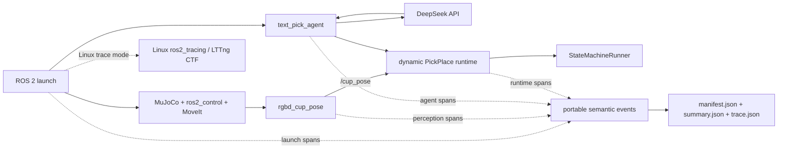

# SO-101 How to profile PickPlace：教学与源码导读

**范围：** MuJoCo Text Agent PickPlace、ROS 2 launch、RGB-D、DeepSeek、MoveIt、ros2_control、跨平台语义 profiling，以及 Linux `ros2_tracing`/LTTng

**对象：** 已了解 Python 和 ROS 2 基础，希望知道一次抓放到底慢在启动、感知、规划还是运动执行的开发者

**目标：** 学会用一套低侵入、可关闭的 profiling 语义，在 macOS 和 Linux 上测量同一条 PickPlace 链路，并能从源码追到每个主要 span 的起止位置

本文从公开入口 [`so101_mujoco_text_pick_agent.launch.py`](../../src/so101_demo_py/launch/so101_mujoco_text_pick_agent.launch.py) 出发，顺着下面这条链路读源码：

```text
ros2 launch
  -> MuJoCo + ros2_control + MoveIt 就绪
  -> RGB-D 三路订阅、同时间戳对齐与杯子定位
  -> DeepSeek 把自然语言转换为受限任务命令
  -> 确定性校验与 dispatch
  -> PickPlace 状态机逐步执行
  -> 汇总跨进程 profile 与物理证据
```

不熟悉 RGB-D 感知、`/cup_pose` 和动态抓放时，可以先读 [`so101-rgbd-perception-pick-place-source-guide.md`](so101-rgbd-perception-pick-place-source-guide.md)。多实例 YOLO-Seg 版本见 [`so101-yolo-seg-rgbd-perception-pick-place-source-guide.md`](so101-yolo-seg-rgbd-perception-pick-place-source-guide.md)。这里关注耗时如何被记录和解释，不改任务决策或运动行为。

## 1. Profiling 到底要回答什么

只测进程从启动到退出的总时间，很难说明问题。一次 Text Agent 抓放混合了四类开销：

1. 栈启动：MuJoCo、controller、MoveIt 和 Planning Scene 依次就绪；
2. 感知：RGB-D 订阅匹配、首批消息到达、三路时间戳对齐、点云与 TF 计算；
3. Agent：DeepSeek 请求、命令校验和确定性 dispatch；
4. 运行时：读取 `/cup_pose`、初始化执行环境，再按状态机完成抓取和放置。

各阶段由不同组件负责。`agent.plan` 变慢，先看网络和 DeepSeek；`runtime.state.DESCEND` 变慢，则继续看 MoveIt 轨迹与 controller。把所有等待都归为“Python 慢”，最后往往改不到真正的瓶颈。

## 2. 先看完整架构



运行结果分成两个观察层：

| 层 | macOS | Linux | 适合回答的问题 |
|---|---|---|---|
| 语义 profiling | JSONL、`summary.json`，`trace` 模式再生成 `trace.json` | 完全相同 | 哪个业务阶段慢，结果是否成功，多个进程是否属于同一 session |
| 系统 tracing | 当前实现不启动系统后端 | `ros2_tracing` + LTTng CTF | executor、callback、rcl/rmw/DDS 等更底层的调度与通信行为 |

语义层是跨平台基线。Linux 系统 trace 是补充信息，不替代 `summary.json`。

## 3. 实际启动了哪些组件

Text Agent launch 由 [`build_text_pick_agent_launch_description()`](../../src/so101_demo_py/src/runtime/launch_composition.py) 构建。执行路径会启动：

| 组件 | 进程或节点 | 责任 |
|---|---|---|
| MuJoCo 与 controller manager | `mujoco_ros2_control/ros2_control_node` | 推进物理、发布相机数据、承载 ros2_control |
| Robot State Publisher | `robot_state_publisher` | 发布机器人 TF |
| Controller spawner × 3 | `controller_manager/spawner` | 激活 `joint_state_broadcaster`、`arm_controller`、`gripper_controller` |
| MoveIt | `so101_mujoco_support/graceful_shutdown_move_group` | 规划、执行轨迹、维护 Planning Scene |
| Planning Scene 初始化 | `so101_demo_py/scene_setup` | 写入并回读场景碰撞对象 |
| 静态相机 TF × 2 | `tf2_ros/static_transform_publisher` | 发布 `base -> camera_link -> task_camera_frame` |
| RGB-D 感知 | `so101_demo_py/rgbd_cup_pose` | 对齐 RGB-D、估计杯子位姿、发布 `/cup_pose` |
| Text Agent | `so101_demo_py/text_pick_agent` | 调用 DeepSeek、校验命令、发起动态抓放 |
| 动态抓放运行时 | Text Agent 子流程 | 消费 `/cup_pose`，驱动状态机和物理验证 |

组件清单主要来自 [`_mujoco_stack_actions()`](../../src/so101_demo_py/src/runtime/launch_composition.py) 和 [`_mujoco_text_pick_agent_execute_actions()`](../../src/so101_demo_py/src/runtime/launch_composition.py)。

## 4. 三种 profiling 模式

公开 launch 参数是 `profiling`：

| 值 | 语义事件 | `summary.json` | `trace.json` | Linux `ros2_tracing` |
|---|---:|---:|---:|---:|
| `off` | 否 | 否 | 否 | 否 |
| `summary` | 是 | 是 | 否 | 否 |
| `trace` | 是 | 是 | 是 | 可用时启动 |

### 4.1 `off` 为什么单独设计

关闭后，[`resolve_launch_profiling()`](../../src/so101_demo_py/src/profiling/launch_support.py) 直接返回 `None`。子进程不会收到 profiling 参数，也不会创建 profiler、计时器、文件、ROS entity 或 `Trace` action。

包装函数也遵守同一规则。例如 [`profile_planner()`](../../src/so101_demo_py/src/profiling/wrappers.py) 收到 `profiler=None` 时原样返回 planner，不增加代理对象。这是“关闭后不影响主逻辑性能”的关键边界。

仓库还提供 [`benchmark_profiling_off.py`](../../src/so101_demo_py/test/benchmark_profiling_off.py)，用来比较直接调用与 disabled wrapper 路径。它检查的不是业务吞吐，而是 `off` 模式有没有偷偷留下额外工作。

### 4.2 `summary` 适合日常测量

`summary` 会保留每个进程的原始 JSONL 事件，并在结束时生成聚合结果。macOS 和 Linux 的字段与 span 名称一致，最适合做双端对比。

### 4.3 `trace` 适合时间线和 Linux 下钻

`trace` 在语义层额外生成 Chrome Trace Event 格式的 `trace.json`。macOS 到此为止，backend 在 manifest 中记为 portable-only。Linux 会再尝试构建官方 [`tracetools_launch.action.Trace`](../../src/so101_demo_py/src/profiling/system_trace.py)，把 ROS 事件写成 LTTng CTF。

## 5. 为什么不是到处手写计时器

插桩接口只有三个动作：

```python
token = profiler.start_span("agent.plan")
profiler.finish_span(token, outcome="ok")
profiler.instant("perception.first_callback", {"topic": topic})
```

[`SemanticProfiler`](../../src/so101_demo_py/src/profiling/session.py) 使用 `time.perf_counter_ns()` 计算单进程持续时间，同时记录 wall-clock anchor，把不同进程的 span 对齐到同一条时间线。每条事件还带有：

```text
session_id
request_id
process_role
pid
thread_id
sequence
monotonic_ns
wall_time_ns
```

业务对象通过 [`profile_planner()`](../../src/so101_demo_py/src/profiling/wrappers.py)、[`profile_dispatcher()`](../../src/so101_demo_py/src/profiling/wrappers.py)、[`profile_executor()`](../../src/so101_demo_py/src/profiling/wrappers.py) 和 [`profile_actions()`](../../src/so101_demo_py/src/profiling/wrappers.py) 装饰。这样不用进入每个 planner、executor 或状态动作内部插桩，也不会改变它们的接口。

## 6. profile 文件保存在哪里

假设启动参数是：

```text
session_id:=profile-task-start-001
evidence_file:=/tmp/so101-profile-learning/result.json
```

launch 会创建：

```text
/tmp/so101-profile-learning/
└── result.d/
    └── profile-task-start-001/
        ├── perception/
        ├── dynamic/
        └── profiling/
            ├── processes/
            │   ├── launch.events.jsonl
            │   ├── perception.events.jsonl
            │   └── text-agent.events.jsonl
            ├── manifest.json
            ├── summary.json
            ├── trace.json                 # 仅 trace 模式
            └── ros2-tracing/              # Linux 系统后端可用时
```

`profiling_output_root` 留空时，profiling 目录自动放在本次 session evidence root 下。若显式设置，它必须是绝对路径，而且仍须位于已登记的 run evidence root 内；符号链接和越界路径会被拒绝。相关门禁在 [`_resolve_output_root()`](../../src/so101_demo_py/src/profiling/launch_support.py)。

同一个 `session_id` 不能复用，因为 session evidence root 必须由本次运行独占。重复实验应换 ID，而不是覆盖旧结果。

## 7. 运行前先确认 provenance

source tree 改完代码后，`ros2 launch` 未必会运行这份源码。ROS 2 通常从当前 overlay 的 install space 加载 package。

```bash
git rev-parse HEAD
git status --short
ros2 pkg prefix so101_demo_py
ros2 pkg executables so101_demo_py | rg 'rgbd_cup_pose|text_pick_agent'
```

如果 `ros2 pkg prefix so101_demo_py` 指向旧 overlay，应先重新 build 并 source 正确的 `install/setup.zsh`。profile 的 `provenance` 字段也会保存 `source_commit` 和 `installed_prefix`，用于事后复核。

接着确认当前任务没有重名 stack：

```bash
ros2 node list | sort
pgrep -af 'ros2_control_node|move_group|text_pick_agent|rgbd_cup_pose'
```

## 8. 保持现有 SUBNET discovery 行为

本 guide 不改变 DDS discovery 配置，也不把 LOCALHOST 当成 profiling 前置条件。执行前只做只读确认：

```bash
printenv ROS_AUTOMATIC_DISCOVERY_RANGE
printenv ROS_LOCALHOST_ONLY
```

本项目当前测量基线使用 `SUBNET`，`ROS_LOCALHOST_ONLY` 应保持未设置。若你的既有启动环境已经固定 SUBNET，继续沿用它；不要为了抓 profile 临时切换 discovery 策略，否则两次结果就不再是同一配置。

## 9. macOS：先跑 portable summary

先准备一个全新的证据目录。不要复用下面的 session ID：

```bash
RUN_ROOT=/tmp/so101-debug-pickplace-profile-macos-001
SESSION_ID=pickplace-profile-macos-001
EVIDENCE_FILE="$RUN_ROOT/result.json"

mkdir -p "$RUN_ROOT"
test -n "$DEEPSEEK_API_KEY"
test "$(printenv ROS_AUTOMATIC_DISCOVERY_RANGE)" = SUBNET
test -z "$(printenv ROS_LOCALHOST_ONLY)"
```

然后启动完整 Text Agent 抓放：

```bash
ros2 launch so101_demo_py so101_mujoco_text_pick_agent.launch.py \
  instruction:='Pick the plastic cup. Apply no constraints.' \
  run_mode:=execute execute:=true skip_confirmation:=true \
  headless:=false sensor_rendering:=true \
  session_id:="$SESSION_ID" evidence_file:="$EVIDENCE_FILE" \
  mujoco_initial_keyframe:=task_start \
  readiness_timeout_s:=90.0 \
  perception_startup_timeout_s:=60.0 \
  cup_pose_timeout_s:=60.0 \
  profiling:=summary \
  profiling_require_system_trace:=false
```

这条命令会执行真实的仿真抓放，不是 dry-run。运行前应确认当前 ROS graph、MuJoCo 会话和证据目录属于本任务。

如果需要可视化时间线，把 `profiling:=summary` 改为 `profiling:=trace`。macOS 会生成 portable `trace.json`，不会导入或启动 `tracetools_launch`。

## 10. Linux：在同一语义层上增加 ros2_tracing

先检查依赖，不要看到命令存在就跳过 Python/AMENT provenance：

```bash
ros2 pkg prefix tracetools
ros2 pkg prefix tracetools_launch
command -v lttng
command -v babeltrace2
python3 -c 'from tracetools_launch.action import Trace; print(Trace)'
```

运行参数与 macOS 相同，只把模式改为：

```text
profiling:=trace
profiling_require_system_trace:=true
```

完整 launch 片段是：

```bash
ros2 launch so101_demo_py so101_mujoco_text_pick_agent.launch.py \
  instruction:='Pick the plastic cup. Apply no constraints.' \
  run_mode:=execute execute:=true skip_confirmation:=true \
  headless:=false sensor_rendering:=true \
  session_id:="$SESSION_ID" evidence_file:="$EVIDENCE_FILE" \
  mujoco_initial_keyframe:=task_start \
  readiness_timeout_s:=90.0 \
  perception_startup_timeout_s:=60.0 \
  cup_pose_timeout_s:=60.0 \
  profiling:=trace \
  profiling_require_system_trace:=true
```

`profiling_require_system_trace:=true` 的含义是：请求了 Linux 系统 trace，却无法启动时，任务应明确失败，而不是只留下 portable 文件后假装系统 trace 成功。日常开发若允许降级，可设为 `false`；这时 manifest 会记录 `unavailable` 及错误类型。

## 11. 先读 manifest，再看耗时

拿到 `summary.json` 后先检查完整性，再计算平均值：

```bash
PROFILE_ROOT="$RUN_ROOT/result.d/$SESSION_ID/profiling"

jq '{session_id, mode, complete, backend,
     incomplete_processes, mismatched_sessions, malformed_events}' \
  "$PROFILE_ROOT/manifest.json"
```

可用于正式分析的 portable profile 至少应满足：

```text
complete == true
incomplete_processes == []
mismatched_sessions == []
malformed_events == []
```

Linux `trace` 还要检查 `backend.status` 和 `backend.output`。`summary.json` 存在，不等于 CTF 已成功生成。

## 12. 怎样读 summary.json

先列出每个 span 的次数和均值：

```bash
jq -r '
  .aggregates
  | to_entries[]
  | [.key, .value.count, (.value.mean_ns / 1000000)]
  | @tsv
' "$PROFILE_ROOT/summary.json" | sort
```

第三列单位是毫秒。查看按开始时间排列的单次 span：

```bash
jq -r '
  .spans
  | sort_by(.wall_start_ns)[]
  | [.process_role, .name, .outcome, (.duration_ns / 1000000)]
  | @tsv
' "$PROFILE_ROOT/summary.json"
```

`aggregates` 提供 `count`、`total_ns`、`min_ns`、`max_ns`、`mean_ns` 和 `p50_ns`。同名 span 至少有 20 个样本时才会出现 `p95_ns`。四个点位各跑一次时，优先同时看四个原始值和中位数，不要只看平均值。

## 13. 总时间与启动时间

launch 层有三个核心 span：

| Span | 起点 | 终点 | 含义 |
|---|---|---|---|
| `launch.total` | profiling session 建立 | workflow 退出 | 整个业务执行窗口 |
| `launch.stack_startup` | profiling session 建立 | `scene_setup` 退出 | MuJoCo、controller、MoveIt、Planning Scene 就绪 |
| `launch.scene_setup` | profiling session 建立 | `scene_setup` 退出 | 当前实现与 stack startup 同起点，聚焦 scene ready 边界 |

这些 token 在 [`resolve_launch_profiling()`](../../src/so101_demo_py/src/profiling/launch_support.py) 创建，由 [`profiling_event_handlers()`](../../src/so101_demo_py/src/profiling/launch_support.py) 监听子进程退出并完成。

`launch.stack_startup` 很长时，继续查 controller activation、MoveIt 初始化和 scene setup 日志。它不能直接证明 DDS discovery 慢，因为 RGB-D 订阅发生在后续感知进程内。

## 14. RGB-D 等待被拆成了哪几段

感知节点同时订阅 CameraInfo、Color 和 Depth。只看旧的 `perception.wait_synchronized_frame`，无法知道时间花在“找到 publisher”还是“publisher 已匹配但没送来可对齐的帧”。[`RgbdSubscriptionMilestones`](../../src/so101_demo_py/src/ros/rgbd_cup_pose_node.py) 因此记录三条累计边界：

| Span | 结束条件 |
|---|---|
| `perception.wait_all_subscriptions_matched` | 三个 subscription 都收到正的 matched count |
| `perception.wait_all_first_callbacks` | CameraInfo、Color、Depth 的 callback 都至少执行一次 |
| `perception.wait_common_stamp` | 首次出现三路共同 source stamp |

它们从 subscription 建立时同时开始，因此是累计时间，不能相加。真正的分段耗时应这样计算：

```text
匹配耗时 = wait_all_subscriptions_matched
匹配后到首批 callback = wait_all_first_callbacks - wait_all_subscriptions_matched
首批 callback 后到共同 stamp = wait_common_stamp - wait_all_first_callbacks
```

同时还会记录每个 topic 的瞬时事件：

```text
perception.subscription_matched
perception.first_callback
perception.common_stamp
```

`perception.wait_synchronized_frame` 保留为兼容边界，表示 frame processor 等到第一组合法对齐帧的总时间。它应与 `perception.wait_common_stamp` 接近，但两者的代码责任不同。

## 15. 如何判断 DDS matching 是否真是瓶颈

先比较三个数：

- `wait_all_subscriptions_matched` 若达到秒级，才有理由继续查 discovery、RMW 与 participant/endpoint 建立；
- matching 很快、`wait_all_first_callbacks` 很慢，问题更像 publisher/render readiness 或消息交付；
- callback 都到了、`wait_common_stamp` 仍很慢，应查三路 source stamp、发布节奏和队列对齐。

当前四点位 A/B 实验里，SUBNET 的全部 subscription matching 平均约 `34.213 ms`。秒级等待主要出现在匹配后的首个 Color callback，以及个别运行的共同时间戳形成阶段。这个结果说明“第一帧慢”不能直接等同于“DDS discovery 慢”。完整实验记录见 [`so101-text-agent-macos-dds-localhost-ab-experiment-ledger.md`](../experiments/so101-text-agent-macos-dds-localhost-ab-experiment-ledger.md)。

该实验比较过 LOCALHOST，但产品代码和本 guide 都继续保持 SUBNET，不把实验变量写入 discovery 配置。

## 16. Open3D preflight 与杯子定位

感知进程在 ROS resource 构建前调用 [`_require_open3d()`](../../src/so101_demo_py/src/ros/rgbd_cup_pose_node.py)。它先用 `find_spec("open3d")` 确认包存在，再真正执行 `import open3d`，以便在启动预算内尽早暴露缺失 dylib、Python ABI 或安装损坏。

第一次 `import open3d` 可能触发大量 Python 模块和本地动态库加载，还会受到文件缓存、代码签名检查与存储延迟影响。它是可用性门禁，不是点云算法本身。

当前实现没有单独的 `perception.open3d_preflight` span；这段时间包含在 `perception.total` 的早期部分，并发生在 subscription milestones 之前。区分冷启动与热启动时，应在相同 commit、overlay 和启动参数下启动独立进程，同时记录进程启动到首个 subscription milestone 的差值。第二次 import 变快，可能只是文件缓存生效，并不等于代码已经优化。

拿到对齐帧后，主要 span 是：

| Span | 源码责任 |
|---|---|
| `perception.estimate_cup_pose` | 构建点云、颜色候选、聚类与杯子几何估计 |
| `perception.transform_world` | exact-stamp TF 查询，把相机坐标结果变换到 `world` |
| `perception.total` | 感知进程从启动检查到退出的总窗口 |

## 17. Agent 阶段怎么读

Text Agent 的主要 span 来自 [`TextAgent`](../../src/so101_demo_py/src/application/text_agent.py) 和 profiling wrappers：

| Span | 内容 |
|---|---|
| `agent.total` | 一次完整 Agent 请求 |
| `agent.validate_input` | 输入与执行授权校验 |
| `agent.plan` | DeepSeek 主调用以及可能的 planner chain 行为 |
| `agent.validate_command` | 将模型输出解析为受限 command 并校验 |
| `agent.dispatch` | 将 command 映射到允许的 MuJoCo PickPlace capability |

`agent.plan` 的 attributes 会记录最终 provider、model 和 `fallback`。做 DeepSeek-only 性能分析时，不能只看环境变量；还要确认结果中 provider 是 `deepseek` 且 `fallback=false`。若本地 Ollama 监听端口存在，也应在实验前按任务约定处理，而不是让 fallback 混入样本。

DeepSeek 是外部网络服务。`agent.plan` 的差异不能直接当作 Mac 与 Linux CPU 性能差异。

## 18. runtime.setup 包含什么

[`run_dynamic_execute()`](../../src/so101_demo_py/src/ros/dynamic_runtime.py) 从 `runtime.setup` 开始后，会依次完成：

```text
加载动态策略与几何
初始化 rclpy 和执行节点
等待 /cup_pose
读取 MuJoCo truth
同步 Planning Scene
校验杯子场景
计算运动目标
执行 reachability preflight
构建 execution、actions 与 StateMachineRunner
```

因此 `runtime.setup` 不是单纯的 Python 对象初始化。它含有 ROS 消息等待、场景读取、MoveIt 可达性检查等外部交互。若它变慢，应结合 `/cup_pose` 的发布时间、scene readback 和 reachability evidence 判断，不要只优化 import。

## 19. 实际抓放如何按状态拆分

[`profile_actions()`](../../src/so101_demo_py/src/profiling/wrappers.py) 给状态机的每个 `StateAction` 外包一层 `_ProfiledStateAction`，自动生成：

```text
runtime.state.<STATE>
```

常见状态包括打开夹爪、移动到杯子上方、下降、闭合夹爪、抬起、移动到放置区、下降放置、释放和撤离。具体状态集合以 [`State`](../../src/so101_demo_py/src/core/domain.py) 和当前 transition table 为准。

一次动作慢时，先定位具体 state：

```bash
jq -r '
  .spans[]
  | select(.name | startswith("runtime.state."))
  | [.name, .outcome, (.duration_ns / 1000000000)]
  | @tsv
' "$PROFILE_ROOT/summary.json"
```

运动 state 的持续时间通常包含 MoveIt 规划、轨迹 action、controller 执行与边界验证。若 `DESCEND` 慢，下一步应在 Linux CTF 或 ROS action evidence 中分清规划与执行，而不是继续细分 Text Agent。

## 20. runtime.total 与 launch.total 为什么不同

`runtime.total` 由 [`_ProfiledExecutor`](../../src/so101_demo_py/src/profiling/wrappers.py) 包住动态 executor，只覆盖 runtime dispatch。`launch.total` 从 launch profiling 建立开始，一直等到 workflow 退出。

大致关系是：

```text
launch.total
  包含 stack startup
  包含 perception startup 和首帧
  包含 agent.plan
  包含 runtime.total
  还包含进程编排与退出边界
```

这些 span 彼此嵌套，也会重叠，不能全部相加。它们描述的是时间线，不是一组互斥的会计科目。

## 21. macOS 如何看 trace.json

`trace.json` 使用 Chrome Trace Event 格式。可在 Chromium/Chrome 的 tracing viewer 或 Perfetto UI 中打开，按 `process_role` 查看 launch、perception 和 text-agent 三条泳道。

重点观察：

- `launch.stack_startup` 结束前，业务进程不会进入正常抓放；
- 三个 RGB-D 累计 span 共享起点；
- `agent.plan` 是否与感知等待重叠；
- `runtime.state.*` 是否有单个明显长于其余动作。

`trace.json` 只包含项目定义的 semantic span，不包含 macOS 内核调度或 Python 每个函数调用。需要 CPU sampling 时，可另用 Instruments，但它与本文的 session correlation 不是同一种证据。

## 22. Linux 如何读 CTF

manifest 里的 `backend.output` 指向本次 LTTng trace 目录。先确认目录可读：

```bash
jq '.backend' "$PROFILE_ROOT/manifest.json"
babeltrace2 "$PROFILE_ROOT/ros2-tracing/so101-$SESSION_ID" | head
```

`head` 的成功退出码不能证明整个 trace 可读。正式验收要让 `babeltrace2` 完整解码，并记录事件数与退出码：

```bash
babeltrace2 "$PROFILE_ROOT/ros2-tracing/so101-$SESSION_ID" \
  > "$RUN_ROOT/ros2-trace.txt"
wc -l "$RUN_ROOT/ros2-trace.txt"
```

系统 trace 用来继续回答：callback 何时被 executor 调度、rcl/rmw 路径是否阻塞、线程之间是否存在长空洞。它不理解“杯子已抓住”这样的业务语义，所以仍要与 `summary.json` 按 wall-clock 时间关联。

## 23. 用四个预定点位做可比测量

当前 MuJoCo 杯子点位包括：

```text
task_start
cup_test_forward_5cm
cup_test_left_5cm
cup_test_right_5cm
```

比较 Mac 与 Linux 时，每个点位都应：

- 使用同一 commit、同一 installed candidate 和同一 instruction；
- 使用独立 `session_id`、`ROS_DOMAIN_ID`、`GZ_PARTITION` 和证据目录；
- 固定 `FULL_RESTART` 生命周期；
- 固定 SUBNET discovery；
- 验证 DeepSeek provider，排除 fallback；
- 同时通过功能、物理、profile 完整性和 cleanup 门禁。

已经完成的双端四点位结果与统计口径见 [`so101-text-agent-dual-platform-four-point-profiling-experiment-ledger.md`](../experiments/so101-text-agent-dual-platform-four-point-profiling-experiment-ledger.md)。

## 24. 一次合格运行不只看耗时

profile 只能说明代码走过哪些时间边界，不能单独证明抓放成功。一次端到端样本至少应同时满足：

| 证据层 | 检查 |
|---|---|
| Provider | `provider=deepseek`，`fallback_used=false` |
| 感知 | 有合法 RGB-D、`/cup_pose` 和 perception evidence |
| 运行时 | `RUNTIME_COMPLETED`、状态机 `DONE`、transition 数符合当前契约 |
| 物理 | 杯子最终在桌面目标区、`table_contact=true` |
| Planning Scene | 最终 attached object 为空 |
| Profiling | manifest complete，无 malformed/mismatch/incomplete |
| Provenance | source commit、installed prefix、session 一致 |
| Cleanup | 本任务节点、进程和 LTTng session 都已退出 |

如果功能失败，耗时仍可用于诊断，但不能混入成功样本的性能统计。

## 25. 常见误读

### 25.1 把累计 span 相加

三个 RGB-D milestone 同时起表。应做差得到阶段 delta，不能把累计值再次相加。

### 25.2 只比较平均值

四点位样本很少，一个冷缓存或网络抖动就会拉高均值。应同时报告逐次值、中位数和异常运行。

### 25.3 把 DeepSeek latency 当作主机 CPU benchmark

它包含外部网络与服务端排队。跨机器 CPU 结论应优先看本地启动、感知计算和状态执行，并说明环境差异。

### 25.4 有 summary 就说系统 trace 成功

portable summary 与 Linux CTF 是两个后端。必须检查 manifest backend，并完整解码 CTF。

### 25.5 忘记 installed provenance

source tree 的 HEAD 正确，不代表 `ros2 launch` 加载了同一份 install 产物。先查 `ros2 pkg prefix`。

### 25.6 为 profile 改 discovery 配置

discovery 是实验变量，不是 profiling 依赖。除非实验专门研究 DDS，否则应保持现有 SUBNET 基线。

## 26. 建议的源码阅读顺序

第一次读这套实现，可以按下面的顺序走：

1. [`so101_mujoco_text_pick_agent.launch.py`](../../src/so101_demo_py/launch/so101_mujoco_text_pick_agent.launch.py)：公开入口为什么很薄；
2. [`build_text_pick_agent_launch_description()`](../../src/so101_demo_py/src/runtime/launch_composition.py)：公开参数和启动门禁；
3. [`_mujoco_text_pick_agent_execute_actions()`](../../src/so101_demo_py/src/runtime/launch_composition.py)：感知、Text Agent、stack 与 handlers 如何组装；
4. [`ProfilingMode`](../../src/so101_demo_py/src/profiling/model.py)：`off`、`summary`、`trace` 契约；
5. [`SemanticProfiler`](../../src/so101_demo_py/src/profiling/session.py)：事件格式、时钟与进程 anchor；
6. [`resolve_launch_profiling()`](../../src/so101_demo_py/src/profiling/launch_support.py)：启用、输出路径和 launch spans；
7. [`RgbdSubscriptionMilestones`](../../src/so101_demo_py/src/ros/rgbd_cup_pose_node.py)：matched、first callback、common stamp；
8. [`wrappers.py`](../../src/so101_demo_py/src/profiling/wrappers.py)：低侵入 agent/runtime/state 包装；
9. [`run_dynamic_execute()`](../../src/so101_demo_py/src/ros/dynamic_runtime.py)：setup、状态机与 cleanup；
10. [`finalize_profiling()`](../../src/so101_demo_py/src/profiling/artifacts.py)：跨进程校验、聚合和 artifact；
11. [`build_system_trace()`](../../src/so101_demo_py/src/profiling/system_trace.py)：Linux-only `ros2_tracing` 适配。

## 27. 一个适合初学者的最小练习

先完成一轮 `task_start` 的 `summary`，再扩展到四点位矩阵：

1. 记录 `git rev-parse HEAD` 和 `ros2 pkg prefix so101_demo_py`；
2. 只读确认 discovery 仍是 SUBNET；
3. 用全新 `RUN_ROOT` 和 `SESSION_ID` 启动；
4. 检查 manifest complete；
5. 列出 `launch.stack_startup`、三个 RGB-D milestone、`agent.plan`、`runtime.setup` 和所有 `runtime.state.*`；
6. 把三个累计 RGB-D span 转成 matched、callback-after-match、align-after-callback 三段 delta；
7. 对照业务 evidence 确认这确实是一轮成功抓放；
8. 关闭 profiling 再运行时，确认没有生成 profiling 目录。

完成这组练习后，再把 `mujoco_initial_keyframe` 换成另外三个点位。Linux 最后增加 `trace`，不要一开始就陷入数百万条 CTF 事件。

## 28. 自检问题

读完后，尝试回答：

1. 为什么 `off` 模式不是“创建 profiler 但不写文件”？
2. `summary` 与 `trace` 在 macOS 上有什么区别？
3. Linux manifest 为 `unavailable` 时，portable summary 还能否用于分析？
4. 为什么三个 RGB-D milestone 不能相加？
5. matching 只有几十毫秒、首个 Color callback 却要几秒，应该先查哪一层？
6. `runtime.setup` 为什么不等于 Python 初始化？
7. `runtime.state.DESCEND` 变慢时，为什么应继续看 MoveIt/controller，而不是 DeepSeek？
8. 为什么 profile complete 仍不能证明杯子被成功放下？
9. 为什么 source commit 与 installed prefix 必须一起记录？
10. 为什么一次普通性能测量不应切换 SUBNET/LOCALHOST？

能结合 `summary.json`、业务 evidence 和对应源码回答这些问题，就已经掌握了这套 PickPlace profiling 的基本用法。
