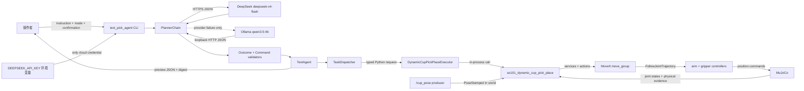

# SO-101 Text Pick Agent 源码导读：从一句话到受控执行

这篇导读面向已经掌握 Python 和 ROS 2 基础的开发者。我们从源码出发，拆开一句自然语言指令
进入机器人执行链的过程。

内容包括自然语言任务分类、DeepSeek、Ollama `qwen3.5:4b`、结构化命令、Preview 确认、执行
provenance，以及 MuJoCo 动态抓放的证据边界。读完后，你应该能理解并运行下面这条链路。大模型
不会生成关节角、轨迹或 shell 命令。

```text
自然语言
  -> DeepSeek / qwen3.5:4b
  -> PlannerOutcome
  -> TaskCommand
  -> Preview + confirmation_digest
  -> 显式 Execute 授权
  -> dynamic_cup_pick_place
  -> MoveIt -> controller -> MuJoCo
```

这里先讲链路最上游：语言怎样变成一条受控任务命令。若要了解 RGB-D 怎样生成杯子位置
`/cup_pose`，请阅读
[`so101-rgbd-perception-pick-place-source-guide.md`](so101-rgbd-perception-pick-place-source-guide.md)；
若要继续追踪 `/cup_pose` 怎样变成抓取目标、5-DoF IK、状态机和物理动作，请阅读
[`so101-dynamic-cup-pick-place-source-guide.md`](so101-dynamic-cup-pick-place-source-guide.md)。

## 1. Text Pick Agent 负责哪一段

`text_pick_agent` 把大模型限制在任务分类这一层。命令是否合法、是否经过人工确认、能否进入
机器人执行链，都由确定性程序判断。

数据按以下顺序流动：

1. CLI 校验运行模式、backend 和 provider 配置；
2. `PlannerChain` 优先调用 DeepSeek，只有 provider failure 才调用本地 Ollama；
3. provider 只能返回 `supported`、`unsupported` 或 `ambiguous` 三种闭合结果；
4. 只有 `supported` 可以携带 `TaskCommand`；
5. Python validator 重新检查字段、对象、动作和 constraints，不信任模型输出；
6. `TaskDispatcher` 判断命令是否有当前真实 consumer；
7. Preview 返回命令、capability、provider/model 和 `confirmation_digest`，不启动 ROS runtime；
8. 操作者检查 Preview 后，以相同 instruction 和 digest 显式请求 Execute；
9. Execute 重新规划，并在任何 runtime 调用前比较新的 digest；
10. 通过确认、provenance 和 request claim 后，typed Executor 才调用现有动态抓放 runtime；
11. dynamic runtime 消费 `/cup_pose`，经过 MoveIt、controller 和 MuJoCo 完成仿真抓放；
12. Agent 状态、下游状态机结果和物理结果分别取证，不能互相替代。

大模型的输出范围很窄：它只能说明任务是否受支持，并在受支持时给出一条闭合任务命令。坐标、
Pose、关节、轨迹、ROS 名称和执行授权不在模型输出范围内。provider 即使返回恶意、冲突或格式
错误的内容，也要经过 validator、Preview 确认和 Executor，无法直接控制机器人。

## 2. 一个 `text_pick_agent` 进程里有什么

公开入口注册在 [`setup.py`](../../src/so101_demo_py/setup.py)：

```bash
ros2 run so101_demo_py text_pick_agent ...
```

这个入口只启动一个短生命周期 Python 进程。Preview 不创建 ROS 节点；Execute 通过所有门禁
后，才在当前进程中 lazy import ROS adapter，并创建动态抓放节点。

### 2.1 Preview 进程内的组件

| 组件 | 源码 | 生命周期 | 作用 |
|---|---|---|---|
| CLI composition | [`text_pick_agent.py`](../../src/so101_demo_py/src/cli/text_pick_agent.py) | 短生命周期 | 参数校验、provider 组装、JSON 输出 |
| DeepSeek adapter | [`deepseek.py`](../../src/so101_demo_py/src/adapters/planner/deepseek.py) | 一次 HTTP 请求 | 调用固定 DeepSeek endpoint/model |
| Ollama adapter | [`ollama.py`](../../src/so101_demo_py/src/adapters/planner/ollama.py) | 最多一次 HTTP 请求 | provider failure 时调用 loopback `qwen3.5:4b` |
| PlannerChain | [`planner_chain.py`](../../src/so101_demo_py/src/application/planner_chain.py) | 进程内对象 | 控制 primary/fallback 规则 |
| TextAgent | [`text_agent.py`](../../src/so101_demo_py/src/application/text_agent.py) | 进程内对象 | outcome、确认摘要、双授权和 request claim |
| TaskDispatcher | [`task_dispatch.py`](../../src/so101_demo_py/src/application/task_dispatch.py) | 进程内对象 | 把闭合命令映射到 capability |
| Preview executor | [`text_pick_agent.py`](../../src/so101_demo_py/src/cli/text_pick_agent.py) | 进程内拒绝桩 | 保证 Preview 不能调用 live runtime |

Preview 不依赖 `rclpy`、MuJoCo、MoveIt、controller 或 `/cup_pose`，可以单独用来练习语言规划
和安全门禁。

### 2.2 Execute 才会用到的组件

Execute 会额外创建：

| 组件 | 源码/节点 | 作用 |
|---|---|---|
| DynamicCupPickPlaceExecutor | [`pick_place_executor.py`](../../src/so101_demo_py/src/adapters/pick_place_executor.py) | 把 typed request 转成现有 dynamic runtime options |
| dynamic runtime | [`dynamic_runtime.py`](../../src/so101_demo_py/src/ros/dynamic_runtime.py) | 创建 `so101_dynamic_cup_pick_place` ROS node，消费 `/cup_pose` 并执行状态机 |
| MuJoCo execution adapter | [`dynamic_mujoco_execution.py`](../../src/so101_demo_py/src/ros/dynamic_mujoco_execution.py) | 调用 MoveIt、controller、Planning Scene 和仿真证据接口 |

`text_pick_agent` 不负责启动仿真环境。执行前，操作者要准备好一套由明确 owner 启动、已经通过
readiness 检查，并且使用同一 ROS domain/session 的 stack。当前
[`so101_mujoco.launch.py`](../../src/so101_demo_py/launch/so101_mujoco.launch.py) 的 composition 包含：

| 组件 | 进程/节点 | 作用 |
|---|---|---|
| Robot State Publisher | `robot_state_publisher` | 由 URDF 和 `/joint_states` 发布机器人 TF |
| MuJoCo + controller manager | `mujoco_ros2_control/ros2_control_node` | 推进物理、发布 `/clock`、承载 ros2_control 和仿真证据插件 |
| Controller spawner × 3 | `joint_state_broadcaster`、`arm_controller`、`gripper_controller` | 激活状态与轨迹 controller |
| MoveIt | `so101_mujoco_support/graceful_shutdown_move_group` | 提供规划、轨迹执行和 Planning Scene 接口 |
| Planning Scene 初始化 | `so101_demo_py/scene_setup` | 写入并回读桌子、底座和杯子碰撞对象 |

Execute 只允许存在一个 `/cup_pose` producer。本指南使用生产感知节点 `rgbd_cup_pose`，由真实的
CameraInfo、彩色图、深度图和 tf2 计算杯子位姿。仓库中的
[`mujoco_cup_pose_bridge.py`](../../src/so101_demo_py/src/ros/mujoco_cup_pose_bridge.py)
只供隔离诊断；它直接读取仿真真值，绕过 RGB-D，因此不在本指南的 Execute 流程中启动。

## 3. 组件之间如何通信

### 3.1 架构图



虚线表示 fallback 只处理 provider 可用性，不负责修正语义。DeepSeek 明确返回 `unsupported`
或 `ambiguous` 时，系统直接拒绝，不会再让 qwen 把结果改成 supported。

### 3.2 跨边界接口表

| 接口 | 类型 | 提供方 | 消费方 | 用途 |
|---|---|---|---|---|
| `DEEPSEEK_API_KEY` | 进程环境变量 | 操作者 shell | DeepSeek adapter | Cloud Authorization；不进入命令参数或结果 JSON |
| DeepSeek chat completions | HTTPS JSON | DeepSeek | DeepSeek adapter | 返回结构化 planner outcome |
| Ollama `/api/chat` | loopback HTTP JSON | 本地 Ollama | Ollama adapter | `qwen3.5:4b` fallback，`think=false` |
| `PlannerPort.plan()` | Python protocol | provider adapter | PlannerChain/TextAgent | 返回 candidate 和 provider metadata |
| `PlannerOutcome` | frozen Python value | validator | TextAgent | 表达 supported/unsupported/ambiguous |
| `DynamicCupPickPlaceRequest` | frozen typed value | TaskDispatcher | Executor | 固定 capability/backend/scene source |
| provenance JSON | 原子写入文件 | CLI | 审计者/execute 结果 | 绑定源码、安装前缀、Python 和 session |
| `/cup_pose` | `geometry_msgs/msg/PoseStamped` | RGB-D 感知或受控 truth bridge | dynamic runtime | `world` 下的杯子 Pose |
| `/joint_states` | `sensor_msgs/msg/JointState` | joint state broadcaster | MoveIt、dynamic runtime、RSP | 当前关节状态和执行回读 |
| `/plan_kinematic_path` | `moveit_msgs/srv/GetMotionPlan` | MoveIt | dynamic runtime | 对 IK 目标做碰撞约束规划 |
| `/execute_trajectory` | `moveit_msgs/action/ExecuteTrajectory` | MoveIt | dynamic runtime | 执行 MoveIt 轨迹 |
| `/arm_controller/follow_joint_trajectory` | `control_msgs/action/FollowJointTrajectory` | arm controller | MoveIt | 执行关节 1–5 |
| `/gripper_controller/follow_joint_trajectory` | `control_msgs/action/FollowJointTrajectory` | gripper controller | dynamic runtime | 执行关节 6 的夹爪开合 |
| `/apply_planning_scene`、`/get_planning_scene` | MoveIt services | MoveIt | scene setup/dynamic runtime | 写入和回读 world/attached collision state |
| `/so101/simulation/evidence` | `SimulationEvidence` | MuJoCo plugin | dynamic runtime | 杯子物理 Pose、接触、session 和 reset epoch |

## 4. CLI 的组装顺序

[`main()`](../../src/so101_demo_py/src/cli/text_pick_agent.py) 按下面顺序工作：

```text
parse arguments
  -> backend/mode/provider options fail-closed validation
  -> execute only: verify and persist execution provenance
  -> construct DeepSeek primary + Ollama fallback
  -> choose PreviewExecutor or DynamicCupPickPlaceExecutor
  -> build AgentRequest
  -> TextAgent.handle()
  -> print exactly one JSON document
```

公开 CLI 暴露了 `--deepseek-model`、`--deepseek-endpoint`、`--ollama-model` 和
`--ollama-endpoint`，但参数值仍受生产边界约束。`_normalize_provider_options()` 会再次检查：

- DeepSeek model 必须是 `deepseek-v4-flash`；
- DeepSeek endpoint 必须是 `https://api.deepseek.com/chat/completions`；
- Ollama model 必须是 `qwen3.5:4b`；
- Ollama endpoint 必须是无用户名/密码/query/fragment 的 loopback HTTP `/api/chat`；
- Ollama 只允许改变有效端口，以支持 localhost reverse tunnel；
- timeout 必须是有限正浮点数。

Preview 使用 `_PreviewExecutor`。代码若误入 dispatch 路径，会立即触发 assertion，不会悄悄启动
ROS。

## 5. PlannerOutcome：先判断任务能不能做

[`planner_outcome.py`](../../src/so101_demo_py/src/core/planner_outcome.py) 定义了三种互斥形状：

```json
{"outcome":"supported","command":{"target_object":"plastic_cup","action":"pick","constraints":{}}}
```

```json
{"outcome":"unsupported"}
```

```json
{"outcome":"ambiguous"}
```

它们的语义是：

| Outcome | 适用输入 | 能否携带 command | 后续行为 |
|---|---|---:|---|
| `supported` | 明确、肯定、无冲突地要求抓取塑料杯 | 必须 | 继续 command validator |
| `unsupported` | 否定请求或当前能力之外的动作/对象 | 不能 | `PLANNER_OUTCOME_UNSUPPORTED` |
| `ambiguous` | 冲突、条件式、不确定或信息不足 | 不能 | `PLANNER_OUTCOME_AMBIGUOUS` |

这样，“不要抓杯子”或“抓杯子或别抓，看情况”不会被硬压成一条可执行命令。validator 要求字段
集合完全匹配；`unsupported` 或 `ambiguous` 若多带一个 `command`，结果就是
`COMMAND_INVALID`。

## 6. `TaskCommand`：模型输出还不能直接使用

[`task_command.py`](../../src/so101_demo_py/src/core/task_command.py) 当前只认识：

```yaml
target_object: plastic_cup
action: pick
constraints:
  spatial_relation: left | right | center | nearest  # 可选
  speed: slow | normal                              # 可选
```

模型返回的 dict 会被规范化成 frozen `TaskCommand`。constraints 排序后保存为 tuple，后续代码和
调用者都不能原地修改已经确认的命令。

这里要区分 schema 和实际能力。schema 认识 `spatial_relation` 和 `speed`，但当前 V5-T003
Dispatcher 没有消费这些字段的实现，所以
[`TaskDispatcher.resolve()`](../../src/so101_demo_py/src/application/task_dispatch.py) 只接受空
constraints：

```text
plastic_cup + pick + {}
  -> dynamic_cup_pick_place
  -> backend=mujoco
  -> scene_source=observe_only
```

任何非空 constraints 都会返回 `CONSTRAINT_UNCONSUMED`。系统不会口头接受 slow，然后仍按
默认速度运行，也不会让语言层承诺下游尚未实现的行为。

## 7. Fallback 只处理 provider failure

[`PlannerChain.plan()`](../../src/so101_demo_py/src/application/planner_chain.py) 只捕获
`PlannerProviderError`：

```text
DeepSeek success
  -> 原样返回 primary candidate

DeepSeek provider error
  -> 调用 Ollama 一次
  -> metadata.fallback_used=true

DeepSeek 和 Ollama 都 provider error
  -> PLANNER_CHAIN_FAILED
```

provider error 包括 credential 缺失、timeout、网络/HTTP/JSON 错误、响应 envelope 错误，以及
生产配置不合格。candidate 一旦成功返回，后续语义检查或 command validator 失败都不会触发
fallback。

Fallback 只在 primary provider 不可用时寻找另一个合格 provider。它不会因为第一个模型的答案
不合用户心意，就再问第二个模型。

## 8. DeepSeek 与 qwen 各自受什么限制

### 8.1 DeepSeek

[`DeepSeekPlanner`](../../src/so101_demo_py/src/adapters/planner/deepseek.py) 固定使用：

```text
endpoint = https://api.deepseek.com/chat/completions
model = deepseek-v4-flash
temperature = 0
thinking = disabled
max_tokens = 128
```

Authorization header 只在 adapter 内根据环境变量生成。
[`http_json.py`](../../src/so101_demo_py/src/adapters/planner/http_json.py) 的 redirect handler 不会把
带 Authorization 的请求重定向到不同 origin，避免 key 被跨域转发。

### 8.2 Ollama `qwen3.5:4b`

[`OllamaPlanner`](../../src/so101_demo_py/src/adapters/planner/ollama.py) 只连接 loopback，发送：

```json
{
  "model": "qwen3.5:4b",
  "stream": false,
  "think": false,
  "format": "<严格 PlannerOutcome JSON Schema>",
  "options": {"temperature": 0}
}
```

`think=false` 让模型直接返回结构化结果，避免 reasoning text 占用 deadline。Ollama endpoint
不能改成局域网或公网模型服务。ai-station 需要访问本地 Ollama 时，应通过 loopback 反向隧道
暴露合格端口，不要放宽 host allowlist。

### 8.3 共享 Prompt

[`prompt.py`](../../src/so101_demo_py/src/adapters/planner/prompt.py) 明确禁止模型输出：

- 坐标、Pose、关节角和轨迹；
- shell 命令和 ROS 名称；
- execute authorization；
- instruction 没有明确表达的 constraints。

Prompt 负责缩小模型的表达范围，后面还有严格 JSON decoder、outcome validator、command
validator、Dispatcher 和 Execute gate。安全性依赖这些程序边界，不依赖模型是否听话。

## 9. Preview 能证明什么

Preview 请求满足：

```text
mode=preview
execute=false
```

通过时返回 `DISPATCH_PREVIEW`，其中包含：

- 标准化 planner outcome；
- 不可变 command；
- 解析出的 `dynamic_cup_pick_place` capability；
- provider、model、延迟/token metadata；
- `confirmation_digest`；
- `dispatch=false`。

Preview 说明语言结果已经通过静态门禁，并展示程序准备调度的内容。它不能证明：

- ROS graph 已 readiness；
- `/cup_pose` 存在；
- MoveIt 可以规划；
- controller 会执行；
- MuJoCo 中杯子会移动；
- 真实硬件已具备安全门禁。

通常先走 Preview，让操作者检查语义。也可以显式使用 `--skip-confirmation` 直接进入 Execute；
这只表示操作者放弃了人工语义检查，其他执行门禁仍然有效。

## 10. `confirmation_digest` 绑定了哪些内容

[`build_confirmation_digest()`](../../src/so101_demo_py/src/application/text_agent.py) 将下面字段编码成
canonical JSON，再计算 SHA-256：

```yaml
schema_version: 1
instruction: <去除首尾空白后的完整指令>
command: <规范化 TaskCommand>
capability: dynamic_cup_pick_place
provider: deepseek | ollama
model: deepseek-v4-flash | qwen3.5:4b
```

结果格式是：

```text
sha256:v1:<64 个小写十六进制字符>
```

延迟、token 数和 cache hit 不改变执行语义，所以不参与 digest。`request_id`、session、reset
epoch 和 provenance 由相关性与运行上下文门禁处理，也不参与 digest。教学命令仍应在 Preview
和 Execute 中使用同一个可读 ID，方便审计。

Execute 会重新调用 provider、重新验证 outcome/command 并重新计算 digest。instruction、命令、
provider 或 model 任意漂移都会得到 `CONFIRMATION_DIGEST_MISMATCH`，而且比较发生在 request
claim 和 Executor 之前。

provider 输出不稳定时，不能忽略 mismatch 继续执行。此时得到的是一份新的 Preview，需要重新
人工检查；实际进入 Execute 的调用仍然只能有一次。

`--skip-confirmation` 会跳过 digest 比较，因此无法保证执行内容与人工检查内容一致。它适用于
已经明确授权的无人值守仿真流程，不能算作与 Preview/digest 等价的人工确认。

## 11. Execute 前的四道门禁

进入 Executor 前至少有四层独立门禁：

1. CLI 要求 `--mode execute` 与 `--execute` 同时出现；只给其中一个返回
   `PARTIAL_EXECUTE_AUTHORIZATION`；
2. backend 必须是当前唯一合格的 `mujoco`；
3. confirmation 必须二选一：提供格式正确且等于本次重新规划结果的
   `--confirmation-digest`，或显式提供 `--skip-confirmation`；两者同时出现会被拒绝；
4. `request_id` 必须尚未被当前 resident `TextAgent` 实例 claim。

[`TextAgent`](../../src/so101_demo_py/src/application/text_agent.py) 用同一把 lock 完成 request ID 的
membership check 和 claim，避免常驻实例中的并发竞态。claim 一旦发生，即使 runtime 受控失败
或抛异常也不会释放，防止同一实例自动重复调度。

当前 `ros2 run text_pick_agent` 是短生命周期 CLI，每次调用都会创建新的 `TextAgent`。内存
claim 只在这个实例中有效，不是跨进程、跨重启的持久幂等键。跨进程只执行一次，仍依赖操作者
工作流、唯一 request/session、confirmation evidence 和下游 exclusive evidence 规则。这个内存
set 不能提供全局 exactly-once 语义。

## 12. Execute provenance 怎样核对代码身份

Execute 在调用 provider 之前，先由
[`verify_execution_provenance()`](../../src/so101_demo_py/src/runtime/provenance.py) 核验：

1. `--source-commit` 是完整 40-hex；
2. 它等于当前 imported `text_agent` module 所在 Git checkout 的真实 HEAD；
3. `--installed-prefix` canonicalize 后等于 ament 实际解析到的 `so101_demo_py` prefix；
4. evidence root 已存在、是绝对目录且可 canonicalize；
5. installed entrypoint、imported module 和 Python executable 在可用时记录路径与 SHA-256；
6. session ID 和 expected reset epoch 一并进入 provenance document。

CLI 用临时文件、flush、`fsync` 和 `os.replace` 把 document 原子写到：

```text
<evidence-root>/text-agent-provenance/<sha256(request-id)>.json
```

dispatch 前，外层 document 先记录 `confirmation_mode=digest|skipped`，并把
`confirmation_validated` 设为 `false`。Agent 确认 digest 匹配，或确认操作者显式选择旁路后，CLI
才原子覆写为 `confirmation_validated=true`；越过门禁的 Execute 结果也会记录
`confirmation_mode`。若确认被拒绝，provenance 继续保持 `false`，结果 JSON 也不会把请求写成已
确认。同一份 provenance 结构会进入 Execute 结果 JSON。源码目录、README 或 IDE 索引看起来已
更新，都不能替代这份 source/install/runtime provenance。

## 13. Dispatcher 与 Executor 之间使用 typed request

[`TaskDispatcher`](../../src/so101_demo_py/src/application/task_dispatch.py) 生成 frozen
[`DynamicCupPickPlaceRequest`](../../src/so101_demo_py/src/ports/pick_place_executor.py)，字段固定为：

```yaml
capability: dynamic_cup_pick_place
backend: mujoco
scene_source: observe_only
target_object: plastic_cup
action: pick
```

[`DynamicCupPickPlaceExecutor`](../../src/so101_demo_py/src/adapters/pick_place_executor.py) 检查 typed
request 和 runtime context 后，在同一 Python 进程调用 `run_dynamic_execute(options)`。模型输出
不会被拼成 shell 命令，模型也不能选择模块名、ROS node、topic 或 arbitrary options。

ROS import 留在 `dispatch()` 内部，按需加载。这样 Preview 和静态 planner 测试不会因为缺少
ROS runtime 而导入失败。

## 14. Dynamic runtime 接入抓放链的顺序

[`run_dynamic_execute()`](../../src/so101_demo_py/src/ros/dynamic_runtime.py) 的顺序是：

```text
加载合格 MuJoCo dynamic policy 和任务几何
  -> 创建 so101_dynamic_cup_pick_place node
  -> 等待一条合法 /cup_pose
  -> 回读 MuJoCo session/reset epoch/杯子 truth
  -> 建立并回读 Planning Scene
  -> 比较 perception、MuJoCo 和 MoveIt 杯子状态
  -> 从 cup Pose 计算 motion targets
  -> 对全部 TCP phase 做 MoveIt reachability preflight
  -> 创建 RosDynamicMujocoExecution
  -> 运行共享 pick-place state machine
  -> 写 reachability 与 dynamic-execute manifest
  -> 清理本进程拥有的 ROS resources
```

手臂轨迹由 MoveIt 规划并通过 `arm_controller` 执行；夹爪由 dynamic runtime 直接调用
`gripper_controller/follow_joint_trajectory`。MuJoCo 是杯子物理 Pose、接触与支撑的事实源；
MoveIt Planning Scene 是碰撞世界和 attached object 的事实源。两者必须独立取证。

Text Agent 只判断语言命令能否进入这个 runtime。RGB-D、tf2、IK、MoveIt、controller、
Gazebo/MuJoCo physics 和真实硬件安全层仍由各自组件负责。

## 15. 隔离标识与 cleanup ownership

一次 Execute 至少需要区分三类标识：

| 标识 | 作用 | 不能替代什么 |
|---|---|---|
| `ROS_DOMAIN_ID` | 隔离 ROS 2 discovery 与通信 | 不证明 session/reset epoch 正确 |
| `request_id` | 关联 Preview、Execute 和 resident claim | 不是跨进程持久幂等键 |
| `session_id` + reset epoch | 关联 MuJoCo runtime、`/cup_pose` 和物理证据 | 不隔离 ROS discovery |
| evidence root | 隔离并保留本轮 provenance/runtime 产物 | 不等于源码或安装 provenance |

`GZ_PARTITION` 是 Gazebo Transport 的 partition 变量。当前 Text Agent 和 MuJoCo runtime 不靠它
隔离 ROS 或 MuJoCo，也不会读取它来决定 dispatch。实验若同时使用 Gazebo 工具链，应按 Gazebo
规则设置；在纯 MuJoCo Text Agent 流程中，它只是额外实验标签，不能替代 `ROS_DOMAIN_ID`、
session/reset epoch 和进程 ownership。

dynamic runtime 会关闭自己创建的 execution adapter、Planning Scene port、truth observer、ROS
node 和 rclpy context。外部 stack、RGB-D producer、静态 TF 和 tmux pane 由启动它们的
orchestrator 清理。
先向已记录的 owned root 发送 `SIGINT`；若已确认的子进程发生 reparent，且温和退出没有收敛，
重新核对 PID/PGID/cmdline 后，只对精确 owned PID 升级 `SIGTERM`。不要使用 broad `pkill`、
`killall`，不要清理共享 tmux session，也不要只凭进程名杀进程。

## 16. 从 `~/.env` 安全加载凭证

程序只读取进程环境中的 `DEEPSEEK_API_KEY`，不会自行打开 `~/.env`。启动前由 shell 导出：

```zsh
set -a
source "$HOME/.env" >/dev/null 2>&1
env_load_exit=$?
set +a
if (( env_load_exit != 0 )); then
  print -u2 -- "failed to load ~/.env"
  exit 1
fi
if [[ -n ${DEEPSEEK_API_KEY:-} ]]; then
  print -r -- 'DEEPSEEK_API_KEY=SET'
else
  print -r -- 'DEEPSEEK_API_KEY=UNSET'
fi
```

不要运行 `env`、`set` 或 `printenv DEEPSEEK_API_KEY`，也不要把 key 放进 CLI 参数、日志、实验
账本、provenance 或 evidence。adapter 返回的 JSON 不包含 key。

## 17. 如何运行 DeepSeek Preview

先 source 指定安装层并确认入口。Preview 不需要启动机器人 stack：

```zsh
cd /Users/matianyi/Projects/robot_demo_001/moveit-demo
eval "$(direnv export zsh)"
source install/setup.zsh

ros2 pkg prefix so101_demo_py
ros2 pkg executables so101_demo_py | rg 'text_pick_agent'
```

登记唯一证据根和关联 ID：

```zsh
export REQUEST_ID=text-agent-learning-deepseek-001
export EVIDENCE_ROOT=/tmp/so101-debug-text-agent-learning-001
mkdir -p "$EVIDENCE_ROOT"
```

按上一节加载 `~/.env` 后运行 Preview：

```zsh
export INSTRUCTION='Pick the plastic cup. Apply no constraints.'
export PREVIEW_JSON="$EVIDENCE_ROOT/deepseek-preview.json"

ros2 run so101_demo_py text_pick_agent \
  --instruction "$INSTRUCTION" \
  --request-id "$REQUEST_ID" \
  --backend mujoco >"$PREVIEW_JSON"
```

只读取非敏感结果字段：

```zsh
python3 - "$PREVIEW_JSON" <<'PY'
import json
import sys

document = json.load(open(sys.argv[1], encoding="utf-8"))
assert document["status"] == "DISPATCH_PREVIEW"
assert document["dispatch"] is False
assert document["planner"]["provider"] == "deepseek"
assert document["planner"]["model"] == "deepseek-v4-flash"
assert document["planner_outcome"] == "supported"
assert document["command"] == {
    "target_object": "plastic_cup",
    "action": "pick",
    "constraints": {},
}
print(document["confirmation_digest"])
PY
```

检查 instruction、command、capability 和 provider/model 后，再决定是否进入 Execute。
`DISPATCH_PREVIEW` 只表示静态门禁通过，不能写成“机械臂抓取成功”。

## 18. 显式走本地 qwen3.5:4b fallback

qwen 是 fallback，没有独立的 `--provider` 开关。若要稳定复现本地路径，先加载 `.env`，再只在
当前 shell 取消 cloud key：

```zsh
unset DEEPSEEK_API_KEY
print -r -- 'DEEPSEEK_API_KEY=UNSET'
export REQUEST_ID=text-agent-learning-qwen-001
export PREVIEW_JSON="$EVIDENCE_ROOT/qwen-preview.json"
```

先确认 Ollama 和模型，再用同一个 `INSTRUCTION` 运行上一节的 Preview 命令：

```zsh
ollama list | rg 'qwen3.5:4b'
```

复用上一节 Preview 命令后，读回这些字段：

```text
planner.provider = ollama
planner.model = qwen3.5:4b
planner.fallback_used = true
planner_outcome = supported
```

默认 endpoint 是 `http://127.0.0.1:11434/api/chat`。ai-station 若通过 reverse tunnel 访问本地
Ollama，只能修改 loopback 端口，例如：

```zsh
--ollama-endpoint http://127.0.0.1:21434/api/chat
```

不要用命令行空 key、远程 host 或自定义 model 绕过生产 provider 边界。

## 19. 从 Preview 进入一次受控 Execute

这一步会实际进入仿真执行链。开始前，由明确 owner 准备并验证：

- 一个不与现有系统冲突的 `ROS_DOMAIN_ID`；
- 一套 readiness-qualified MuJoCo、MoveIt 和 controller stack；
- 恰好一个 `/cup_pose` producer；
- 与 stack 一致的 `session_id` 和刚刚回读的 reset epoch；
- 已存在、属于本 task 的绝对 evidence root；
- 当前 source HEAD 与 `ros2 pkg prefix so101_demo_py` 对应的安装层。

### 19.1 启动 Execute 依赖的仿真环境

`text_pick_agent` 不会替你启动 MuJoCo。下面使用 stack-only
`so101_mujoco.launch.py`，再启动相机静态 TF 和生产 `rgbd_cup_pose`。这样 Text Agent 仍是唯一的
pick-place workflow owner，而 `/cup_pose` 来自完整 RGB-D 感知链。先确认没有现成 stack，并为
本轮选择未占用的 domain 和 session。以下 `212` 和 `text-agent-execute-mujoco-001` 只是示例；
实际运行时要换成本轮登记的值。

五个终端都先加载同一安装层，并设置相同的关联 ID：

```zsh
cd /Users/matianyi/Projects/robot_demo_001/moveit-demo
eval "$(direnv export zsh)"
source install/setup.zsh

export ROS_DOMAIN_ID=212
export SESSION_ID=text-agent-execute-mujoco-001
```

终端 E 应继续使用第 17 或第 18 节运行 Preview 的 shell，这样 `INSTRUCTION`、`REQUEST_ID`、
`EVIDENCE_ROOT` 和 `PREVIEW_JSON` 仍在当前环境中。若换了新终端，先按对应章节重新导出这些变量，
但不要重新运行或改写已经检查过的 Preview。

终端 A 启动 MuJoCo、`ros2_control`、三个 controller、MoveIt 和 Planning Scene。这里没有附带
pick-place workflow，真正的 workflow 仍由后面的 Text Agent Execute 创建：

```zsh
ros2 launch so101_demo_py so101_mujoco.launch.py \
  run_mode:=execute \
  execute:=true \
  headless:=true \
  sensor_rendering:=true \
  mujoco_initial_keyframe:=task_start \
  session_id:="$SESSION_ID"
```

`headless:=true` 只关闭 Viewer；`sensor_rendering:=true` 必须保留，否则 CameraPlugin 不会产生
RGB-D 图像。

终端 B 启动 `base -> camera_link` 静态外参：

```zsh
ros2 run tf2_ros static_transform_publisher \
  --x 0.65 --y -0.65 --z 0.3600814 \
  --roll 0 --pitch 0.517 --yaw 2.35619449 \
  --frame-id base \
  --child-frame-id camera_link
```

终端 C 启动 `camera_link -> task_camera_frame` 光学坐标变换：

```zsh
ros2 run tf2_ros static_transform_publisher \
  --x 0 --y 0 --z 0 \
  --roll -1.57079633 --pitch 0 --yaw -1.57079633 \
  --frame-id camera_link \
  --child-frame-id task_camera_frame
```

终端 D 先准备下面的命令，但暂时不要执行。`rgbd_cup_pose` 会订阅对齐的 CameraInfo、RGB 和
Depth，在原始图像时间戳查询 tf2，把杯子点云变换到 `world` 后拟合圆心。它是本轮唯一的
`/cup_pose` producer：

```zsh
mkdir -p "$EVIDENCE_ROOT/perception"

ros2 run so101_demo_py rgbd_cup_pose \
  --startup-timeout-s 30 \
  --output-topic /cup_pose \
  --output-ply "$EVIDENCE_ROOT/perception/cup.ply" \
  --evidence-json "$EVIDENCE_ROOT/perception/summary.json"
```

不要同时运行 `mujoco_cup_pose_bridge`、`cup_pose_tf_demo` 或第二个 `rgbd_cup_pose`。它们会让
`/cup_pose` 出现重复 publisher，其中 truth bridge 还会直接绕过 RGB-D。

终端 E 在 Execute 前做只读检查：

```zsh
ros2 run so101_demo_py motion_stack_ready --timeout-s 60
ros2 run so101_demo_py scene_setup --backend mujoco observe
ros2 topic echo /task_camera/camera_info --once
ros2 topic echo /task_camera/color --once --field header
ros2 topic echo /task_camera/depth --once --field header
ros2 topic echo /so101/simulation/evidence --once
```

`motion_stack_ready` 是 MuJoCo 和 Gazebo 共用的 controller/MoveIt readiness CLI。上述命令必须
确认三个 controller 都是 active、Planning Scene 可回读；CameraInfo、彩色图和深度图都收到本轮
样本；simulation evidence 中的 `simulation_session_id` 等于 `$SESSION_ID`。只看到 topic 名称不算
RGB-D 数据有效。此时还没有启动 `/cup_pose` producer，不要把缺少 `/cup_pose` 误判为 readiness
失败。把同一条 simulation evidence 中实际读到的 `reset_epoch` 记入当前 shell，例如本轮读到
`0`：

```zsh
export RESET_EPOCH=0
```

不要根据“新启动的 stack 通常是 0”直接填写；reset 发生后 epoch 会变化。

从 Preview JSON 取出 digest：

```zsh
export CONFIRMATION_DIGEST="$(python3 -c \
  'import json,sys; print(json.load(open(sys.argv[1], encoding="utf-8"))["confirmation_digest"])' \
  "$PREVIEW_JSON")"
```

使用完全相同的 instruction/provider 环境执行一次：

```zsh
ros2 run so101_demo_py text_pick_agent \
  --instruction "$INSTRUCTION" \
  --request-id "$REQUEST_ID" \
  --backend mujoco \
  --mode execute \
  --execute \
  --confirmation-digest "$CONFIRMATION_DIGEST" \
  --cup-pose-timeout-s 30 \
  --session-id "$SESSION_ID" \
  --expected-reset-epoch "$RESET_EPOCH" \
  --evidence-root "$EVIDENCE_ROOT" \
  --source-commit "$(git rev-parse HEAD)" \
  --installed-prefix "$(ros2 pkg prefix so101_demo_py)"
```

终端 E 出现下面这行后，立即在终端 D 执行已经准备好的 `rgbd_cup_pose` 命令：

```text
status=READY subscription=/cup_pose
```

`--cup-pose-timeout-s` 默认是 `30.0`，只接受有限正数。计时从 dynamic runtime 建立 subscriber 后
开始，为生产 RGB-D 节点的 Open3D 初始化、首帧对齐和 tf2 查询留出时间。增加等待时间不会重放
subscriber 建立前已经从 volatile `/cup_pose` 发布并消失的消息，因此不能提前启动终端 D。感知成功
后，还应确认 `$EVIDENCE_ROOT/perception/cup.ply` 和 `summary.json` 已写出，`/cup_pose` 只有终端 D
这一名 publisher。

`ROS_DOMAIN_ID`、`SESSION_ID` 和 `RESET_EPOCH` 必须来自本轮启动与 readiness evidence，不能照抄
示例或历史实验。Execute 前，CLI 会先写 provenance。之后若出现 planner mismatch、request claim
或 runtime 失败，应保留原始结果，不要自动重试。

Execute 结束后，依次用一次 `Ctrl-C` 停止终端 D 的 RGB-D producer、终端 C 和 B 的静态 TF，最后
停止终端 A 拥有的 stack。只清理本轮 session 对应的进程，不要用宽泛的 `pkill` 影响其他 ROS
任务。

### 19.2 跳过 Preview 直接 Execute

明确授权的无人值守仿真可以用 `--skip-confirmation` 代替 digest：

```zsh
ros2 run so101_demo_py text_pick_agent \
  --instruction "$INSTRUCTION" \
  --request-id "$REQUEST_ID" \
  --backend mujoco \
  --mode execute \
  --execute \
  --skip-confirmation \
  --cup-pose-timeout-s 30 \
  --session-id "$SESSION_ID" \
  --expected-reset-epoch "$RESET_EPOCH" \
  --evidence-root "$EVIDENCE_ROOT" \
  --source-commit "$(git rev-parse HEAD)" \
  --installed-prefix "$(ros2 pkg prefix so101_demo_py)"
```

这个模式也必须等终端 E 输出 `status=READY subscription=/cup_pose` 后，才能在终端 D 启动
`rgbd_cup_pose`。

这个模式仍会调用 provider、验证 outcome/command、解析 capability、核验 MuJoCo backend、写入
runtime provenance、原子 claim request，最后进入同一个 Executor。省略的只有人工检查和 digest
相等性门禁。不要同时传 `--confirmation-digest`；Preview 模式也不能传
`--skip-confirmation`。输出和 provenance 中都应读到 `confirmation_mode=skipped`。

### 19.3 用一个 launch 启动整条链路

[`so101_mujoco_text_pick_agent.launch.py`](../../src/so101_demo_py/launch/so101_mujoco_text_pick_agent.launch.py)
适合明确授权跳过人工确认的一次性仿真。它会启动 MuJoCo、controller、MoveIt、Planning Scene、
相机 TF、`rgbd_cup_pose` 和 `text_pick_agent`，工作流结束后再清理这些本轮进程。

先按第 16 节把 `DEEPSEEK_API_KEY` 加载到当前 shell，或者确认本机 Ollama 已有
`qwen3.5:4b`。然后执行：

```zsh
export EVIDENCE_ROOT=/tmp/so101-debug-text-agent-e2e-example-001
mkdir -p "$EVIDENCE_ROOT"

ros2 launch so101_demo_py so101_mujoco_text_pick_agent.launch.py \
  instruction:="Pick the plastic cup. Apply no constraints." \
  run_mode:=execute \
  execute:=true \
  skip_confirmation:=true \
  headless:=false \
  sensor_rendering:=true \
  mujoco_initial_keyframe:=task_start \
  session_id:=text-rgbd-task-start-001 \
  evidence_file:="$EVIDENCE_ROOT/text-rgbd-task-start-001.json"
```

操作者仍要给出 instruction、三重执行授权、keyframe、session 和 evidence file。
[`build_text_pick_agent_launch_description()`](../../src/so101_demo_py/src/runtime/launch_composition.py)
从已安装模块和 ament index 解析 source commit 与 package prefix，并固定 fresh stack 的 reset
epoch 为 `0`。它还会把派生的 dynamic evidence root 传给 Text Agent，避免手工拼接 provenance
参数。

DeepSeek 和 Ollama 不属于这个 launch。launch 只继承 provider 配置，不启动、重启或停止模型服务。
Text Agent 返回后，它也只清理自己创建的 ROS 和 MuJoCo 进程，不处理其他 tmux、ROS domain 或
未知所有权的进程。

这个入口只接受 `skip_confirmation:=true`。需要检查 Preview 和 digest 时，使用第 19.1 节的两步
CLI 流程，不要把 digest 协议塞进这个 launch。

## 20. 每种状态分别证明什么

| 状态/证据 | 它证明什么 | 它不证明什么 |
|---|---|---|
| `DISPATCH_PREVIEW` | 静态 outcome、command、capability 通过 | ROS runtime 或物理动作 |
| provenance 中 `confirmation_mode=digest` 且 `confirmation_validated=true` | Execute 使用了匹配的 Preview digest | 下游 runtime 或物理结果成功 |
| provenance 中 `confirmation_mode=skipped` 且 `confirmation_validated=true` | 操作者显式绕过人工确认 | command 正确或物理执行成功 |
| `RUNTIME_STARTED` | typed Executor 已被调用 | runtime 成功完成 |
| `RUNTIME_COMPLETED` | `run_dynamic_execute()` 返回 0 | 单靠这一字段仍不是跨层物理验收 |
| runtime log 中的 state-machine dispatch | 同一 request/session 确实进入下游状态机 | 杯子最终位置正确 |
| downstream `DONE/19` | 当前 dynamic state machine 到达终态 | GUI、真实硬件或 V5-T005 自动通过 |
| MuJoCo Pose/contact/support | 仿真物理结果 | MoveIt collision shadow 已同步 |
| MoveIt world/attached read-back | 规划场景结果 | MuJoCo 中杯子真的被抓持/释放 |
| fresh GUI screenshot | 人看到的本轮场景 | 数值 Pose、接触和 controller 状态 |

CLI 只在 `DISPATCH_PREVIEW` 和 `RUNTIME_COMPLETED` 时返回退出码 0。reject、planner failure、
invalid command 和 runtime failure 都返回非零。

V5-T003 的验收范围是：一句自然语言经过门禁，恰好一次进入受控仿真 runtime。V5-T005 的物理
成功还要分别取得 Gazebo/MuJoCo、MoveIt、controller/joint/TF、Pose/contact 和 fresh visual
evidence。Agent JSON 或 `DONE` 不能替代这些证据。

## 21. 从第一个分叉边界定位失败

| 症状/原因码 | 首先检查 | 不要先做什么 |
|---|---|---|
| `PROVIDER_OPTIONS_INVALID` | model、endpoint、loopback path、timeout | 不要放宽生产 allowlist |
| `PLANNER_CHAIN_FAILED` | key 是否 SET、DeepSeek 网络、Ollama loopback/model | 不要把原始响应或 key 打进日志 |
| `PLANNER_OUTCOME_UNSUPPORTED` | 指令是否为否定或能力外请求 | 不要 fallback 强制生成 command |
| `PLANNER_OUTCOME_AMBIGUOUS` | 指令是否冲突、条件式或信息不足 | 不要猜用户想执行哪一个动作 |
| `COMMAND_INVALID` | JSON shape、未知字段、对象/动作/constraint | 不要只信 provider schema mode |
| `CONSTRAINT_UNCONSUMED` | 指令是否要求 left/right/slow 等未实现语义 | 不要静默按默认行为执行 |
| `PARTIAL_EXECUTE_AUTHORIZATION` | `--mode execute` 与 `--execute` 是否成对 | 不要删掉双授权门禁 |
| `CONFIRMATION_BYPASS_REQUIRES_EXECUTE` | 旁路是否只用于完整 Execute 模式 | 不要让 Preview 携带执行旁路 |
| `CONFIRMATION_MODE_CONFLICT` | digest 和旁路是否同时出现 | 不要让 CLI 猜测采用哪种确认模式 |
| `CUP_POSE_TIMEOUT_INVALID` | `--cup-pose-timeout-s` 是否为有限正数 | 不要用无限等待掩盖感知或时序故障 |
| `CONFIRMATION_DIGEST_*` | instruction、command、provider/model 是否漂移 | 不要复用旧 digest 或自动重试 |
| `EXECUTION_SOURCE_COMMIT_MISMATCH` | imported module 所在 checkout 与声明 HEAD | 不要把 source tree 当 installed runtime |
| `EXECUTION_INSTALLED_PREFIX_MISMATCH` | overlay 顺序和 `ros2 pkg prefix` | 不要继续执行旧 install |
| `DUPLICATE_REQUEST_ID` | 同一 resident agent 是否已 claim | 不要释放失败后的 claim 自动再调度 |
| `RUNTIME_FAILED` | runtime 的首个 failure、session/reset、`/cup_pose`、reachability | 不要把 Agent 状态当根因 |
| Agent 完成但杯子结果异常 | MuJoCo、Planning Scene、controller 和 fresh visual | 不要只相信 `RUNTIME_COMPLETED` |

沿数据流寻找第一个分叉。provider 问题留在 HTTP/JSON 边界处理，语义问题留在
outcome/command 边界处理，overlay 问题留在 provenance 边界处理。运动和物理问题进入 dynamic
runtime 的分层证据流程，不要在 prompt 中塞入坐标补丁。

## 22. 当前实现的限制

- 只支持 `plastic_cup + pick + {}`；没有 place、其他物体或组合任务；
- schema 虽认识两个 constraint 字段，当前 Dispatcher 拒绝所有非空 constraints；
- 只允许 `backend=mujoco`，不代表真实机械臂安全门禁已完成；
- Text Agent 不启动完整 MuJoCo/MoveIt stack，也不拥有外部 stack 的生命周期；
- `/cup_pose` 由上游感知或资格 truth bridge 提供，语言模型不负责目标检测和三维定位；
- digest 模式的 Preview 与 Execute 分属两次 provider 调用，输出漂移会 fail closed；旁路模式只有
  Execute 的 provider 调用，不比较人工检查前后的语义漂移；
- request claim 只在一个 resident `TextAgent` 实例内原子去重，不是跨 CLI 进程持久幂等；
- DeepSeek 固定官方 endpoint/model；Ollama 固定 loopback `qwen3.5:4b`；
- qualification 中的 downstream `DONE/19` 是 V5-T003 诊断，不是 V5-T005 物理验收；
- 当前实现没有多轮对话、memory、VLM 选择、多目标消歧或自动 recovery 策略。

## 23. 资格结果能支持哪些结论

最终生产代码候选 `4ebdf451021f975f5f4903777bdcd5bb9a31b347` 分别通过：

| 实验 | Provider | 结果 |
|---|---|---|
| EXP-006 | ai-station DeepSeek | Preview/确认/Execute 各自相关，execute count 1，`RUNTIME_COMPLETED`，下游 `DONE/19` |
| EXP-007 | Mac DeepSeek | execute count 1，`RUNTIME_COMPLETED`，下游 `DONE/19`，owned cleanup 完成 |
| EXP-008 | Mac Ollama `qwen3.5:4b` | execute count 1，`RUNTIME_COMPLETED`，下游 `DONE/19`，Ollama model digest 前后一致 |

最终文档和实验 checkpoint 合并在本地 main
`1a1241803441b8836a1caffb7d803d4313cff23c`。完整来源、旧候选边界和清理记录见
[`v5-t003-text-agent-experiment-ledger.md`](../experiments/v5-t003-text-agent-experiment-ledger.md)。

这些实验支持最终候选上的自然语言受控调度和仿真诊断结论。实验没有触碰真实硬件，也不支持
V5-T005 physical acceptance 声明。

## 24. 源码阅读顺序

建议沿着“外部输入 → 结构化语义 → 授权 → runtime”阅读：

1. [`setup.py`](../../src/so101_demo_py/setup.py)：`text_pick_agent` console entrypoint；
2. [`text_pick_agent.py`](../../src/so101_demo_py/src/cli/text_pick_agent.py)：CLI composition、provider 配置和 execute context；
3. [`prompt.py`](../../src/so101_demo_py/src/adapters/planner/prompt.py)：模型允许表达什么、禁止表达什么；
4. [`deepseek.py`](../../src/so101_demo_py/src/adapters/planner/deepseek.py)：Cloud request/response envelope；
5. [`ollama.py`](../../src/so101_demo_py/src/adapters/planner/ollama.py)：本地结构化响应和 loopback 门禁；
6. [`http_json.py`](../../src/so101_demo_py/src/adapters/planner/http_json.py)：HTTP 错误归一化和 Authorization redirect 边界；
7. [`planner_chain.py`](../../src/so101_demo_py/src/application/planner_chain.py)：provider-only fallback；
8. [`planner_outcome.py`](../../src/so101_demo_py/src/core/planner_outcome.py)：三种闭合 outcome；
9. [`task_command.py`](../../src/so101_demo_py/src/core/task_command.py)：严格 schema 和 immutable command；
10. [`text_agent.py`](../../src/so101_demo_py/src/application/text_agent.py)：Preview、digest、双授权和 claim；
11. [`task_dispatch.py`](../../src/so101_demo_py/src/application/task_dispatch.py)：能力映射和 constraint consumer 门禁；
12. [`provenance.py`](../../src/so101_demo_py/src/runtime/provenance.py)：source/install/runtime 身份核验；
13. [`pick_place_executor.py`](../../src/so101_demo_py/src/adapters/pick_place_executor.py)：typed request 到 dynamic runtime；
14. [`dynamic_runtime.py`](../../src/so101_demo_py/src/ros/dynamic_runtime.py)：`/cup_pose`、truth、scene、reachability 和状态机组合；
15. [`dynamic_mujoco_execution.py`](../../src/so101_demo_py/src/ros/dynamic_mujoco_execution.py)：MoveIt、controller、Planning Scene 与物理证据闭环；
16. [`so101-rgbd-perception-pick-place-source-guide.md`](so101-rgbd-perception-pick-place-source-guide.md)：上游感知如何生成 `/cup_pose`；
17. [`so101-dynamic-cup-pick-place-source-guide.md`](so101-dynamic-cup-pick-place-source-guide.md)：下游动态抓放如何完成物理链路。

## 25. 读完后检查自己是否讲得清楚

读完源码并完成 Preview 练习后，试着脱离文档回答：

1. 为什么模型必须先返回 `supported/unsupported/ambiguous`，而不是任何输入都返回命令？
2. Prompt、JSON Schema、validator 和 Dispatcher 分别挡住哪一类错误？
3. 为什么 DeepSeek 返回 `unsupported` 后不能再问 qwen 把它“修成” supported？
4. 当前 schema 为什么认识 `speed`，Dispatcher 却仍拒绝它？
5. `confirmation_digest` 绑定哪些字段，为什么不绑定 latency 和 token 数？
6. Execute 为什么要重新调用 provider，而不是直接执行保存的 Preview JSON？
7. `--mode execute`、`--execute` 和 digest 三层授权分别解决什么问题？
8. request claim 为什么能解决同一 resident 实例的并发竞态，却不能提供跨进程 exactly-once？
9. source commit、ament prefix、entrypoint/module/Python SHA-256 各自证明什么？
10. 为什么 Preview 可以在没有 ROS graph 时运行，而 Execute 不可以？
11. `RUNTIME_COMPLETED`、下游 `DONE/19` 和杯子物理成功为什么是三个不同证据层？
12. `ROS_DOMAIN_ID`、session/reset epoch、evidence root 和 `GZ_PARTITION` 的责任边界分别是什么？
13. DeepSeek key 为什么只从环境变量注入，跨 origin redirect 为什么必须拒绝？
14. Text Agent 在“感知 → tf2 → MoveIt → controller → MuJoCo”完整链路中只拥有哪一段？

如果能沿 HTTP JSON、Python port、ROS topic/service/action 和物理证据讲清这些问题，就能说明
当前 SO-101 自然语言抓取 Agent 的实现方式、安全边界和调试入口。
