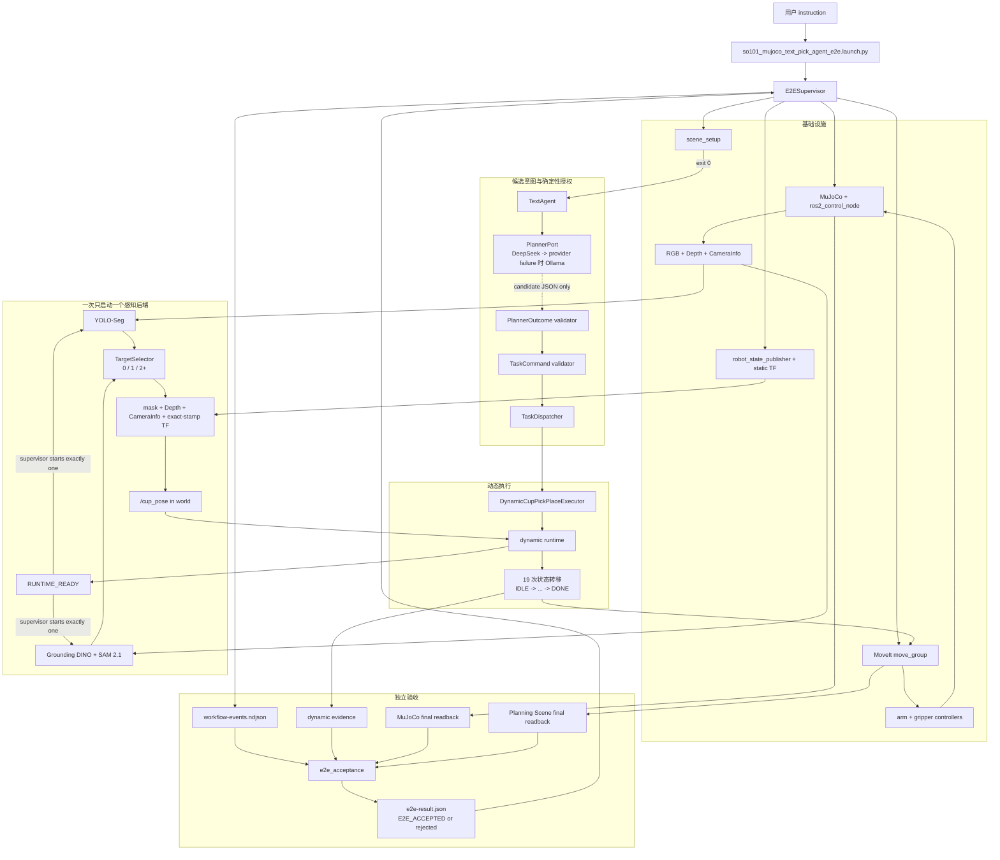
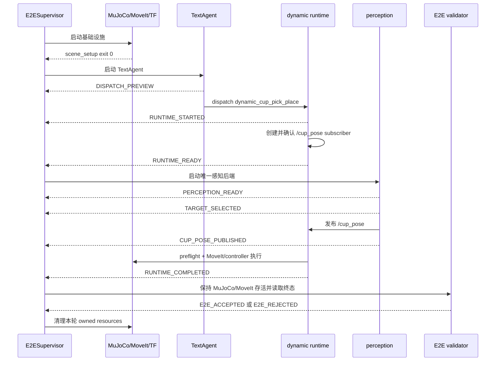

# SO-101 Text Agent 多后端 MuJoCo E2E 教学与源码导读

**范围：** 自然语言 Planner、确定性命令校验、YOLO-Seg、Grounded SAM、RGB-D 定位、`/cup_pose`、动态抓放、MoveIt、MuJoCo、结构化工作流事件和独立终态验收

**对象：** 已经接触过 Python 和 ROS 2，希望看懂“输入一句自然语言，机器人怎样找到杯子并完成一次可验证抓放”的初学者

**目标：** 理解并复现下面这条链路，同时知道每一层的权限和失败边界：

```text
自然语言 instruction
  -> PlannerPort 生成候选 JSON
  -> 固定代码校验 PlannerOutcome 和 TaskCommand
  -> TaskDispatcher 映射为受支持能力
  -> dynamic runtime 先建立 /cup_pose subscriber
  -> YOLO-Seg 或 Grounded SAM 读取 RGB-D
  -> 唯一 plastic_cup -> /cup_pose
  -> MoveIt -> controller -> MuJoCo
  -> 独立读取物理与 Planning Scene 终态
  -> E2E_ACCEPTED
```

这份导读沿用 [`so101-grounded-sam-rgbd-perception-pick-place-source-guide.md`](so101-grounded-sam-rgbd-perception-pick-place-source-guide.md) 的写法：先看完整运行图，再按源码层次拆开讲，最后给出部署、运行、证据阅读和自检步骤。Grounded SAM 的模型训练、bundle 制作和 RGB-D 定位细节仍以那份导读为准。本文关注的是它接入 Text Agent 之后，整条 MuJoCo E2E 链路如何被授权、编排和验收。

本文中的 Linux 命令从通用 Ubuntu + NVIDIA CUDA 视角编写。路径使用 ai-station 上已经验证过的目录作为示例；换到另一台 Ubuntu 主机时，要替换 workspace、overlay、模型和 evidence 路径，不能照搬路径后跳过 provenance 检查。

当前现场结果来自运行代码提交 `1614eb84ef73ad36f050368a65ef40ddae3ea78f`。YOLO-Seg 与 Grounded SAM 已在 Ubuntu/CUDA 和 macOS/MPS 上分别完成四个预置点位，合计 `16/16`。连续五次、两条尚未完成的现场负例、GUI 视频和学习者验收仍是独立门禁，因此本文不会把四点位通过写成整套发布验收已经结束。

## 1. 这条路线解决什么问题

普通的感知抓放入口从“识别杯子”开始。Text Agent E2E 又向前增加了一步：用户先说一句自然语言，系统要判断这句话是否能安全映射到当前机器人已经实现的能力。

这里最容易产生一个误解：既然用了语言模型，是不是语言模型可以直接决定坐标、轨迹和执行？答案是否定的。当前实现把职责切成四段：

1. Planner 只返回候选结构；
2. 固定 Python 代码检查结构和允许值；
3. 感知模型从本轮 RGB-D 中找唯一目标；
4. 动态执行器和独立验收器分别负责动作与结果判断。

语言模型不能输出关节角、Pose、轨迹、shell 命令、ROS 名称或执行授权。即使它返回了合法 JSON，系统仍要经过 backend、确认方式、请求 ID、运行 provenance、感知、场景一致性和 MoveIt 门禁。

这条链路解决的不是“让 LLM 控制机械臂”，而是把自然语言限制在一个很窄、可以审计的任务入口里。目前唯一受支持的能力是：

```json
{
  "target_object": "plastic_cup",
  "action": "pick",
  "constraints": {}
}
```

### 1.1 先认几个词

| 词 | 在本文中的意思 |
|---|---|
| Planner | 把自然语言转换成候选 JSON 的模型 adapter |
| candidate | 尚未获得执行权限的候选数据 |
| backend | 某一层的可替换实现；本文既有感知 backend，也有机器人执行 backend |
| runtime | 真正运行 ROS、模型或动态状态机的环境 |
| provenance | source commit、installed prefix、模型 SHA、device 等来源身份 |
| fail closed | 信息缺失、矛盾或不受支持时直接失败，不猜测默认动作 |
| E2E | 从 instruction 一直验证到物理终态和资源清理 |
| owned resource | 由本轮 launch 创建，因此允许本轮 supervisor 清理的进程或容器 |

后文遇到 `backend` 时要看它属于哪一层。`perception_backend=grounded_sam` 选择感知实现；Text Agent dispatch 中的 `backend=mujoco` 选择机器人执行环境。两者不是同一个参数。

## 2. 先看完整运行图

### 2.1 三个公开入口

仓库保留了三个用途不同的 launch。学习时先分清入口，比记参数更重要。

| 入口 | 从哪里开始 | 感知 | 用途 |
|---|---|---|---|
| `so101_mujoco_text_pick_agent.launch.py` | 自然语言 | 既有颜色几何链路 | 复现此前 Text Agent 课程，接口和默认行为保持不变 |
| `so101_mujoco_perception_pick_place.launch.py` | 已确定要抓杯子 | `color_geometry`、`yolo_seg` 或 `grounded_sam` | 跳过 Planner，单独验证感知到动态抓放 |
| `so101_mujoco_text_pick_agent_e2e.launch.py` | 自然语言 | 正式验收使用 `yolo_seg` 或 `grounded_sam` | 完整验证 Planner、感知、MoveIt、MuJoCo、终态证据和清理 |

新入口文件 [`so101_mujoco_text_pick_agent_e2e.launch.py`](../../src/so101_demo_py/launch/so101_mujoco_text_pick_agent_e2e.launch.py) 只有一个职责：调用 [`build_text_pick_agent_e2e_launch_description()`](../../src/so101_demo_py/src/runtime/launch_composition.py)。它本身不复制参数解析和进程编排代码。

### 2.2 实际启动的组件

执行模式下，顶层 launch 会管理这些组件：

| 组件 | 进程或节点 | 生命周期 | 责任 |
|---|---|---|---|
| E2E supervisor | `launch_composition.py` 内的 `E2ESupervisor` | 贯穿整轮 | 校验阶段顺序、启动子进程、记录首错、清理 owned resources |
| MuJoCo 与 controller manager | `mujoco_ros2_control/ros2_control_node` | 长驻 | 推进物理、发布 `/clock`，承载相机与物理证据插件 |
| Robot State Publisher | `robot_state_publisher` | 长驻 | 根据 URDF 和 `/joint_states` 发布机器人 TF |
| Controller spawner | `controller_manager/spawner` | 激活后退出 | 启动 joint state、手臂和夹爪 controller |
| MoveIt | `so101_mujoco_support/graceful_shutdown_move_group` | 长驻 | 规划轨迹、执行轨迹并维护 Planning Scene |
| Planning Scene 初始化 | `so101_demo_py/scene_setup` | 一次性 | 写入并回读桌子、底座和杯子碰撞对象 |
| 静态相机 TF | `tf2_ros/static_transform_publisher` | 长驻 | 发布相机到机器人/世界坐标链 |
| Text Agent | `so101_demo_py/text_pick_agent` | 一次任务 | 调用 Planner、校验命令、授权 dispatch、运行 dynamic runtime |
| 感知 | `rgbd_object_pose` 或 `rgbd_cup_pose` | 发布后等待统一关停 | 处理本轮 RGB-D，输出观察证据与 `/cup_pose` |
| E2E validator | `so101_demo_py/e2e_acceptance` | 一次性 | 读取 dynamic、MuJoCo 和 Planning Scene 终态，给出接受或拒绝 |

YOLO-Seg 或 Grounded SAM 不是运动控制器。它们只在感知进程内产生候选、mask 和杯子 Pose。Text Agent 也不直接调用 MoveIt；它通过 `PickPlaceExecutorPort` 进入已经受约束的 dynamic runtime。

### 2.3 总体架构图



图里的虚线很重要：Planner 到 validator 传的是候选 JSON，不是执行命令。只有固定代码逐层接受后，`TaskDispatcher` 才能构造 `dynamic_cup_pick_place` 请求。

### 2.4 控制流与数据流不要混在一起

系统里同时有两类“流”：

| 类型 | 典型内容 | 作用 |
|---|---|---|
| 控制流 | `DISPATCH_PREVIEW`、`RUNTIME_READY`、`E2E_ACCEPTED` | 决定什么时候启动哪个进程，是否可以继续 |
| 数据流 | RGB、Depth、CameraInfo、TF、`/cup_pose`、joint state | 描述相机看到了什么、机器人和杯子在哪里 |

`/cup_pose` 是数据，不是授权。即使 topic 上出现了一个 Pose，如果 Planner 没通过、Pose 过期、场景 identity 不一致或 MoveIt preflight 失败，机械臂仍不能开始状态机。

### 2.5 主要 ROS 接口

| 接口 | 类型 | 发布或提供方 | 消费方 | 用途 |
|---|---|---|---|---|
| `/clock` | `rosgraph_msgs/msg/Clock` | MuJoCo | 所有 `use_sim_time` 节点 | 仿真时间基准 |
| `/task_camera/color` | `sensor_msgs/msg/Image` | MuJoCo CameraPlugin | 感知节点 | 模型 RGB 输入 |
| `/task_camera/depth` | `sensor_msgs/msg/Image` | MuJoCo CameraPlugin | 感知节点 | mask 内的米制深度 |
| `/task_camera/camera_info` | `sensor_msgs/msg/CameraInfo` | MuJoCo CameraPlugin | 感知节点 | 相机内参与图像尺寸 |
| `/tf`、`/tf_static` | `tf2_msgs/msg/TFMessage` | RSP、静态 TF 节点 | 感知、MoveIt | 坐标变换 |
| `/perception/detections` | `vision_msgs/msg/Detection2DArray` | `rgbd_object_pose` | 观察者 | bbox、类别和分数 |
| `/perception/overlay` | `sensor_msgs/msg/Image` | `rgbd_object_pose` | 观察者 | 带 bbox 和 mask 的可视结果 |
| `/cup_pose` | `geometry_msgs/msg/PoseStamped` | 感知节点 | dynamic runtime | `world` frame 下的目标中心 |
| `/joint_states` | `sensor_msgs/msg/JointState` | controller | RSP、MoveIt、执行器 | 关节反馈 |
| `/plan_kinematic_path` | `moveit_msgs/srv/GetMotionPlan` | MoveIt | dynamic runtime | 生成轨迹 |
| `/execute_trajectory` | `moveit_msgs/action/ExecuteTrajectory` | MoveIt | dynamic runtime | 执行轨迹 |

工作流事件不走 ROS topic。它们使用子进程 stdout 上带 `SO101_EVENT ` 前缀的 NDJSON，由 supervisor 解析。这样控制协议不会被普通 ROS 观察消息或第三方日志误触发。

## 3. 源码分成了哪些层

| 层 | 主要文件 | 只负责什么 |
|---|---|---|
| 公开 launch | [`so101_mujoco_text_pick_agent_e2e.launch.py`](../../src/so101_demo_py/launch/so101_mujoco_text_pick_agent_e2e.launch.py) | 暴露 ROS 2 launch 名称 |
| 顶层编排 | [`launch_composition.py`](../../src/so101_demo_py/src/runtime/launch_composition.py) | 参数、进程所有权、阶段迁移、首错和清理 |
| 工作流协议 | [`workflow_events.py`](../../src/so101_demo_py/src/runtime/workflow_events.py) | 事件 schema、顺序、payload 和 failure code |
| Planner 端口 | [`task_planner.py`](../../src/so101_demo_py/src/ports/task_planner.py) | 定义 `plan(instruction)` 边界 |
| Provider adapter | [`deepseek.py`](../../src/so101_demo_py/src/adapters/planner/deepseek.py)、[`ollama.py`](../../src/so101_demo_py/src/adapters/planner/ollama.py) | HTTP 请求、响应解码和 provider metadata |
| Provider 链 | [`planner_chain.py`](../../src/so101_demo_py/src/application/planner_chain.py) | 只在 provider error 时从 DeepSeek 回退到 Ollama |
| 语义契约 | [`planner_outcome.py`](../../src/so101_demo_py/src/core/planner_outcome.py)、[`task_command.py`](../../src/so101_demo_py/src/core/task_command.py) | 验证 supported/unsupported/ambiguous 与命令 allowlist |
| Agent 应用层 | [`text_agent.py`](../../src/so101_demo_py/src/application/text_agent.py) | 组合 Planner、校验、确认和 executor |
| 能力映射 | [`task_dispatch.py`](../../src/so101_demo_py/src/application/task_dispatch.py) | 把唯一支持的命令映射为动态抓放请求 |
| 执行端口与 adapter | [`pick_place_executor.py`](../../src/so101_demo_py/src/ports/pick_place_executor.py)、[`adapters/pick_place_executor.py`](../../src/so101_demo_py/src/adapters/pick_place_executor.py) | 隔离 Agent 与 ROS dynamic runtime |
| 动态执行 | [`dynamic_runtime.py`](../../src/so101_demo_py/src/ros/dynamic_runtime.py) | `/cup_pose` 订阅、preflight、状态机和运行证据 |
| 感知构造 | [`perception_launch.py`](../../src/so101_demo_py/src/runtime/perception_launch.py) | 三个 backend 的共同参数校验和进程构造 |
| 目标定位 | [`object_pose.py`](../../src/so101_demo_py/src/application/object_pose.py)、[`rgbd_object_pose_node.py`](../../src/so101_demo_py/src/ros/rgbd_object_pose_node.py) | 0/1/2+ 选择、Depth、tf2 和 `/cup_pose` |
| 感知证据 | [`perception_evidence.py`](../../src/so101_demo_py/src/runtime/perception_evidence.py) | 写入 RGB、mask、overlay、点云和 JSON |
| 终态规则 | [`e2e_acceptance.py`](../../src/so101_demo_py/src/application/e2e_acceptance.py) | 无 ROS 的纯证据校验 |
| 终态采集 | [`e2e_acceptance_readback.py`](../../src/so101_demo_py/src/ros/e2e_acceptance_readback.py) | 读取 MuJoCo 与 Planning Scene 现场状态 |
| 验收 CLI | [`cli/e2e_acceptance.py`](../../src/so101_demo_py/src/cli/e2e_acceptance.py) | 组合证据、写结果并发送终态事件 |

初学者可以先记住一个规律：端口描述“需要什么”，adapter 处理外部系统，application/core 保存稳定规则，ROS 文件负责消息和节点，runtime 文件负责进程与证据。

## 4. Planner 怎样把自然语言变成候选结构

[`PLANNER_SYSTEM_PROMPT`](../../src/so101_demo_py/src/adapters/planner/prompt.py) 要求模型先把 instruction 分成三类：

```json
{"outcome":"supported","command":{"target_object":"plastic_cup","action":"pick","constraints":{}}}
```

```json
{"outcome":"unsupported"}
```

```json
{"outcome":"ambiguous"}
```

比如 `Pick the plastic cup. Apply no constraints.` 应得到 `supported`。要求移动瓶子、否定抓取，或让模型猜测未说明的条件，应得到 `unsupported` 或 `ambiguous`。

Prompt 明确禁止模型输出坐标、Pose、关节、轨迹、shell 命令、ROS 名称和执行授权。这个限制先减少危险输出，但安全边界不依赖 prompt。真正的边界是后面的 Python validator。

## 5. `PlannerPort` 为什么只返回 candidate

[`PlannerPort`](../../src/so101_demo_py/src/ports/task_planner.py) 只有一个方法：

```python
def plan(self, instruction: str) -> PlannerCandidate: ...
```

`PlannerCandidate` 包含两部分：未经信任的 `value`，以及 provider、model、耗时和 fallback 状态。它没有 `execute()`，也拿不到 MoveIt 或 ROS 节点。

当前 provider 顺序是 DeepSeek `deepseek-v4-flash`，provider 失败时回退到本地 Ollama `qwen3.5:4b`。这里的“失败”指认证、网络、超时、HTTP 或响应 JSON 等 provider 层错误。

如果 provider 已经返回可解析内容，但语义是 `unsupported`、`ambiguous` 或命令字段非法，系统不会换一个模型再问一次。否则，同一句被拒绝的指令可能因为重试另一个模型而突然获准。

## 6. `PlannerOutcome` 和 `TaskCommand` 检查什么

[`validate_planner_outcome()`](../../src/so101_demo_py/src/core/planner_outcome.py) 先要求顶层字段精确匹配 schema。`supported` 必须带 `command`，另两类不能偷偷夹带 command。

[`validate_task_command()`](../../src/so101_demo_py/src/core/task_command.py) 再检查：

```text
target_object == plastic_cup
action == pick
constraints 只能包含已登记键和值
不能有额外字段
```

schema 认识 `spatial_relation` 和 `speed`，但当前 [`TaskDispatcher`](../../src/so101_demo_py/src/application/task_dispatch.py) 还没有这些约束的执行 consumer。因此正式 E2E 指令要求 `constraints={}`。如果 Planner 输出 `speed=slow`，命令通过 schema 后仍会因 `CONSTRAINT_UNCONSUMED` 被拒绝。

这说明“语法合法”和“当前能力可执行”是两道不同的门。

## 7. `TextAgent` 何时允许 dispatch

[`TextAgent._handle()`](../../src/so101_demo_py/src/application/text_agent.py) 按固定顺序检查：

1. instruction 和 request 类型；
2. Planner provider 是否成功；
3. PlannerOutcome 与 TaskCommand；
4. `TaskDispatcher` 是否支持该能力；
5. `mode`、`execute` 和 backend；
6. confirmation digest 或受控 bypass；
7. `request_id` 是否重复；
8. executor 返回值是否符合契约。

普通 `text_pick_agent` 支持 preview 和 digest 确认。专用 E2E launch 则强制：

```text
run_mode=execute
execute=true
skip_confirmation=true
```

`skip_confirmation=true` 只适用于这个自动化验收入口，用来跳过人工复制 digest 的交互步骤。它不能跳过 Planner、命令 allowlist、backend、provenance、感知、Pose、MoveIt 或终态证据。

## 8. 为什么一定先等 `RUNTIME_READY`

感知节点在唯一目标出现后只需要发布一次 `/cup_pose`。如果感知先启动，而 dynamic runtime 还没有建立 subscriber，这条消息可能丢失，最后表现为杯子已经识别但执行器一直超时。

当前顺序是：



`RUNTIME_READY` 表示 subscriber 已存在，不表示运动已经授权。收到新鲜 Pose 后，runtime 还要检查 session、reset epoch、场景 identity、暂停状态、Planning Scene 一致性和 reachability。

## 9. 结构化事件协议怎样工作

每个事件占 stdout 的一行，格式为：

```text
SO101_EVENT {JSON object}
```

JSON 固定包含：

```json
{
  "schema_version": 1,
  "workflow_id": "workflow-...",
  "sequence": 1,
  "component": "text_agent",
  "event": "DISPATCH_PREVIEW",
  "status": "OK",
  "timestamp_ns": 1788796800000000000,
  "failure_code": null,
  "payload": {}
}
```

[`EventDecoder`](../../src/so101_demo_py/src/runtime/workflow_events.py) 会按 child 分别缓存 stdout 字节，直到收到完整换行。它还检查 workflow ID、component、sequence、事件年龄、payload 字段和 failure code。

正式模型后端的成功顺序固定为：

```text
STACK_READY
  -> DISPATCH_PREVIEW
  -> RUNTIME_STARTED
  -> RUNTIME_READY
  -> PERCEPTION_READY
  -> TARGET_SELECTED
  -> CUP_POSE_PUBLISHED
  -> RUNTIME_COMPLETED
  -> E2E_ACCEPTED
```

乱序、重复 sequence、未知 component、旧 workflow、超龄事件、非法 JSON 或非法跳转都产生 `EVENT_PROTOCOL_INVALID`。普通 stdout 没有 `SO101_EVENT ` 前缀时只作为日志，不会推进状态。

## 10. 三个感知 backend 共用什么

[`perception_launch.py`](../../src/so101_demo_py/src/runtime/perception_launch.py) 把 backend 参数解析和进程构造集中在一处。感知抓放入口与 Text Agent E2E 都调用这套函数，因此不会各自维护一份 device、权重、bundle 和阈值逻辑。

三个 backend 是：

| backend | 输入 | 输出 | 在新入口中的位置 |
|---|---|---|---|
| `color_geometry` | RGB-D、颜色与几何规则 | `/cup_pose` | 诊断和旧路径对照 |
| `yolo_seg` | RGB-D、`.pt` 权重 | candidate、mask、`/cup_pose` | 正式模型感知 backend |
| `grounded_sam` | RGB-D、不可变双模型 bundle | candidate、mask、`/cup_pose` | 正式模型感知 backend |

共同规则包括：

- 设备和 CPU fallback 必须显式可解释；
- 模型工件使用绝对路径和 SHA-256；
- 感知只能从当前 RGB-D 和 TF 生成 Pose；
- 0 个合格候选返回 `TARGET_NOT_FOUND`；
- 2 个及以上返回 `TARGET_AMBIGUOUS`；
- 只有唯一候选才能发布 `/cup_pose`；
- 输出 subscriber 未准备好时失败，不盲发一次消息后退出。

## 11. YOLO-Seg backend 做什么

YOLO-Seg 一次推理直接给出类别、bbox、confidence 和实例 mask。当前 E2E 使用同一份 `.pt` 在 Ubuntu/CUDA 和 macOS/MPS 上运行。

Linux 的 `perception_runtime=auto` 会解析为 Docker；正式 Ubuntu/CUDA 复现建议显式写 `docker`，同时固定 image。macOS 使用 `host` 和 `mps`。

YOLO 专属参数是：

```text
perception_weights
perception_weights_sha256
perception_container_image
```

权重必须是存在的绝对普通文件，不能是 symlink；SHA 必须是 64 位小写十六进制。给 YOLO 同时传 Grounded SAM 的 `perception_model_root` 会在创建进程前失败。

## 12. Grounded SAM backend 做什么

Grounded SAM 的推理链是：

```text
RGB + 受控文本
  -> Grounding DINO 给候选框
  -> bbox 去重
  -> SAM 2.1 按 box prompt 给 mask
  -> DetectionCandidate
  -> TargetSelector
  -> RGB-D 定位
```

当前合格模型包由 `Grounding DINO Tiny epoch 1` 和 `SAM 2.1 Hiera Tiny decoder epoch 4` 组成。manifest SHA-256 是：

```text
b55bb601d311407df8f9f25d9da18649f6bd78ac1299148bde0d07f7cfdfed05
```

阈值锁 SHA-256 是：

```text
b02e3be2814d03b954bdcb73b2f79f8b91d1227c6476fcc82695cabb91f50278
```

已登记发布源是私有 Hugging Face 仓库 `zjumty/so101-grounded-sam-cup-pickplace` 的 revision `52b8334358e5ff11f94f10f7c14b1697ef44d964`。正式运行读取下载后的本地 bundle，不在推理途中访问 Hub。manifest 记录 pipeline 和文件清单，逐文件 SHA 防止 bundle 内某个权重或配置被替换；launch 参数中的 manifest SHA 再锁住整份清单。

新入口四点位验收使用的阈值为：

| 参数 | 值 |
|---|---:|
| `grounding_box_threshold` | `0.5` |
| `grounding_text_threshold` | `0.5` |
| `grounding_duplicate_iou` | `0.85` |
| `grounding_max_candidates` | `16` |
| `sam_mask_quality_threshold` | `0.5` |
| `sam_min_mask_pixels` | `64` |
| `sam_max_mask_area_ratio` | `0.50` |

这些值与代码默认值不完全相同，复现验收时必须显式传入。不要只写 `perception_backend:=grounded_sam` 后依赖默认阈值。

Grounded SAM 的 Ubuntu 验收采用 host runtime 和锁定 Python 环境，因为该进程既要加载 ROS 2 `rclpy`，又要加载固定版本的 torch、transformers 和模型代码。模型包存在不等于可以用于 PickPlace 验收；还要登记本机绝对路径、manifest、阈值、Python、source mapping 和实际 CUDA/MPS device。

模型训练、逐文件 SHA、`local_files_only=True`、MPS/CUDA 部署和域泛化边界见 [`Grounded SAM RGB-D 导读`](so101-grounded-sam-rgbd-perception-pick-place-source-guide.md)。

## 13. 为什么 `color_geometry` 不算新入口的正式模型验收

颜色几何后端适合检查相机、Depth、TF 和动态抓放是否连通，也能复现旧课程。但它没有验证 YOLO-Seg 或 Grounded SAM 的模型加载、device、候选选择和模型 provenance。

因此 `color_geometry` 成功只能说明诊断基线可用，不能替代新入口的模型 backend 验收。它的工作流可以从 `PERCEPTION_READY` 直接到 `CUP_POSE_PUBLISHED`；两个模型 backend 必须额外产生 `TARGET_SELECTED`。

## 14. RGB-D 怎样变成 `/cup_pose`

两个模型最终都交给同一个应用层做定位：

1. RGB、Depth 和 CameraInfo 必须来自可配对的当前帧；
2. candidate 的 mask 尺寸必须与 RGB 一致；
3. `TargetSelector` 只接受唯一 `plastic_cup`；
4. 从 selected mask 内读取有效 Depth；
5. 用相机内参把像素反投影成三维点；
6. 查询该 source stamp 对应的 tf2；
7. 把目标中心变换到 `world`；
8. 发布保留 source stamp 的 `PoseStamped`。

运行时感知输入 frame 是 `task_camera_frame`，而 `CUP_POSE_PUBLISHED.frame_id` 必须是 `world`。如果 exact-stamp TF 不可用，系统返回失败；不能悄悄换成 latest transform，也不能用 MuJoCo truth pose 补一个结果。

MuJoCo object ID、truth pose 和 categorical mask 只用于数据生成或验收。它们不能进入生产 detector、TargetSelector 或 `/cup_pose` 计算。

## 15. dynamic runtime 收到 Pose 后还检查什么

[`run_dynamic_execute()`](../../src/so101_demo_py/src/ros/dynamic_runtime.py) 在 subscriber ready 后先等待新鲜 Pose，再完成 preflight：

- Pose frame 和 source stamp；
- simulation session 与 expected reset epoch；
- 场景是否暂停；
- MuJoCo scene identity；
- Planning Scene 中目标是否与物理场景一致；
- 目标是否可达；
- policy、source commit、installed prefix 和 evidence root。

这些门禁通过后才创建 runner。`RUNTIME_STARTED` 只表示 executor 已进入运行边界，`RUNTIME_READY` 只表示 subscriber 就绪；两者都不等于状态机已经开始移动。

## 16. 动态抓放状态机怎样走

一次成功执行有 19 次状态转移：

```text
IDLE
PREPARE_OPEN_GRIPPER
MOVE_ABOVE_OBJECT
DESCEND
CLOSE_GRIPPER
WAIT_GRASP_STABLE
MICRO_LIFT
WAIT_MICRO_LIFT_STABLE
VERIFY_PHYSICAL_GRASP
ATTACH_MOVEIT
LIFT
MOVE_ABOVE_PLACE
DESCEND_TO_PLACE
DETACH_MOVEIT
OPEN_GRIPPER
WAIT_RELEASE_SETTLE
VALIDATE_FINAL_PLACEMENT
SYNC_WORLD_OBJECT
RETREAT
DONE
```

其中几步值得单独理解：

- `MICRO_LIFT` 先做小幅抬升，用物理证据确认杯子确实被双侧夹持；
- `ATTACH_MOVEIT` 更新的是 Planning Scene shadow，不是给 MuJoCo 创建隐形约束；
- `DETACH_MOVEIT` 必须发生在 `OPEN_GRIPPER` 之前；
- release 后使用新的样本判断桌面接触和稳定，不能复用松手前的数据；
- `SYNC_WORLD_OBJECT` 把 Planning Scene 中的杯子位置同步到 MuJoCo 终态。

当前 MuJoCo 抓持依赖双侧接触、摩擦和物理仿真。看到 MoveIt attached object 不等于杯子在 MuJoCo 中真的被抓住。

## 17. 为什么 `RUNTIME_COMPLETED` 之后还要验收

`RUNTIME_COMPLETED` 只说明 dynamic runtime 返回 0，并且 manifest 已写出。它不能单独证明：

- 杯子最后落在桌面上；
- 杯子已经停止；
- 夹爪没有继续碰杯；
- Planning Scene 已经 detach；
- Planning Scene Pose 与 MuJoCo 一致；
- 本轮 identity 没有串到另一轮证据。

所以 supervisor 会保持 MuJoCo、MoveIt 和 TF 存活，再启动 [`e2e_acceptance`](../../src/so101_demo_py/src/cli/e2e_acceptance.py)。验收器读取：

```text
expected identity
dynamic manifest
perception result
MuJoCo final readback
Planning Scene final readback
qualified policy
```

全部通过才发送 `E2E_ACCEPTED`。

## 18. 终态验收具体看什么

[`validate_e2e_evidence()`](../../src/so101_demo_py/src/application/e2e_acceptance.py) 是无 ROS 的纯校验函数，主要检查四组事实。

| 组别 | 检查内容 |
|---|---|
| Identity | workflow、request、session、reset epoch 在各文件中一致 |
| Dynamic | 完整状态序列、19 次转移、运动 readback、微抬升、运输、释放后样本 |
| MuJoCo | 杯子稳定、桌面支撑、无 fingertip contact、姿态和速度在 policy 门内 |
| Planning Scene | attached 集合为空，杯子/桌子/底座存在，Pose 与 MuJoCo 在容差内 |

物理真值以 MuJoCo 为准，Planning Scene 是规划 shadow。两者必须一致，但不能用 Planning Scene 的成功替代物理结果。

## 19. 两种时钟为什么不能直接相减

感知和 dynamic 运行使用 MuJoCo `/clock`。终态证据里，MuJoCo source timestamp 属于 `mujoco_sim`，Planning Scene 读回时间属于 `system_wall`。

这两个数没有共同零点，不能直接做减法判断谁更新得晚。当前验收比较的是同一宿主机采集两份 readback 时记录的 `readback_monotonic_ns`，并检查最大采集偏差。

看到两个 timestamp 数值差很大时，先看 `clock_domain`，不要把不同时间域误判为 stale evidence。

## 20. 首个失败和后续清理错误怎样记录

supervisor 保存：

```text
primary_failure
secondary_failures[]
current_phase
shutting_down
```

第一个合法终态错误进入 `primary_failure`，后来的错误不能覆盖它。例如，感知先返回 `TARGET_AMBIGUOUS`，随后 MoveIt 关停超时：主错误仍是目标歧义，关停超时进入 `secondary_failures`。

如果 child 非零退出却没有先发送合法失败事件，supervisor 使用 `CHILD_EXITED_WITHOUT_TERMINAL_EVENT`。required long-lived process 在 `E2E_ACCEPTED` 前退出，即使退出码是 0，也算失败。

## 21. recovery 与进程清理有什么区别

状态机 recovery 处理已经发生的机器人副作用，例如夹爪状态、Planning Scene attachment、world object 和安全 retreat。顶层 teardown 处理进程与容器。

清理范围只包括本轮 launch 创建并登记为 owned 的资源：Text Agent、感知、MuJoCo、MoveIt、controllers、RSP、静态 TF、validator，以及本轮 YOLO Docker container。DeepSeek 服务、Ollama daemon、其他 tmux 和未知所有权进程不在清理范围内。

信号按 `SIGINT -> SIGTERM -> SIGKILL` 逐级升级，每一级有有限超时。清理异常进入 `secondary_failures`。launch 不会 reset 世界来伪装一次 recovery 成功。

## 22. 旧入口为什么没有被破坏

新入口是新增的 thin wrapper，没有给旧 Text Agent launch 强加新参数。共享感知代码的重构保持了 perception launch 的三个 backend、参数转发和退出语义。

兼容性证据包括：

- 旧 Text Agent launch 的参数集合、默认值、颜色感知进程和顺序测试；
- 旧 perception launch 的 exact 参数、backend 和 action 构造测试；
- workflow 参数未启用时，既有 CLI stdout/exit contract；
- installed launch 集合只增加新 E2E launch；
- 新入口实现提交在 Ubuntu 和 macOS 都通过完整普通测试门。

Grounded SAM 续测后又单独运行了两个旧入口的 focused 回归，结果为 `173 passed in 3.32 seconds`。本轮续测没有改产品 `src/`。

## 23. 每轮 evidence 目录里有什么

每次运行必须使用一个此前不存在的 run root：

```text
<run-root>/
  workflow-events.ndjson
  e2e-result.json
  perception/
    result.json
    source-rgb.png
    prediction-overlay.png
    detections.json
    selected-mask.png
    selected-cloud.ply
    model-provenance.json
  dynamic/
    text-agent-provenance/
    dynamic-execute-manifest.json
    ...状态机、MoveIt、joint、TF 和物理证据...
  acceptance/
    mujoco-final.json
    planning-scene-final.json
    result.json
```

如果流程在某个阶段失败，后面的文件可能不存在。缺失本身是证据，不能从另一轮复制文件补齐。

`e2e-result.json` 至少把这些信息串在一起：source commit、installed prefix、backend、model provenance、event trace、首错、后续错误、runtime exit、物理结果、Planning Scene 结果、owned cleanup 和 artifact path。

## 24. 运行前先准备什么

### 24.1 Agent 与运行参数

公开参数的默认值偏向“不执行”。专用 E2E 运行必须显式打开执行门：

| 参数 | 默认值 | E2E 规则 |
|---|---|---|
| `instruction` | 无 | 必填，先经过 instruction validator |
| `run_mode` | `dry_run` | 必须传 `execute` |
| `execute` | `false` | 必须传 `true` |
| `skip_confirmation` | `false` | 专用 E2E 必须传 `true`，只跳过人工 digest 交互 |
| `headless` | `false` | 自动证据可用 `true`；GUI 观察使用 `false` |
| `sensor_rendering` | `true` | 只接受 `true`，模型感知需要相机渲染 |
| `session_id` | 自动生成 | 正式运行使用本轮唯一、安全字符组成的 ID |
| `evidence_file` | `/tmp` 下唯一文件 | 必须是新绝对路径，父级 run root 也不能已经存在 |
| `readiness_timeout_s` | `90.0` | MuJoCo、controllers、MoveIt 和 scene 的启动预算 |
| `perception_startup_timeout_s` | `30.0` | 模型加载与感知 ready 预算；正式模型复现使用登记值 |
| `cup_pose_timeout_s` | `45.0` | dynamic runtime 等待新鲜 Pose 的预算 |
| `mujoco_scene` | 安装包内 `scene.xml` | 必须是存在的绝对普通文件，不能是 symlink |
| `mujoco_initial_keyframe` | `task_start` | 只接受四个已登记预置点 |

三个看似重复的执行参数各管一件事：`run_mode` 选择运行路径，`execute` 授予执行权限，`skip_confirmation` 选择这次是否需要人工 digest。缺少其中任何一个，专用 E2E launch 都会在启动业务进程前拒绝。

### 24.2 感知参数

| 参数组 | 参数 | 说明 |
|---|---|---|
| backend | `perception_backend` | 默认 `yolo_seg`；可选 `color_geometry`、`yolo_seg`、`grounded_sam` |
| YOLO-Seg | `perception_weights`、`perception_weights_sha256` | 必须成对提供 |
| Grounded SAM | `perception_model_root`、`perception_model_manifest_sha256` | 必须成对提供 |
| device | `perception_device`、`perception_allow_cpu_fallback` | 可选 `auto/cuda/mps/cpu`；正式 MPS/CUDA 验收关闭 fallback |
| runtime | `perception_runtime` | 可选 `auto/host/docker/docker_dev` |
| Docker | `perception_container_image` | Linux YOLO inference image |
| 开发挂载 | `perception_source_root` | 只允许与 `docker_dev` 一起使用 |
| Grounding DINO | `grounding_box_threshold`、`grounding_text_threshold`、`grounding_duplicate_iou`、`grounding_max_candidates` | 只对 `grounded_sam` 有效 |
| SAM | `sam_mask_quality_threshold`、`sam_min_mask_pixels`、`sam_max_mask_area_ratio` | 只对 `grounded_sam` 有效 |

backend 专属参数是互斥的。给 YOLO 传 bundle，给 Grounded SAM 传 `.pt`，或给其他 backend 传非默认 Grounded SAM 阈值，都会 fail closed。

### 24.3 通用 preflight

无论 Ubuntu 还是 macOS，都先确认：

1. 当前 shell 已 source 正确的 ROS 2 Jazzy 和本轮 overlay；
2. `ros2 pkg prefix so101_demo_py` 指向预期 install；
3. installed entrypoint 使用能同时导入 `rclpy` 与模型依赖的 Python；
4. source commit、installed prefix 和运行模块能互相对上；
5. Planner 服务可用，Ollama 模型名是 `qwen3.5:4b`，或 DeepSeek 凭据通过安全环境提供；
6. MPS/CUDA 实际可用，且正式验收关闭 CPU fallback；
7. 模型文件和 SHA 与账本登记一致；
8. 没有另一套同 domain 的 ROS graph；
9. `ROS_DOMAIN_ID`、`GZ_PARTITION`、session 和 run root 都是本轮新值；
10. run root 还不存在。

先查看当前安装真正暴露的 launch 参数：

```bash
ros2 launch so101_demo_py \
  so101_mujoco_text_pick_agent_e2e.launch.py --show-args
```

不要从旧笔记复制参数后直接运行。`--show-args` 读的是当前 sourced overlay。

## 25. Ubuntu + NVIDIA CUDA 的环境视角

下面采用已经验证过的 Ubuntu 目录作为示例：

```text
source checkout:
  /data/work/ws_moveit/.worktrees/text-agent-e2e-e6057016

common support overlay:
  /data/work/so101-evidence/text-agent-e2e/.../candidate-1614eb84-r4/install

Grounded SAM overlay:
  /data/work/so101-evidence/text-agent-e2e/.../candidate-1614eb84-grounded-sam/install

Grounded SAM Python:
  /data/work/venvs/so101-grounded-sam/bin/python

durable evidence base:
  /data/work/so101-evidence/text-agent-e2e/<run-id>
```

这些不是软件要求的固定安装位置。它们是已验收机器上的 provenance 示例。另一台 Ubuntu 主机可以使用不同路径，但必须重新构建 overlay、校验模型、读回 installed identity，并登记自己的 evidence root。

Ubuntu shell 初始化示例：

```bash
source /opt/ros/jazzy/setup.bash
source /data/work/so101-evidence/text-agent-e2e/<run-id>/candidate-1614eb84-r4/install/setup.bash

export ROS_DOMAIN_ID=<fresh-valid-domain>
export GZ_PARTITION=text-e2e-ubuntu-<fresh-id>
export HF_HUB_OFFLINE=1
export TRANSFORMERS_OFFLINE=1
export PYTHONNOUSERSITE=1
```

如果测试或构建会创建大量 fsync fixture，在 ai-station 上还要按仓库规则把 `TMPDIR`、`TMP` 和 `TEMP` 指到本轮 durable evidence root 下新建的 NVMe scratch。普通主机应遵循自己的证据和磁盘策略，不要机械复制 ai-station 专用路径。

## 26. Ubuntu 上运行 YOLO-Seg E2E

已验证权重与镜像示例：

```bash
export E2E_WEIGHTS=/data/work/so101-evidence/v5-t004-yolo-seg-rgbd/20260831-f09cf88/training/full-exp-012/best.pt
export E2E_WEIGHTS_SHA256=f281d25258493e2c7c220dd1d84a7ca4f0501adf99ed4a921a065d74ace40781
export E2E_IMAGE=so101-yolo11n-seg-inference:text-agent-e2e-1614eb84
export E2E_ROOT=/data/work/so101-evidence/text-agent-e2e/<run-id>/live/<fresh-yolo-run>
export E2E_SESSION=text-e2e-ubuntu-yolo-<fresh-id>

test ! -e "$E2E_ROOT"

ros2 launch so101_demo_py so101_mujoco_text_pick_agent_e2e.launch.py \
  instruction:='Pick the plastic cup. Apply no constraints.' \
  run_mode:=execute execute:=true skip_confirmation:=true \
  headless:=true sensor_rendering:=true \
  session_id:="$E2E_SESSION" \
  evidence_file:="$E2E_ROOT/e2e-result.json" \
  readiness_timeout_s:=90.0 \
  perception_startup_timeout_s:=120.0 \
  cup_pose_timeout_s:=45.0 \
  mujoco_initial_keyframe:=task_start \
  perception_backend:=yolo_seg \
  perception_runtime:=docker \
  perception_device:=cuda \
  perception_allow_cpu_fallback:=false \
  perception_weights:="$E2E_WEIGHTS" \
  perception_weights_sha256:="$E2E_WEIGHTS_SHA256" \
  perception_container_image:="$E2E_IMAGE"
```

正式运行还要把 shell 退出码和 postflight ROS/process 检查写入本轮 controller evidence。不要在已有 `e2e-result.json` 的目录重跑。

## 27. Ubuntu 上运行 Grounded SAM E2E

先 source 能加载 Grounded SAM 的 overlay，并加入登记过的源码映射：

```bash
source /opt/ros/jazzy/setup.bash
source /data/work/so101-evidence/text-agent-e2e/<run-id>/candidate-1614eb84-r4/install/setup.bash
source /data/work/so101-evidence/text-agent-e2e/<run-id>/candidate-1614eb84-grounded-sam/install/setup.bash

export PYTHONPATH=/data/work/so101-evidence/text-agent-e2e/<run-id>/candidate-1614eb84-grounded-sam/pythonpath:${PYTHONPATH:-}
export HF_HUB_OFFLINE=1
export TRANSFORMERS_OFFLINE=1
export PYTHONNOUSERSITE=1
```

已验证 bundle 示例：

```bash
export E2E_MODEL_ROOT=/data/work/so101-evidence/v5-t005-grounded-sam-rgbd/20260901-b55c869/remediation/exp-079/models/grounded-sam-dino-nonpenetrating-epoch1-sam-decoder-epoch4-r1
export E2E_MODEL_MANIFEST_SHA256=b55bb601d311407df8f9f25d9da18649f6bd78ac1299148bde0d07f7cfdfed05
export E2E_ROOT=/data/work/so101-evidence/text-agent-e2e/<run-id>/live/<fresh-grounded-sam-run>
export E2E_SESSION=text-e2e-ubuntu-gsam-<fresh-id>

test ! -e "$E2E_ROOT"
test "$(sha256sum "$E2E_MODEL_ROOT/manifest.json" | cut -d ' ' -f 1)" = \
  "$E2E_MODEL_MANIFEST_SHA256"

ros2 launch so101_demo_py so101_mujoco_text_pick_agent_e2e.launch.py \
  instruction:='Pick the plastic cup. Apply no constraints.' \
  run_mode:=execute execute:=true skip_confirmation:=true \
  headless:=true sensor_rendering:=true \
  session_id:="$E2E_SESSION" \
  evidence_file:="$E2E_ROOT/e2e-result.json" \
  readiness_timeout_s:=90.0 \
  perception_startup_timeout_s:=120.0 \
  cup_pose_timeout_s:=45.0 \
  mujoco_initial_keyframe:=task_start \
  perception_backend:=grounded_sam \
  perception_runtime:=host \
  perception_device:=cuda \
  perception_allow_cpu_fallback:=false \
  perception_model_root:="$E2E_MODEL_ROOT" \
  perception_model_manifest_sha256:="$E2E_MODEL_MANIFEST_SHA256" \
  grounding_box_threshold:=0.5 \
  grounding_text_threshold:=0.5 \
  grounding_duplicate_iou:=0.85 \
  grounding_max_candidates:=16 \
  sam_mask_quality_threshold:=0.5 \
  sam_min_mask_pixels:=64 \
  sam_max_mask_area_ratio:=0.50
```

正式资格运行前还应读回：

```bash
ros2 pkg prefix so101_demo_py
head -1 "$(ros2 pkg prefix so101_demo_py)/lib/so101_demo_py/rgbd_object_pose"
/data/work/venvs/so101-grounded-sam/bin/python -c \
  'import torch; print(torch.__version__, torch.cuda.is_available(), torch.cuda.get_device_name(0))'
```

如果 entrypoint 的 shebang、`rclpy`、torch 或 installed source identity 不属于同一套环境，先修复 overlay。不要通过临时 CPU fallback 把环境错误变成一次“成功”。

## 28. macOS + MPS 有哪些不同

macOS 使用 host runtime 和 `mps`。YOLO-Seg 仍使用与 Ubuntu 相同的 `.pt` 和 SHA；Grounded SAM 使用相同 bundle manifest 和阈值锁。

正式运行前检查：

```bash
python3 -c 'import torch; print(torch.backends.mps.is_built(), torch.backends.mps.is_available())'
```

MuJoCo vendor 动态库目录必须在当前 shell 的 `DYLD_LIBRARY_PATH` 中。已验证环境使用：

```bash
export DYLD_LIBRARY_PATH=/Users/matianyi/Projects/robot_demo_001/moveit-demo/install/mujoco_vendor/opt/mujoco_vendor/lib:${DYLD_LIBRARY_PATH:-}
```

缺少这条路径时，MuJoCo hardware plugin 会因找不到 `libmujoco.3.4.0.dylib` 而失败，感知随后等不到正向 `/clock`。这属于运行环境无效，不能算 Grounded SAM backend 失败。

macOS 的 backend 参数替换为：

```bash
perception_backend:=grounded_sam \
perception_runtime:=host \
perception_device:=mps \
perception_allow_cpu_fallback:=false \
perception_model_root:="$E2E_MODEL_ROOT" \
perception_model_manifest_sha256:="$E2E_MODEL_MANIFEST_SHA256"
```

其余 workflow、session、run root、阈值和成功条件与 Ubuntu 相同。

## 29. 怎样读一轮成功结果

先看事件顺序：

```bash
jq -r '[.component,.event,.status,(.failure_code // "-")] | @tsv' \
  "$E2E_ROOT/workflow-events.ndjson"
```

再看顶层结论：

```bash
jq '{machine_accepted,primary_failure,secondary_failures,runtime_exit_code,
     physical_outcome,planning_scene_outcome,owned_process_cleanup,
     model_provenance,artifact_paths}' \
  "$E2E_ROOT/e2e-result.json"
```

一次完整成功至少应看到：

```text
machine_accepted == true
primary_failure == null
secondary_failures == []
runtime_exit_code == 0
physical_outcome.stable == true
physical_outcome.support_contact == true
physical_outcome.fingertip_contact == false
planning_scene_outcome.pose_matches_mujoco == true
planning_scene_outcome.attached_object_ids == []
owned_process_cleanup.complete == true
owned_process_cleanup.remaining == []
```

Grounded SAM 和 YOLO-Seg 还要检查实际 device、CPU fallback、candidate count、matching count、manifest/weights SHA 和 inference latency。

## 30. 常见错误怎样定位

| 现象或 failure code | 先看哪里 | 不要怎么处理 |
|---|---|---|
| `PLANNER_CHAIN_FAILED` | DeepSeek 凭据、网络、Ollama loopback 与 `qwen3.5:4b` | 不要绕过 Planner 手写执行请求 |
| `PLANNER_OUTCOME_UNSUPPORTED` | Planner 原始结果和 instruction | 不要换模型反复问到它同意 |
| `COMMAND_INVALID` | PlannerOutcome/TaskCommand 字段 | 不要忽略额外字段 |
| `CONSTRAINT_UNCONSUMED` | `constraints` 是否为空 | 不要假装当前 runtime 能执行约束 |
| `BACKEND_NOT_QUALIFIED` | Agent backend 与 dispatcher 结果 | 不要把模型 backend 和机器人 backend 混为一谈 |
| `EVENT_PROTOCOL_INVALID` | workflow ID、component、sequence、阶段和事件年龄 | 不要人工补一行成功事件 |
| `SIM_CLOCK_UNAVAILABLE` | MuJoCo plugin、`/clock`、动态库环境 | 不要归咎于模型推理 |
| `MODEL_BUNDLE_INVALID` | manifest、文件集合与逐文件 SHA | 不要在线补下载缺失文件 |
| `DEVICE_UNAVAILABLE` | torch CUDA/MPS 和实际 device | 不要开启 CPU fallback 代替正式资格 |
| `TARGET_NOT_FOUND` | source RGB、overlay、score、mask rejection | 不要发布默认 Pose |
| `TARGET_AMBIGUOUS` | 是否真的有两个合格候选 | 不要暗中选最高分 |
| `DEPTH_INVALID` | selected mask 内 Depth 和有效点数 | 不要用 bbox 中心伪造三维位置 |
| `TF_UNAVAILABLE` | source stamp 的 `world <- task_camera_frame` | 不要换 latest TF |
| `CUP_POSE_TIMEOUT` | 是否先出现 `RUNTIME_READY`、感知是否发布 | 不要原目录重跑覆盖证据 |
| `MOVEIT_EXECUTION_FAILED` | plan、execute、joint readback 和 recovery | 不要只看 action 返回文本 |
| `E2E_MUJOCO_FINAL_INVALID` | 杯子 Pose、速度、桌面和 fingertip contact | 不要用 Planning Scene 成功替代物理事实 |
| `E2E_PLANNING_SCENE_INVALID` | attached object、world object 和 MuJoCo Pose 差 | 不要只看 RViz 画面 |

定位时先找 `primary_failure`，再看它所属阶段的证据。`secondary_failures` 常常是清理时出现的问题，不应遮住真正的首错。

## 31. 四个预置点位怎样验收

四点位是：

```text
task_start
cup_test_forward_5cm
cup_test_left_5cm
cup_test_right_5cm
```

每个点都要使用独立 `FULL_RESTART`、workflow ID、request ID、session、ROS domain 和 run root。不能在同一仿真里连续 reset 后把四次算成四个独立点位。

每一点都要同时满足：

- Planner 产生合法 `plastic_cup + pick + {}`；
- 事件严格走到 `E2E_ACCEPTED`；
- 感知只有一个 matching candidate；
- `/cup_pose` 新鲜且 frame 为 `world`；
- dynamic 到 `DONE/19`；
- 杯子完成微抬升、运输、释放和稳定落桌；
- 没有 fingertip contact；
- Planning Scene attached 集合为空；
- Planning Scene Pose 与 MuJoCo 匹配；
- launch 和 runtime 返回 0；
- owned resources 清理完整。

环境污染产生的 `INVALID` 不算产品失败，但也不能计入 4/4。修复后必须换新的 experiment ID、domain、session 和 run root。

## 32. 当前双平台、双模型结果

| 配置 | 结果 | 实验 | 位姿误差 |
|---|---|---|---|
| Ubuntu/CUDA + YOLO-Seg | `4/4` | EXP-037 至 EXP-040 | 1.157、1.161、1.130、1.177 mm |
| macOS/MPS + YOLO-Seg | `4/4` | EXP-025、EXP-026、EXP-027b、EXP-028 | 1.175、1.146、1.120、1.172 mm |
| Ubuntu/CUDA + Grounded SAM | `4/4` | EXP-068 至 EXP-071 | 1.159、1.147、1.126、1.175 mm |
| macOS/MPS + Grounded SAM | `4/4` | EXP-076 至 EXP-079 | 1.170、1.156、1.117、1.172 mm |

十六次有效运行都使用实际 MPS 或 CUDA，并关闭 CPU fallback。每次运行都记录一个 matching candidate、`DONE/19`、稳定桌面支撑、无 fingertip contact、空 attached 集合、Planning Scene/MuJoCo Pose 匹配和完整清理。

Grounded SAM 在 Ubuntu/CUDA 上的推理耗时为 `225.94..287.97 ms`，冷启动约 `5.03..5.11 s`；当前 Mac/MPS 为 `1248.43..1300.67 ms`，冷启动约 `7.41..9.52 s`。

这里的 `16/16` 全部是 MuJoCo 仿真结果，没有实体机械臂验收。它证明的是这两个模型 backend 在已登记仿真环境中的四点位闭环，不是现实世界抓放资格。

下面这些运行因环境或取证问题记为 `INVALID`，未计入结果：

| 实验 | 原因 |
|---|---|
| EXP-042 | wrapper 预先创建了本应由 launch 独占创建的 evidence root |
| EXP-050 | installed source provenance mapping 缺失 |
| EXP-058 | 验证 shell 的 nounset/pipefail 处理错误，脚本状态不可信 |
| EXP-072 | macOS MuJoCo `DYLD_LIBRARY_PATH` 缺失，模型没有进入推理 |

Planner 拒绝负例 EXP-015 已通过，没有产生感知或运动副作用。双杯歧义现场负例因环境问题无效，MoveIt action abort 现场负例尚未执行。每配置连续五次、GUI 视频和学习者证据也未完成。

## 33. 已保留证据在哪里

Ubuntu/CUDA 的正式证据根：

```text
/data/work/so101-evidence/text-agent-e2e/20260907T185218Z-197fa789-046f-4bd6-b029-641673ac17ad
```

macOS 的登记根：

```text
/tmp/so101-debug-text-agent-e2e-impl-20260907-01a07c7f
```

Grounded SAM 的统一四点摘要：

```text
/data/work/so101-evidence/text-agent-e2e/20260907T185218Z-197fa789-046f-4bd6-b029-641673ac17ad/grounded-sam-linux-four-point-summary.json
/tmp/so101-debug-text-agent-e2e-impl-20260907-01a07c7f/grounded-sam-macos-four-point-summary.json
```

完整实验状态、无效运行、命令、SHA 和清理记录见 [`text-agent-multibackend-e2e-experiment-ledger.md`](../experiments/text-agent-multibackend-e2e-experiment-ledger.md)。原始证据没有删除；可删除候选仍需单独授权。

## 34. 建议的源码阅读顺序

第一次阅读不建议从 2000 多行的 launch composition 开始。按下面的顺序更容易建立心智模型：

1. [`task_command.py`](../../src/so101_demo_py/src/core/task_command.py)：系统究竟允许什么命令；
2. [`planner_outcome.py`](../../src/so101_demo_py/src/core/planner_outcome.py)：supported、unsupported 和 ambiguous；
3. [`task_planner.py`](../../src/so101_demo_py/src/ports/task_planner.py)：为什么 Planner 只是端口；
4. [`planner_chain.py`](../../src/so101_demo_py/src/application/planner_chain.py)：什么情况才 fallback；
5. [`text_agent.py`](../../src/so101_demo_py/src/application/text_agent.py)：候选怎样经过确定性门禁；
6. [`task_dispatch.py`](../../src/so101_demo_py/src/application/task_dispatch.py)：命令怎样映射为唯一能力；
7. [`pick_place_executor.py`](../../src/so101_demo_py/src/adapters/pick_place_executor.py)：Agent 怎样进入 dynamic runtime；
8. [`workflow_events.py`](../../src/so101_demo_py/src/runtime/workflow_events.py)：跨进程阶段协议；
9. [`perception_launch.py`](../../src/so101_demo_py/src/runtime/perception_launch.py)：backend 参数和 action 构造；
10. [`so101-grounded-sam-rgbd-perception-pick-place-source-guide.md`](so101-grounded-sam-rgbd-perception-pick-place-source-guide.md)：模型到 `/cup_pose`；
11. [`dynamic_runtime.py`](../../src/so101_demo_py/src/ros/dynamic_runtime.py)：Pose 后的 preflight；
12. [`so101-dynamic-cup-pick-place-source-guide.md`](so101-dynamic-cup-pick-place-source-guide.md)：19 次状态转移的动作细节；
13. [`e2e_acceptance.py`](../../src/so101_demo_py/src/application/e2e_acceptance.py)：为什么 `DONE` 之后还可能失败；
14. [`launch_composition.py`](../../src/so101_demo_py/src/runtime/launch_composition.py)：最后再看 supervisor 如何把全部组件串起来。

## 35. 初学者最小观察练习

第一次练习先不要改代码，也不要调阈值。找一轮已经完成的证据，按顺序打开：

```text
workflow-events.ndjson
perception/source-rgb.png
perception/prediction-overlay.png
perception/detections.json
perception/result.json
dynamic/dynamic-execute-manifest.json
acceptance/mujoco-final.json
acceptance/planning-scene-final.json
e2e-result.json
```

回答下面的问题：

1. Planner 实际使用哪个 provider 和 model？是否 fallback？
2. `DISPATCH_PREVIEW` 为什么不等于机械臂开始运动？
3. `RUNTIME_READY` 出现时，哪个 ROS 条件已经成立？
4. 感知 backend 是什么，实际 device 是什么？
5. candidate count 与 matching candidate count 各是多少？
6. `/cup_pose` 的 source frame 和输出 frame 分别是什么？
7. dynamic state trace 是否正好从 `IDLE` 到 `DONE`，转移数是否为 19？
8. 哪些字段证明杯子真的离开桌面并被运输？
9. release 后的新样本如何证明杯子回到桌面且夹爪不再接触？
10. Planning Scene 为什么还要与 MuJoCo Pose 对账？
11. `runtime_exit_code=0` 与 `machine_accepted=true` 有什么区别？
12. owned cleanup 是否为空？

能把这十二个答案串起来，再运行新的 headless E2E。这样失败时不会只盯着最后一行日志。

## 36. 自检问题

读完后，应能不看文档回答：

1. 为什么 Planner 只能产生候选 JSON？
2. provider failure 和 semantic rejection 的 fallback 行为有什么不同？
3. `PlannerOutcome` 与 `TaskCommand` 各检查哪一层？
4. 为什么 schema 允许的 constraint 仍可能被 dispatcher 拒绝？
5. `skip_confirmation=true` 跳过了什么，又没有跳过什么？
6. 为什么感知必须等到 `RUNTIME_READY` 才启动？
7. workflow event 为什么不使用普通 ROS topic？
8. YOLO-Seg 与 Grounded SAM 共用了哪些后处理和定位规则？
9. 为什么 Grounded SAM bundle 存在仍不等于本机可以验收？
10. 0、1、2 个合格候选分别发生什么？
11. 为什么 `/cup_pose` 必须保留当前 RGB-D 的 source stamp？
12. MoveIt attachment 与 MuJoCo 物理抓持有什么区别？
13. `RUNTIME_COMPLETED` 为什么不能直接让 launch 返回 0？
14. MuJoCo 和 Planning Scene 的 timestamp 为什么不能直接相减？
15. `primary_failure` 与 `secondary_failures` 如何分工？
16. 哪些资源属于本轮 launch，哪些服务不能被清理？
17. 四点位为什么必须使用四次 `FULL_RESTART`？
18. `INVALID` 为什么既不算产品失败，也不能算成功？
19. 哪些证据证明旧入口行为仍然保持？
20. 当前 `16/16` 还不能替代哪些发布门禁？

如果答案还停留在“LLM 理解命令，模型找杯子，MoveIt 抓起来”，回到第 2 节的架构图，沿着一次真实 run root 把候选意图、授权、感知、Pose、状态机、物理终态和清理逐项连起来。
