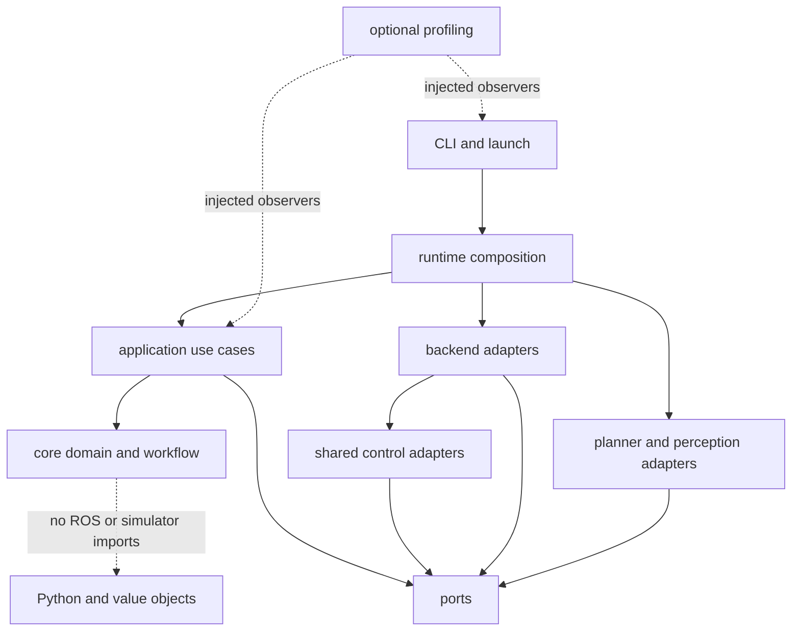
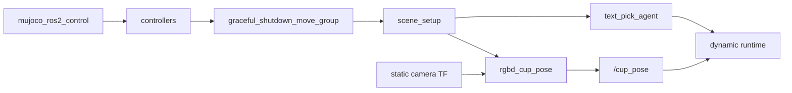
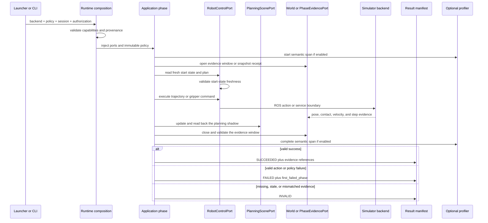

# SO-101 Python pick-place architecture

This document describes the current structure, dependency direction, and
runtime semantics of `so101_demo_py`. The package has one control vocabulary,
while MuJoCo, Gazebo, ROS 2, model providers, and perception libraries remain
behind explicit adapters and launch compositions. The physical SO-101 boundary
stays fail closed.

The architecture now covers four related paths:

1. fixed-waypoint pick-place on MuJoCo or Gazebo;
2. dynamic pick-place from a fresh `/cup_pose`;
3. bounded natural-language planning followed by the dynamic MuJoCo runtime;
4. one-shot YOLO-Seg instance detection and RGB-D object localization.

Portable profiling observes the Text Agent path without gaining task or motion
authority.

## 1. Package identity and source layout

| Name | Current value | Responsibility |
|---|---|---|
| ROS package | `so101_demo_py` | Owner of ament resources, launch files, configuration, assets, and console scripts |
| Python namespace | `so101_demo` | Import root for application code |
| Python source root | `src/so101_demo_py/src/` | Maps directly to `so101_demo` |
| Package entry | `src/so101_demo_py/setup.py` | Installs resources and 21 console scripts |
| Package metadata | `src/so101_demo_py/package.xml` | Declares ROS 2 build and runtime dependencies |

`setup.py` uses `package_dir={python_package: "src"}`. For example,
`src/so101_demo_py/src/core/domain.py` is imported as
`so101_demo.core.domain`.

The package installs seven launch files:

- `so101_mujoco.launch.py`
- `so101_mujoco_pick_place.launch.py`
- `so101_mujoco_perception_pick_place.launch.py`
- `so101_mujoco_text_pick_agent.launch.py`
- `so101_mujoco_task_station.launch.py`
- `so101_gazebo.launch.py`
- `so101_gazebo_pick_place.launch.py`

Each launch file selects its backend and ownership model explicitly. The
runtime never searches for an available simulator and switches to it. This
keeps the backend, policy, model, installed prefix, process ownership, and
evidence authority stable for the whole run.

## 2. Layers and dependency direction



Dependencies point inward:

1. `core/` owns stable values and deterministic rules. It does not import ROS,
   MoveIt, MuJoCo, Gazebo, model SDKs, or Ultralytics.
2. `ports/` defines capability boundaries with Protocols and immutable values.
3. `application/` coordinates use cases through core values and injected ports.
4. `control/`, `backends/`, and `adapters/` implement those ports.
5. `runtime/` is the composition root. It binds the backend, policy, adapters,
   launch ownership, capabilities, and provenance.
6. `cli/` and `launch/` parse input and construct process graphs. They do not
   own motion policy.
7. `profiling/` is optional and injected. A disabled profiler is represented by
   `None`, so the business objects remain unchanged.

Import-boundary and composition tests reject ROS or simulator types that leak
into the core.

## 3. Core contracts

### 3.1 Motion domain and workflow

`src/core/domain.py` defines the vocabulary shared by both simulators:

- `State` covers preparation, approach, grasp verification, transport, release,
  recovery, and terminal states.
- `RunMode` distinguishes `dry_run`, `plan_only`, and `execute`.
- `ActionStatus` and `ActionResult` describe a single action.
- `FailureCategory` and `Failure` normalize configuration, observation,
  planning, execution, collision, TF, gripper, and scene failures.
- `RunStatus` and `ExecutionRunStatus` keep state-machine completion separate
  from the externally reported execution class.

`src/core/workflow.py` contains the explicit transition table. Every
nonterminal state has a success and failure destination. Failures enter bounded
recovery instead of continuing from an unknown state. `VALIDATION_FAILED` can
be crossed only through the explicit `force_continue` path.

`src/core/runner.py` provides the ROS-free runner and checkpoint contract. A
checkpoint records the run identity, sequence, phase, original failure, next
state, policy bundle hash, and simulation session. Resume compares current TCP,
joint, gripper, Planning Scene, simulator pose, and contact state before any
side effect. Session, policy, or world mismatches fail closed.

### 3.2 Policies and physical outcomes

`src/core/policy.py` parses action parameters into `TaskPolicy`.
`src/core/policy_registry.py` accepts only a complete
`policy_id/version/backend` variant and checks its manifest and hash:

```text
config/policies/<policy-id>/<version>/<backend>.yaml
```

MuJoCo and Gazebo may have different variants. A qualified MuJoCo policy cannot
be overwritten with a Gazebo tuning change without a new, explicit variant or
version.

`contact_policy.py`, `grasp_outcome.py`, and `outcome.py` keep controller or
action success separate from physical success. Contact, support, velocity,
pose envelopes, release epochs, and consecutive samples determine whether the
cup was lifted, carried, released, and left in a valid final pose.

### 3.3 Task-command contracts

The natural-language layer uses closed values from `core/task_command.py` and
`core/planner_outcome.py`. A provider can return a proposal, an ambiguous
outcome, or an unsupported outcome. It cannot add a new backend, capability,
action, or execution mode.

`TaskCommand` validation happens before dispatch. The confirmation digest binds
the normalized instruction, command, capability, provider, and model. A request
ID can be claimed only once by one `TextAgent` instance.

### 3.4 Detection contracts

`src/core/detection.py` defines model-independent values:

- `DetectionFrame` owns one RGB image and its source identity.
- `DetectionQuery` names the requested class.
- `DetectionCandidate` binds class, confidence, bounding box, instance mask,
  source stamp, frame, and image dimensions.
- `DetectionBatch` records model identity, weights SHA256, device, latency, and
  all candidates.
- `LocalizedObject` records the selected world-frame cloud and center.

NumPy arrays are copied into owned, read-only values at the core boundary. The
core does not import `torch` or `ultralytics`.

## 4. Ports

| Port | Source | Responsibility |
|---|---|---|
| `RobotControlPort` | `src/ports/robot_control.py` | Joint and TCP planning, execution, gripper, stop, and fresh joint state |
| `PlanningScenePort` | `src/ports/planning_scene.py` | World objects, planning shadows, pose synchronization, and temporary ACM updates |
| `Reset*Port` | `src/ports/reset.py` | Transactional observation, cancellation, scene, robot, and final reset verification |
| `WorldPort` | `src/ports/world.py` | Atomic snapshots, snapshot receipts, and reset-epoch receipts |
| `LifecyclePort` | `src/ports/lifecycle.py` | Readiness, pause, shutdown, and lifecycle ownership |
| `PhaseEvidencePort` | `src/ports/phase_evidence.py` | Opens and closes phase evidence windows |
| evidence values | `src/ports/evidence.py` | Immutable pose, contact, velocity, session, and sequence evidence |
| capabilities | `src/ports/capabilities.py` | Declares what a backend can prove before execute or qualification |
| `PlannerPort` | `src/ports/task_planner.py` | Converts an instruction into a provider result without dispatch authority |
| `PickPlaceExecutorPort` | `src/ports/pick_place_executor.py` | Starts the allowed runtime with explicit execution provenance |
| `DetectorPort` | `src/ports/object_detector.py` | Maps one detection frame and query to a model-independent batch |

Capabilities are explicit values. The runtime does not use `hasattr` or a failed
call to guess what a backend supports.

| Capability | MuJoCo | Gazebo | real stub |
|---|---:|---:|---:|
| Atomic snapshot | Yes | No | No |
| Snapshot with receipt | Yes | Yes | No |
| Reset epoch | Yes | Yes | No |
| Pause | Yes | No | No |
| Viewer or GUI camera preset | Yes | Yes | No |
| Physical contact force | Yes | Yes | No |
| Lossless physics-step trace | Yes | No | No |

`CapabilityRequirements.mujoco_qualification()` requires the lossless trace in
addition to ordinary execute capabilities. A valid Gazebo run can report
`SUCCEEDED`, but it cannot be relabeled as a MuJoCo qualification result.

## 5. Application use cases

### 5.1 Backend execution and MuJoCo qualification

`src/application/backend_execute.py` converts a backend `ExecuteBoundary` into
a stable `RunResultManifest`. Action status and evidence validity are separate:

- invalid evidence produces `INVALID`;
- valid evidence with an action failure produces `FAILED` and keeps
  `first_failed_phase`;
- valid evidence with action success produces `SUCCEEDED`;
- only an additional qualification gate can produce `QUALIFIED`.

`src/application/phases/` expresses staged approach, contact hold, micro lift,
transport, descend, place alignment, release settle, and retreat through ports.

`src/application/pick_place.py` owns the physically validated MuJoCo sequence:

```text
staged_approach -> contact_hold -> micro_lift -> policy_lift_waypoint1
-> remaining_lift -> transport -> descend -> place_alignment -> release_retreat
```

Adapters under `src/backends/mujoco/qualified_phases/` write independent phase
evidence. The application checks expected status, simulation session, reset
epoch, policy fingerprint, and contact fingerprint. A nonzero child status,
missing evidence, status mismatch, or provenance mismatch stops the sequence at
that phase.

`src/application/qualification.py` keeps `FULL_RESTART` and `RESET_WORLD`
batches separate. Results from different lifecycle classes never share a
denominator.

### 5.2 Dynamic RGB-D pick-place

The current integrated RGB-D path is:

```text
/task_camera/{camera_info,color,depth}
  -> exact-stamp synchronization
  -> cup estimation in the camera frame
  -> exact-stamp tf2 lookup
  -> source-stamped world /cup_pose
  -> freeze one fresh sample
  -> dynamic target policy and 5-DoF IK
  -> MoveIt planning and controller execution
  -> simulator and Planning Scene evidence
```

The integrated perception launch selects either the resident
`rgbd_cup_pose` color-geometry producer or the one-shot `rgbd_object_pose`
YOLO-Seg producer. The dynamic runtime subscribes before the launch accepts the
pose, so a volatile sample published before readiness is not treated as a
current request. A supplied `/cup_pose` is an input claim, not proof that
perception, planning, motion, or physical placement succeeded.

### 5.3 Text Pick Agent

`src/application/text_agent.py` coordinates the model-facing path:

```text
instruction
  -> PlannerPort
  -> planner outcome and TaskCommand validation
  -> allowlisted TaskDispatcher resolution
  -> preview digest or explicit confirmation bypass
  -> backend and dual-execute checks
  -> one-time request claim
  -> PickPlaceExecutorPort
  -> dynamic MuJoCo runtime
```

DeepSeek is the primary provider in the current CLI configuration. The planner
chain can try local Ollama with `qwen3.5:4b` once after a provider failure. The
result records the selected provider, model, latency, token counts, cache-hit
tokens, and whether fallback was used.

The model proposes intent only. Python owns schema validation, capability
selection, the MuJoCo-only execution boundary, confirmation, request claiming,
runtime provenance, and dispatch. `skip_confirmation` removes human review of
the digest; it does not weaken any of the deterministic checks.

### 5.4 YOLO-Seg object pose

The one-shot object path is available as a standalone executable and as the
`yolo_seg` backend of `so101_mujoco_perception_pick_place.launch.py`. It remains
separate from the current Text Agent launch:

```text
fresh aligned RGB-D
  -> DetectorPort
  -> all YOLO-Seg candidates and masks
  -> TargetSelector
  -> selected-mask point cloud
  -> outlier and cluster filtering
  -> exact source-stamp world transform
  -> /cup_pose + detections + overlay + request evidence
```

`TargetSelector` accepts exactly one matching `plastic_cup` candidate above the
configured threshold. Zero matches return `TARGET_NOT_FOUND`; multiple matches
return `TARGET_AMBIGUOUS`. The application does not choose the highest score to
hide ambiguity.

`detect_once()` writes detection evidence before selection, then writes the
selected mask, world-frame cloud, and result. It publishes the pose only after
the required artifacts exist. Failure results keep the candidate count, model
identity, weights hash, device, and latency when those values are available.

## 6. Shared control

`src/control/robot_control.py` implements `RobotControlPort` through injected
callables:

- it reads a fresh joint state before planning;
- joint and TCP planners receive the request and explicit start state;
- it reads state again before execution and rejects a stale plan when the start
  state exceeds tolerance;
- gripper and stop use the same injected boundary and do not depend on a
  simulator type.

ROS-specific clients are split by responsibility:

- `control/moveit/` handles planning requests, robot state, and MoveIt clients;
- `control/trajectory/` handles planning, execution, calibration, and endpoint
  evidence;
- `control/gripper/` owns the gripper action client;
- `control/planning_scene/` owns collision objects, ACM updates, planning
  shadows, and read-back.

Shared control means that the contract and safety checks are reused. It does not
require both simulators to use the same topics, reset services, or evidence
sources.

## 7. Backend adapters

### 7.1 MuJoCo

`src/backends/mujoco/` provides:

- atomic world observation and receipts;
- lossless phase and transport evidence;
- pause, reset epochs, and feedback convergence;
- fork service clients;
- viewer camera control;
- physically validated phase adapters.

The pinned fork publishes authoritative evidence after each successful physics
step while holding the simulation mutex. This is why MuJoCo can satisfy the
qualification capability set. Planning Scene attachment remains a MoveIt
collision-planning shadow. Cup pose, support, velocity, and contact establish
the physical result.

### 7.2 Gazebo

`src/backends/gazebo/` implements world observation, lifecycle, reset, camera,
transport, and runtime SDF materialization. Its bounded execute path waits for
joint state, Gazebo state, controllers, and MoveIt before running the complete
approach, grasp, attach, transport, place, detach, and retreat sequence.

Gazebo writes `gazebo-execute-evidence.json` and a standard result manifest. A
valid success is `SUCCEEDED/NOT_QUALIFIED`; an action failure is
`FAILED/NOT_QUALIFIED` at the observed phase. Evidence-infrastructure failure is
`INVALID`.

`assets/common/geometry-manifest.yaml` is the common contract for table,
pedestal, and plastic-cup geometry. Gazebo SDF materialization and the MoveIt
builder consume the same IDs, dimensions, local and world poses, colors, and
primitive counts.

### 7.3 Real stub

`src/backends/real_stub/backend.py` implements the port shapes but returns
`REJECTED / REAL_HARDWARE_NOT_CONFIGURED` for every operation. It performs no
device discovery, serial or socket access, publisher or client creation,
planning, execution, gripper command, reset, stop, or recovery. There is no real
launcher.

## 8. Planner and perception adapters

`src/adapters/planner/` isolates provider transport and structured-output
handling from the application. Provider errors are translated to
`PlannerProviderError`; provider responses still pass through the closed core
schema before they can reach dispatch.

`src/adapters/perception/yolo_seg.py` isolates Ultralytics and PyTorch behind
`DetectorPort`. It verifies that weights are a regular file with the expected
SHA256 digest. Device selection is explicit:

- `cuda` and `mps` fail if the requested accelerator is unavailable;
- `cpu` is accepted only when requested;
- `auto` prefers CUDA, then MPS, and uses CPU only with explicit fallback
  authorization.

The adapter warms the model once, preserves every returned instance mask, and
converts the result into core detection values. The dataset and training tools
under `adapters/perception/` generate synthetic labels and run the pinned
YOLO-Seg training workflow. Synthetic MuJoCo identity is a training and
evaluation source, not a production `/cup_pose` or runtime perception input.

## 9. Runtime composition and launch ownership

`src/runtime/composition.py` is the backend composition point. It receives the
backend, policy identity, package share, source commit, and installed prefix;
checks declared capabilities; loads the policy variant; injects adapters; and
builds the provenance bundle.

`src/runtime/launch_composition.py` constructs the public process graphs:

| Launch file | Owned graph | Safe boundary |
|---|---|---|
| `so101_mujoco.launch.py` | MuJoCo, controllers, MoveIt, and scene setup | Stack readiness only |
| `so101_mujoco_pick_place.launch.py` | MuJoCo stack plus fixed workflow | `run_mode:=dry_run execute:=false` |
| `so101_mujoco_perception_pick_place.launch.py` | MuJoCo stack, camera TF, selectable `color_geometry` or `yolo_seg` perception, and dynamic workflow | Live path requires dual execute authorization |
| `so101_mujoco_text_pick_agent.launch.py` | MuJoCo stack, camera TF, `rgbd_cup_pose`, Text Agent, and dynamic workflow | Requires `run_mode:=execute execute:=true skip_confirmation:=true` |
| `so101_mujoco_task_station.launch.py` | Persistent visible MuJoCo stack and optional Teleop | One owner for repeated `RESET_WORLD` tasks |
| `so101_gazebo.launch.py` | Gazebo, bridge, controllers, MoveIt, and scene setup | Stack readiness only |
| `so101_gazebo_pick_place.launch.py` | Gazebo stack plus fixed workflow | Functional execution, never MuJoCo qualification |

The Text Agent process graph is:



The launch owner starts the dynamic consumer before accepting a pose and starts
perception only after scene setup succeeds. A required long-lived component
that exits early fails the owned workflow. DeepSeek and Ollama remain external
services; the launch inherits their configuration but does not own their
lifecycle.

`runtime/provenance.py` records source and install identity.
`runtime/result_manifest.py` uses atomic rename for `so101-run-result-v1`, which
includes backend, session, reset epoch, source commit, installed prefix, policy
and bundle hashes, first failed phase, failure category, and evidence references.

## 10. Portable profiling and Linux system tracing

Profiling is exposed on `so101_mujoco_text_pick_agent.launch.py` through three
launch arguments:

- `profiling:=off|summary|trace`
- `profiling_output_root:=<absolute-path>`
- `profiling_require_system_trace:=true|false`

| Mode | Semantic JSONL | `summary.json` | `trace.json` | Linux system trace |
|---|---:|---:|---:|---:|
| `off` | No | No | No | No |
| `summary` | Yes | Yes | No | No |
| `trace` | Yes | Yes | Yes | Attempted when available |

The off path resolves to `None`. It does not add child arguments, wrappers,
clocks, output directories, ROS entities, or a `Trace` action. The package has a
benchmark that compares this disabled path with direct calls.

Enabled profiling uses `SemanticProfiler` to append process-local JSONL events.
Each stream records a wall-clock anchor and monotonic timestamps, so events from
launch, perception, the Text Agent, and the dynamic runtime can be placed on one
timeline. Events also include the session, request, process role, PID, thread,
sequence, source commit, and installed prefix where applicable.

Representative span groups are:

- `launch.*` for total workflow, stack startup, and scene setup;
- `perception.*` for subscription matching, first callbacks, common source
  stamp, pose estimation, TF, and total perception time;
- `agent.*` for input validation, provider planning, command validation,
  dispatch, and total request time;
- `runtime.*` for setup, state actions, executor dispatch, and cleanup.

The RGB-D discovery milestones start at the same subscription-creation boundary
and end at distinct cumulative conditions:

```text
perception.wait_all_subscriptions_matched
perception.wait_all_first_callbacks
perception.wait_common_stamp
```

They are cumulative and must not be added together. Differences between adjacent
milestones separate endpoint matching, first message delivery, and exact-stamp
alignment.

At launch shutdown, `finalize_profiling()` validates stream schemas and sessions,
then writes:

```text
<run-session-root>/profiling/
├── processes/*.events.jsonl
├── manifest.json
├── summary.json
├── trace.json                 # trace mode only
└── ros2-tracing/              # Linux CTF when available
```

An explicit `profiling_output_root` must remain under the registered run evidence
root and cannot be a symlink. Existing output is not overwritten.

On Linux, trace mode can construct `tracetools_launch.action.Trace` and write
LTTng CTF. If `profiling_require_system_trace:=true`, an unavailable system
backend fails the request. With `false`, portable profiling remains valid and
the manifest records the unavailable backend. macOS always uses the portable
layer and does not attempt to start LTTng.

Profiling measures boundaries. It does not prove a grasp, authorize motion,
replace the result manifest, or make incomplete physical evidence valid.

## 11. Execution and evidence flow



Simulator physics and the MoveIt Planning Scene have different ownership.
Planning Scene attach or detach success does not prove that the simulated cup is
held or released. Simulator contact and pose do not prove that MoveIt collision
state is synchronized. Both sides require read-back.

## 12. CLI surface

`setup.py` installs 21 console scripts in three groups.

Workflow and orchestration:

- `fixed_cup_pick_place`
- `dynamic_cup_pick_place`
- `run_qualification`
- `gazebo_execute`
- `so101_mujoco_perception_pick_place`
- `teleop_workflow`
- `so101_mujoco_rgbd_batch`
- `text_pick_agent`

Perception, data, and ROS interfaces:

- `cup_pose_subscriber`
- `cup_pose_tf_demo`
- `rgbd_point_cloud`
- `rgbd_cup_pose`
- `rgbd_object_pose`
- `generate_yolo_seg_dataset`
- `train_yolo_seg`
- `rgbd_sensor_capture`

Operator, reset, and diagnostics:

- `scene_setup`
- `motion_stack_ready`
- `camera_preset`
- `teleop_reset`
- `task_reachability`

The CLI parses inputs and returns stable status. Business decisions remain in
core, application, and runtime code. Launch composition owns process order,
readiness, and shutdown.

## 13. Physical SO-101 extension rules

A real implementation must add `backends/real/` and a separate launcher. It
must not modify core state meanings or allow SDK and serial types into ports.
A safe progression is:

1. Implement read-only identity, joint, fault, emergency-stop, temperature, and
   voltage observation while all motion capabilities remain false.
2. Add MoveIt plan-only support with real joint limits. Execution, gripper, and
   reset continue to reject requests.
3. After a separate safety review, add low-speed bounded segments, fresh start
   state checks, joint, velocity, and effort limits, watchdogs, cancellation,
   deterministic stop, and operator enable.
4. Keep physical gripper feedback, perceived object pose, and MoveIt planning
   shadows separate.
5. Map real camera, force, or current sensors into a new evidence adapter and
   calibrate new thresholds. Simulation policy qualification does not transfer.
6. Define real lifecycle, recovery, evidence retention, and operator
   authorization independently from simulation batches.

At minimum, a real adapter must preserve explicit backend selection, independent
human motion authorization, fresh state checks before execution, deterministic
stop on timeout or fault, first-class recovery ports, and complete hardware and
operator provenance.

## 14. Architecture acceptance checklist

When the control or perception chain changes, verify that:

- core still imports and tests without ROS, simulator, provider, or ML runtime;
- ports expose no simulator, provider SDK, or Ultralytics types;
- backend selection and launch ownership remain explicit;
- policy variants match their manifests and protected MuJoCo bytes are unchanged;
- Gazebo keeps the observed `first_failed_phase` and never reports MuJoCo
  qualification;
- MuJoCo phase evidence keeps session, epoch, step, and sequence continuity;
- Planning Scene state and simulator truth are read back separately;
- Text Agent validation, confirmation, request claiming, provenance, and
  allowlisted dispatch remain deterministic;
- object detection keeps every candidate and fails closed for zero or multiple
  matches;
- weights identity, source stamp, TF stamp, artifacts, and published pose refer
  to the same perception request;
- profiling off remains free of profiling objects and output, while enabled
  profiles keep session and process completeness checks;
- the real stub still performs zero I/O, has no launcher, and rejects every
  operation;
- result manifests record source, install, policy, bundle, and evidence
  provenance;
- a fresh install exposes the documented packages, executables, launch files,
  configuration, and assets from the selected prefix.
