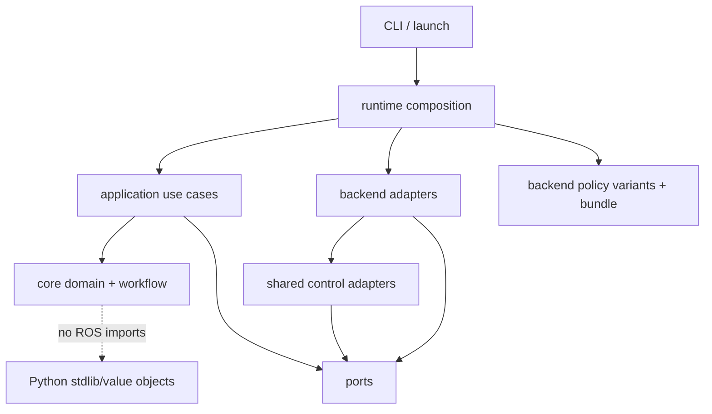
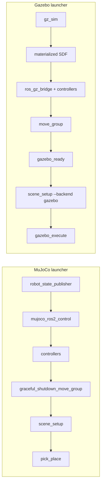
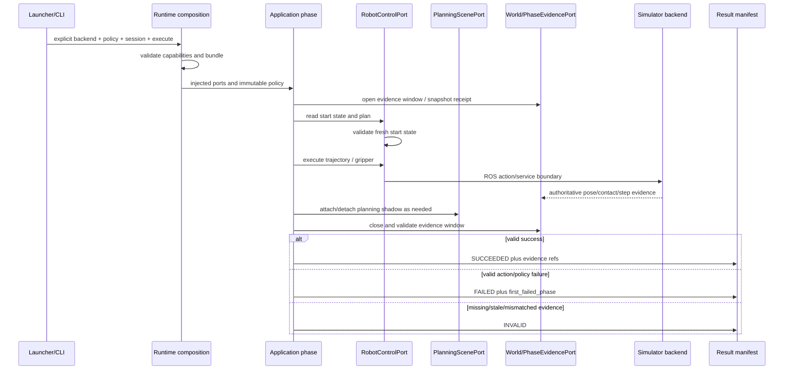

# SO-101 Python Pick-Place 架构

本文描述 `so101_demo_py` 当前代码的结构、依赖方向和运行语义。它的核心设计是：控制意图与
结果模型只有一套，MuJoCo/Gazebo 的仿真细节留在 adapter 和显式 launcher 中；未来接入真实
SO-101 时实现同一组 ports，但在安全设计通过前始终 fail closed。

## 1. 包与源码布局

| 名称 | 当前值 | 作用 |
|---|---|---|
| ROS package | `so101_demo_py` | ament index、launch、config、assets、console scripts 的 owner |
| Python namespace | `so101_demo` | 业务代码的 import 根 |
| Python source root | `src/so101_demo_py/src/` | 直接映射到 `so101_demo`，不再嵌套同名目录 |
| package entry | `src/so101_demo_py/setup.py` | 声明 resources 与七个 console scripts |
| package metadata | `src/so101_demo_py/package.xml` | ROS 2 runtime/build dependencies |

`setup.py` 使用 `package_dir={python_package: "src"}`，因此文件
`src/so101_demo_py/src/core/domain.py` 的 import 是 `so101_demo.core.domain`。

四个 launcher 强制调用方选择后端：

- `so101_mujoco.launch.py`：MuJoCo 栈，不自动执行任务；
- `so101_mujoco_pick_place.launch.py`：MuJoCo 栈加 pick-place；
- `so101_gazebo.launch.py`：Gazebo 栈，不自动执行任务；
- `so101_gazebo_pick_place.launch.py`：Gazebo 栈加 bounded execute。

不存在“自动选择可用 simulator”的 fallback。这个约束保证一次结果的 backend、policy、模型、
install prefix 和 evidence authority 不会在运行中漂移。

## 2. 分层与依赖方向



允许的依赖方向是外层指向内层：

1. `core/` 不知道 ROS、MuJoCo、Gazebo、MoveIt concrete client；
2. `ports/` 用 Protocol 和 immutable data class 定义能力边界；
3. `application/` 编排用例，只依赖 core/ports 和注入的能力；
4. `control/`、`backends/` 实现 ports，封装 ROS/client/simulator 差异；
5. `runtime/` 是唯一 composition root，绑定 backend、policy、adapter、capability 和 provenance；
6. `cli/`、`launch/` 只解析输入和构建进程图，不拥有控制规则。

测试 `test_core_import_boundaries.py`、`test_runtime_composition.py` 和 contracts tests 用来防止
simulator/ROS 类型反向渗入 core。

## 3. Core：统一控制语义

### 3.1 Domain model

`src/core/domain.py` 定义稳定的跨后端词汇：

- `State`：从 `IDLE`、预开夹爪、接近、下降、抓取验证、搬运、释放到恢复和终态；
- `RunMode`：`dry_run`、`plan_only`、`execute`；
- `ActionStatus` / `ActionResult`：单动作结果；
- `FailureCategory` / `Failure`：配置、观测、规划、执行、碰撞、TF、gripper、scene 等失败；
- `RunStatus` 与 `ExecutionRunStatus`：状态机结果和对外运行分类分开。

后端必须把自己的错误翻译到这套模型，而不是让 Gazebo error code、MuJoCo struct 或 ROS action
result 成为 application 的公共 API。

### 3.2 Workflow 与 runner

`src/core/workflow.py` 是显式状态转移表。每个非终态有成功/失败两个 destination；失败路径会进入
有界 recovery，而不是从中间状态静默继续。`VALIDATION_FAILED` 只有在显式
`force_continue` 时才允许越过。

`src/core/runner.py` 提供 ROS-free 的 deterministic runner、checkpoint schema 与 resume 校验：

- checkpoint 原子写入，含 run ID、sequence、phase、原失败、下一个状态；
- 保存 policy bundle hash 和 simulation session ID；
- resume 时比较 TCP、joint、gripper、MoveIt world/attachment、simulator object pose/contact；
- 任何 session、policy 或 world mismatch 都 fail closed；
- dry-run/plan-only/single-step 与 live execute 共享结果语义，但不会混成资格证据。

### 3.3 Policy 与 outcome

`src/core/policy.py` 把动作参数解析成 `TaskPolicy`；`src/core/policy_registry.py` 只接受完整的
`policy_id/version/backend` variant，并验证 manifest/hash。policy 文件位于：

```text
config/policies/<policy-id>/<version>/<backend>.yaml
```

MuJoCo 与 Gazebo 可以有不同 variant；当前 `light_cup_wall_pick/v1` 两个 simulator variant
字节相同，是受保护的合格基线。以后调 Gazebo policy 应创建清晰的新版本或独立 variant，不能
覆盖 MuJoCo 合格字节。

`core/contact_policy.py`、`core/grasp_outcome.py` 和 `core/outcome.py` 把“动作返回成功”与“杯子
真的被抓起并稳定放下”分开：接触、支撑、速度、pose envelope、release epoch 和连续采样窗口
共同决定物理结果。

## 4. Ports：后端必须提供的能力

| Port | 文件 | 关键职责 |
|---|---|---|
| `RobotControlPort` | `src/ports/robot_control.py` | joint/TCP plan、execute、gripper、stop、fresh joint state |
| `PlanningScenePort` | `src/ports/planning_scene.py` | world object、attach/detach shadow、pose sync、临时 ACM |
| `Reset*Port` | `src/ports/reset.py` | backend-neutral 事务 reset 的观测、取消、scene、robot 与最终验证边界 |
| `WorldPort` | `src/ports/world.py` | 原子 world snapshot、带 receipt 的 snapshot、reset epoch receipt |
| `LifecyclePort` | `src/ports/lifecycle.py` | readiness、pause、shutdown 等生命周期控制 |
| `PhaseEvidencePort` | `src/ports/phase_evidence.py` | 开始/完成 phase evidence window |
| evidence types | `src/ports/evidence.py` | pose/contact/velocity/session/sequence 等不可变证据值 |
| capabilities | `src/ports/capabilities.py` | 后端能力声明与 execute/qualification 前置校验 |

能力是显式值，不靠 `hasattr` 或“调用失败后再猜”。当前 composition 声明：

| 能力 | MuJoCo | Gazebo | real stub |
|---|---:|---:|---:|
| atomic snapshot | 是 | 否 | 否 |
| snapshot with receipt | 是 | 是 | 否 |
| reset epoch | 是 | 是 | 否 |
| pause | 是 | 否 | 否 |
| viewer/GUI camera preset | 是 | 是 | 否 |
| physical contact force | 是 | 是 | 否 |
| lossless physics-step trace | 是 | 否 | 否 |

`CapabilityRequirements.mujoco_qualification()` 除基本 execute 能力外还要求 lossless trace，
因此 Gazebo 的正常执行失败不会被误标为资格化结果。

## 5. Application：用例编排

Application 层分成两类执行路径。

### 5.1 通用结果与控制阶段

`src/application/backend_execute.py` 把任一后端的 `ExecuteBoundary` 转成稳定的
`RunResultManifest`。证据有效性和动作成功是两个正交维度：

- evidence 无效 → `INVALID`；
- evidence 有效且动作失败 → `FAILED`，保留 `first_failed_phase`；
- evidence 有效且动作成功 → `SUCCEEDED`；
- 只有额外通过 qualification gate 才是 `QUALIFIED`。

`src/application/phases/` 以 ports 表达 staged approach、contact hold、micro lift、transport、
descend、place alignment 和 release-retreat 等阶段。`staged_approach.py`、
`place_alignment.py`、`release_settle.py` 等模块提供可组合的细分 use case。

### 5.2 MuJoCo qualified workflow

`src/application/pick_place.py` 是当前物理验证过的 MuJoCo production orchestration。它按顺序运行：

```text
staged_approach → contact_hold → micro_lift → policy_lift_waypoint1
→ remaining_lift → transport → descend → place_alignment → release_retreat
```

每个阶段由 `src/backends/mujoco/qualified_phases/` 的 adapter 产生独立 evidence JSON，application
逐项验证 expected status、simulation session、reset epoch 和 policy/contact fingerprint。任何阶段
subprocess 非零、证据缺失、status 不符或 provenance 不一致都会在当阶段停止，并写完整 manifest。

`src/application/qualification.py` 在更外层管理 `FULL_RESTART` 与 `RESET_WORLD` 两种 batch。
它区分 `SUCCESS`、`VALID_FAILURE`、`INVALID`，要求 artifact hashes、物理 outcome 和 clean
shutdown，且不同 lifecycle 不混计。

## 6. Shared control

`src/control/robot_control.py` 的 `SharedRobotControl` 是注入式 `RobotControlPort` 实现：

- 在 plan 前读取 fresh joint state；
- joint/TCP planner 只接收 port request 与 start state；
- execute 前再次读状态，超过 start-state tolerance 就拒绝旧 plan；
- gripper 与 stop 也是注入 callable，不绑定具体 simulator。

具体 ROS 能力拆在：

- `control/moveit/`：motion-plan request、robot state、MoveIt client；
- `control/trajectory/`：trajectory planner/executor、calibration 和执行证据；
- `control/gripper/`：夹爪 action client；
- `control/planning_scene/`：collision objects、ACM、attach/detach shadow 与 read-back。

这里的“shared”表示控制合同与 safety check 复用，不表示两个仿真器必须使用相同通信 topic、
reset service 或证据来源。

## 7. Backend adapters

### 7.1 MuJoCo

`src/backends/mujoco/` 提供：

- `world.py` / `observer.py`：读取原子 simulation evidence；
- `phase_evidence.py` / `transport_observer.py`：逐 physics-step 窗口与搬运连续性；
- `lifecycle.py` / `reset.py`：pause、reset epoch、feedback convergence；
- `client.py`：fork services；
- `camera_presets.py` / `viewer.py`：viewer camera；
- `qualified_phases/`：经过物理验证的九阶段 live adapter。

MuJoCo 是资格后端，因为 fork r6 能在每个成功 physics step 后、simulation mutex 内提供
authoritative hook。Planning Scene attachment 只供 MoveIt 碰撞规划；抓取成立仍由杯子的真实接触、
pose、速度和支撑证据证明。

### 7.2 Gazebo

`src/backends/gazebo/` 提供 world/observer/lifecycle/reset/camera/transport adapter 和 runtime SDF
materialization。`execute.py` 执行完整的有界策略链：

1. 等待 joint state、Gazebo pose/stats、arm/gripper controller 与 MoveIt readiness；
2. 执行 `PREPARE_OPEN_GRIPPER`；
3. 依次执行 approach、grasp、attach、lift、transport、place、detach、retreat 全部阶段；
4. 写 `gazebo-execute-evidence.json` 和统一 result manifest；
5. 失败时报告当前 phase 与真实 error code。

成功返回 `SUCCEEDED/NOT_QUALIFIED`；任何有效产品失败在实际首个失败阶段返回
`FAILED/NOT_QUALIFIED`，只有证据基础设施本身失败才是 `INVALID`。Gazebo 不被默认拒绝、不被
跳过，也不作为 MuJoCo 五连胜的 RED→GREEN 门。

`assets/common/geometry-manifest.yaml` 是 table、pedestal、plastic_cup 的唯一几何合同；MoveIt
builder 与 Gazebo SDF parity test 共同约束 ID、尺寸、局部/世界 6D pose、颜色和 `1/1/13` primitive
counts。公共 `scene_setup`、`camera_preset`、`teleop_reset` CLI 以 `--backend mujoco|gazebo` 分派，
Gazebo adapter 独立实现，不读取或调用 C++ demo 的 executable/config。

Gazebo reset 由 application 的十三阶段 transaction 编排。任何阶段失败都会停止后续动作，并输出
稳定 phase、failure code 与累积 evidence；只有杯子 Gazebo/Planning Scene pose 与 attachment、world
membership、`1/1/13`、controller、joint position/velocity 和 TF 全部收敛才提交成功 receipt。

### 7.3 Real stub

`src/backends/real_stub/backend.py` 实现 ports 的同形方法，但全部返回
`REJECTED / REAL_HARDWARE_NOT_CONFIGURED`。它不 discovery 设备、不打开 serial/socket、不创建
硬件 publisher/client、不 plan 或 execute，也没有 real launcher。这是未来扩展 seam，不是隐藏的
实机开关。

## 8. Runtime composition 与启动图

`src/runtime/composition.py` 是唯一 backend composition point：

1. 接收明确的 backend、policy ID/version、package share、source commit 和 installed prefix；
2. 读取 backend capability；
3. 加载严格的 policy variant；
4. 注入 `BackendAdapters`；
5. lossless backend 缺 phase-evidence adapter 时拒绝 composition；
6. 生成包含 source/install/policy/runtime inputs 的 qualification bundle。

`src/runtime/launch_composition.py` 构建两套显式进程图：



共同 launch 参数包括 `run_mode`、`execute`、`headless`、policy ID/version、session ID、
evidence file 和 readiness timeout。只有 `run_mode:=execute execute:=true` 同时成立才会进入 live
路径；backend 由具体 launcher 固定。

`src/runtime/provenance.py` 计算 bundle；`src/runtime/result_manifest.py` 以原子 rename 写稳定的
`so101-run-result-v1`，字段含 backend、session、reset epoch、source commit、installed prefix、
policy/bundle SHA、first failed phase、failure category 和 evidence refs。

## 9. 一次 execute 的控制与证据流



“物理世界”和“规划 shadow”必须分别 read back。attach/detach API 成功只说明 MoveIt scene 更新，
不能替代 simulator object pose/contact；同理 simulator 中杯子被抓住也不代表 MoveIt collision world
已经同步。

## 10. CLI 面

`setup.py` 安装以下 entry points：

| Executable | 用途 |
|---|---|
| `pick_place` | dry-run/plan/checkpoint 与 MuJoCo qualified live workflow |
| `run_qualification` | 生命周期隔离的重复性资格化 |
| `scene_setup` | MuJoCo Planning Scene 初始化 |
| `gazebo_execute` | Gazebo bounded execute 与真实失败报告 |
| `camera_preset` | MuJoCo viewer camera |
| `teleop_reset` | MuJoCo transactional reset owner |
| `teleop_workflow` | Teleop 调用的 MuJoCo qualified workflow owner |

CLI 只接受参数并打印稳定状态。业务判断留在 core/application/runtime；launch 只负责进程顺序、
readiness delay 和失败时 shutdown。

## 11. 未来真实 SO-101 接入规则

真实机械臂接入应新增 `backends/real/` adapter 和独立 launcher，不修改 core 状态语义，也不让
serial/SDK 类型进入 ports。建议按以下顺序演进：

1. **Read-only adapter**：只实现 device identity、joint state、fault/e-stop/temperature/voltage
   read-back；所有 motion capability 仍 false。
2. **Plan-only**：接入 MoveIt planning 和 real joint limits，但 `execute`、gripper、reset 继续拒绝。
3. **Bounded motion**：在独立安全审批后实现低速单段执行、start-state freshness、joint/velocity/
   effort limits、watchdog、cancel/stop 和 operator enable。
4. **Gripper 与场景**：区分真实 gripper feedback、感知得到的物体 pose 与 MoveIt shadow；不得用
   attachment 假装真实抓取。
5. **Physical outcome**：把相机/力/电流等真实传感器映射为新的 evidence adapter，重新标定阈值；
   仿真 policy 不能未经验证直接获得 real qualification。
6. **独立资格化**：real lifecycle、failure taxonomy、e-stop/recovery、证据保留和 operator
   authorization 单独定义，不复用 simulator 五连胜结论。

Real adapter 至少要保持以下安全不变量：

- backend 必须显式选择，无环境探测 fallback；
- execute 需要独立的人类授权与硬件 enable，不由 `run_mode` 单一参数隐式开启；
- 每次 plan 执行前重新比较 fresh real joint state；
- command timeout、通信丢失、limit/fault 触发 deterministic stop；
- stop/recovery 是一级 port，不是 exception handler 里的 best effort；
- hardware identity、calibration、firmware、policy、source、operator 与 evidence 同时进入 manifest。

## 12. 架构验收清单

变更控制链时至少验证：

- core 仍可在无 ROS 环境导入和测试；
- ports 未泄露 simulator-specific message/type；
- backend selection 和 launcher 仍显式；
- policy variant 与 manifest hash 匹配，受保护的 MuJoCo v1 bytes 未变；
- Gazebo failure 仍保留真实 `first_failed_phase`，没有被 skip 或伪装成 qualification；
- MuJoCo phase evidence 保持 session/epoch/step/sequence 连续；
- Planning Scene 与 simulator truth 分层 read-back；
- real stub 仍零 I/O、无 launcher、全操作 fail closed；
- result manifest 完整记录 source/install/policy/bundle/evidence provenance；
- fresh install 后包、executables、launchers 和 assets 均从本次 prefix 解析。
