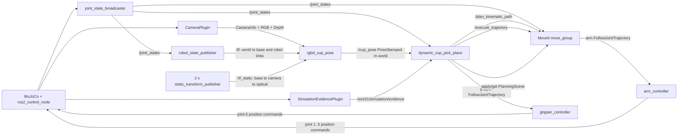

# SO-101 RGB-D 感知位置 PickPlace 教学与源码导读

**范围：** MuJoCo RGB-D 相机、点云分割、tf2、`/cup_pose`、MoveIt、ros2_control 与物理结果验证

**对象：** 已理解 Python 和 ROS 2 基础，希望能从源码复现“相机看到杯子后完成抓放”的开发者

**目标：** 理解并运行下面这条完整链路，而不是把杯子初始坐标直接写进抓取程序

```text
MuJoCo -> RGB-D -> 杯子点云 -> tf2 -> /cup_pose
       -> dynamic_cup_pick_place -> MoveIt -> controller -> MuJoCo
```

本文是 [`so101-dynamic-cup-pick-place-source-guide.md`](so101-dynamic-cup-pick-place-source-guide.md) 的上游配套教程：本文重点讲“图像如何变成 `world` 下的杯子 Pose”以及“一体化 launch 如何连接所有组件”；从 `/cup_pose` 推导抓取目标、5-DoF IK、状态机和物理抓取的细节继续阅读原导读。

## 1. 先建立整体直觉

这条链路解决的核心问题不是“机械臂能不能移动”，而是：

> 杯子换了位置以后，程序能否只依赖本轮 RGB-D 数据重新得到杯子位置，并让后面的规划与执行自动跟随？

完整数据流是：

1. MuJoCo 渲染同一时刻的彩色图、深度图和相机内参；
2. `rgbd_cup_pose` 按源时间戳把三条消息组成一帧；
3. 深度像素通过针孔相机模型反投影为相机光学坐标系中的三维点；
4. 颜色阈值选出橙色候选点，Open3D DBSCAN 选择最大的空间聚类；
5. tf2 在这帧图像的原始时间戳查询 `world <- task_camera_frame`；
6. 杯子点云变换到 `world` 后，在世界 XY 平面拟合杯子的圆心；
7. 生成 `geometry_msgs/msg/PoseStamped` 并发布到 `/cup_pose`；
8. `dynamic_cup_pick_place` 冻结第一条合法 Pose，计算抓取 TCP 目标；
9. MoveIt 规划轨迹，ros2_control controller 把轨迹写回 MuJoCo；
10. MuJoCo 物理证据和 MoveIt Planning Scene 分别验证杯子真的被搬运且场景状态一致。

最重要的边界是：

> `dynamic_cup_pick_place` 只接受 `world` frame；tf2 转换由上游 `rgbd_cup_pose` 在发布 `/cup_pose` 之前完成。

因此，下游状态机不需要知道相机安装姿态，也不会在输入 frame 错误时猜测一个转换。

## 2. 一体化 launch 实际启动了什么

公开入口有两种形式：

```bash
ros2 run so101_demo_py so101_mujoco_perception_pick_place ...
ros2 launch so101_demo_py so101_mujoco_perception_pick_place.launch.py ...
```

console script 注册在 [`setup.py`](../src/so101_demo_py/setup.py)。`ros2 run` 入口由 [`perception_pick_place_launch.py`](../src/so101_demo_py/src/cli/perception_pick_place_launch.py) 创建 `LaunchService`，并保留失败子进程的退出码；公开 launch 文件只是把工作委托给同一个 [`build_perception_pick_place_launch_description()`](../src/so101_demo_py/src/runtime/launch_composition.py)。

执行模式会启动以下组件：

| 组件 | 进程/节点 | 生命周期 | 作用 |
|---|---|---|---|
| MuJoCo + controller manager | `mujoco_ros2_control/ros2_control_node` | 长驻 | 加载 MJCF、推进物理、发布 `/clock`、承载相机和物理证据插件、连接 ros2_control 硬件接口 |
| Robot State Publisher | `robot_state_publisher` | 长驻 | 读取 URDF 和 `/joint_states`，发布机器人 `/tf` |
| Controller spawner × 3 | `controller_manager/spawner` | 成功后退出 | 激活 `joint_state_broadcaster`、`arm_controller`、`gripper_controller` |
| MoveIt | `so101_mujoco_support/graceful_shutdown_move_group` | 长驻 | 提供标准 MoveIt 规划、轨迹执行和 Planning Scene 接口，并绕开当前 Jazzy 二进制组合的已知关停析构崩溃 |
| Planning Scene 初始化 | `so101_demo_py/scene_setup` | 一次性 | 写入并回读桌子、底座和杯子的碰撞对象 |
| 静态 TF × 2 | `tf2_ros/static_transform_publisher` | 长驻 | 发布 `base -> camera_link -> task_camera_frame` |
| RGB-D 感知 | `so101_demo_py/rgbd_cup_pose` | 发布后等待统一关停 | 读取一帧有效 RGB-D，生成点云和 `world` 杯子 Pose，写感知证据 |
| 动态抓放 | `so101_demo_py/dynamic_cup_pick_place` | 一次任务 | 消费 `/cup_pose`，规划、执行并验证完整 pick-place |

组件清单的源码入口是 [`_mujoco_stack_actions()`](../src/so101_demo_py/src/runtime/launch_composition.py) 和 [`_mujoco_perception_execute_actions()`](../src/so101_demo_py/src/runtime/launch_composition.py)。

下面三个 executable **不会**被生产 launch 启动：

| executable | 定位 | 为什么不在生产图中 |
|---|---|---|
| `rgbd_point_cloud` | 一次性教学/调试工具 | 只输出相机 frame 点云和报告，不发布可供抓取使用的 `world` Pose |
| `cup_pose_tf_demo` | 通用 PoseStamped tf2 教学桥 | 生产感知直接转换整簇点云，再在 `world` XY 拟合圆，不需要先生成 camera-frame Pose |
| `mujoco_cup_pose_bridge` | 测试用 truth bridge | 直接把 MuJoCo 真值变成 `/cup_pose`，绕过 RGB-D，不能证明视觉链路 |

## 3. 组件之间如何通信

### 3.1 架构图



### 3.2 ROS 接口表

| 接口 | 类型 | 发布/提供方 | 消费方 | 用途 |
|---|---|---|---|---|
| `/clock` | `rosgraph_msgs/msg/Clock` | MuJoCo runtime | 所有 `use_sim_time` 节点 | 让图像、TF、Pose 和执行状态使用同一仿真时间 |
| `/task_camera/camera_info` | `sensor_msgs/msg/CameraInfo` | MuJoCo CameraPlugin | `rgbd_cup_pose` | 分辨率与内参矩阵 `K` |
| `/task_camera/color` | `sensor_msgs/msg/Image`，`rgb8` | MuJoCo CameraPlugin | `rgbd_cup_pose` | 橙色杯子的像素候选 |
| `/task_camera/depth` | `sensor_msgs/msg/Image`，`32FC1` | MuJoCo CameraPlugin | `rgbd_cup_pose` | 每个像素沿光轴方向的米制深度 |
| `/tf_static` | `tf2_msgs/msg/TFMessage` | 两个 static TF 节点、robot state publisher | tf2 Buffer、MoveIt | 固定相机外参和固定 `world -> base` 关系 |
| `/tf` | `tf2_msgs/msg/TFMessage` | robot state publisher | MoveIt、tf2 consumer | 随关节状态变化的机器人 link 变换 |
| `/cup_pose` | `geometry_msgs/msg/PoseStamped` | `rgbd_cup_pose` | `dynamic_cup_pick_place` | 带原始 RGB-D 时间戳的 `world` 杯子中心 |
| `/joint_states` | `sensor_msgs/msg/JointState` | joint state broadcaster | robot state publisher、MoveIt、动态执行器 | 实际关节状态、IK seed、执行终点检查 |
| `/plan_kinematic_path` | `moveit_msgs/srv/GetMotionPlan` | MoveIt | 动态执行器 | 对 IK 得到的关节目标做碰撞约束轨迹规划 |
| `/execute_trajectory` | `moveit_msgs/action/ExecuteTrajectory` | MoveIt | 动态执行器 | 执行 MoveIt 轨迹并取得结果 |
| `/arm_controller/follow_joint_trajectory` | `control_msgs/action/FollowJointTrajectory` | arm controller | MoveIt controller manager | 执行关节 1–5 的轨迹 |
| `/gripper_controller/follow_joint_trajectory` | `control_msgs/action/FollowJointTrajectory` | gripper controller | 动态执行器 | 直接控制关节 6 开合夹爪 |
| `/apply_planning_scene` | `moveit_msgs/srv/ApplyPlanningScene` | MoveIt | `scene_setup`、动态执行器 | 初始化、更新、attach 或 detach 杯子碰撞对象 |
| `/get_planning_scene` | `moveit_msgs/srv/GetPlanningScene` | MoveIt | `scene_setup`、动态执行器 | 独立回读 world/attached 状态 |
| `/so101/simulation/evidence` | `mujoco_ros2_control_msgs/msg/SimulationEvidence` | SimulationEvidencePlugin | 动态执行器 | 杯子物理 Pose、接触、支撑、session 和 reset epoch |

控制器定义见 [`ros2_controllers.yaml`](../src/so101_demo_py/config/mujoco/ros2_controllers.yaml)，MoveIt 到 controller 的映射见 [`moveit_controllers.yaml`](../src/so101_demo_py/config/mujoco/moveit_controllers.yaml)，相机和物理证据插件配置见 [`mujoco_plugins.yaml`](../src/so101_demo_py/config/mujoco/mujoco_plugins.yaml)。

## 4. RGB-D 数据从哪里来

MJCF 场景 [`scene.xml`](../src/so101_demo_py/assets/mujoco/scene.xml) 定义了：

```xml
<camera name="task_camera" resolution="640 480" .../>
```

CameraPlugin 以 10 Hz streaming policy 发布三条相机 topic，frame 都是 `task_camera_frame`。插件为 RGB、Depth 和 CameraInfo 写入同一个 source stamp；深度编码是 `32FC1`，单位为米。插件实现位于 [`camera_plugin.cpp`](../third_party/mujoco_ros2_control/mujoco_ros2_control_plugins/src/camera_plugin.cpp)。

一体化感知依赖渲染，所以 production launch 默认：

```text
headless:=false
```

当前 MuJoCo 集成中 `headless:=true` 会禁用相机渲染，因而不能拿它验证 RGB-D 感知链。是否能在桌面上枚举到 Viewer 窗口，与相机 topic 是否真正产生样本也是两个不同的证据层。

## 5. 为什么必须严格对齐三条消息

[`AlignedRgbdBuffer`](../src/so101_demo_py/src/cli/rgbd_point_cloud.py) 分别缓存 CameraInfo、RGB 和 Depth，并只返回 source stamp 完全相同的三元组：

```text
camera_info.stamp == color.stamp == depth.stamp
```

构建点云前还会检查：

- 三条消息的 `frame_id` 相同；
- width/height 相同；
- RGB 编码严格为 `rgb8`；
- Depth 编码严格为 `32FC1`；
- buffer step 和字节数与图像尺寸相符；
- source stamp 非零且严格递增。

如果把第 N 帧 RGB 和第 N+1 帧 Depth 拼在一起，杯子边缘会落到错误深度上。对于静止物体，误差可能暂时不明显；一旦相机或物体运动，点云会出现撕裂。因此这里选择 exact-stamp，而不是“时间差看起来不大就接受”。

## 6. 深度图如何反投影成点云

相机内参来自 `CameraInfo.k`：

```text
fx = K[0]
fy = K[4]
cx = K[2]
cy = K[5]
```

对像素 `(u, v)` 和深度 `z`，[`back_project_depth()`](../src/so101_demo_py/src/cli/rgbd_point_cloud.py) 使用针孔相机模型：

```text
x = (u - cx) * z / fx
y = (v - cy) * z / fy
z = depth[v, u]
```

得到的 `(x, y, z)` 仍位于 `task_camera_frame`，不是机器人使用的 `world`。只有有限、正值且不超过 `depth_trunc_m` 的深度参与反投影；默认截断距离是 3 m。

## 7. 如何从完整点云截出杯子

点云分割分两层完成。

### 7.1 颜色候选

[`orange_cup_mask()`](../src/so101_demo_py/src/cli/rgbd_point_cloud.py) 针对当前 MuJoCo 橙色杯子使用固定 RGB 阈值：

```text
R >= 140
50 <= G <= 210
B <= 110
R - G >= 35
G - B >= 20
```

这一步主要排除棕色桌面和红色放置目标，但它只是当前受控仿真材质的分割规则，不是通用目标检测器。

### 7.2 最大空间聚类

颜色相似的孤立像素仍可能来自灯光、边缘抗锯齿或其他物体。代码把颜色候选交给 Open3D DBSCAN：

```text
eps = 0.02 m
min_points = 5
```

[`largest_cluster_indices()`](../src/so101_demo_py/src/cli/rgbd_point_cloud.py) 丢弃 noise label，只保留最大的非噪声 cluster。最终 cluster 少于 50 个点时整帧失败，不会发布一个低置信度 fallback Pose。

`rgbd_point_cloud` 可单独观察这一阶段：

```bash
ros2 run so101_demo_py rgbd_point_cloud \
  --timeout-s 15 \
  --output-ply /tmp/so101-cup-cloud.ply
```

它会等待一帧对齐样本、保存 PLY，并用三轴中位数输出一个相机 frame 的调试中心。生产 launch 不启动这个进程；[`rgbd_cup_pose_node.py`](../src/so101_demo_py/src/ros/rgbd_cup_pose_node.py) 直接复用同一个 `build_cup_point_cloud()`，避免通过文件或第二条 ROS topic 中转点云。

## 8. tf2 如何把相机点变成世界点

### 8.1 TF Tree

机器人 URDF [`so101.urdf`](../src/so101_demo_py/assets/mujoco/so101.urdf) 定义固定 `world -> base`。感知 launch 再从 [`camera_tf.py`](../src/so101_demo_py/src/runtime/camera_tf.py) 启动两条静态外参：

```text
world
  -> base
      -> camera_link
          -> task_camera_frame
```

其中 URDF 的 `world -> base` 高度为 0.1899186 m，`base -> camera_link` 的 Z 为 0.3600814 m，两者相加正好是 MJCF 相机的 world Z 0.55 m。这是检查 URDF、静态 TF 与 MJCF 是否使用同一安装几何的一个简单 sanity check。

参数与手工命令一致：

```bash
ros2 run tf2_ros static_transform_publisher \
  --x 0.65 --y -0.65 --z 0.3600814 \
  --roll 0 --pitch 0.517 --yaw 2.35619449 \
  --frame-id base \
  --child-frame-id camera_link

ros2 run tf2_ros static_transform_publisher \
  --x 0 --y 0 --z 0 \
  --roll -1.57079633 --pitch 0 --yaw -1.57079633 \
  --frame-id camera_link \
  --child-frame-id task_camera_frame
```

一体化 launch 已经启动这两个节点。再次手工启动会制造重复 TF authority，因此以上命令只用于理解或独立实验，不应与 production launch 同时运行。

### 8.2 必须查询图像原始时间戳

[`estimate_cup_pose_frame()`](../src/so101_demo_py/src/ros/rgbd_cup_pose_node.py) 请求：

```text
lookup_transform(
  target_frame = "world",
  source_frame = cloud.frame_id,
  query_time = camera_info.header.stamp
)
```

它没有使用“现在最新的 TF”。这保证相机点和外参属于同一仿真时刻。精确时间戳的 TF 不存在、超时预算耗尽或 frame chain 断裂时，该帧被拒绝。

### 8.3 刚体变换

[`transform_points()`](../src/so101_demo_py/src/cli/rgbd_cup_pose.py) 先归一化 tf2 四元数，再应用：

```text
p_world = R_world_camera * p_camera + t_world_camera
```

转换的是杯子 cluster 中的全部点，不是只转换一个粗略的相机坐标中心。

## 9. 为什么在 world XY 拟合圆心

当前杯子是竖直圆柱。相机从斜上方观察时，杯壁点在相机 XY 平面的投影并不是机器人世界中的水平圆。因此正确顺序是：

```text
杯子相机点云
  -> 全部点变换到 world
  -> 取 world XY
  -> 最小二乘拟合圆
```

[`fit_circle_xy()`](../src/so101_demo_py/src/cli/rgbd_cup_pose.py) 求解：

```text
2*x*cx + 2*y*cy + c = x^2 + y^2
```

得到圆心 `(cx, cy)` 和半径。半径必须落在：

```text
expected_radius ± radius_tolerance
= 0.04 m ± 0.01 m
```

这项几何门禁可以拒绝“虽然颜色是橙色，但形状不像目标杯子”的 cluster。

Z 不直接取可见点的平均值。斜视相机主要看到杯壁上半部，点云 Z 均值会偏高。当前受控场景已知桌面顶面和杯高，因此使用：

```text
center_z = table_top_z + cup_height / 2
         = 0.12 + 0.09 / 2
         = 0.165 m
```

最终 Pose orientation 固定为单位四元数 `(0, 0, 0, 1)`，表达“杯子保持竖直”。这是一种把视觉观测与已知任务几何结合的定位方法。

## 10. `/cup_pose` 的生产发布契约

`rgbd_cup_pose` 发布：

```yaml
header:
  stamp: <原始 RGB-D source stamp>
  frame_id: world
pose:
  position: <拟合得到的杯子 body center>
  orientation: {x: 0.0, y: 0.0, z: 0.0, w: 1.0}
```

发布第一条合法 Pose 前，节点先写：

- `perception/cup.ply`：选中的相机 frame 杯子点云；
- `perception/summary.json`：source stamp、输入/输出 frame、点数、拟合半径和最终 Pose。

证据写入失败时不会先发布 Pose。第一条合法 Pose 发布后，当前实现主动销毁三条 RGB-D subscription，避免继续接收和处理不再需要的输入；节点本身保持存活，直到一体化 launch 有序关停。一次任务因此是：

```text
一帧有效 RGB-D -> 一条 /cup_pose -> 一次完整 pick-place
```

`/cup_pose` 使用 volatile QoS，不是 latched topic。事后再运行 `ros2 topic echo` 可能看不到已经发布过的那一条消息；需要旁路观察时，应先启动订阅器再启动整条链，或者读取本轮 `perception/summary.json`。

## 11. 动态抓取如何消费这条 Pose

[`RosCupPoseSource`](../src/so101_demo_py/src/ros/cup_pose_source.py) 等待 `/cup_pose`，并校验：

- `frame_id == world`；
- source stamp 非零；
- Pose 中所有数有限，四元数有效；
- source age 未超过策略上限；
- 时间戳没有明显来自未来。

它冻结第一条完全合法的样本，然后销毁 subscription。后续状态不会每帧追逐视觉噪声。

[`dynamic_runtime.py`](../src/so101_demo_py/src/ros/dynamic_runtime.py) 随后依次：

1. 从 MuJoCo 原子证据读取杯子真值；
2. 从 MoveIt Planning Scene 回读杯子对象；
3. 比较 `/cup_pose`、MuJoCo 和 MoveIt 三份位置；
4. 用感知 Pose 更新 Planning Scene；
5. 根据动态策略计算 pregrasp、descend、micro-lift、lift、place 和 retreat 目标；
6. 交给共享状态机执行。

从杯子 Pose 推导 TCP Pose、5-DoF IK、MoveIt 规划和 attach/detach 双状态的详细解释见[动态抓取源码导读](so101-dynamic-cup-pick-place-source-guide.md)。

## 12. MoveIt、controller 和 MuJoCo 如何闭环

[`RosDynamicMujocoExecution`](../src/so101_demo_py/src/ros/dynamic_mujoco_execution.py) 对手臂动作执行以下闭环：

```text
感知 cup Pose
  -> 计算目标 TCP Pose
  -> 欠驱动 IK 得到 joint 1..5 target
  -> /plan_kinematic_path
  -> MoveIt trajectory
  -> /execute_trajectory
  -> /arm_controller/follow_joint_trajectory
  -> ros2_control position command
  -> MuJoCo joint state
  -> /joint_states + physical evidence readback
```

夹爪不需要 MoveIt 做空间路径规划，因此动态执行器直接调用：

```text
/gripper_controller/follow_joint_trajectory
```

“MoveIt 返回成功”只证明规划/执行接口的结果，不足以证明杯子搬运成功。物理事实源是 MuJoCo 的 `/so101/simulation/evidence`；碰撞世界和 attachment 的事实源是 MoveIt Planning Scene。最终成功需要两者一致。

## 13. launch 的启动顺序和 fail-closed 行为

launch 不是简单地一次性启动所有应用然后等待日志。关键时序是：

```text
注册退出处理器
  -> 启动静态 TF、MuJoCo、RSP、controller spawner、MoveIt、scene_setup
  -> scene_setup exit 0
      -> 同时启动 rgbd_cup_pose 与 dynamic_cup_pick_place
  -> 感知发布 /cup_pose
  -> dynamic workflow 运行
  -> workflow 返回终态退出码
  -> launch 有序 shutdown，并把失败码返回给调用者
```

下列进程在 workflow 完成前意外退出，即使退出码是 0，也会被视为失败：

- MuJoCo runtime；
- robot_state_publisher；
- MoveIt move_group；
- 两个静态 TF publisher；
- RGB-D perception。

controller spawner 和 `scene_setup` 是一次性进程：只有退出 0 才能继续。`rgbd_cup_pose` 在 startup timeout 内没有发布合法 Pose、TF 不可用、Open3D 不可用、点数不足或半径不符时均 fail closed，不会注入 MJCF 的杯子真值作为 fallback。

## 14. 如何运行完整链路

先使用项目已验证的 ROS 2/MoveIt 环境构建并 source 选定 overlay。不要只看到 source tree 有新文件就认为 `ros2 run` 会执行它；先确认：

```bash
ros2 pkg prefix so101_demo_py
ros2 pkg prefix mujoco_ros2_control
ros2 pkg executables so101_demo_py | rg so101_mujoco_perception_pick_place
ros2 launch so101_demo_py so101_mujoco_perception_pick_place.launch.py --show-args
```

为本轮创建唯一证据根。普通教学运行使用 `/tmp/so101-debug-<task-id>/`：

```bash
mkdir -p /tmp/so101-debug-rgbd-tutorial-001
```

启动默认杯位：

```bash
ros2 run so101_demo_py so101_mujoco_perception_pick_place \
  run_mode:=execute \
  execute:=true \
  headless:=false \
  session_id:=rgbd-tutorial-task-start-001 \
  mujoco_initial_keyframe:=task_start \
  evidence_file:=/tmp/so101-debug-rgbd-tutorial-001/task-start.json
```

`evidence_file` 必须是绝对路径且运行前不存在。它是 evidence 目录的命名锚点；本轮产物位于：

```text
/tmp/so101-debug-rgbd-tutorial-001/task-start.d/
  rgbd-tutorial-task-start-001/
    perception/
      cup.ply
      summary.json
    dynamic/
      dynamic-execute-manifest.json
```

session 目录使用 exclusive create。同一个 `session_id` 重跑会被拒绝，防止新证据覆盖旧证据。

## 15. 四个预制杯位如何验证

MJCF 提供四个 keyframe：

| Keyframe | 杯子初始中心 `(x, y, z)` m | 相对默认位置 |
|---|---:|---|
| `task_start` | `(0.02, -0.28, 0.165)` | 默认 |
| `cup_test_forward_5cm` | `(0.02, -0.33, 0.165)` | 前移 5 cm |
| `cup_test_left_5cm` | `(-0.03, -0.28, 0.165)` | 左移 5 cm |
| `cup_test_right_5cm` | `(0.07, -0.28, 0.165)` | 右移 5 cm |

每个点必须使用独立 `session_id`、独立 evidence stem 和完整重启生命周期。例如只替换：

```text
mujoco_initial_keyframe:=cup_test_forward_5cm
session_id:=rgbd-tutorial-forward-001
evidence_file:=/tmp/so101-debug-rgbd-tutorial-001/forward.json
```

不要把四个 keyframe 在同一个未重启 stack 中的结果混算成四次 `FULL_RESTART`。

当前 macOS 资格批次记录在 [`macos-four-preset-post-reconcile-experiment-ledger.md`](experiments/macos-four-preset-post-reconcile-experiment-ledger.md)。固定源码为 `main@b6adf1b`，`mujoco_ros2_control` 为 `0.1.0`、child commit `5e9d67c`。四次独立完整重启结果是：

| Keyframe | 感知位置误差 | 最大 TCP 终点误差 | 最终放置 XY 误差 | 结果 |
|---|---:|---:|---:|---|
| `task_start` | 0.644 mm | 0.692 mm | 2.611 mm | `DONE/19`，退出 0 |
| `cup_test_forward_5cm` | 0.594 mm | 1.179 mm | 2.474 mm | `DONE/19`，退出 0 |
| `cup_test_left_5cm` | 0.690 mm | 0.832 mm | 2.481 mm | `DONE/19`，退出 0 |
| `cup_test_right_5cm` | 0.631 mm | 1.570 mm | 2.502 mm | `DONE/19`，退出 0 |

四次都验证了：非空 RGB-D 点云、source-stamped `world` `/cup_pose`、非空轨迹、双侧接触且离桌的抓持、搬运中无桌面支撑、MoveIt 在开夹爪前 detach、最终杯子直立并由桌面支撑、Planning Scene 已同步、进程有序退出。该批次随后运行 Python suite，记录为 448 tests passed。

视觉证据有独立边界：macOS 的非 bundle GLFW Viewer 没有出现在 Accessibility/CoreGraphics 窗口枚举中，因此该批次没有声称“精确窗口截图验收通过”。功能和物理证据通过不能改写成 GUI 证据通过。

## 16. 运行时应检查什么

### 16.1 相机输入

“节点已注册 topic”不等于相机产生了样本。至少检查一次真实消息：

```bash
ros2 topic echo --once /task_camera/camera_info
ros2 topic echo --once /task_camera/color
ros2 topic echo --once /task_camera/depth
```

应确认：

- 三条消息具有相同的非零 source stamp；
- frame 都是 `task_camera_frame`；
- RGB 是 `rgb8`；
- Depth 是 `32FC1`；
- 深度中存在有限、正值的样本。

### 16.2 TF

```bash
ros2 run tf2_ros tf2_echo world task_camera_frame
```

应能解释 chain 中每一段来自哪里，而不只是看到一个最终矩阵。

### 16.3 感知输出

`summary.json` 至少应包含：

```text
status=OK
input_frame_id=task_camera_frame
output_frame_id=world
stamp_ns>0
cup_point_count>=50
fitted_radius_m 接近 0.04
cup_pose_position_xyz 为有限值
```

### 16.4 执行结果

`dynamic-execute-manifest.json` 至少应确认：

- 输入 Pose 与 perception summary 的 stamp 和位置一致；
- `status == DONE`；
- `transition_count == 19`；
- 每个 motion phase 有非零 trajectory points；
- micro-lift 后杯子确实上升且双侧接触；
- release 后杯子稳定、由桌面支撑；
- MoveIt 最终没有 attached cup；
- final placement 在策略容差内。

## 17. 常见失败如何沿首个边界定位

| 症状 | 首先检查 | 不要先做什么 |
|---|---|---|
| 相机 topic 存在但没有样本 | `headless`、rendering、真实 `ros2 topic echo --once` | 不要先调颜色阈值 |
| 三条相机消息无法对齐 | source stamp、frame、尺寸、编码 | 不要放宽成任意近似时间 |
| 点云为空 | Depth 是否有限且为正、内参、截断距离 | 不要生成默认中心 |
| 橙色候选不足 | RGB 编码和材质/灯光是否改变 | 不要直接降低到几个点 |
| DBSCAN 无 cluster | 候选点空间分布、`eps` 与点密度 | 不要跳过空间聚类 |
| `RGBD_CUP_POSE_TF_UNAVAILABLE` | `world -> base -> camera_link -> task_camera_frame` 和图像原始 stamp | 不要把 frame_id 字符串直接改成 `world` |
| 半径门禁失败 | 是否截到了完整杯壁、相机外参、world 变换顺序 | 不要取消几何校验 |
| `/cup_pose` timeout | 感知日志、summary 是否已写、订阅/发布启动时序 | 不要回退到固定杯位 |
| MoveIt 规划失败 | frozen Pose、动态 TCP target、IK residual、Planning Scene | 不要用 controller 补偿感知错误 |
| 状态机 `DONE` 但杯子没搬运 | MuJoCo contact/Pose 与 MoveIt attached 状态 | 不要只相信 action success |

原则是一次只验证一个最小假设，并在第一个分叉边界修复。RGB-D 输入错误不应在 IK 层补偿；TF 错误不应通过修改杯子坐标常量掩盖；物理抓取失败也不应通过伪造 Planning Scene attachment 变成“成功”。

## 18. 当前实现的明确限制

- 颜色分割只针对当前受控 MuJoCo 橙色材质，不是通用检测或分割模型；
- Z 使用已知桌高与杯高先验，不适合任意高度、悬空或倾倒的杯子；
- orientation 固定为 upright，不估计杯子倾角；
- 相机外参由静态 TF 标定给出，不包含在线外参标定；
- 一次任务只使用一帧合法感知结果，不做 visual servoing；
- pick 位置来自感知，place 位置仍来自策略中的固定目标；
- 当前 production launch 只支持 MuJoCo execute，不代表真实机械臂安全门禁已经完成；
- 四点资格结果证明当前受控仿真场景，不自动外推到换颜色、换杯型、遮挡或真实深度噪声。

## 19. 建议的源码阅读顺序

按数据流阅读，比直接打开最长的执行器更容易建立系统直觉：

1. [`scene.xml`](../src/so101_demo_py/assets/mujoco/scene.xml)：相机、杯子和四个 keyframe；
2. [`mujoco_plugins.yaml`](../src/so101_demo_py/config/mujoco/mujoco_plugins.yaml)：相机 topic 和物理证据配置；
3. [`rgbd_point_cloud.py`](../src/so101_demo_py/src/cli/rgbd_point_cloud.py)：对齐、反投影、颜色筛选和 DBSCAN；
4. [`camera_tf.py`](../src/so101_demo_py/src/runtime/camera_tf.py)：外参与 TF Tree；
5. [`rgbd_cup_pose.py`](../src/so101_demo_py/src/cli/rgbd_cup_pose.py)：点变换、圆拟合和杯子中心；
6. [`rgbd_cup_pose_node.py`](../src/so101_demo_py/src/ros/rgbd_cup_pose_node.py)：精确时间 TF、证据优先和 `/cup_pose` 发布；
7. [`cup_pose_source.py`](../src/so101_demo_py/src/ros/cup_pose_source.py)：下游如何校验并冻结一条 Pose；
8. [`launch_composition.py`](../src/so101_demo_py/src/runtime/launch_composition.py)：组件、启动顺序和退出策略；
9. [`so101-dynamic-cup-pick-place-source-guide.md`](so101-dynamic-cup-pick-place-source-guide.md)：动态目标、IK、MoveIt、状态机和物理闭环。

## 20. 自检问题

读完并运行实验后，应能不看文档回答：

1. 为什么 RGB、Depth 和 CameraInfo 必须使用同一个 source stamp？
2. 反投影得到的点为什么还不能直接作为机械臂抓取位置？
3. 两条静态相机 TF 分别解决“相机安装位置”和“光学坐标轴约定”中的哪一部分？
4. 为什么要先把整簇点变换到 `world`，再拟合 world XY 圆心？
5. 为什么杯子中心 Z 不使用可见点云的均值？
6. `rgbd_point_cloud`、`rgbd_cup_pose` 和 `cup_pose_tf_demo` 的责任边界是什么？
7. 为什么 `/cup_pose` 发布成功仍不足以证明 pick-place 成功？
8. MoveIt attachment 和 MuJoCo 物理抓持为什么必须分别验证？
9. 为什么四个杯位要用四次独立 `FULL_RESTART`，而不是只在一个 stack 中改四次坐标？

如果能沿 topic、TF、service、action 和物理证据把这九个问题讲清楚，就已经掌握了这条 RGB-D 感知位置 PickPlace 链路的主要实现方式和调试边界。
