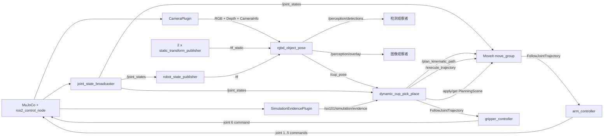

# SO-101 YOLO-Seg RGB-D 多实例感知 PickPlace 教学与源码导读

**范围：** MuJoCo 合成数据、YOLO11-Seg 微调、本地推理部署、多实例目标选择、RGB-D 深度定位、tf2、`/cup_pose`、MoveIt、ros2_control 与 MuJoCo 物理验证

**对象：** 已了解 Python 和 ROS 2 基础，希望从源码复现“在多个物体中找到指定杯子并完成抓放”的开发者

**目标：** 理解并运行下面这条链路。程序需要从当前图像中识别 `plastic_cup`，不能靠颜色或预先写好的杯子坐标猜目标

```text
MuJoCo 合成场景 + object-ID 标签
  -> YOLO11n-Seg 微调
  -> Mac MPS / Linux CUDA 本地推理
  -> 多实例 DetectionCandidate
  -> 唯一 plastic_cup 选择
  -> mask + Depth + CameraInfo
  -> exact-stamp tf2
  -> /cup_pose
  -> dynamic_cup_pick_place
  -> MoveIt -> controller -> MuJoCo
```

本文沿用 [`so101-rgbd-perception-pick-place-source-guide.md`](so101-rgbd-perception-pick-place-source-guide.md) 的讲解方式。原导读描述的是“颜色阈值 + 最大空间聚类”方案，适合学习 RGB-D 和 tf2，但它不知道什么叫杯子。本文继续往前走：先合成带实例标签的数据，再训练 YOLO-Seg，保留每个候选实例，最后由确定性代码选择唯一的 `plastic_cup`。

`/cup_pose` 之后的动态目标、5-DoF IK、MoveIt 规划和抓放状态机，可配合 [`so101-dynamic-cup-pick-place-source-guide.md`](so101-dynamic-cup-pick-place-source-guide.md) 阅读。

## 1. 先弄清这次功能解决了什么

旧方案会做两件事：找出橙色像素，再从这些像素形成的三维点里挑最大的聚类。受控的单杯场景里，这样做很直观；一旦桌面上多放一个相近颜色的瓶子，问题就出现了。

颜色只是一种外观属性。`orange_cup_mask()` 能回答“哪些像素偏橙色”，不能回答“这些像素属于杯子还是瓶子”。最大聚类也没有类别概念，它只知道哪一团点更多。一个更大的同色瓶子很可能被选中。

多物体版本把问题拆成三个明确步骤：

1. 检测器保留图像中的每个实例，并为每个实例给出类别、置信度、边界框和 mask；
2. `TargetSelector` 只寻找置信度足够的 `plastic_cup`；
3. 只有恰好一个目标时才继续深度定位。

目标数量对应的行为是闭合的：

| 合格 `plastic_cup` 数量 | 结果 | 是否发布 `/cup_pose` |
|---:|---|---:|
| 0 | `TARGET_NOT_FOUND` | 否 |
| 1 | 选择该实例并继续定位 | 是，但仍需通过深度、TF 和几何门禁 |
| 2 或更多 | `TARGET_AMBIGUOUS` | 否 |

这里没有“选置信度最高的那个”这一隐藏规则。两个杯子都满足条件时，程序不知道操作者想抓哪一个，安全的做法是拒绝执行。

## 2. 先看完整运行图

### 2.1 一体化入口

公开入口有两种写法：

```bash
ros2 run so101_demo_py so101_mujoco_perception_pick_place ...
ros2 launch so101_demo_py so101_mujoco_perception_pick_place.launch.py ...
```

console script 在 [`setup.py`](../src/so101_demo_py/setup.py) 中注册。`ros2 run` 最终进入 [`perception_pick_place_launch.py`](../src/so101_demo_py/src/cli/perception_pick_place_launch.py)，由它创建 `LaunchService`，并保留真正失败子进程的退出码。公开 launch 文件与这个入口共用 [`build_perception_pick_place_launch_description()`](../src/so101_demo_py/src/runtime/launch_composition.py)。

### 2.2 实际启动的组件

当 `perception_backend:=yolo_seg` 且执行门禁通过后，launch 会启动这些组件：

| 组件 | 进程或节点 | 生命周期 | 责任 |
|---|---|---|---|
| MuJoCo 与 controller manager | `mujoco_ros2_control/ros2_control_node` | 长驻 | 加载 MJCF、推进物理、发布 `/clock`，承载相机和物理证据插件，并连接 ros2_control 硬件接口 |
| Robot State Publisher | `robot_state_publisher` | 长驻 | 读取 URDF 与 `/joint_states`，发布机器人 `/tf` |
| Controller spawner × 3 | `controller_manager/spawner` | 激活成功后退出 | 启动 `joint_state_broadcaster`、`arm_controller` 和 `gripper_controller` |
| MoveIt | `so101_mujoco_support/graceful_shutdown_move_group` | 长驻 | 提供规划、轨迹执行与 Planning Scene 接口 |
| Planning Scene 初始化 | `so101_demo_py/scene_setup` | 一次性 | 写入并回读桌子、底座和杯子碰撞对象 |
| 静态相机 TF × 2 | `tf2_ros/static_transform_publisher` | 长驻 | 发布 `base -> camera_link -> task_camera_frame` |
| 本地 YOLO-Seg 感知 | `so101_demo_py/rgbd_object_pose` | 发布后等待统一关停 | 加载本地模型，处理一帧 RGB-D，发布检测结果、overlay 和 `/cup_pose` |
| 动态抓放 | `so101_demo_py/dynamic_cup_pick_place` | 一次任务 | 消费 `/cup_pose`，调用 MoveIt 与 controller，验证物理抓放结果 |

组件清单主要来自 [`_mujoco_stack_actions()`](../src/so101_demo_py/src/runtime/launch_composition.py) 和 [`_mujoco_perception_execute_actions()`](../src/so101_demo_py/src/runtime/launch_composition.py)。

### 2.3 组件如何通信



### 2.4 ROS 接口表

| 接口 | 类型 | 发布或提供方 | 消费方 | 用途 |
|---|---|---|---|---|
| `/clock` | `rosgraph_msgs/msg/Clock` | MuJoCo | 所有 `use_sim_time` 节点 | 统一图像、TF、Pose 与执行状态的时间基准 |
| `/task_camera/camera_info` | `sensor_msgs/msg/CameraInfo` | CameraPlugin | `rgbd_object_pose` | 图像尺寸和针孔相机内参 `K` |
| `/task_camera/color` | `sensor_msgs/msg/Image`，`rgb8` | CameraPlugin | `rgbd_object_pose` | YOLO-Seg 的 RGB 输入 |
| `/task_camera/depth` | `sensor_msgs/msg/Image`，`32FC1` | CameraPlugin | `rgbd_object_pose` | mask 内每个像素的米制深度 |
| `/tf_static` | `tf2_msgs/msg/TFMessage` | 两个静态 TF 节点 | 感知节点、MoveIt | 固定相机外参 |
| `/tf` | `tf2_msgs/msg/TFMessage` | Robot State Publisher | 感知节点、MoveIt | 机器人 link 的动态变换 |
| `/perception/detections` | `vision_msgs/msg/Detection2DArray` | `rgbd_object_pose` | 观察者或可视化工具 | 每个候选的 ID、类别、置信度和 bbox |
| `/perception/overlay` | `sensor_msgs/msg/Image`，`rgb8` | `rgbd_object_pose` | 观察者或可视化工具 | 带实例 mask、bbox 和标签的 RGB 图 |
| `/cup_pose` | `geometry_msgs/msg/PoseStamped` | `rgbd_object_pose` | `dynamic_cup_pick_place` | 精确源时间戳、`world` frame 下的杯子中心 |
| `/joint_states` | `sensor_msgs/msg/JointState` | joint state broadcaster | RSP、MoveIt、动态执行器 | 实际关节反馈和执行终点检查 |
| `/plan_kinematic_path` | `moveit_msgs/srv/GetMotionPlan` | MoveIt | 动态执行器 | 生成碰撞约束轨迹 |
| `/execute_trajectory` | `moveit_msgs/action/ExecuteTrajectory` | MoveIt | 动态执行器 | 执行 MoveIt 轨迹 |
| `/arm_controller/follow_joint_trajectory` | `control_msgs/action/FollowJointTrajectory` | arm controller | MoveIt | 控制手臂关节 1–5 |
| `/gripper_controller/follow_joint_trajectory` | `control_msgs/action/FollowJointTrajectory` | gripper controller | 动态执行器 | 控制夹爪关节 6 |
| `/so101/simulation/evidence` | `mujoco_ros2_control_msgs/msg/SimulationEvidence` | MuJoCo 插件 | 动态执行器 | 杯子 Pose、接触、支撑和 reset epoch |

`/perception/detections` 只携带标准 2D 检测字段，不携带完整 mask。完整 mask 会写入本轮证据目录；overlay 用于快速观察。真正参与深度定位的是进程内的 `DetectionCandidate.mask`，不会经过有损图片再读回来。

## 3. 源码分成了哪些层

这一版没有把模型调用、目标选择、点云计算和 ROS publish 全塞进一个 node。各层边界如下：

| 层 | 主要文件 | 只负责什么 |
|---|---|---|
| 核心数据契约 | [`detection.py`](../src/so101_demo_py/src/core/detection.py) | 定义不可变的 frame、candidate、batch 和 localized object |
| 检测端口 | [`object_detector.py`](../src/so101_demo_py/src/ports/object_detector.py) | 约束 `detect(frame, query)` 接口，不依赖 Ultralytics |
| YOLO adapter | [`yolo_seg.py`](../src/so101_demo_py/src/adapters/perception/yolo_seg.py) | 校验权重与 device，运行 YOLO，转换输出 |
| 应用规则 | [`object_pose.py`](../src/so101_demo_py/src/application/object_pose.py) | 目标选择、深度定位和一次请求编排 |
| ROS adapter | [`rgbd_object_pose_node.py`](../src/so101_demo_py/src/ros/rgbd_object_pose_node.py) | 订阅、tf2、消息转换、publish 与 lifecycle |
| 证据写入 | [`perception_evidence.py`](../src/so101_demo_py/src/runtime/perception_evidence.py) | 原子写入 RGB、mask、overlay、点云和结果 JSON |
| 启动编排 | [`launch_composition.py`](../src/so101_demo_py/src/runtime/launch_composition.py) | 参数门禁、组件启动顺序、退出与清理 |

这种拆法的直接好处是：`TargetSelector` 和 `RgbdLocalizer` 可以用假检测器测试，不需要每次测试都加载 PyTorch；YOLO adapter 也不用知道 ROS publisher 和 MoveIt。

## 4. 检测契约为什么要先定义

[`DetectionFrame`](../src/so101_demo_py/src/core/detection.py) 保存一张 RGB 图及其来源：

```text
rgb8
source_stamp_ns
source_frame_id
```

[`DetectionCandidate`](../src/so101_demo_py/src/core/detection.py) 表示一个实例：

```text
instance_id
class_id
confidence
bbox_xyxy
mask
source_stamp_ns
source_frame_id
image_width
image_height
```

其中 mask 必须是与原图同尺寸的布尔数组，并且至少包含一个像素。候选自己的 stamp、frame 和尺寸不能与本批次冲突。

[`DetectionBatch`](../src/so101_demo_py/src/core/detection.py) 再补上模型 provenance：

```text
model_id
weights_sha256
runtime_device
inference_latency_ms
candidates
```

batch 会把 `weights_sha256` 和 `runtime_device` 与本轮推理结果一起保存。假如 Mac 意外回退到 CPU，或运行时加载了另一份同名 `best.pt`，这两个字段能让问题直接暴露出来。

## 5. RGB-D 输入为什么仍要严格对齐

YOLO 只看 RGB，但三维定位还需要 Depth 和 CameraInfo。`rgbd_object_pose` 复用了 [`AlignedRgbdBuffer`](../src/so101_demo_py/src/cli/rgbd_point_cloud.py)，只有三条消息的 source stamp 完全相同才接受：

```text
camera_info.stamp == color.stamp == depth.stamp
```

节点还会检查 frame、尺寸和编码。RGB 必须是 `rgb8`，Depth 必须是 `32FC1`。[`FreshFrameGate`](../src/so101_demo_py/src/ros/rgbd_object_pose_node.py) 只接受门禁之后的新帧，避免启动时误用队列中的旧消息。

这一点和是否使用 YOLO 无关。第 N 帧的 mask 配上第 N+1 帧的深度，杯子边缘就会落到别的三维位置。静止画面可能暂时看不出问题，运动时误差会明显放大。

## 6. 为什么选择实例分割，而不是检测框

普通目标检测给出 bbox。bbox 是一个矩形，里面通常既有杯子，也有桌面、瓶子边缘和背景。若把整个 bbox 的深度都反投影，点云会混入不属于目标的点。

YOLO-Seg 多输出一张实例 mask：

```text
同一张 RGB
  -> candidate 0: plastic_cup + mask 0
  -> candidate 1: bottle + mask 1
  -> candidate 2: plastic_cup + mask 2
```

深度定位只读取被选中 candidate 的 mask。类别选择发生在二维实例层，三维计算发生在选中的像素层。这样才能避免“先把所有相近颜色点混成一团，再从三维里猜类别”。

## 7. 合成训练数据从哪里来

### 7.1 多物体 MJCF

训练和验收场景位于 [`v5_multi_object_scene.xml`](../src/so101_demo_py/assets/mujoco/v5_multi_object_scene.xml)。它包含两个杯子实例、瓶子干扰物、桌面、目标区域和 `task_camera`。

数据生成配置 [`plastic_cup_yolo_seg.yaml`](../src/so101_demo_py/config/perception/plastic_cup_yolo_seg.yaml) 固定：

```yaml
mjcf_path: ../../assets/mujoco/v5_multi_object_scene.xml
camera_name: task_camera
image_width: 640
image_height: 480
split_counts:
  train: 800
  val: 200
  test: 200
```

### 7.2 四种场景分布

[`DatasetScenario`](../src/so101_demo_py/src/adapters/perception/mujoco_dataset.py) 定义四种场景：

| 场景 | 杯子数量 | 用来学习什么 |
|---|---:|---|
| `NO_CUP` | 0 | 有瓶子不等于有杯子，降低误检 |
| `ONE_CUP_DISTRACTORS` | 1 | 在干扰物中找到唯一杯子 |
| `TWO_CUPS` | 2 | 保留两个独立实例，不把它们合并 |
| `CUP_NEAR_BOTTLE` | 1 | 杯子贴近瓶子时仍分开 mask |

样本按固定 seed 生成。训练、验证和测试使用不同的 seed 起点：

```text
train: 100000 ...
val:   200000 ...
test:  300000 ...
```

分开的 seed 区间能防止同一随机场景同时进入 train 和 test。

### 7.3 每个 seed 随机化什么

[`MuJoCoDatasetRenderer._prepare()`](../src/so101_demo_py/src/adapters/perception/mujoco_dataset.py) 会在受控范围内改变：

- 两个杯子和瓶子的 XY 位置；
- 相机位置的小幅扰动；
- 杯子与瓶子的材质颜色；
- 当前样本出现 0、1 还是 2 个杯子。

`CUP_NEAR_BOTTLE` 会把瓶子放到杯子附近，专门制造容易粘连的边界。随机化不是越大越好。范围太大时，训练数据会包含机器人实际工作区不会出现的视角和位置；范围太小，模型又容易只记住固定画面。

## 8. object-ID 如何变成 YOLO-Seg 标签

### 8.1 RGB 和标签来自两次同位渲染

[`MuJoCoDatasetRenderer.render()`](../src/so101_demo_py/src/adapters/perception/mujoco_dataset.py) 对同一个仿真状态执行两次渲染：

1. 普通 RGB rendering，得到模型输入图片；
2. segmentation rendering，得到每个像素所属的 MuJoCo geom ID。

geom ID 再通过 `model.geom_bodyid` 映射到 body ID，body ID 对应 `plastic_cup`、`plastic_cup_b` 或瓶子。

### 8.2 为什么不用颜色生成标签

训练时杯子和瓶子的颜色会随机变化。如果标签来自颜色阈值，换色后真值就会跟着坏掉。object-ID 属于模拟器场景结构，同一个 body 无论渲染成红色、绿色还是灰色，实例身份都不会变。

[`build_labeled_sample()`](../src/so101_demo_py/src/adapters/perception/mujoco_dataset.py) 只把 body 名为 `plastic_cup` 或以 `plastic_cup_` 开头的实例加入标签。每个 body 单独生成 mask，所以两个杯子会得到两条标签。

### 8.3 mask 如何写成 YOLO polygon

YOLO segmentation label 的一行格式是：

```text
class_id x1 y1 x2 y2 ... xn yn
```

`_polygon_from_mask()` 取 mask 中的像素坐标，计算凸包，再把坐标归一化到 `[0, 1]`。当前数据集只有一个类别，因此每行以 `0` 开头：

```text
0 0.421875000 0.366666667 0.425000000 0.358333333 ...
```

一张无杯图片的 label 文件为空。它不是坏样本，反而用于教模型在只有干扰物时不要输出杯子。

## 9. 如何生成数据集

生成入口注册为 `generate_yolo_seg_dataset`，CLI 源码在 [`generate_yolo_seg_dataset.py`](../src/so101_demo_py/src/cli/generate_yolo_seg_dataset.py)。先 source 正确的 ROS 与包 overlay，然后运行：

```bash
CONFIG="$(ros2 pkg prefix so101_demo_py)/share/so101_demo_py/config/perception/plastic_cup_yolo_seg.yaml"

ros2 run so101_demo_py generate_yolo_seg_dataset \
  --config "$CONFIG" \
  --output-root /absolute/path/to/plastic-cup-dataset \
  --generator-commit "$(git rev-parse HEAD)"
```

输出根必须不存在。生成器不会覆盖一个旧目录，因为混入两次运行的图片会破坏 manifest 和 split provenance。

刚开始调试时不要直接生成 1200 张。先跑 12 张 smoke：

```bash
ros2 run so101_demo_py generate_yolo_seg_dataset \
  --config "$CONFIG" \
  --output-root /absolute/path/to/plastic-cup-dataset-smoke \
  --generator-commit "$(git rev-parse HEAD)" \
  --sample-limit 12
```

目录结构如下：

```text
plastic-cup-dataset/
  images/{train,val,test}/*.png
  labels/{train,val,test}/*.txt
  truth/{train,val,test}/*.json
  dataset.yaml
  dataset-manifest.json
```

抽查时至少看四件事：RGB 里有几个杯子、label 有几行、truth 的 `visible_instance_count` 是多少、polygon 是否覆盖对应杯子。只检查文件数量不够，标签错位也能生成完整目录。

## 10. YOLO11n-Seg 微调在做什么

这里使用 Ultralytics `yolo11n-seg.pt` 作为预训练基础模型。它已经学过通用的边缘、纹理和形状特征。微调让模型适应当前任务中的相机视角、MuJoCo 画面和 `plastic_cup` 类别。

如果从随机权重开始训练，1200 张合成图通常太少；使用预训练权重能把训练重点放在“这个任务里的杯子实例长什么样”。这就是微调与从零训练的区别。

训练契约在 [`training.yaml`](../src/so101_demo_py/config/perception/training.yaml)：

```yaml
task: segment
model: yolo11n-seg.pt
data: dataset.yaml
class_names:
  - plastic_cup
classes:
  - 0
imgsz: 640
epochs: 100
batch: 32
workers: 8
seed: 20260831
deterministic: true
device: cuda
amp: false
```

几个参数值得单独解释：

- `task: segment` 表示训练实例分割，不是普通 bbox detection；
- `imgsz: 640` 与运行时推理尺寸一致；
- `seed` 和 `deterministic` 用来减少重复训练之间的无谓差异；
- `device: cuda` 把完整训练固定在 Linux GPU；
- `amp: false` 避免 Ultralytics 的 AMP 预检额外拉取模型，并固定本次训练数值路径。

## 11. 训练前如何冻结配置

仓库里的 `training.yaml` 是人能审阅的契约，不应直接被训练命令随意改写。[`prepare_training_run()`](../src/so101_demo_py/src/adapters/perception/yolo_training.py) 会做这些检查：

1. 数据集与训练配置中的 class names 必须一致；
2. 基础模型必须是本地普通文件，不能是 symlink；
3. 数据集路径会改成绝对路径；
4. 输出目录必须是新的；
5. smoke 训练可覆盖 `epochs` 和 `fraction`，但不会改原始契约。

一个最小 Python driver 可以写成：

```python
from pathlib import Path

from so101_demo.adapters.perception.yolo_training import prepare_training_run

prepared = prepare_training_run(
    contract_path=Path("/absolute/path/to/training.yaml"),
    dataset_yaml_path=Path("/absolute/path/to/dataset/dataset.yaml"),
    base_model_path=Path("/absolute/path/to/yolo11n-seg.pt"),
    output_root=Path("/absolute/path/to/training/smoke-001"),
    run_name="smoke-001",
    epochs_override=1,
    fraction=0.05,
)
print(prepared.training_config)
```

先用 `epochs=1`、`fraction=0.05` 验证数据路径、CUDA、离线资产和输出工件。smoke 失败时继续跑 100 epochs 只会浪费时间。

## 12. 如何执行离线 CUDA 微调

依赖版本固定在 [`requirements.lock`](../src/so101_demo_py/config/perception/requirements.lock)：

```text
torch==2.13.0
torchvision==0.28.0
ultralytics==8.4.115
mujoco==3.12.0
PyYAML==6.0.2
Pillow==12.3.0
```

在独立虚拟环境中安装，不要把这套模型依赖混进系统 Python：

```bash
python3 -m venv /absolute/path/to/so101-perception-venv
source /absolute/path/to/so101-perception-venv/bin/activate
python -m pip install -r src/so101_demo_py/config/perception/requirements.lock
```

Linux 上还要确认安装的是与当前驱动匹配的 CUDA build，不能因为 `import torch` 成功就认为 GPU 可用：

```bash
nvidia-smi
python -c 'import torch; print(torch.__version__); print(torch.cuda.is_available()); print(torch.cuda.get_device_name(0))'
```

正式训练从本地 `yolo11n-seg.pt` 启动：

```bash
export YOLO_OFFLINE=true
yolo segment train cfg=/absolute/path/to/training-config.yaml
```

`YOLO_OFFLINE=true` 会关闭一部分在线检查，但它不等于“任何情况下都不会下载”。Ultralytics 的字体检查曾绕过 offline gate，因此完全离线训练还要预置本地字体，并扫描日志中是否出现 `Downloading`、外部 URL 或额外模型名。基础模型、字体和数据集都应在开跑前准备好。

训练结束后保存：

```text
training-config.yaml
args.yaml
results.csv
metrics.json
best.pt
last.pt
weights.sha256
```

通常部署 `best.pt`，不直接凭文件名相信它。先计算哈希：

```bash
sha256sum /absolute/path/to/best.pt
```

本任务最终权重的 SHA-256 是：

```text
f281d25258493e2c7c220dd1d84a7ca4f0501adf99ed4a921a065d74ace40781
```

## 13. 怎样读训练指标

本任务的 test mask 指标为：precision `0.9997`、recall `1.0`、mAP50 `0.995`、mAP50-95 `0.9737`。这些指标说明模型很好地拟合了当前合成测试分布，但它们不能单独证明机器人可以抓杯子。

训练评估与运行时验收分别回答不同问题：

| 证据 | 回答的问题 |
|---|---|
| test split mask 指标 | 模型在未参与训练的合成图片上能否分出实例 |
| Mac MPS / Linux CUDA smoke | 同一权重能否在两个部署设备上运行 |
| 四场景真实 RGB-D 矩阵 | 候选、选择、Depth、TF 和 `/cup_pose` 能否连通 |
| pick&place 物理仿真 | 感知 Pose 能否被执行链消费并搬运杯子 |

不要用高 mAP 替代 ROS topic、深度定位或物理结果。

## 14. 本地推理部署是什么形态

当前实现没有 HTTP 模型服务器，也不调用云端 API。`rgbd_object_pose` 是本机 ROS 进程，`YoloSegDetector` 在这个进程里直接加载本地 `best.pt`：

```text
ROS installed executable
  -> import torch + ultralytics from isolated perception environment
  -> verify best.pt SHA-256
  -> select mps/cuda
  -> YOLO(best.pt)
  -> warm-up
  -> subscribe aligned RGB-D
  -> publish ROS outputs
```

称它为“本地推理服务”时，服务指它在 ROS graph 中提供持续可发现的感知能力，不表示另外部署了 Triton、TorchServe 或 HTTP endpoint。

## 15. 为什么 ROS Python 与模型 Python 要分开看

ROS entrypoint 的 shebang 通常指向构建该包时使用的 ROS Python。PyTorch 和 Ultralytics 可以放在另一个隔离 venv，再把该 venv 的 `site-packages` 加入当前进程的 `PYTHONPATH`。

部署时要分别确认两层 provenance：

```text
ROS interpreter
  -> rclpy、launch、vision_msgs、tf2_ros

perception site-packages
  -> torch、torchvision、ultralytics、mujoco、Pillow
```

只激活 perception venv 可能丢失 ROS 模块；只 source ROS overlay 又可能找不到 Ultralytics。部署前要分别验证。

## 16. macOS MPS 本地部署

下面使用临时目录举例。长期部署时可换成受管理的固定 venv，但不要覆盖已有环境。

```zsh
python3.11 -m venv /tmp/so101-perception-macos
source /tmp/so101-perception-macos/bin/activate
python -m pip install -r src/so101_demo_py/config/perception/requirements.lock
```

确认 MPS：

```zsh
python -c 'import torch; print(torch.__version__); print(torch.backends.mps.is_built()); print(torch.backends.mps.is_available())'
```

运行 ROS 入口前，先加载 ROS 和候选包 overlay，再注入模型依赖：

```zsh
source /opt/ros/jazzy/setup.zsh
source /Users/matianyi/ros2_jazzy/install/setup.zsh
source /path/to/candidate/install/setup.zsh

export PYTHONPATH=/tmp/so101-perception-macos/lib/python3.11/site-packages${PYTHONPATH:+:$PYTHONPATH}
export YOLO_CONFIG_DIR=/absolute/path/to/owned-ultralytics-config
```

检查实际入口：

```zsh
ros2 pkg prefix so101_demo_py
ros2 pkg executables so101_demo_py | rg 'rgbd_object_pose|so101_mujoco_perception_pick_place'
python -c 'import torch, ultralytics, rclpy; print(torch.__file__); print(ultralytics.__file__); print(rclpy.__file__)'
```

正式参数使用 `perception_device:=mps` 和 `perception_allow_cpu_fallback:=false`。如果 MPS 不可用，程序返回 `DEVICE_UNAVAILABLE`，不会悄悄改用 CPU。

## 17. Linux CUDA 本地部署

ai-station 上先确认当前确实位于目标主机，再加载 zsh overlay：

```zsh
hostname
pwd
source /opt/ros/jazzy/setup.zsh
source /data/work/ws_moveit/install/setup.zsh
source /path/to/candidate/install/setup.zsh
```

创建独立 venv：

```zsh
python3.12 -m venv /data/work/venvs/so101-perception
source /data/work/venvs/so101-perception/bin/activate
python -m pip install -r src/so101_demo_py/config/perception/requirements.lock
```

CUDA 预检：

```zsh
nvidia-smi
python -c 'import torch; print(torch.__version__); print(torch.cuda.is_available()); print(torch.cuda.get_device_name(0))'
```

把模型依赖接到 ROS entrypoint：

```zsh
export PYTHONPATH=/data/work/venvs/so101-perception/lib/python3.12/site-packages${PYTHONPATH:+:$PYTHONPATH}
export YOLO_CONFIG_DIR=/absolute/path/to/owned-ultralytics-config
export MUJOCO_GL=egl
```

正式参数使用 `perception_device:=cuda` 和 `perception_allow_cpu_fallback:=false`。`nvidia-smi`、`torch.cuda.is_available()` 和一次真实 CUDA tensor 运算都应通过；CPU smoke 不能替代 Linux CUDA 验收。

## 18. 单独启动本地 YOLO 推理节点

先启动 MuJoCo 相机、静态 TF 和必要 ROS stack，再运行：

```bash
ros2 run so101_demo_py rgbd_object_pose \
  --weights /absolute/path/to/best.pt \
  --weights-sha256 f281d25258493e2c7c220dd1d84a7ca4f0501adf99ed4a921a065d74ace40781 \
  --device mps \
  --request-id tutorial-one-shot-001 \
  --evidence-root /absolute/path/to/new-evidence-directory \
  --once
```

Linux 把 `--device mps` 改为 `--device cuda`。`--once` 表示完成一次请求后退出，适合部署 smoke。生产一体化 launch 不传 `--once`，节点会在发布后保持存活，直到抓放 workflow 结束并统一关停。

启动成功时日志包含：

```text
status=READY request_id=... runtime_device=mps
```

随后 JSON 结果应记录 `model_id`、`weights_sha256`、`runtime_device`、候选数量、推理延迟、定位结果和是否发布 `/cup_pose`。

## 19. 一体化启动 YOLO 感知与抓放

先为本轮准备一个尚不存在的 evidence file 名称。launch 会根据它创建独占的 session 目录：

```bash
mkdir -p /tmp/so101-debug-yolo-tutorial

ros2 run so101_demo_py so101_mujoco_perception_pick_place \
  run_mode:=execute \
  execute:=true \
  headless:=false \
  sensor_rendering:=true \
  session_id:=yolo-tutorial-001 \
  evidence_file:=/tmp/so101-debug-yolo-tutorial/run-001.json \
  mujoco_scene:="$(ros2 pkg prefix so101_demo_py)/share/so101_demo_py/assets/mujoco/v5_multi_object_scene.xml" \
  mujoco_initial_keyframe:=task_start \
  perception_backend:=yolo_seg \
  perception_weights:=/absolute/path/to/best.pt \
  perception_weights_sha256:=f281d25258493e2c7c220dd1d84a7ca4f0501adf99ed4a921a065d74ace40781 \
  perception_device:=mps \
  perception_allow_cpu_fallback:=false
```

Linux 使用 `perception_device:=cuda`。无头运行仍要显式 `sensor_rendering:=true`，否则 Viewer 虽然不显示，相机也可能停止产生 RGB-D。感知组合栈把 MuJoCo 仿真速度固定为实时 `1.0`，防止无头快速仿真让合法 source stamp 在墙钟下变成陈旧 Pose。

## 20. `YoloSegDetector` 内部做了什么

构造阶段在 [`YoloSegDetector.__init__()`](../src/so101_demo_py/src/adapters/perception/yolo_seg.py) 完成：

1. 权重必须是本地普通文件；
2. 计算 SHA-256，并与启动参数逐字比较；
3. 按 `cuda -> mps -> authorized cpu` 规则选择 device；
4. 延迟导入 PyTorch 与 Ultralytics；
5. 调用 `YOLO(local_path)` 加载模型；
6. 用一张全零 `640 x 640` RGB 图 warm-up。

真实推理调用：

```python
model.predict(
    source=rgb8,
    imgsz=640,
    device=runtime_device,
    conf=0.25,
    verbose=False,
)
```

`conf=0.25` 是检测器保留 raw candidate 的下限。应用层 `TargetSelector` 还会使用默认 `0.50` 阈值决定哪些杯子有资格成为任务目标。两层阈值用途不同：低阈值保留可观察候选，高阈值控制执行资格。

[`convert_yolo_result()`](../src/so101_demo_py/src/adapters/perception/yolo_seg.py) 会校验 boxes、classes、confidence 和 masks 数量一致，把低分辨率 mask 用 nearest-neighbor 恢复到原图大小，并对边界做两层十字邻域收缩。这个小处理用于移除贴近瓶子时偶发的一像素 mask 泄漏；如果 mask 很小，收缩会在变空前停止。

## 21. `TargetSelector` 为什么保持简单

[`TargetSelector.select()`](../src/so101_demo_py/src/application/object_pose.py) 的逻辑可以完整写成：

```python
matches = [
    candidate
    for candidate in batch.candidates
    if candidate.class_id == query.class_id
    and candidate.confidence >= confidence_threshold
]
```

然后只处理 `len(matches)` 为 0、1 或大于 1 的情况。它不依赖 bbox 大小、画面中心、实例编号或 MuJoCo truth ID。

selector 故意写得很短，规则因而一眼可见。将来若要支持“左边的杯子”或“离机器人最近的杯子”，应显式增加任务约束和选择策略，不要把新偏好藏进当前 selector。

## 22. mask 如何结合 Depth 变成三维点

[`RgbdLocalizer.localize()`](../src/so101_demo_py/src/application/object_pose.py) 只把 selected mask 中的有效深度像素反投影。针孔模型仍是：

```text
x = (u - cx) * z / fx
y = (v - cy) * z / fy
z = depth[v, u]
```

其中 `fx`、`fy`、`cx`、`cy` 来自 CameraInfo。只有有限、正值且小于 `depth_trunc_m` 的深度被保留。

mask 边缘可能混入桌面或相邻物体。当前 localizer 使用 NumPy 实现的 voxel 邻域清理：把点按 `cluster_eps_m=0.015` 分桶，找出具有足够邻居的 core voxels，再保留靠近完整点云中位数的连通簇。运行时不再依赖 Open3D。

清理后少于 `minimum_cup_points=50` 会返回 `GEOMETRY_REJECTED`，不会用 bbox 中心或默认坐标补一个 Pose。

## 23. exact-stamp tf2 如何保证时间一致

相机点还在 `task_camera_frame`。localizer 查询：

```text
lookup_transform(
  target_frame = world,
  source_frame = candidate.source_frame_id,
  source_stamp_ns = candidate.source_stamp_ns
)
```

它查询的是图像原始时间戳，不是“当前最新 TF”。ROS node 在真正调用 localizer 前还会用 `can_transform()` 等待这一精确时间的变换可用。

TF chain 是：

```text
world
  -> base
      -> camera_link
          -> task_camera_frame
```

精确时间的 transform 不存在时返回 `TF_UNAVAILABLE`。把 `frame_id` 字符串直接改成 `world` 不能完成坐标变换，只会制造一个看起来合法、数值却错误的 Pose。

## 24. 世界坐标几何门禁

所有清理后的点先变换到 `world`，再拟合 world XY 圆。原因与旧 RGB-D 导读相同：斜视相机中的 XY 平面不是桌面水平面。

杯子半径必须落在：

```text
0.04 m ± 0.01 m
```

中心 Z 使用当前任务已知的桌高和杯高：

```text
center_z = 0.12 + 0.09 / 2 = 0.165 m
```

最终中心还必须位于配置的 workspace box 内。实例类别正确但深度点来自错误表面时，半径或 workspace 门禁仍会拒绝它。

## 25. `/cup_pose` 何时才会发布

[`detect_once()`](../src/so101_demo_py/src/application/object_pose.py) 的顺序是：

```text
detect
  -> 写 source RGB、overlay、detections、每个 candidate mask
  -> 发布 /perception/detections 与 /perception/overlay
  -> select
  -> 写 selected-mask
  -> localize
  -> 写 selected-cloud.ply
  -> 写 staged result.json
  -> 发布 /cup_pose
  -> 更新 result.json 为 published_cup_pose=true
```

证据在 Pose 之前写。如果磁盘写入失败，节点不会先发布一个无法追溯的 `/cup_pose`。

发布的 Pose 契约是：

```yaml
header:
  stamp: <原始 RGB-D source stamp>
  frame_id: world
pose:
  position: <定位得到的杯子 body center>
  orientation: {x: 0.0, y: 0.0, z: 0.0, w: 1.0}
```

## 26. 感知证据目录里有什么

[`PerceptionEvidenceWriter`](../src/so101_demo_py/src/runtime/perception_evidence.py) 写出：

```text
source-rgb.png
prediction-overlay.png
candidate-mask-000.png
candidate-mask-001.png
...
detections.json
selected-mask.png
selected-cloud.ply
result.json
```

`TARGET_NOT_FOUND` 和 `TARGET_AMBIGUOUS` 也会保存 source、overlay、候选 mask 和 result。失败证据很有用：没有它，只看到“未发布 `/cup_pose`”，无法判断是模型没找到杯子、找到两个杯子，还是后面的 Depth/TF 失败。

## 27. 动态抓取如何消费 `/cup_pose`

`dynamic_cup_pick_place` 先校验：

- `frame_id == world`；
- stamp 非零且没有过期；
- position 与 quaternion 都是有限值；
- source stamp 没有明显来自未来。

它冻结第一条合法 Pose，然后按现有动态策略计算 pregrasp、descend、micro-lift、lift、place 和 retreat 目标。MoveIt 负责规划与手臂轨迹执行，夹爪由 gripper controller 直接控制。

物理结果仍由 MuJoCo 负责证明。`/cup_pose` 发布成功不代表杯子已经被抓起，MoveIt attachment 也只是碰撞规划中的 shadow。完整验收需要 joint/TCP 运动、双侧接触、微抬升、搬运、release 后桌面支撑，以及 MoveIt 最终 detached/world scene 收敛。

## 28. launch 的启动顺序与失败策略

一体化 launch 的主要顺序是：

```text
注册退出处理器
  -> 启动静态 TF、MuJoCo、RSP、MoveIt、controller spawners、scene_setup
  -> scene_setup exit 0
      -> 同时启动 rgbd_object_pose 与 dynamic_cup_pick_place
  -> 感知发布 /cup_pose
  -> workflow 执行
  -> workflow 返回终态退出码
  -> 统一关停本轮拥有的进程
```

下面任一长期组件在 workflow 完成前退出，launch 都按失败处理：MuJoCo、RSP、MoveIt、两个静态 TF、`rgbd_object_pose`。controller spawner 是一次性进程，成功退出是正常行为。

感知进程因 `TARGET_NOT_FOUND`、`TARGET_AMBIGUOUS`、hash、device、Depth、TF 或证据写入失败而非零退出时，动态执行不会回退到固定杯位。

## 29. 常见失败从哪里查

| 症状 | 首先检查 | 不要先做什么 |
|---|---|---|
| `MODEL_UNAVAILABLE` | 权重是否是本地普通文件、绝对路径是否正确 | 不要让 Ultralytics自动下载替代模型 |
| `WEIGHTS_HASH_MISMATCH` | `sha256sum best.pt` 与启动参数 | 不要改代码跳过哈希 |
| `DEVICE_UNAVAILABLE` | MPS/CUDA probe、wheel 类型、驱动 | 不要静默打开 CPU fallback |
| 相机 topic 存在但无数据 | `sensor_rendering`、实际消息、Depth 有限正值数量 | 不要先调 YOLO 阈值 |
| raw candidates 很多且接近 0 分 | adapter 的 `conf=0.25` 是否生效、installed source 是否陈旧 | 不要在 selector 后过滤几百个垃圾候选 |
| `TARGET_NOT_FOUND` | overlay、每个 candidate class/confidence | 不要生成默认 `/cup_pose` |
| `TARGET_AMBIGUOUS` | 是否确有两个合格杯子、任务是否缺少选择约束 | 不要暗中选置信度最高项 |
| mask 粘到瓶子 | candidate mask、相邻边界、训练场景覆盖 | 不要只缩 bbox |
| `DEPTH_INVALID` | selected mask 内的 Depth、编码和尺寸 | 不要使用 RGB 像素中心代替三维定位 |
| `TF_UNAVAILABLE` | exact source stamp 的 `world <- task_camera_frame` | 不要改 `frame_id` 字符串冒充变换 |
| `/cup_pose` 已发布但 workflow timeout | consumer discovery、QoS、启动顺序、stamp age | 不要重复发布伪造新时间戳 |
| workflow `DONE` 但画面不对 | MuJoCo pose/contact、MoveIt scene、fresh GUI 证据 | 不要只相信退出码 |

调试时沿第一处分叉往下查。RGB-D 输入错误不应在 IK 层补偿，模型部署错误也不应靠放宽几何门禁掩盖。

## 30. 当前实现的边界

- 模型训练数据来自当前 MuJoCo 场景，不代表真实相机域已经覆盖；
- 类别白名单目前只有 `plastic_cup`；
- 两个合格杯子会拒绝执行，尚未实现“左边的杯子”等指代；
- orientation 固定为 upright，不估计杯子倾角；
- Z 使用桌高和杯高先验，不适合悬空或倾倒目标；
- 一次任务冻结一帧合法感知结果，不做 visual servoing；
- pick 位置来自感知，place 位置仍来自策略；
- Mac/Linux 验收是 MuJoCo 物理仿真，不是实际 SO-101 硬件安全验收。

## 31. 建议的源码阅读顺序

按数据流读，比从 launch 或最长的 ROS node 开始更容易：

1. [`v5_multi_object_scene.xml`](../src/so101_demo_py/assets/mujoco/v5_multi_object_scene.xml)：两个杯子、瓶子和相机；
2. [`plastic_cup_yolo_seg.yaml`](../src/so101_demo_py/config/perception/plastic_cup_yolo_seg.yaml)：数据规模与 MJCF；
3. [`mujoco_dataset.py`](../src/so101_demo_py/src/adapters/perception/mujoco_dataset.py)：object-ID 标签与数据生成；
4. [`training.yaml`](../src/so101_demo_py/config/perception/training.yaml)：微调契约；
5. [`yolo_training.py`](../src/so101_demo_py/src/adapters/perception/yolo_training.py)：训练配置冻结；
6. [`detection.py`](../src/so101_demo_py/src/core/detection.py)：candidate 和 batch 契约；
7. [`yolo_seg.py`](../src/so101_demo_py/src/adapters/perception/yolo_seg.py)：本地模型加载和结果转换；
8. [`object_pose.py`](../src/so101_demo_py/src/application/object_pose.py)：0/1/2+ 选择与深度定位；
9. [`rgbd_object_pose_node.py`](../src/so101_demo_py/src/ros/rgbd_object_pose_node.py)：ROS 输入输出、tf2 和生命周期；
10. [`perception_evidence.py`](../src/so101_demo_py/src/runtime/perception_evidence.py)：每轮证据；
11. [`launch_composition.py`](../src/so101_demo_py/src/runtime/launch_composition.py)：组件、时序和 fail-closed；
12. [`so101-dynamic-cup-pick-place-source-guide.md`](so101-dynamic-cup-pick-place-source-guide.md)：Pose 之后的执行闭环。

## 32. 一个适合初学者的最小观察练习

先不要运行完整抓放。启动多物体相机和 `rgbd_object_pose --once`，然后打开本轮的四类文件：

```text
source-rgb.png
prediction-overlay.png
candidate-mask-000.png
result.json
```

按顺序回答：

1. source RGB 里有几个独立物体？
2. overlay 里有几个 candidate，各自 class 和 confidence 是什么？
3. candidate mask 是否只覆盖一个实例，而不是整个 bbox？
4. `result.json` 的 `candidate_count` 和 `matching_candidate_count` 是否相同？为什么可能不同？
5. 如果有两个 `plastic_cup`，为什么没有 `selected-mask.png` 和 `/cup_pose`？
6. 如果只有一个杯子，`selected-cloud.ply` 中的点来自哪些像素？
7. `/cup_pose.header.stamp` 为什么必须等于 RGB-D source stamp？

观察清楚后，再运行一体化 pick&place。这样一旦失败，你知道问题停在候选、选择、深度、TF 还是执行层。

## 33. 自检问题

读完后，应能不看文档回答：

1. 为什么颜色阈值和最大聚类不能代替实例分类？
2. object-ID 标签为什么不受杯子材质颜色随机化影响？
3. 为什么 train、val、test 要使用不同 seed 区间？
4. YOLO segmentation label 的一行表示一个类别还是一个实例？
5. 微调与从随机权重训练有什么区别？
6. `conf=0.25` 与 `confidence_threshold=0.50` 分别控制什么？
7. 为什么权重路径和 SHA-256 都要传给推理节点？
8. Mac MPS 与 Linux CUDA 为什么可以使用同一个 `best.pt`？
9. 当前“本地推理服务”为什么是 ROS 进程，而不是 HTTP server？
10. bbox 和实例 mask 哪一个适合做深度反投影？为什么？
11. 0、1、2 个合格杯子分别产生什么结果？
12. 为什么 exact-stamp tf2 失败时不能使用 latest transform？
13. `/perception/detections`、`/perception/overlay` 与 `/cup_pose` 分别给谁使用？
14. 为什么 `/cup_pose` 发布成功还不能证明 pick&place 成功？
15. MuJoCo physical truth 与 MoveIt Planning Scene shadow 为什么要分别验证？

自检时，请把答案落到数据集、模型、ROS topic、TF、MoveIt action 和 MuJoCo 物理状态上。如果还只能概括成“YOLO 识别后发布 Pose”，建议回到对应章节，对着代码和证据文件再走一遍。
