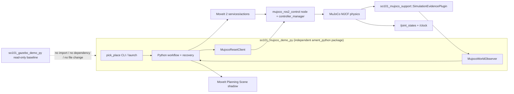

# SO-101 + MuJoCo + ROS 2 迁移设计

**状态：** 2026-08-10 用户已批准；允许按配套实施计划执行

**Atomic schema 裁决：** 2026-08-10 用户批准扩展 schema；以 §10.1 的 session/reset/step/左右指尖原子证据字段为准

**设计基线：** `codex/so101-gazebo-demo-py` @ `8d7913e7f552a40ee627d65be8b873ac16748bc9`

**实现 main 基线：** `d300e7a41fb274d6d7e120699b7040666ea61904`

**历史 kickoff（仅审计）：** `8464038e7cc13f638e2e336c625ed6677fa7db22`

**目标平台：** ai-station，Ubuntu 24.04，ROS 2 Jazzy

**目标实现分支：** `codex/so101-mujoco-ros2`

**目标实现 worktree：** `/data/work/ws_moveit/.worktrees/so101-mujoco-ros2`

## 1. 决策摘要

本迁移采用“保留 ROS 2 / MoveIt 2 / Python 任务层，只替换仿真后端”的方案：

- ROS 2 Jazzy、`ros2_control`、现有 JointTrajectoryController、MoveIt 2 服务/action、TF、Planning Scene、Python 状态机与最终物理结果判据继续使用。
- Gazebo Harmonic、`gz_ros2_control`、`ros_gz_bridge`、Gazebo pose/contact topic 和 Gazebo reset/transport 适配器替换为 MuJoCo、固定官方 `mujoco_ros2_control` 0.0.3 commit 加最小可审计 reset hook patch 的隔离 overlay、MuJoCo reset/step 服务与项目自有的只读原子仿真证据插件。
- 机器人和任务场景使用仓库内受版本控制的 MJCF；URDF 继续作为 MoveIt、TF 与语义模型的来源。两者通过自动几何一致性测试约束，而不是运行时临时转换。
- 抓取主链保持纯物理：不使用 weld/equality 约束，不把物体 teleport 当作搬运，不把 Planning Scene attachment 当成物理抓取成功。
- 从第一步创建独立 `ament_python` package `src/so101_mujoco_demo_py/`；backend-neutral domain、workflow、MoveIt adapter 和物理结果语义只迁入这个新 package，不在 `so101_gazebo_demo_py` 内建立中间层。
- `src/so101_gazebo_demo_py/**` 是只读行为基线，正式迁移分支必须始终与本次 rebase 的 main 基线 `d300e7a` 中该目录字节级一致；新 package 不导入、不依赖、不读取其 installed assets。
- MuJoCo 接触数值必须重新标定。Gazebo 的 penetration/depth 数值不跨引擎复用，但“真实双侧接触、微抬后杯子实际随动、无禁碰、最终稳定放置”的断言语义保持不变。

## 2. 背景与当前证据

### 2.1 当前 Gazebo Python 方案

当前 `so101_gazebo_demo_py` 已经具备：

- 独立 `ament_python` package；
- ROS-free domain/workflow/checkpoint 层；
- `/plan_kinematic_path`、`/execute_trajectory`、Planning Scene service 与 `/joint_states` 适配；
- Gazebo pose/contact 观察、世界 reset、MoveIt collision shadow；
- 物理微抬、搬运阶段物体结果门槛和最终放置结果门槛；
- 长程实验账本、headless contract 与 GUI 证据流程。

截至设计基线，账本已经记录有效最终成功，但尚未完成规定的连续 `FULL_RESTART` 和 `RESET_WORLD` 资格验证。因此它是迁移的行为对照基线，不是“已经稳定发布”的基线。

#### 2.1.1 `ff1a1b6` → `8d7913e` 设计 delta

初稿完成后，ai-station 的 Gazebo 分支新增 12 个实验提交并已推送。审阅后的迁移影响如下：

- 当前默认 release alignment XY 容差从 `0.006 m` 调整为 `0.010 m`；迁移必须把它当作 backend-neutral Python 行为默认值保留，而不是回退到旧值。
- fingertip 横向摩擦候选经过 `3.0`、`2.0` 的失败实验后回到 `1.2`。这些结论属于 Gazebo/Bullet 材料语义，只作为“不可直接跨引擎复制”的证据，不成为 MuJoCo friction 数值。
- EXP-073 只有 RED/GREEN、全量 pytest、colcon build/test 证据，尚无 live runtime 或连续资格验证。因此新基线仍是未完成资格验证的行为对照，Task 12–14 的 MuJoCo 标定和连续成功门槛不放宽。
- 上述 delta 不改变 ROS 2、MoveIt、控制器、状态机、原子物理证据、纯物理抓取和 reset 架构决策。

#### 2.1.2 2026-08-10 package 隔离修正

初版设计曾要求先在 `so101_gazebo_demo_py` 内建立 backend-neutral 层，最后再改名。该路线已被用户明确否决。修正后的边界是：

- 正式分支先从历史 kickoff `8464038` 严格重建，再将独立 package spec 单独重放到 `main@d300e7a`；`src/so101_gazebo_demo_py/**` 从第一项任务到最终验收均不得变化。
- 旧路线的 committed/dirty 状态已保存到 ai-station 备份分支 `codex/so101-mujoco-ros2-pre-isolation-20260810` @ `3add34f8390b78a1f4a13ff49aefb2dc87638245`，只用于审计和选择性重写，不允许整体 cherry-pick 回正式分支。
- Python 实现、测试、配置、launch、MJCF 和 package metadata 全部新建在 `src/so101_mujoco_demo_py/**`。
- C++ message/plugin/parity 支持继续独立位于 `src/so101_mujoco_support/**`。
- 可以从 Gazebo 基线逐文件移植 ROS-free 行为，但目标文件必须使用新 import namespace，并在 provenance manifest 中记录源 commit、源路径和目标路径；运行时不得回退导入旧 package。

### 2.2 ai-station 当前依赖状态

2026-08-09 的只读核对结果：

- 已安装 `ros-jazzy-mujoco-vendor 0.0.8`；
- ROS 安装前缀中可发现 `mujoco_vendor`；
- 未安装 `ros-jazzy-mujoco-ros2-control`；
- apt 候选为 `ros-jazzy-mujoco-ros2-control 0.0.3`。

用户已授权后续实施时升级 ai-station 版本，或从 GitHub 最新稳定版构建；本文仍不执行安装或构建。2026-08-09 核对到的最新稳定 tag 仍是 `0.0.3`（commit `35ba8174b62d9560093614f981a3d4b978a96036`），没有更新的 GitHub release/tag。`main` 虽然包含更新接口，但仍声明 0.0.3 且没有稳定 tag，因此属于未发布快照，不进入默认依赖链。

Task 10 的 live 证据确认 apt 0.0.3 的 `ResetWorld` 保留 simulation time，而原 evidence plugin 只能从 time decrease 推断 reset；两者无法产生权威 `reset_epoch`。因此 reset-qualified runtime 的依赖选择已由用户裁决为：

1. apt 0.0.3 只作为 underlay 和未涉及 reset 资格门的历史探测结果，不再是 reset-qualified runtime；
2. 必须从官方上游 <https://github.com/ros-controls/mujoco_ros2_control> 的稳定 tag `0.0.3`、精确 commit `35ba8174b62d9560093614f981a3d4b978a96036` 构建最小 patched source overlay 到 `/data/work/ws_mujoco_ros2_control_003/install`；
3. patch、build 脚本和 provenance 验证器保存在 `src/so101_mujoco_demo_py/**`，必须能从精确 commit checkout 重放，并固定 upstream URL、commit、patch SHA-256、构建命令和四个 MuJoCo package prefix；专用 source checkout 若已存在则必须验证 remote、HEAD、clean status 和 patch state 并 fail closed，不得用 reset/clean 覆盖现场；
4. shell/source 顺序固定为 `/opt/ros/jazzy/setup.zsh` → `/data/work/ws_mujoco_ros2_control_003/install/setup.zsh` → project `install/setup.zsh`。`mujoco_ros2_control`、`mujoco_ros2_control_msgs`、`mujoco_ros2_control_plugins` 必须解析到 dependency overlay，`mujoco_vendor` 必须解析到 `/opt/ros/jazzy` underlay，项目两包必须解析到 project install；
5. 不覆盖 `/opt/ros/jazzy`，不从 floating `main` 构建，不把 `/data/work/so_arm_ws` 或其他 checkout 当作运行依赖；
6. 若实施时出现更新的稳定 tag，仍不得自动升级，必须先做设计/API delta review 和新的用户裁决。

最小 upstream patch 只有一个职责：为 reset 成功建立插件可观察的权威事件。插件基类新增带默认空实现的 virtual `on_reset()`，保持现有第三方 plugin 源码兼容；hook 调用位于 central `reset_simulation_state` 内全部 state/interface 更新之后的成功尾部，对每个已初始化 plugin 恰好调用一次。非法 keyframe 在进入 central reset 前返回失败，因此不得调用任何 plugin 的 `on_reset()`。

## 3. 目标与非目标

### 3.1 目标

1. 用 MuJoCo 替代 Gazebo，保持现有 SO-101 pick-place 的核心外部行为。
2. 继续让 MoveIt 2 负责规划、Planning Scene 和轨迹执行请求，让 `ros2_control` 负责控制器契约。
3. 保持关节名 `1`–`6`、planning group `arm`、TCP `so101_tcp`、控制器名、状态机状态、run mode、失败码风格与最终结果判据。
4. 建立可审计的 URDF ↔ MJCF 几何、关节方向、零位和 limit 一致性证明。
5. 建立来自同一 MuJoCo simulation step 的物体 pose、twist、contact distance、contact force 和 reset 证据链。
6. 在 headless 与 GUI 两种模式下完成分层验收，并分别完成连续 5 次完整重启和连续 5 次世界重置成功。
7. 从第一项实现任务起 package 即独立，不在 build、test 或 runtime 中依赖 `so101_gazebo_demo_py`、Gazebo binary 或原 package 的 installed assets。
8. 在每个 task 和最终验收中证明 `git diff --quiet d300e7a -- src/so101_gazebo_demo_py`。

### 3.2 非目标

- 真实机械臂接入；
- Web Teleop、workspace sampler、标定 UI、视频工具；
- RGB-D 相机、VLM、目标检测或感知链；
- 强化学习、MJX、批量并行训练；
- 软体杯、可变形物体；
- 为“提高成功率”引入 weld、equality、mocap 跟随、循环 teleport 或隐藏的外力；
- 在迁移同时重写 MoveIt 接口、状态机或业务策略；
- 修改、格式化、删除或向 `src/so101_gazebo_demo_py/**` 添加任何文件；
- 新建需要 Gazebo package 同步修改才能工作的共享 common package；
- 把 Menagerie 的 SO-ARM100 模型直接当作 SO-101 的正确模型。

## 4. 方案选择

### 4.1 选中的集成层：`mujoco_ros2_control`

采用官方稳定版 `ros-controls/mujoco_ros2_control`，而不是自建 `/joint_states` 和 trajectory bridge。

理由：

- 保留现有 JointTrajectoryController 与 MoveIt controller mapping；
- 保留标准 `ros2_control` controller lifecycle、action result 和 joint feedback；
- ai-station 的 0.0.3 binary 提供 `/clock`、pause、keyframe reset、step 与插件扩展点；
- 避免在 Python 内重写控制循环、插值、command/state interface 和模拟时钟同步。

### 4.2 选中的模型策略：一次性转换辅助 + 仓库内手工维护 MJCF

不把 URDF-to-MJCF converter 放入 runtime launch。实施时可用转换器生成第一版草稿，但提交的是经过审查、编译测试和几何对齐的 MJCF。

理由：

- 官方转换工具明确标记为 experimental；
- MuJoCo 官方建议通常只转换一次，之后维护 MJCF；
- SO-101 当前的夹爪碰撞、接触材料和任务场景需要 MuJoCo 原生建模；
- 运行时转换会让生成物、依赖、哈希和物理参数难以审计。

### 4.3 备选方案及不采用原因

| 方案 | 不采用原因 |
|---|---|
| Python 直接驱动 MuJoCo，再桥接 ROS topic/action | 会重复实现 `ros2_control` 控制器契约，MoveIt 执行边界变得不标准 |
| 运行时 URDF → MJCF | 转换器 experimental，模型漂移与启动失败难以复现 |
| 直接采用 Menagerie SO-ARM100 | 它是 5DOF SO-ARM100 的简化模型，只能借鉴建模方法，不能证明 SO-101 link/joint/夹爪几何一致 |
| MuJoCo weld/equality 代替抓取 | 绕过物理抓取验收，无法证明摩擦与夹持产生了真实搬运 |
| 保留 Gazebo contact bridge，同时只换动力学 | 两套仿真 source of truth 冲突，接触与 pose 不再属于同一物理世界 |
| 先在 `so101_gazebo_demo_py` 内抽象、最后改名 | 违反 package 隔离和 Gazebo 基线零差异要求，已于 2026-08-10 废止 |
| 抽取 `so101_demo_common_py` 并让两包共同依赖 | 会要求修改 Gazebo package 或产生双包同步发布面；当前范围不需要第三个 Python package |
| 整包复制后逐步删除 Gazebo 文件 | 起步快但容易残留 Gazebo import、package metadata 和 installed-asset 依赖；采用逐边界移植与显式 provenance 代替 |

## 5. 总体架构



### 5.1 保留层

以下行为从 `8d7913e` 逐边界移植到新 namespace；保持外部契约，但不修改或运行时导入原文件：

- `domain.py`、`workflow.py`、`runner.py`；
- `motion/`；
- `moveit/planning.py`、`moveit/scene.py`、`moveit/robot_state.py`；
- `physical_outcome.py`、`release_settle.py`；
- `recovery/`；
- policy YAML 的任务目标、最终区域、姿态和稳定性语义。

### 5.2 替换层

| Gazebo 边界 | MuJoCo 边界 |
|---|---|
| `gz_ros2_control/GazeboSimSystem` | `mujoco_ros2_control/MujocoSystemInterface` |
| `ros_gz_sim` launch/spawn | `mujoco_ros2_control/ros2_control_node` 加载已提交 MJCF |
| Gazebo pose/info bridge | 自有只读 `SimulationEvidencePlugin` 的 object pose/twist |
| `ros_gz_interfaces/msg/Contacts` | 同一 `SimulationEvidencePlugin` 的 contact samples |
| Gazebo world-control/reset | 0.0.3 的 `set_pause`、`reset_world(keyframe)`、`step_simulation` |
| `GZ_PARTITION` | 独立 `ROS_DOMAIN_ID` + `simulation_session_id` |
| Gazebo GUI | MuJoCo Simulate App；RViz 保留 |

## 6. 包与文件边界

### 6.1 独立 Python package

正式实现从第一项任务就使用下面的 package 和 import namespace：

```text
src/so101_mujoco_demo_py/
  package.xml
  setup.py
  setup.cfg
  resource/so101_mujoco_demo_py
  mjcf/
    so101.xml
    scene.xml
    assets/
  config/
    mujoco_plugins.yaml
  launch/
    so101_mujoco.launch.py
    so101_pick_place.launch.py
  so101_mujoco_demo_py/
    domain.py
    workflow.py
    runner.py
    simulation/
      types.py
      protocols.py
    mujoco/
      client.py
      observer.py
      reset.py
    moveit/
    motion/
    recovery/
  test/
```

隔离规则：

- `package.xml`、`setup.py`、Python import、launch substitution 和 runtime resource lookup 不得出现 `so101_gazebo_demo_py`；
- 新 package 可以拥有从 `8d7913e` 移植的 ROS-free 代码副本，但必须在 `docs/provenance.json` 记录 source commit/path、destination path 和 SHA-256；
- characterization test 必须复制到新 package 并针对新 namespace 运行，不能通过修改原测试获得通过；
- 不创建跨 package symlink，不从原 package install/share 读取 URDF、mesh、config、launch 或 policy；所需资产进入新 package 并记录 provenance；
- 公开 ROS graph 契约可以相同，Python package/import/resource identity 必须不同。

### 6.2 独立 C++ 支持 package

新增一个最小 `ament_cmake` 支持包：

```text
src/so101_mujoco_support/
  msg/ContactSample.msg
  msg/SimulationEvidence.msg
  include/so101_mujoco_support/simulation_evidence_plugin.hpp
  src/simulation_evidence_plugin.cpp
  so101_mujoco_plugins.xml
  CMakeLists.txt
  package.xml
  test/
```

### 6.3 Gazebo package 完整性门

`src/so101_gazebo_demo_py/**` 在正式分支上是不可写基线。每个 task 提交前和最终验收必须运行：

```bash
git diff --quiet d300e7a41fb274d6d7e120699b7040666ea61904 -- src/so101_gazebo_demo_py
test -z "$(git status --short -- src/so101_gazebo_demo_py)"
```

任一命令失败即停止，不允许用 allowlist、生成文件例外或后续恢复提交继续该 task。全部资格验证通过后只发布 `so101_mujoco_demo_py` 与 `so101_mujoco_support`；Gazebo package 不删除、不改名、不成为新 package 依赖。

## 7. Backend-neutral Python 合约

### 7.1 证据类型

`simulation/types.py` 负责与引擎无关的值对象：

```python
@dataclass(frozen=True, slots=True)
class ContactEvidence:
    body1_id: int
    geom1_id: int
    body1: str
    geom1: str
    body2_id: int
    geom2_id: int
    body2: str
    geom2: str
    side: Literal["left_fingertip", "right_fingertip", "other"]
    position_world: tuple[float, float, float]
    normal_world: tuple[float, float, float]
    signed_distance_m: float
    normal_force_n: float

@dataclass(frozen=True, slots=True)
class ObjectState:
    body_id: int
    body_name: str
    pose_world: tuple[float, float, float, float, float, float, float]
    twist_world: tuple[float, float, float, float, float, float]

@dataclass(frozen=True, slots=True)
class SimulationEvidence:
    source_timestamp_s: float
    publisher_sequence: int
    simulation_step: int
    reset_epoch: int
    simulation_session_id: str
    paused: bool
    object_state: ObjectState
    has_contact: bool
    minimum_signed_distance_m: float
    maximum_normal_force_n: float
    truncated: bool
    left_fingertip_contacts: tuple[ContactEvidence, ...]
    right_fingertip_contacts: tuple[ContactEvidence, ...]
    other_object_contacts: tuple[ContactEvidence, ...]

@dataclass(frozen=True, slots=True)
class ResetReceipt:
    old_epoch: int
    new_epoch: int
    keyframe: str
    simulation_step: int
    simulation_session_id: str
```

约束：

- 所有数值必须有限；
- MuJoCo 原生 signed distance 保持原符号；业务层需要 penetration 时使用 `max(0, -signed_distance_m)` 派生，不在证据对象中保存第二份数值；
- `normal_force_n` 必须有限且非负；新 package 不实现 Gazebo 的 nullable-force 兼容 adapter；
- quaternion 采用 ROS 顺序 `x, y, z, w`，MJCF 的 `w, x, y, z` 只允许在 adapter 边界转换；
- `source_timestamp_s` 使用 simulation time；
- `publisher_sequence` 单调递增；同一 `reset_epoch` 内 `simulation_step` 单调不减；
- `simulation_session_id`、`reset_epoch` 与 `simulation_step` 的组合必须与 ROS message 完全一致；
- 空 contact snapshot 必须作为显式消息发布，不能把“没收到消息”解释成“没有接触”。

### 7.2 协议

```python
class WorldObserver(Protocol):
    def snapshot(self) -> SimulationEvidence:
        raise NotImplementedError

class WorldReset(Protocol):
    def reset(self, keyframe: str) -> ResetReceipt:
        raise NotImplementedError
```

freshness timeout 与期望的 `simulation_session_id` 在 observer 构造时注入。新 package 的业务层只依赖这两个协议，不导入 Gazebo message/service 类型；MuJoCo message/service 类型只允许出现在 `so101_mujoco_demo_py.mujoco` adapter 边界。

### 7.3 命名迁移

Gazebo-specific `ExpectedWorldState` 字段迁移为 schema v5：

```text
simulator_backend: "mujoco"
simulator_task_object_pose_world
simulator_task_object_constrained
simulator_task_object_stationary
```

兼容规则：

- v5 只写 backend-neutral 字段；
- v4 可读，但只允许转换 `gazebo_task_object_attached in {None, false}`；
- v4 中物体曾被 Gazebo attach、session/backend 不匹配或有 active release epoch 时拒绝 resume；
- 迁移后的物理主链要求 `simulator_task_object_constrained == false`。

## 8. MJCF 模型合约

### 8.1 双模型职责

- URDF/Xacro：MoveIt RobotModel、TF、SRDF、碰撞规划语义；
- MJCF：质量、惯量、关节动力学、actuator、contact、task object 和 MuJoCo 渲染。

任何一方都不能静默覆盖另一方。关节坐标变换必须由测试证明。

### 8.2 必须保持的机器人标识

- joint：`1`、`2`、`3`、`4`、`5`、`6`；
- body/link：`base`、`shoulder`、`upper_arm`、`lower_arm`、`wrist`、`gripper`、`jaw`；
- TCP site/body：`so101_tcp`；
- task object body：`plastic_cup`；
- table geom：`table_support`；
- 固定/活动 fingertip geoms 使用可由 policy 识别的稳定名字。

### 8.3 几何一致性门槛

在 home 和 10 组固定关节样本上比较 URDF FK 与 MuJoCo body transform：

- 每个关键 body 原点位置差 `<= 0.0005 m`；
- 姿态角差 `<= 0.2 deg`；
- 关节正方向、零位、上下限完全一致；
- q6 开合方向和 `preopen/grasp/release` 语义一致；
- 超过门槛时停止进入控制/物理调参阶段。

### 8.4 资产来源

- SO-101 的现有 mesh、URDF/Xacro 和 policy 是模型 source of truth；
- Menagerie `trs_so_arm100` 仅借鉴 convex gripper collision、position actuator、elliptic cone 和 `impratio` 的建模方法；
- 若复制任何第三方资产，必须保存具体 commit、原路径、license 和 SHA-256；
- runtime 不下载模型或依赖网络。

## 9. ros2_control 与 ROS graph 合约

### 9.1 hardware interface

URDF 中的 simulation hardware 配置为：

```xml
<plugin>mujoco_ros2_control/MujocoSystemInterface</plugin>
<param name="mujoco_model">$(find so101_mujoco_demo_py)/mjcf/scene.xml</param>
```

使用 `mujoco_ros2_control` 自带的 `ros2_control_node`。MJCF 中每个关节使用 position actuator，并映射到现有 position command interface；controller YAML 中的 controller 名和 joint 列表保持不变。

### 9.2 固定 ROS 名称

| 类型 | 名称 |
|---|---|
| controller manager | `/controller_manager` |
| MuJoCo hardware service node | `/ros2_control_node` |
| clock | `/clock` |
| joint state | `/joint_states` |
| arm action | `/arm_controller/follow_joint_trajectory` |
| gripper action | `/gripper_controller/follow_joint_trajectory` |
| simulation evidence | `/so101/simulation/evidence` |
| pause/reset/step | `/ros2_control_node/{set_pause,reset_world,step_simulation}` |

所有仿真、MoveIt、robot_state_publisher 与业务 node 使用 `use_sim_time:=true`。

### 9.3 会话隔离

- 每套完整 stack 使用独立 `ROS_DOMAIN_ID`；
- `simulation_session_id` 进入 checkpoint、diagnostic 和实验账本；
- MuJoCo 迁移账本把 `gz_partition` 替换为 `simulator_service_prefix`、`mjcf_sha256`、`mujoco_vendor_version` 和 `mujoco_ros2_control_version`；
- 同一 ROS domain 中检测到第二套 `/controller_manager`、`/ros2_control_node` 或第二个 simulation evidence publisher 时，运行无效并立即停止本轮计数。

## 10. 原子仿真证据插件

这里存在必须显式处理的版本差异：Jazzy 在线文档和未发布 `main` 已经描述/实现 `FreeJointStatePublisherPlugin` 和 `set_free_joint_state`，但最新稳定 tag 0.0.3（`35ba8174b62d9560093614f981a3d4b978a96036`）中没有对应 message/service。稳定 0.0.3 只有 `ResetWorld`、`SetPause`、`StepSimulation`，但已有自定义 plugin base。

因此本设计固定使用稳定 0.0.3 commit `35ba8174b62d9560093614f981a3d4b978a96036` 加上述最小 reset hook patch 的隔离 source overlay，不从 main 追未发布功能；新增只读 `so101_mujoco_support/SimulationEvidencePlugin`，在同一个 simulation step 中发布 task-object pose/twist 与 contact，避免跨 topic 拼接时间不一致的证据。apt binary 不包含该 hook，不能通过 reset qualification。

### 10.1 消息

`ContactSample.msg`：

```text
int32 body1_id
int32 geom1_id
string body1
string geom1
int32 body2_id
int32 geom2_id
string body2
string geom2
geometry_msgs/Point position_world
geometry_msgs/Vector3 normal_world
float64 signed_distance_m
float64 normal_force_n
```

`SimulationEvidence.msg`：

```text
std_msgs/Header header
uint64 publisher_sequence
uint64 simulation_step
uint64 reset_epoch
string simulation_session_id
bool paused
int32 object_body_id
string object_body
geometry_msgs/Pose object_pose_world
geometry_msgs/Twist object_twist_world
bool has_contact
float64 minimum_signed_distance_m
float64 maximum_normal_force_n
bool truncated
ContactSample[] left_fingertip_contacts
ContactSample[] right_fingertip_contacts
ContactSample[] other_object_contacts
```

字段语义固定如下：

- `header.stamp` 是与该 `mjData` snapshot 对应的 MuJoCo simulation time，`header.frame_id` 固定为 `world`；
- `publisher_sequence` 在同一 publisher 生命周期内严格单调递增；`simulation_step` 是当前 world epoch 内的 step id，reset 后允许从零重新开始；
- `reset_epoch` 的唯一权威来源是 patched runtime 在成功 central reset 后调用的 `on_reset()`。evidence plugin 的 `on_reset()` 只对 atomic reset generation 加一；`update()` 读取 observed generation；若它不同于 consumed generation，则把 `reset_epoch` 和 consumed generation 都设为 observed generation，并把 `simulation_step` 归零。这样即使 update 之间发生多次 reset 也不会丢失 generation 计数。time decrease、pose jump、keyframe 名称或 Python 侧计数均不得作为 epoch 权威；
- `simulation_session_id` 从 launch 注入并在进程生命周期内不可变；消费方使用 `(simulation_session_id, reset_epoch, simulation_step)` 拒绝跨会话、跨 reset 或倒序证据；
- `left_fingertip_contacts` 与 `right_fingertip_contacts` 只包含 task object 与对应指尖 geom 的接触，`other_object_contacts` 保存 task object 与 table 或其他受监控 geom 的接触；每个样本同时保留 MuJoCo 数字 ID 和稳定名称；
- `minimum_signed_distance_m` 与 `maximum_normal_force_n` 对消息内全部 task-object contact 聚合；零 contact 时 `has_contact=false`、三个数组为空、两个聚合值均为 `0.0`；
- `paused`、object pose/twist、聚合值和三个 contact 数组必须来自同一次锁定的 `mjData` snapshot。

### 10.2 行为

- `init` 时解析 task-object body 和受监控 geom 名称，任一名称不存在即启动失败；
- `on_reset()` 不读取或修改 MuJoCo state，只对 atomic generation 执行一次 increment；每次成功 `ResetWorld` 必须恰好触发一次，非法 keyframe 和失败 reset 必须触发零次；
- `update` 中只读 `mjModel`/`mjData`，先读取同一步的 object world pose/twist，再筛选与 task object、两侧 fingertip、table 有关的 contact；
- `signed_distance_m` 来自 MuJoCo contact distance；
- `normal_force_n` 由 `mj_contactForce` 的 contact-frame normal 分量得到；
- 每个 publish tick 都发消息，包括零 contact；pose/twist 与 contacts 必须来自同一个 `mjData` step；
- reset 后第一条可接受消息必须携带新 `reset_epoch`，消费者不得把旧 epoch 的缓存消息用于 reset postcondition；
- 删除以 simulation time decrease 或 pose jump 推断 epoch 的路径；time 仍可连续，幂等 reset 仍必须产生一个且仅一个新 epoch；
- 左右指尖分类使用启动时解析并冻结的 geom id，不使用运行时字符串模糊匹配；
- 使用非阻塞 realtime publisher，最大样本数固定为 128；溢出时 `truncated=true`，业务硬门拒绝该样本；
- 插件不得修改 `qpos`、`qvel`、`ctrl`、constraint、body pose 或 contact 参数。

## 11. 物理抓取与放置语义

### 11.1 硬约束

正向任务链中：

- 禁止 weld/equality/adhesion/mocap 跟随；
- 禁止通过任何 plugin/service 直接移动正在抓取或搬运的杯子；
- 禁止把 Planning Scene attached object 当成 MuJoCo 中的约束；
- Planning Scene attachment 只作为碰撞 shadow；
- 物体必须由 fingertip contact/friction 实际携带；
- 最终结果仍由物体 world pose、upright、稳定、table support、gripper-free、controller healthy 联合判定。

### 11.2 保留语义、不复制数值

保留：

- 两侧指尖均有有效接触证据；
- moving/fixed contact 对象与 policy 指定 geom 匹配；
- 2 mm 微抬后杯子具有足够轴向位移且 lateral drift 受限；
- 禁碰集合为空；
- grasp/carry/release/final epoch 属于同一 simulation session 且时间新鲜。

不直接复制：

- Gazebo/Ode/Bullet contact depth 的符号、report limit 和 1.3 mm ceiling；
- Gazebo friction 参数的数值含义；
- Gazebo solver-specific preload 与 surface 参数。

MuJoCo 阈值必须通过专门标定实验生成建议报告。未经用户确认，不得把新 force/distance 阈值写入发布 policy，也不得通过放宽断言绕过失败。

## 12. Reset 与恢复

### 12.1 reset 顺序

每次 `RESET_WORLD` 执行：

1. 停止新的 trajectory goal，等待已有 action 结束或 cancel 结果；
2. deactivate `arm_controller` 与 `gripper_controller`；
3. 调用 `set_pause(paused=true)`；
4. 调用 `reset_world(keyframe="home")`；
5. `home` keyframe 必须同时恢复 robot qpos/qvel/ctrl 与 `plastic_cup` free-joint pose/velocity；该 pose 由自动测试证明与 task-object config 一致；
6. 在 pause 状态调用 `step_simulation(steps=250)` 让接触收敛；
7. 恢复 MoveIt Planning Scene 为 world-only object；
8. activate controllers；
9. 调用 `set_pause(paused=false)`；
10. 从新的原子 simulation evidence 证明 reset postcondition。

0.0.3 路径不实现 task-object mutation service。任务状态进入 `DESCEND` 后到最终结果 epoch 结束前，除 actuator command 外不得存在任何对 object qpos/qvel/body pose/constraint 的写入。

### 12.2 reset postcondition

- 6 个 joint 与 home 的最大误差 `<= 0.001 rad`；
- cup 初始位置误差 `<= 0.001 m`，姿态误差 `<= 0.5 deg`；
- cup linear speed `<= 0.001 m/s`，angular speed `<= 0.01 rad/s`；
- 只有预期 table support contact，无 gripper contact；
- Planning Scene 包含 world object，attached set 不含该 object；
- simulation service、controller、joint state、atomic simulation evidence 均新鲜；
- 任一不满足则 reset 失败，不进入 execute。

### 12.3 恢复

恢复仍按已产生副作用的逆序收敛，但 simulator constraint 永远应为 false：

1. cancel motion；
2. 确认 Planning Scene detach/world restore；
3. 执行受控世界 reset；
4. home arm/gripper；
5. 证明完整 postcondition；
6. 写入可解释 checkpoint/error code。

## 13. Launch 与公开行为

独立 package 从创建时就同时提供 `so101_mujoco.launch.py` 和 `so101_pick_place.launch.py`。前者启动 MuJoCo/control 基础栈，后者组合 MoveIt、任务层与可选 MuJoCo 启动；不增加 Gazebo backend selector，也不修改原 package 的同名 launch。

需要保持：

- `run_mode:=dry_run|plan_only|execute`；
- `start_simulation:=false` 默认；
- `headless:=true|false`；
- `stop_after` 继续接受现有 state enum，例如 `stop_after:=MOVE_ABOVE_OBJECT`；
- `simulation_session_id`；
- `checkpoint_path` 与 resume 语义；
- `pick_place_state_machine` console script；
- dry-run 不要求 MuJoCo 已启动，plan-only/execute 明确验证 simulator/controller provenance。

## 14. 迁移阶段

### P0：冻结 Gazebo 对照

- 冻结 source commit、installed package、policy fingerprint 和现有资格验证状态；
- 严格重建正式分支并保存旧路线到独立备份分支；
- 建立 `git diff --quiet d300e7a -- src/so101_gazebo_demo_py` 零差异门；
- 建立独立 MuJoCo 迁移账本；
- 不把后续 Gazebo 实验结果静默混入迁移基线。

### P1：独立 package 与最小控制 PoC

- 创建 `so101_mujoco_demo_py`/`so101_mujoco_support` package metadata 和独立 namespace；
- 逐边界移植最小 ROS-free contract 与 provenance，禁止依赖原 package；
- 安装并探测 `mujoco_ros2_control`；
- 用 1 个关节和现有 controller 名称证明 MoveIt/trajectory/controller boundary；
- 验证 `/clock`、pause、step、reset。

### P2：SO-101 MJCF 与场景

- 生成并整理 robot MJCF；
- 加入 table/cup/keyframe/actuator；
- 通过 compile 与 URDF ↔ MJCF 几何一致性门槛。

### P3：状态、接触与 deterministic reset

- 从官方稳定 0.0.3 commit 重放最小 reset hook patch，构建并验证隔离 dependency overlay；
- 只读 atomic simulation evidence plugin；
- Python observer/reset adapter；
- reset postcondition 与服务调用边界测试。

### P4：Python runtime 后端迁移

- 在新 package 内建立 backend-neutral protocol，并直接接入 MuJoCo observer/reset；
- 逐文件移植 domain/workflow/MoveIt/motion/recovery/physical-outcome 行为和 tests，不修改 Gazebo adapter 或原测试；
- checkpoint v5 与 profile 命名迁移；
- 保持 MoveIt、状态机与最终结果层不变。

### P5：物理阈值标定

- 只变一个变量；
- 分开采集 no-contact、单侧、双侧、微抬成功/失败、release/final 数据；
- 输出 force/distance/friction 建议与误判矩阵；
- 等待用户确认后再固化阈值。

### P6：资格验证与独立发布

- headless contract；
- GUI + RViz 视觉验收；
- 连续 5 次 `FULL_RESTART`；
- 连续 5 次 `RESET_WORLD`；
- 证明新 package metadata/import/install/share/runtime 全部独立；
- 再次证明 Gazebo package 相对 kickoff 零差异；
- 从干净 install overlay 复验。

## 15. 验收矩阵

| 层 | 必须证明 |
|---|---|
| Package isolation | `src/so101_gazebo_demo_py/**` 相对 `d300e7a` 零差异；新 package metadata/import/resource/runtime 不依赖旧 package |
| Provenance | upstream URL/tag/commit、patch SHA-256、build script、三个 dependency-overlay package prefix、`mujoco_vendor` underlay prefix、project prefix、source 顺序、MJCF SHA-256、PID/cmdline、ROS domain/service prefix 一致 |
| Model | MJCF compile；home + 10 poses 几何门槛；joint limit/direction/q6 语义一致 |
| ROS graph | 单套 control node；`/clock`、controller、service/action、topic 类型正确 |
| Controller | arm/gripper trajectory result 成功；joint feedback 到达目标且无 limit violation |
| MoveIt | planning 成功；trajectory 可执行；world/attached membership 与阶段一致 |
| MuJoCo pose | cup pose/twist 来自 fresh atomic simulation evidence，不来自 command 或 Planning Scene |
| Contact | contact snapshot 非 stale、非 truncated；geom pair、distance、force 可解释 |
| Physical grasp | 无 simulator constraint；微抬时 cup 实际随动；禁碰为空 |
| Reset | controllers 先 deactivate；服务顺序正确；postcondition 全部满足 |
| Final outcome | in-region、upright、stable、table-supported、detached、无 gripper contact、controller healthy |
| Runtime stability | 固定 commit/policy，连续 5 次 FULL_RESTART + 连续 5 次 RESET_WORLD，分别计数 |
| Visual | 本轮新 MuJoCo/RViz 截图，机械臂、杯子、夹爪和 Planning Scene 与数值证据一致 |

资格验证的 `INVALID` 与 `VALID failure` 规则沿用项目实验账本；任一有效失败终止当前连续成功序列。

## 16. 风险与缓解

| 风险 | 缓解 |
|---|---|
| URDF/MJCF 关节轴或零位不一致 | 在任何物理调参前执行 home + 10 poses 自动 transform 对比 |
| controller reset 后 snap 回旧 command | reset 前 deactivate controllers，reset 后从新 state 激活 |
| contact publisher 在实时线程阻塞 | fixed capacity + non-blocking realtime publisher + truncated hard failure |
| 把 message silence 当 no-contact | 每 tick 显式空 snapshot，freshness/sequence 双门槛 |
| Gazebo 参数机械复制导致错误物理 | 只迁移语义，MuJoCo 参数重新实验标定 |
| Planning Scene 与 MuJoCo object 分叉 | 每个 attach/detach/sync 边界同时查询两侧权威状态 |
| 通过 weld/teleport 获得假成功 | runtime interface/write audit；forward phase 无 object mutation API；MJCF 禁止 equality/adhesion |
| GUI 与 headless 物理配置不一致 | 同一 MJCF/policy/hash，只改变 headless renderer flag |
| 迁移与当前 Gazebo worker 冲突 | 独立 worktree/branch，不复用或清理现有 tmux/process |
| 新实现再次渗入 Gazebo package | 每个 task 提交前执行 kickoff tree/status 双门；失败立即停止，不允许例外路径 |
| 复制行为代码造成 provenance 丢失 | 新 package `docs/provenance.json` 记录源 commit/path、目标 path 与 SHA-256，测试只运行新 namespace |
| 依赖版本升级导致接口漂移 | 固定稳定 tag/commit；记录 apt underlay probe 与强制 pinned patched source overlay provenance；更新 tag 先做 delta review |
| reset 保持 simulation time 导致 epoch 不可观察 | reset-qualified runtime 强制使用 pinned patched overlay；central reset 成功后调用默认兼容的 plugin `on_reset()`，atomic generation 是唯一 epoch 权威 |

## 17. 实施停止条件

出现任一条件必须停止并报告，不得继续调参或绕过：

- `mujoco_ros2_control` 实际接口与本 spec 固定接口不一致；
- pinned patch 不能从干净 `35ba8174b62d9560093614f981a3d4b978a96036` checkout 重放；或三个 `mujoco_ros2_control*` package 未解析到 `/data/work/ws_mujoco_ros2_control_003/install`；或 `mujoco_vendor` 未解析到 `/opt/ros/jazzy`；
- 成功 reset 的 `on_reset()` 调用次数不是每 plugin 恰好一次，非法 keyframe 触发 hook，或 evidence epoch 仍依赖 time decrease/pose jump；
- MJCF 与 URDF 几何门槛不通过；
- contact plugin 需要修改 MuJoCo state 才能提供证据；
- 只能通过 weld、teleport、禁碰或放宽最终结果阈值才能完成 pick-place；
- 当前 ai-station worktree、tmux 或 ROS domain 与其他 worker 冲突；
- `src/so101_gazebo_demo_py/**` 相对 kickoff 出现任何 tracked 或 untracked 变化；
- 新 package 的 metadata、import、launch 或 resource lookup 引用 `so101_gazebo_demo_py`；
- 新的 MuJoCo force/distance 门槛尚未获得用户确认；
- 现有物理/安全断言与新实现发生不可解释冲突。

## 18. 主要来源

- ROS 2 Jazzy `mujoco_ros2_control` 总览：<https://control.ros.org/jazzy/doc/mujoco_ros2_control/doc/index.html>
- `mujoco_ros2_control` 稳定 tag 0.0.3：<https://github.com/ros-controls/mujoco_ros2_control/tree/0.0.3>
- hardware interface、joint actuator、simulation services：<https://control.ros.org/jazzy/doc/mujoco_ros2_control/mujoco_ros2_control/docs/hardware_interface.html>
- 自定义 plugin API，以及比 0.0.3 binary 更新的 FreeJoint 文档：<https://control.ros.org/jazzy/doc/mujoco_ros2_control/mujoco_ros2_control_plugins/doc/plugins.html>
- 官方 URDF-to-MJCF 工具及 experimental 警告：<https://control.ros.org/jazzy/doc/mujoco_ros2_control/mujoco_ros2_control/docs/tools.html>
- MuJoCo MJCF/URDF 模型建议：<https://mujoco.readthedocs.io/en/stable/modeling.html>
- MuJoCo `mj_contactForce`：<https://mujoco.readthedocs.io/en/stable/APIreference/APIfunctions.html#mj-contactforce>
- MuJoCo Menagerie SO-ARM100 参考模型：<https://github.com/google-deepmind/mujoco_menagerie/tree/main/trs_so_arm100>
- MoveIt controller 配置：<https://moveit.picknik.ai/main/doc/examples/controller_configuration/controller_configuration_tutorial.html>

以上在线接口于 2026-08-09 核对。在线 Jazzy 文档比 apt 的 0.0.3 tag 更新；实施以安装后的 `ros2 interface list/show`、package version 和 tag source 为准，文档中的未发布 API 不进入实现依赖。
