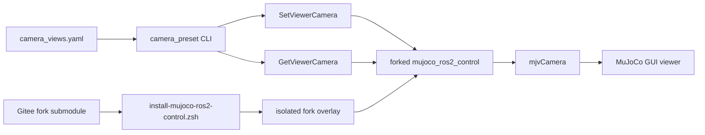

# SO-101 MuJoCo Viewer Camera Presets 与定制 Fork 设计

**日期：** 2026-08-11

**状态：** 已获对话设计批准，等待书面 spec 审阅

**目标分支：** `codex/so101-mujoco-ros2`

## 1. 目标

为 `so101_mujoco_demo_py` 增加可脚本化、可回读的 MuJoCo GUI viewer camera preset 功能，使调试者能通过 ROS 2 service 和 CLI 在稳定视角之间切换。第一批 preset 从桌面四个角以相同距离和俯视角观察任务场景，构图参考用户提供的 SO-101 抓杯画面。

同时停止把定制 `mujoco_ros2_control 0.0.3` 维护为项目内单个 patch 加外部 source checkout。建立独立 Gitee fork，并将它作为 `moveit-demo` 的 Git submodule。以后 reset、pause、snapshot、viewer camera 等扩展直接在 fork 中以正常提交维护。

该功能控制的是 MuJoCo GUI 的调试相机，不是 RGB-D sensor camera。它不产生 ROS image topic，也不参与感知链路。

## 2. 已确认的决策

- fork 远端为 `git@gitee.com:zjumty/mujoco_ros2_control.git`；当前是空仓库。
- fork 基于官方 <https://github.com/ros-controls/mujoco_ros2_control> tag `0.0.3`、commit `35ba8174b62d9560093614f981a3d4b978a96036`。
- `moveit-demo` 通过 `third_party/mujoco_ros2_control` Git submodule 固定 fork commit。
- 第一版只提供 typed ROS 2 service、CLI 和 YAML preset；不接 Teleop Web UI。Web UI 正在其他分支重构，后续只复用本设计的 service 和项目侧 preset API。
- 第一版支持 `FREE` 和 `FIXED` 两种 viewer camera，不加入没有当前用例的 tracking camera。
- 第一批四角视图采用相同 `lookat`、`distance`、`elevation` 和投影方式，只让 azimuth 相差 90 度。
- camera 切换不能暂停或重置 MuJoCo，不能修改物理状态、controller 或 MoveIt 状态。
- 新 fork overlay 与当前 `/data/work/ws_mujoco_ros2_control_003/install` 并存，完成验证前不覆盖或删除旧 overlay。
- ai-station 视觉验收使用 CUA 获取新截图，不使用为 Gazebo demo 准备的截图脚本。

## 3. 方案比较

### 3.1 Typed ROS 2 service，选用

在 fork 的 `mujoco_ros2_control_msgs` 定义 viewer camera message 和 set/get service，在 `MujocoSystemInterface` 中持锁修改 viewer camera。项目侧负责 preset 命名、配置与 CLI。

优点是更新原子、类型明确、错误可回读，并能被未来 Web UI 直接复用。fork 仍保持通用，不含 SO-101 场景知识。

### 3.2 ROS parameters，不选

用 node parameters 表示 camera 字段可减少接口文件，但多个字段的更新不是天然原子事务，mode-specific 校验和失败反馈较弱，也难以表达“应用后的实际 camera”。

### 3.3 只增加 MJCF 固定相机，不选

MJCF `<camera>` 配合 MuJoCo GUI 可以人工切换，但不能按项目 preset 名称自动调用、严格校验和回读，无法满足可重复调试和未来 Web UI 接入。

## 4. 总体架构



边界如下：

- fork 拥有通用 camera message、service、校验、mutex 和 `mjvCamera` 映射。
- `so101_mujoco_demo_py` 拥有 SO-101 preset、CLI、超时和用户输出。
- MJCF 拥有需要精确位置、方向或 roll 的固定 camera。MuJoCo free camera 只有 `lookat`、`distance`、`azimuth` 和 `elevation`，不表达 roll。
- Teleop Web UI 后续调用项目侧能力，不直接依赖 fork 的 C++ 内部实现。

## 5. Fork 与 submodule 生命周期

### 5.1 初始化历史

Gitee fork 使用以下远端约定：

```text
origin    git@gitee.com:zjumty/mujoco_ros2_control.git
upstream  https://github.com/ros-controls/mujoco_ros2_control.git
```

fork 的 `main` 从官方 0.0.3 精确 commit 开始。只推送该 commit 可达的历史和官方 `0.0.3` tag，不需要把所有无关上游 tag 导入空 Gitee 仓库。

当前 `mujoco_ros2_control-0.0.3-reset-hook.patch` 转换为一个正常 fork commit。viewer camera message、service 和测试作为后续独立提交。第一次项目认可的组合打 tag `so101-0.0.3-r1`，后续兼容扩展递增 `rN`。

已推送的 fork `main` 不 rebase 或 force-push。未来迁移到另一个官方稳定 tag 时，从新 tag 创建迁移分支，移植定制提交，通过测试后再前移 `main`。这保证主项目已记录的 submodule commit 长期可解析。

### 5.2 主项目 pin

主项目新增：

```text
third_party/mujoco_ros2_control
```

更新顺序必须是：

1. 在 fork 中实现并测试；
2. 提交并先推送 fork commit；
3. 更新主项目 submodule pointer；
4. 更新 `dependency-lock.yaml`、接口 hash、安装验证和文档；
5. 提交并推送主项目。

主项目不得引用尚未推送的 fork commit。

## 6. 定制安装脚本与 provenance

主项目新增：

```text
scripts/install-mujoco-ros2-control.zsh
```

脚本解析自身位置得到项目根和 submodule source。默认使用：

```text
/data/work/ws_mujoco_ros2_control_fork/build
/data/work/ws_mujoco_ros2_control_fork/install
/data/work/ws_mujoco_ros2_control_fork/log
```

脚本执行以下 fail-closed 检查：

1. submodule 已初始化，或调用者显式提供 `--init-submodule`；
2. submodule URL 是批准的 Gitee fork；
3. checkout 无 tracked 或 untracked 修改；
4. HEAD 等于 dependency lock 的 fork commit；
5. 官方 0.0.3 commit 是 HEAD 的祖先；
6. fork release tag 与 lock 一致；
7. 不向 `/opt/ros/jazzy` 写文件。

脚本 source `/opt/ros/jazzy/setup.zsh`，然后用明确的 `--base-paths`、`--build-base`、`--install-base` 和 `--log-base` 构建：

- `mujoco_ros2_control_msgs`
- `mujoco_ros2_control_plugins`
- `mujoco_ros2_control`

接口变化时使用 clean CMake configure，但不对 source checkout 执行 `git reset`、`git clean` 或 checkout。构建后运行三个包的 tests 和 `colcon test-result --verbose`，再验证 camera interfaces、关键 installed files 和 package prefix。

source 顺序固定为：

```zsh
source /opt/ros/jazzy/setup.zsh
source /data/work/ws_mujoco_ros2_control_fork/install/setup.zsh
source <project-worktree>/install/setup.zsh
```

三个 `mujoco_ros2_control*` package 必须解析到 fork overlay；`mujoco_vendor` 继续解析到 `/opt/ros/jazzy`。

`dependency-lock.yaml` 升级 schema，provider 改为 fork submodule，并记录：

- fork URL、精确 commit 和 release tag；
- 官方 URL、tag 和 base commit；
- submodule path；
- install prefix 和 source 顺序；
- ROS interface hashes；
- 关键 header、library 和 executable hashes。

新 fork overlay 通过全部 gate 后，删除主项目旧 patch、patch SHA 和 patch replay 测试。相应 reset/pause/snapshot 回归移入 fork。旧 `/data/work/ws_mujoco_ros2_control_003` checkout 和 install 暂时保留为回滚路径，不由安装脚本删除。

## 7. ROS 2 接口

### 7.1 `ViewerCamera.msg`

```text
uint8 FREE=0
uint8 FIXED=1

uint8 mode

float64[3] lookat
float64 distance
float64 azimuth_deg
float64 elevation_deg
bool orthographic

string fixed_camera_name
```

`FREE` 使用数值字段并忽略 `fixed_camera_name`。`FIXED` 使用 `fixed_camera_name`，其余字段不作为固定 camera pose 来源。

### 7.2 `SetViewerCamera.srv`

```text
ViewerCamera camera
---
bool success
string message
ViewerCamera applied_camera
```

### 7.3 `GetViewerCamera.srv`

```text
---
bool success
string message
ViewerCamera camera
```

service 名称固定为：

```text
/mujoco_ros2_control_node/set_viewer_camera
/mujoco_ros2_control_node/get_viewer_camera
```

### 7.4 并发与原子性

callback 先在不修改状态的情况下完整校验请求。随后持有 MuJoCo viewer 使用的同一把 mutex，在一个临界区内更新 `mjvCamera` 和 GUI camera selector。set 响应从应用后的状态构造，不回显未经规范化的请求。

任何校验失败都必须保留原 camera。camera callback 不调用 pause、reset 或 step service，不写 `mjModel`、`mjData`、`qpos` 或 `qvel`，不重载 MJCF，也不修改 controller 或 MoveIt 状态。

headless 模式仍公开 service，但 set/get 返回 `success=false` 和 `viewer unavailable`。这样调用方能区分“正确 overlay 的无 GUI 运行”与“service/interface 未安装”。

### 7.5 校验

`FREE` 请求必须满足：

- `lookat`、`distance`、`azimuth_deg`、`elevation_deg` 全部有限；
- `distance > 0`；
- `-90 < elevation_deg < 90`；
- azimuth 规范化到统一范围；
- `fixed_camera_name` 为空。

`FIXED` 请求必须满足：

- `fixed_camera_name` 非空；
- 名称能通过当前 `mjModel` 解析为 camera；
- free-only 字段不参与 pose 计算。

未知 mode、未知固定 camera 或非法数值均返回失败且不产生部分修改。

## 8. 项目 preset 与 CLI

项目新增：

```text
src/so101_mujoco_demo_py/config/camera_views.yaml
src/so101_mujoco_demo_py/so101_mujoco_demo_py/viewer_camera.py
```

配置使用带 `schema_version` 的严格 YAML。自由相机示意：

```yaml
schema_version: 1
presets:
  table_corner_nw:
    mode: free
    lookat: [0.0, 0.0, 0.25]
    distance: 1.2
    azimuth_deg: 135.0
    elevation_deg: -20.0
    orthographic: false
```

示意数值不是最终标定值。现场先在 MuJoCo GUI 中把第一视角调成用户参考图的构图，再用 `GetViewerCamera` 读取真实参数。将该实测值作为第一个 preset，其余三个只改变 azimuth。

必须存在：

- `table_corner_nw`
- `table_corner_ne`
- `table_corner_se`
- `table_corner_sw`

四者具有完全相同的 `lookat`、`distance`、`elevation_deg` 和 `orthographic`。相邻 azimuth 规范化后的环形差值为 90 度。例如基准为 135 度时，其余三个可为 45、-45、-135 度。

CLI 安装名为 `camera_preset`，提供：

```bash
ros2 run so101_mujoco_demo_py camera_preset --list
ros2 run so101_mujoco_demo_py camera_preset table_corner_nw
ros2 run so101_mujoco_demo_py camera_preset --current
ros2 run so101_mujoco_demo_py camera_preset --current --format yaml
```

YAML parser 拒绝未知字段、重复 preset、非法 mode、缺字段和 mode 不允许的字段。`--format yaml` 输出可复制的 preset 字段，但不自动修改 source 或 installed 配置。

CLI 等待 service 有明确超时，service 不可用、调用超时、请求被拒绝或 set/get 回读不一致均返回非零退出码和可操作错误信息。

## 9. 测试设计

### 9.1 Fork 测试

实现前先增加失败测试，至少覆盖：

- FREE camera 正确应用全部字段；
- FIXED camera 按 MJCF 名称解析 ID；
- set 后 get 返回规范化的实际状态；
- 非有限值、非法 distance/elevation、未知 mode 和未知固定 camera 被拒绝；
- 失败请求后原 camera 完全不变；
- camera 修改持有 viewer mutex；
- headless 返回 `viewer unavailable`；
- callback 不写 physics state，也不调用 pause/reset/step 路径；
- reset/pause/snapshot 既有定制回归继续通过；
- 官方 0.0.3 原有测试无新增失败。

### 9.2 主项目测试

至少覆盖：

- strict YAML schema 和 mode-specific 字段；
- 四个必需 preset 存在；
- 四角 preset 共享构图字段且相邻 azimuth 相差 90 度；
- `--list`、apply、`--current` 和 YAML 输出；
- 未知 preset、service unavailable、timeout 和 rejected response；
- submodule URL/commit、官方 base ancestry、release tag 和 clean status；
- dependency lock、接口 hash、installed file hash、source order 和 package prefix；
- Ruff、pytest、fork C++ test 和 package build/test gates。

## 10. ai-station 运行时验收

运行时必须使用 fork overlay、全新 ROS domain、明确归属的 tmux GUI stack，并在启动前检查重复 MuJoCo、MoveIt 和 controller 进程。

验收步骤：

1. 证明运行 executable 和 interfaces 来自 fork overlay；
2. 在未暂停的正常物理中启动 MuJoCo GUI；
3. 人工将第一视角调到参考图构图；
4. 通过 get service 读取实际 camera 并固定第一个 preset；
5. 由该实测值生成另外三个 azimuth 相差 90 度的 preset；
6. 依次 set 四个 preset，每次都 get 回读并比对；
7. 使用 ai-station CUA 在每次切换后获取 fresh screenshot；
8. 实际检查四张截图，而不是只确认截图文件存在。

每张画面必须看见完整机械臂、夹爪、基座、杯子和主要桌面边界，关键几何不能被画面边缘裁剪。四个方向必须明显不同且构图尺度一致。

camera 切换前后还必须证明：

- `reset_epoch` 不变；
- `simulation_step` 连续递增；
- controller 状态不变；
- 没有调用 pause、reset 或 step service；
- `/joint_states` 没有与 camera 调用同步发生的不连续跳变；
- MoveIt、ros2_control 和 physics 继续运行。

自动测试证明 callback 的写边界；运行时证据证明没有 reset、暂停或控制链中断。视觉截图与数值证据缺一不可。

## 11. 回滚

若 fork overlay 构建、测试或运行验收失败：

1. 保存新 build、test 和 runtime evidence；
2. 不更新主项目 submodule pointer 或 dependency lock；
3. 新 shell 切回 `/data/work/ws_mujoco_ros2_control_003/install`；
4. 保留旧 checkout/install，不删除或覆盖；
5. 在 fork 中追加修复提交，不重写已经推送的历史。

## 12. 明确不在本期范围

- Teleop Web UI 接入；
- RGB-D sensor camera、渲染图像 topic 和相机标定；
- tracking camera；
- 自动改写 source YAML；
- 修改 `so101_gazebo_demo_py`；
- 修改或提交当前 ai-station worktree 中的 Task13 未跟踪文件；
- 删除旧 patched checkout 或 overlay。

## 13. 参考资料

- MuJoCo visualization programming：<https://mujoco.readthedocs.io/en/latest/programming/visualization.html>
- MuJoCo `mjvCamera` API：<https://mujoco.readthedocs.io/en/latest/APIreference/APItypes.html>
- MuJoCo MJCF camera reference：<https://mujoco.readthedocs.io/en/stable/XMLreference.html>
- 官方 `mujoco_ros2_control 0.0.3`：<https://github.com/ros-controls/mujoco_ros2_control/tree/0.0.3>
